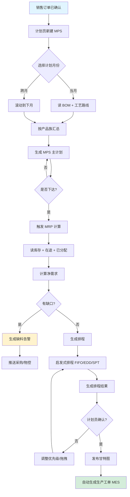
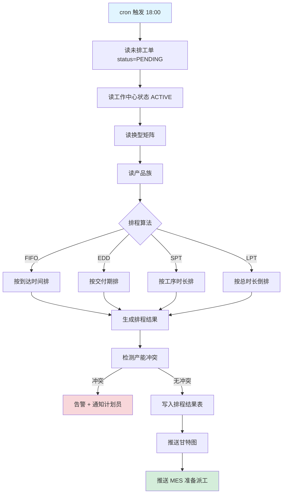
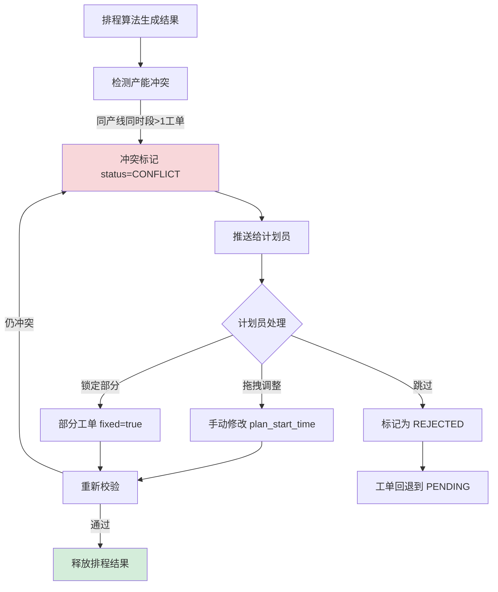
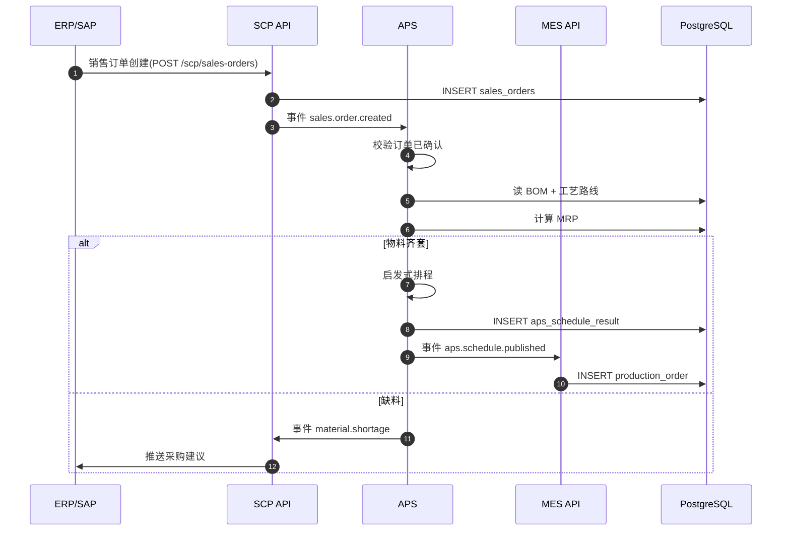
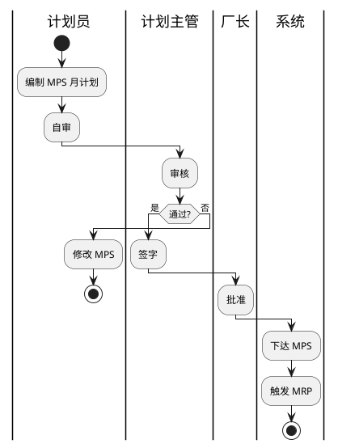
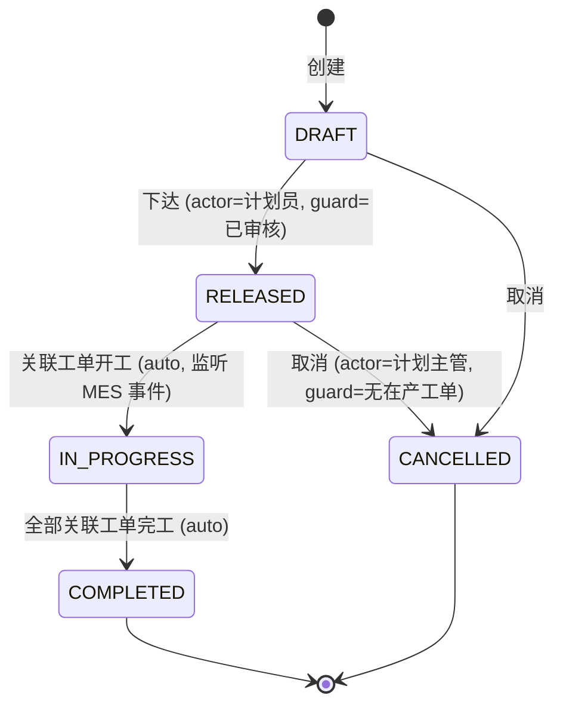
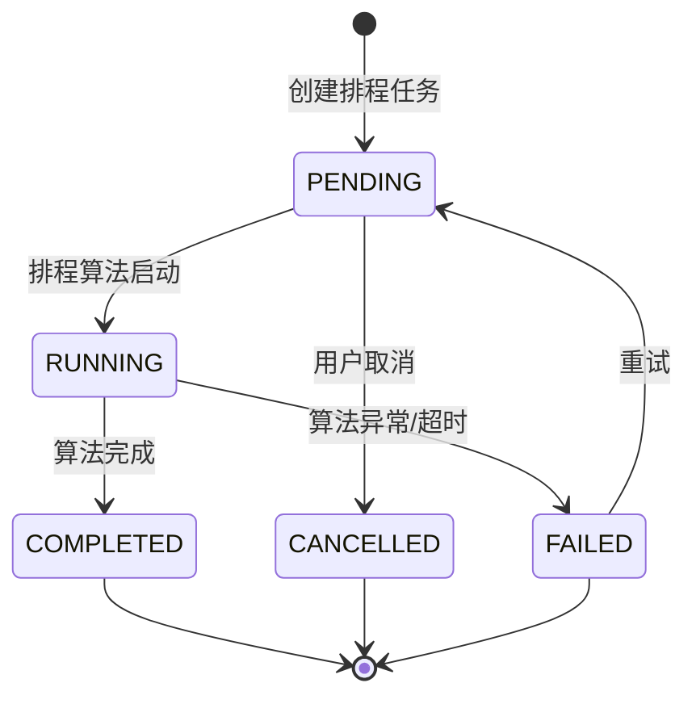
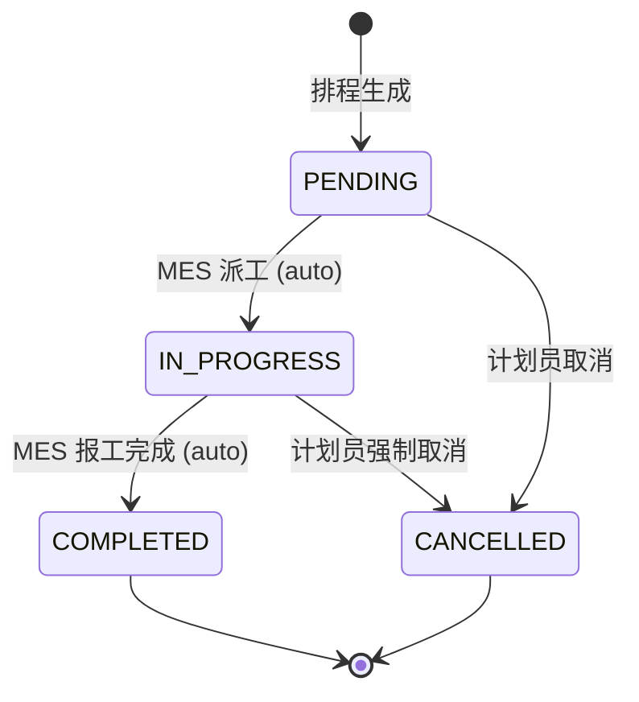
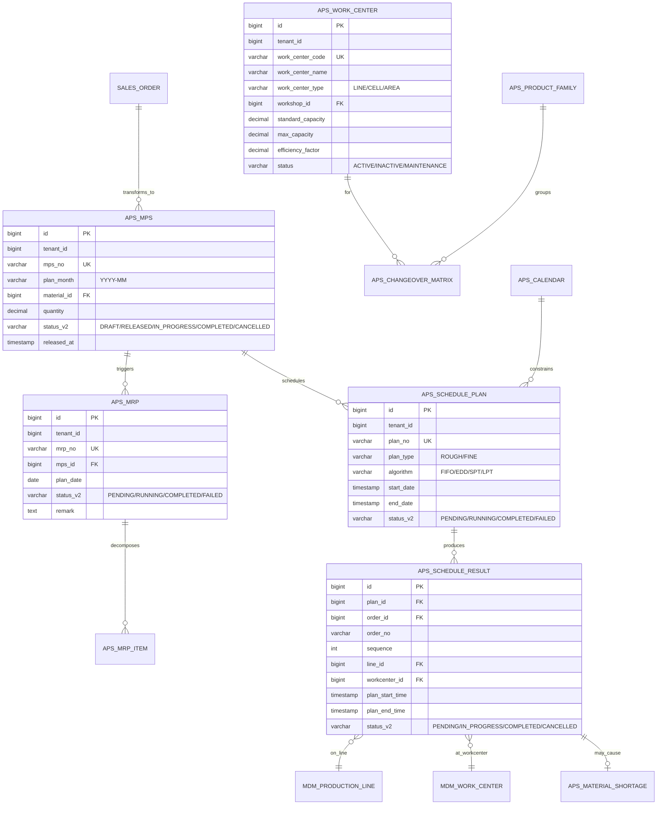

# MOM 3.0 APS 计划模块设计文档

> 版本：V2.0 | 最后更新：2026-07-03 | 维护人：架构组 / 小二
> 适用范围：MOM 3.0 APS（Advanced Planning and Scheduling）高级计划排程域
> 模板主干：[MOM3.0_模块设计模板.md](MOM3.0_模块设计模板.md)（Arc42 简化版 + MESA 11 项 + ISA-95）
> 模块代码：`mom-server/internal/handler/aps/*` `mom-server/internal/service/aps*` `mom-server/internal/model/aps*`（3971 行）
> 数据库表：核心 8 张 + 扩展 5 张
> 状态：**✅ 样板验证 - 用 V2.0 模板重写,验证模板普适性**

---

## 0. 文档元信息

| 字段 | 值 |
|---|---|
| 模块代号 | `aps` |
| 模块名 | APS 高级计划排程 |
| 技术栈 | Vue 3.4 + Element Plus 2.5 / Go 1.24 + Gin + GORM 2.x / PostgreSQL 18 |
| 前端入口 | `mom-web/src/views/aps/*.vue`（9 个视图） |
| 后端入口 | `mom-server/internal/handler/aps/*.go`（7 个 handler） |
| API 前缀 | `/api/v1/aps/*` |
| 数据库表 | 8 张核心 + 5 张扩展（13 张） |
| 模块文档版本 | V2.0 |
| 上次评审 | — |
| 主要作者 | 架构组 / 小二 |
| 状态 | ✅ 样板验证（V2.0 模板在 M04 验证通过） |

> **V2.0 重大变更**：基于 V1.0（217 行,章节不齐,文字流代替 Mermaid）按统一模板重写。状态字段命名按 [MOM3.0_状态字段统一方案.md](MOM3.0_状态字段统一方案.md) 对齐 `mdm_status_dict`。

---

## 1. 模块概述

### 1.1 业务定位

APS（Advanced Planning and Scheduling）是 MOM 3.0 的"调度大脑"，对接 **ISA-95 Level 3-4 之间**，向上承接 ERP/销售订单，向下驱动 MES 生产工单，实现日/周/月三级计划排程闭环。

**价值流位置**：`销售订单(SCP) → MPS(APS) → MRP(APS) → 排程(APS) → 生产工单(MES) → 工序执行(MES) → 报工入库(MES+WMS) → 交付(SCP)`

模块覆盖 **MPS 主生产计划、MRP 物料需求、工作中心、滚动排程、甘特图、交付分析、缺料分析、换型矩阵、产品族、工厂日历** 10 个子业务。

### 1.2 核心功能

| # | 功能 | 简述 | 优先级 |
|---|------|------|--------|
| 1 | MPS 主生产计划 | 月度生产计划编制、下达、跟踪 | P0 |
| 2 | MRP 物料需求运算 | 根据 MPS + BOM 计算物料缺口 | P0 |
| 3 | 工作中心管理 | 产能定义、效率因子、利用率目标 | P0 |
| 4 | 滚动排程 | 每日 18:00 自动触发,排 7 天内工单 | P0 |
| 5 | 甘特图 | 排程结果可视化,支持拖拽编辑 | P1 |
| 6 | 交付分析 | 准时交付率、延期天数统计 | P1 |
| 7 | 缺料分析 | 物料缺口等级、告警推送 | P0 |
| 8 | 换型矩阵 | 产品族换型时间配置 | P1 |
| 9 | 产品族 | 产品分组,影响排程策略 | P2 |
| 10 | 工厂日历 | 班次、节假日、停线时间 | P1 |

> ⚠️ 超过 10 个边界警告：当前 10 个功能达标,新增"智能排程算法"时必须先拆分子模块。

### 1.3 Top 3 干系人

| 角色 | 诉求 | 在本模块的关注点 |
|------|------|----------------|
| **计划员** | 月计划编制、日排程调整 | MPS 下达、排程异常处理 |
| **车间主任** | 看本车间排程、调整优先级 | 甘特图、产能冲突 |
| **采购/物控** | 看缺料清单、提前备料 | 缺料分析、MRP 物料需求 |

### 1.4 Top 3 质量目标（量化）

| 指标 | 目标值 | 当前值 | 测量方法 |
|------|--------|--------|---------|
| 排程算法 P95 耗时 | ≤ 5s（100 工单） | 待测 | Prometheus histogram |
| MRP 计算准确率 | ≥ 99% | 待测 | 业务埋点 |
| 排程结果采纳率 | ≥ 90% | 待测 | 排程结果 vs 实际派工对比 |

---

## 2. 依赖关系

### 2.1 上游模块（谁给我数据）

| 模块 | 数据 / 接口 | 频度 |
|------|------------|------|
| **SCP 销售订单** | `sales_order` 表（已确认订单） | 实时 |
| **MDM 主数据** | `material`、`bom`、`process_routes` | 实时 |
| **ERP** | `sales_order.synced` 事件 | 分钟级 |

### 2.2 下游模块（我给谁数据）

| 模块 | 数据 / 接口 | 频度 |
|------|------------|------|
| **MES 生产工单** | `production_order` 表（自动生成） | 排程完成后 |
| **WMS 仓储** | `material_shortage` 告警 | 实时 |
| **报表 BI** | `delivery_analysis` 数据 | 日终 |

### 2.3 外部系统

| 系统 | 方向 | 协议 | 用途 |
|------|------|------|------|
| **ERP (SAP/QAD)** | 入站 | REST / IDOC | 销售订单同步 |
| **AGV 调度** | 出站 | MQTT | 排程结果下发 |
| **SCADA** | 入站 | OPC-UA | 设备实际产能反馈 |

### 2.4 标准对齐

| 标准 | 段 / 角色 |
|------|----------|
| **ISA-95** | Level 3-4 过渡区(详细排程)、Segment、Process Segment |
| **ISA-88** | Recipe（产品族对应 Master Recipe） |
| **MESA** | MESA 11 项 #2 Detailed Production Scheduling、#3 Production Execution、#7 Detailed Scheduling |

---

## 3. 功能清单

### 3.1 已实现（v2.0 截至 2026-07-03）

| # | 功能 | 端点 / 文件 | 优先级 | 实现日期 | 备注 |
|---|------|------------|--------|---------|------|
| 1 | MPS 列表/创建/下达 | `/api/v1/aps/mps/*` | P0 | 2026-04 |  |
| 2 | MRP 计算 | `/api/v1/aps/mrp/*` | P0 | 2026-04 | 简化算法,FIFO |
| 3 | 工作中心 CRUD | `/api/v1/aps/work-centers` | P0 | 2026-04 |  |
| 4 | 排程执行 | `/api/v1/aps/schedule/execute` | P0 | 2026-04 | 启发式(FIFO/EDD/SPT/LPT) |
| 5 | 排程结果查询 | `/api/v1/aps/schedule/results` | P0 | 2026-04 |  |
| 6 | 甘特图数据 | `/api/v1/aps/schedule/results/:id/gantt` | P1 | 2026-05 |  |
| 7 | 交付分析 | `/api/v1/aps/delivery/analysis` | P1 | 2026-05 |  |
| 8 | 缺料分析 | `/api/v1/aps/material-shortage` | P0 | 2026-05 |  |
| 9 | 换型矩阵 | `/api/v1/aps/changeover-matrix` | P1 | 2026-05 |  |
| 10 | 滚动排程配置 | `/api/v1/aps/rolling-config` | P0 | 2026-05 | cron 触发 |
| 11 | 产品族管理 | `/api/v1/aps/product-families` | P2 | 2026-05 |  |
| 12 | 工厂日历 | `/api/v1/aps/calendar` | P1 | 2026-05 |  |

### 3.2 部分实现

| # | 功能 | 已实现部分 | 缺口 | 计划 |
|---|------|----------|------|------|
| 1 | 智能排程算法 | 启发式 FIFO/EDD/SPT/LPT | 遗传/约束规划（CP）算法 | V3.0（Q4 2026） |
| 2 | 甘特图拖拽 | 只读 + 单向编辑 | 双向 conflict detect | V2.1（8 月） |

### 3.3 未实现 / 待开发

| # | 功能 | 业务价值 | 工作量 | 优先级 | 来源 |
|---|------|---------|--------|--------|------|
| 1 | APS 双向联动 MES | 实际派工反馈回排程 | 5 人天 | P0 | 内部 TODO |
| 2 | 多工厂协同排程 | 集团多基地 | 15 人天 | P1 | 客户需求 |
| 3 | 排程 What-if 仿真 | 计划员试算 | 8 人天 | P2 | SAP Gap |

---

## 4. 页面与交互

### 4.1 页面清单

| 路由 | 页面标题 | 关键按钮 | 表格列数 | 表单字段数 | 状态 |
|------|---------|---------|---------|----------|------|
| `/aps/mps` | MPS 计划 | 新建/下达/导出 | 8 | 6 | ✅ |
| `/aps/gantt` | 甘特图 | 自动排程/拖拽/锁定 | 动态 | — | ✅ |
| `/aps/rolling-config-list` | 滚动排程配置 | 新建/启停/触发 | 6 | 5 | ✅ |
| `/aps/delivery-analysis` | 交付分析 | 刷新/筛选/导出 | 7 | 3 | ✅ |
| `/aps/delivery-warning` | 交付预警 | 确认/升级 | 6 | — | ✅ |
| `/aps/material-shortage` | 缺料分析 | 推送采购/转单 | 8 | 2 | ✅ |
| `/aps/work-center` | 工作中心 | 新建/编辑/启停 | 9 | 8 | ✅ |
| `/aps/changeover-matrix` | 换型矩阵 | 批量导入/编辑 | 4 | 3 | ✅ |
| `/aps/product-family` | 产品族 | 新建/排序 | 5 | 4 | ✅ |
| `/aps/calendar` | 工厂日历 | 批量设班/节假日 | — | 动态 | ✅ |

### 4.2 标准列表页（本模块特有）

**MPS 列表**（`/aps/mps`）— 表格列：

| 列名 | 类型 | 宽度 | 对齐 | 固定 |
|------|------|------|------|------|
| 计划编号 | link | 160px | 左 | ✅ |
| 计划月份 | string | 100px | 中 | ❌ |
| 物料编码 | string | 140px | 左 | ❌ |
| 物料名称 | string | 200px | 左 | ❌ |
| 数量 | decimal(18,3) | 120px | 右 | ❌ |
| 状态 | tag | 100px | 中 | ❌ |
| 下达时间 | datetime | 160px | 中 | ❌ |
| 操作 | buttons | 200px | 中 | ✅ |

**查询条件**：`plan_month`（月份范围） / `status`（多选） / `material_code`（模糊）

### 4.3 甘特图交互（特殊）

> 通用结构参考 [MOM3.0_UI设计规范 §2](./MOM3.0_UI设计规范.md)。
> **本模块特有交互**：

```vue
<template>
  <div class="gantt-container">
    <div class="gantt-toolbar">
      <el-button @click="autoSchedule">自动排程</el-button>
      <el-button @click="lockSelected">锁定选中</el-button>
      <el-radio-group v-model="viewMode">
        <el-radio-button label="day">日</el-radio-button>
        <el-radio-button label="week">周</el-radio-button>
        <el-radio-button label="month">月</el-radio-button>
      </el-radio-group>
    </div>
    <div class="gantt-timeline">
      <div v-for="day in days" :key="day" class="day-cell">
        {{ day }}
      </div>
      <div v-for="order in orders" :key="order.id" class="gantt-row">
        <div class="order-bar"
             :style="{ left: getBarLeft(order), width: getBarWidth(order) }"
             :class="order.status"
             draggable="true"
             @dragstart="handleDragStart($event, order)"
             @dragend="handleDragEnd($event, order)">
          {{ order.order_no }}
        </div>
      </div>
    </div>
  </div>
</template>
```

**联动逻辑**：
- 拖拽结束 → 调 `PUT /api/v1/aps/schedule/results/:id` 调整 `plan_start_time` / `plan_end_time`
- 检测冲突（同一产线同时段）→ 红框高亮 + 提示
- 自动排程按钮 → 调 `POST /api/v1/aps/schedule/execute` 启发式算法

### 4.4 详情弹窗（MPS 详情）

> Tabs：基本信息 / 物料明细 / 排程历史 / 变更日志
> 详情页布局参考 [MOM3.0_UI设计规范 §4](./MOM3.0_UI设计规范.md)。

---

## 5. 业务流程（★ 必有图）

### 5.1 核心流程：MPS 月计划编制 → 工单生成



**节点说明**：

| 节点 | 说明 |
|------|------|
| A | 触发：销售订单已确认（status=CONFIRMED）|
| D | 从 MDM 读 `bom` + `process_routes` 实时 |
| K | MRP 公式：净需求 = 毛需求 - 库存 - 在途 - 已分配 |
| P | 排程算法可在 `rolling_config.scheduling_algorithm` 配置 |

### 5.2 核心流程：滚动排程（每日 18:00 自动触发）



### 5.3 异常流程：排程产能冲突



### 5.4 跨系统流程：销售订单同步 → 工单下发



### 5.5 BPMN：月计划审批（计划员 → 计划主管 → 厂长）



---

## 6. 状态机（★ 必有图）

### 6.1 核心实体：MPS 主生产计划

#### 6.1.1 状态值与显示

| 状态值 | 业务含义 | 显示文本 | Element Plus type |
|--------|---------|---------|------------------|
| `DRAFT` | 草稿,可编辑 | 草稿 | info |
| `RELEASED` | 已下达,锁定编辑 | 已下达 | primary |
| `IN_PROGRESS` | 已下达且关联工单在产 | 执行中 | warning |
| `COMPLETED` | 全部关联工单已完工 | 已完成 | success |
| `CANCELLED` | 计划取消 | 已取消 | info |

> 状态字段存储类型:**`varchar(30)` + 字典表**（`mdm_status_dict.entity='mps'`）
> 字典详见 [MOM3.0_状态字段统一方案.md § 3.2 aps.mps](./MOM3.0_状态字段统一方案.md)

#### 6.1.2 状态机图



#### 6.1.3 转移明细

| 源状态 | 目标状态 | 触发事件 | 守卫条件 | 动作 | 角色 |
|--------|---------|---------|---------|------|------|
| DRAFT | RELEASED | 下达 | 计划主管已审核 | 写入 `released_at`、生成 MRP 任务 | 计划员 |
| RELEASED | IN_PROGRESS | 开工 | 关联工单状态变为 IN_PROGRESS | 更新统计 | 系统 |
| IN_PROGRESS | COMPLETED | 完工 | 全部关联工单状态=COMPLETED | 归档 | 系统 |
| RELEASED | CANCELLED | 取消 | 无在产工单 | 写日志、释放物料 | 计划主管 |

### 6.2 核心实体：排程计划（SchedulePlan）

#### 6.2.1 状态值与显示

| 状态值 | 业务含义 | 显示文本 | Element Plus type |
|--------|---------|---------|------------------|
| `PENDING` | 待排程 | 待排程 | info |
| `RUNNING` | 排程算法执行中 | 排程中 | primary |
| `COMPLETED` | 排程完成 | 已完成 | success |
| `FAILED` | 排程失败 | 失败 | danger |

#### 6.2.2 状态机图



### 6.3 核心实体：排程结果（ScheduleResult）

#### 6.3.1 状态值与显示

| 状态值 | 业务含义 | 显示文本 | Element Plus type |
|--------|---------|---------|------------------|
| `PENDING` | 排程结果待执行 | 待执行 | info |
| `IN_PROGRESS` | 工单已派工执行 | 执行中 | warning |
| `COMPLETED` | 工单已完工 | 已完成 | success |
| `CANCELLED` | 排程结果作废 | 已取消 | info |



### 6.4 字段类型说明（重要）

> **状态字段存储类型**：
>
> | 选项 | 适用场景 | 优缺点 |
> |------|---------|--------|
> | **`int` (1,2,3,...)** | 存储紧凑、查询快 | 需字典映射；不直观；跨 module 难统一 |
> | **`varchar` (DRAFT/RELEASED/...)** | 自解释、日志清晰、跨 module 一致 | 占空间；需字典约束 |
> | **`enum` (Postgres/MySQL)** | 兼顾紧凑与可读 | 数据库绑定；扩展性弱 |
>
> **MOM 3.0 APS 选 `varchar(30) + mdm_status_dict`**：跨 16 module 一致；字典可热更新；日志/前端/调试可读。
> 完整方案见 [MOM3.0_状态字段统一方案.md](./MOM3.0_状态字段统一方案.md)

---

## 7. 数据模型（★ 必有 ER 图）

### 7.1 核心 ER 图



**关系说明**：

| 表 A | 表 B | 关系 | 说明 |
|------|------|------|------|
| `SALES_ORDER` | `APS_MPS` | 1:N | 一个销售订单可拆成多个 MPS 计划行 |
| `APS_MPS` | `APS_MRP` | 1:N | MPS 触发 MRP 计算 |
| `APS_SCHEDULE_PLAN` | `APS_SCHEDULE_RESULT` | 1:N | 一个排程计划产生多个排程结果 |
| `APS_SCHEDULE_RESULT` | `MDM_PRODUCTION_LINE` | N:1 | 排程结果分配到具体产线 |
| `APS_PRODUCT_FAMILY` | `APS_CHANGEOVER_MATRIX` | 1:N | 产品族定义换型规则 |

### 7.2 核心表

#### `aps_mps`

| 字段 | 类型 | 必填 | 默认 | 索引 | 说明 |
|------|------|------|------|------|------|
| `id` | `bigint` | ✅ | auto | PK | 主键 |
| `tenant_id` | `bigint` | ✅ | - | IDX | 租户隔离 |
| `mps_no` | `varchar(50)` | ✅ | - | UK | MPS 编号（`MPS-YYYYMM-NNNN`） |
| `plan_month` | `varchar(10)` | ✅ | - | IDX | 计划月份 YYYY-MM |
| `material_id` | `bigint` | ✅ | - | IDX | 物料 ID |
| `material_code` | `varchar(50)` | ✅ | - | - | 物料编码（冗余） |
| `material_name` | `varchar(100)` | ✅ | - | - | 物料名称（冗余） |
| `quantity` | `decimal(18,4)` | ✅ | - | - | 计划数量 |
| `status` | `int` | ✅ | 1 | IDX | **旧字段**（保留,本表双轨） |
| `status_v2` | `varchar(30)` | ❌ | NULL | IDX | **新字段**（详见 migration 0051） |
| `released_at` | `timestamptz` | ❌ | NULL | - | 下达时间 |
| `created_at` | `timestamptz` | - | now() | - | 创建时间 |
| `updated_at` | `timestamptz` | - | now() | - | 更新时间 |
| `deleted_at` | `timestamptz` | - | null | IDX | 软删除 |

> **通用字段**：`id / created_at / updated_at / deleted_at / tenant_id` 详见 [MOM3.0_附录.md § 字段命名规范](./MOM3.0_附录.md)。

#### `aps_mrp`

| 字段 | 类型 | 必填 | 默认 | 索引 | 说明 |
|------|------|------|------|------|------|
| `id` | `bigint` | ✅ | auto | PK | 主键 |
| `tenant_id` | `bigint` | ✅ | - | IDX | |
| `mrp_no` | `varchar(50)` | ✅ | - | UK | MRP 编号 |
| `mrp_type` | `varchar(20)` | ✅ | - | - | MPS / MRP |
| `mps_id` | `bigint` | ❌ | NULL | IDX | 关联 MPS |
| `plan_date` | `date` | ✅ | - | IDX | 计划日期 |
| `status` | `int` | ✅ | 1 | IDX | **旧** |
| `status_v2` | `varchar(30)` | ❌ | NULL | IDX | **新** |
| `remark` | `varchar(500)` | ❌ | NULL | - | 备注 |

#### `aps_schedule_plan` / `aps_schedule_result` / `aps_work_center`

字段结构类似,详见 [mom-server/internal/model/aps.go](../../mom-server/internal/model/aps.go) 和 [mom-server/internal/model/aps_rolling.go](../../mom-server/internal/model/aps_rolling.go)。

### 7.3 索引策略

| 表 | 索引名 | 列 | 类型 | 用途 |
|----|--------|-----|------|------|
| `aps_mps` | `idx_tenant_plan_month` | `(tenant_id, plan_month)` | B-Tree | 月计划查询 |
| `aps_mps` | `idx_status_v2` | `(status_v2)` | B-Tree | 字典状态过滤 |
| `aps_schedule_result` | `idx_plan_start_time` | `(plan_id, plan_start_time)` | B-Tree | 甘特图时间轴 |
| `aps_work_center` | `idx_tenant_wc_code` | `(tenant_id, work_center_code)` | B-Tree UK | 唯一编码 |

### 7.4 枚举字典

| 枚举 | 表/字段 | 值列表 | 备注 |
|------|--------|--------|------|
| MPS 状态 | `aps_mps.status_v2` | `('DRAFT','RELEASED','IN_PROGRESS','COMPLETED','CANCELLED')` | 字典见 [mdm_status_dict](../../mom-server/migrations/0051_status_unification.sql) |
| 排程计划状态 | `aps_schedule_plan.status_v2` | `('PENDING','RUNNING','COMPLETED','FAILED')` | |
| 排程结果状态 | `aps_schedule_result.status_v2` | `('PENDING','IN_PROGRESS','COMPLETED','CANCELLED')` | |
| 排程算法 | `aps_schedule_plan.algorithm` | `('FIFO','EDD','SPT','LPT')` | 启发式 |
| 工作中心状态 | `aps_work_center.status` | `('ACTIVE','INACTIVE','MAINTENANCE')` | |
| 缺料等级 | `aps_material_shortage.shortage_level` | `('CRITICAL','HIGH','MEDIUM','LOW')` | |

---

## 8. API 规范

### 8.1 路由清单

| 方法 | 路径 | 说明 | 鉴权 | 幂等 |
|------|------|------|------|------|
| GET | `/api/v1/aps/mps/list` | MPS 列表 | ✅ | — |
| GET | `/api/v1/aps/mps/:id` | MPS 详情 | ✅ | — |
| POST | `/api/v1/aps/mps` | 创建 MPS | ✅ | ✅（Idempotency-Key）|
| PUT | `/api/v1/aps/mps/:id` | 更新 MPS | ✅ | ✅ |
| POST | `/api/v1/aps/mps/:id/release` | 下达 MPS | ✅ | ❌ |
| POST | `/api/v1/aps/mrp/calculate` | 触发 MRP 计算 | ✅ | ❌ |
| GET | `/api/v1/aps/schedule/execute` | 执行排程（异步） | ✅ | ❌ |
| GET | `/api/v1/aps/schedule/results/:id/gantt` | 甘特图数据 | ✅ | — |
| GET | `/api/v1/aps/delivery/warnings` | 交付预警列表 | ✅ | — |
| PUT | `/api/v1/aps/delivery/warnings/:id/acknowledge` | 确认预警 | ✅ | ✅ |
| GET | `/api/v1/aps/material-shortage` | 缺料分析 | ✅ | — |
| GET | `/api/v1/aps/work-centers` | 工作中心列表 | ✅ | — |
| GET | `/api/v1/aps/changeover-matrix` | 换型矩阵 | ✅ | — |

### 8.2 请求/响应示例

#### 8.2.1 创建 MPS（POST）

**请求**：

```http
POST /api/v1/aps/mps HTTP/1.1
Content-Type: application/json
Authorization: Bearer eyJhbG…9...
Idempotency-Key: 550e8400-e29b-41d4-a716-446655440000

{
  "plan_month": "2026-08",
  "material_id": 12345,
  "quantity": 5000,
  "remark": "8月客户A订单"
}
```

**响应**：

```json
{
  "code": 200,
  "message": "success",
  "data": {
    "id": 67890,
    "mps_no": "MPS-202608-0001",
    "plan_month": "2026-08",
    "material_id": 12345,
    "quantity": 5000,
    "status": 1,
    "status_v2": "DRAFT",
    "created_at": "2026-07-03T10:00:00+08:00"
  }
}
```

#### 8.2.2 执行排程（POST）

**请求**：

```http
POST /api/v1/aps/schedule/execute HTTP/1.1
{
  "plan_type": "FINE",
  "horizon_days": 7,
  "algorithm": "EDD",
  "workshop_id": 1,
  "priority_min": 1
}
```

**响应**（异步任务）：

```json
{
  "code": 200,
  "data": {
    "task_id": "schedule-task-20260703-001",
    "status": "PENDING",
    "estimated_seconds": 30
  }
}
```

### 8.3 错误码（★）

完整错误码字典见 [MOM3.0_附录.md § 错误码字典](./MOM3.0_附录.md)。**本模块错误码**：

| 错误码 | HTTP | 含义 | 处理建议 |
|--------|------|------|---------|
| `04-01-0001` | 400 | MPS 计划月份格式错误 | 检查 `plan_month` YYYY-MM |
| `04-01-0002` | 400 | 物料不存在 | 检查 `material_id` |
| `04-02-0001` | 404 | MPS 不存在 | 检查 ID |
| `04-03-0001` | 409 | MPS 已下达,不可编辑 | 检查 status |
| `04-04-0001` | 500 | 排程算法异常 | 查看 `schedule_logs` |
| `04-05-0001` | 409 | 产能冲突 | 调整排程 |

### 8.4 幂等与限流

| 接口 | 幂等策略 | 限流（默认）|
|------|---------|------------|
| 创建类（MPS） | `Idempotency-Key` Header，24h 去重 | 100 次/分钟/用户 |
| 排程执行 | 不幂等（重跑覆盖结果）| 10 次/小时/用户 |
| MRP 计算 | 不幂等（每次新算）| 50 次/小时/用户 |

---

## 9. 角色与权限

### 9.1 操作矩阵

| 角色 | MPS CRUD | MPS 下达 | 排程执行 | 排程调整 | 缺料查看 | 交付预警 |
|------|---------|---------|---------|---------|---------|---------|
| 系统管理员 | ✅ | ✅ | ✅ | ✅ | ✅ | ✅ |
| 计划员 | ✅ | ✅ | ✅ | ✅ | ✅ | ✅ |
| 计划主管 | ✅ | ✅ | ❌ | ✅ | ✅ | ✅ |
| 车间主任 | 查看 | ❌ | ❌ | 查看 | ✅ | ✅ |
| 采购员 | 查看 | ❌ | ❌ | ❌ | ✅ | ❌ |
| 物控员 | 查看 | ❌ | ❌ | ❌ | ✅ | ✅ |
| 财务 | 查看 | ❌ | ❌ | ❌ | ❌ | 查看 |

权限码示例：`aps:mps:list` / `aps:mps:create` / `aps:mps:release` / `aps:schedule:execute`

### 9.2 数据权限

- **多租户隔离**：`WHERE tenant_id = ?` 由中间件自动注入
- **车间隔离**（如适用）：`WHERE workshop_id IN (?)`（仅车间主任启用）

---

## 10. 集成与事件

### 10.1 出站事件（我发什么）

| 事件名 | 触发时机 | payload 摘要 | 消费者 |
|--------|---------|-------------|--------|
| `aps.mps.released` | MPS 下达后 | `{mps_no, plan_month, material_id, qty}` | MRP, MES, 报表 |
| `aps.mrp.completed` | MRP 计算完成 | `{mrp_no, shortage_count, critical_count}` | 采购, 报表 |
| `aps.schedule.published` | 排程结果发布 | `{plan_id, results_count, conflicts}` | MES, AGV, BI |
| `aps.material.shortage` | 检测到缺料 | `{material_id, shortage_qty, level}` | SCP, 钉钉 |

### 10.2 入站事件（我收什么）

| 事件名 | 来源 | payload 摘要 | 处理逻辑 |
|--------|------|-------------|---------|
| `scp.sales_order.confirmed` | SCP | `{sales_order_no, items}` | 触发 MPS 创建 |
| `mes.production.completed` | MES | `{order_no, completed_qty}` | 更新 MPS 状态为 IN_PROGRESS/COMPLETED |
| `erp.material.received` | ERP | `{material_id, qty}` | 重新计算 MRP |

### 10.3 消息格式

```json
{
  "event_id": "uuid",
  "event_name": "aps.mps.released",
  "event_time": "2026-07-03T10:00:00+08:00",
  "tenant_id": 1,
  "source": "mom-aps",
  "data": {
    "mps_no": "MPS-202608-0001",
    "plan_month": "2026-08",
    "material_id": 12345,
    "quantity": 5000,
    "released_by": 100
  }
}
```

### 10.4 重试 / 死信

| 参数 | 值 |
|------|---|
| 重试次数 | 3 |
| 重试间隔 | 指数退避（1s / 4s / 16s）|
| 死信队列 | `dlq.aps.*` |
| 告警 | 死信数量 > 10 触发 PagerDuty |

---

## 11. 可观测性

### 11.1 关键指标

| 指标名 | 类型 | 说明 | 告警阈值 |
|--------|------|------|---------|
| `aps_mps_create_total` | Counter | MPS 创建数 | - |
| `aps_schedule_execute_latency_seconds` | Histogram | 排程执行耗时 | P95 > 30s |
| `aps_mrp_calculate_latency_seconds` | Histogram | MRP 计算耗时 | P95 > 5s |
| `aps_material_shortage_total` | Counter | 缺料告警数 | rate(1h) > 50 |

### 11.2 日志样例

```json
{
  "level": "info",
  "ts": "2026-07-03T18:00:00.123+08:00",
  "caller": "aps/service/schedule.go:142",
  "msg": "schedule executed",
  "request_id": "abc-123-def",
  "tenant_id": 1,
  "plan_id": 12345,
  "algorithm": "EDD",
  "scheduled_count": 87,
  "conflict_count": 3,
  "latency_ms": 4521
}
```

### 11.3 告警规则

| 规则 | 阈值 | 严重度 | 通知 |
|------|------|--------|------|
| 排程算法 P95 > 30s | 5 分钟持续 | P2 | 飞书机器人 |
| MRP 失败率 > 5% | 5 分钟内 | P2 | 飞书 + 短信 |
| 缺料告警 critical 突增 | 1 小时 > 10 | P1 | 飞书 + 短信 + 电话 |

---

## 12. 非功能需求

### 12.1 性能

| 指标 | 目标 | 当前 | 测量 |
|------|------|------|------|
| MPS 列表 P95 | ≤ 1s | 待测 | Prometheus |
| 排程算法 P95（100 工单） | ≤ 5s | 待测 | 业务埋点 |
| MRP 计算 P95（500 物料） | ≤ 3s | 待测 | 业务埋点 |
| 甘特图加载 | ≤ 2s | 待测 | 前端埋点 |

### 12.2 可用性

| 指标 | 目标 |
|------|------|
| 月度可用性 | ≥ 99.5%（业务时间 7:00-22:00）|
| 故障恢复 RTO | ≤ 4h |
| 数据恢复 RPO | ≤ 24h |

### 12.3 数据量与保留期

| 数据 | 年增量估算 | 保留期 | 归档策略 |
|------|----------|--------|---------|
| MPS | 1 万/年 | 在线 5 年 | 按月分区 |
| MRP | 10 万/年 | 在线 3 年 | 按月分区 |
| 排程计划 | 365/年 | 在线 1 年 | 按月分区 |
| 排程结果 | 100 万/年 | 在线 3 年 | 按月分区 |

---

## 13. 附录

### 13.1 CHANGELOG

| 版本 | 日期 | 修订人 | 说明 |
|------|------|--------|------|
| V1.0 | 2026-04-21 | 架构组 | 初版（217 行,占位）|
| **V2.0** | **2026-07-03** | **架构组 / 小二** | **按统一模板重写,验证模板普适性;状态字段按 0051 方案统一** |

### 13.2 相关链接

- [MOM3.0_主设计文档.md](./MOM3.0_主设计文档.md) — 系统总览
- [MOM3.0_技术架构文档.md](./MOM3.0_技术架构文档.md) — 技术架构
- [MOM3.0_UI设计规范.md](./MOM3.0_UI设计规范.md) — UI 规范
- [MOM3.0_模块设计模板.md](./MOM3.0_模块设计模板.md) — 文档模板
- [MOM3.0_状态字段统一方案.md](./MOM3.0_状态字段统一方案.md) — 状态字典方案
- [MOM3.0_MES生产执行模块设计文档.md](./MOM3.0_MES生产执行模块设计文档.md) — 下游模块
- 相关模块：
  - MES：[MOM3.0_MES生产执行模块设计文档.md](./MOM3.0_MES生产执行模块设计文档.md)
  - SCP：[MOM3.0_SCP供应链模块设计文档.md](./MOM3.0_SCP供应链模块设计文档.md)
  - WMS：[MOM3.0_WMS仓储模块设计文档.md](./MOM3.0_WMS仓储模块设计文档.md)

### 13.3 待办 / 已知问题

| # | 问题 | 优先级 | 计划 | 备注 |
|---|------|--------|------|------|
| 1 | APS 双向联动 MES（实际派工反馈回排程） | P0 | V2.1（8 月） | 内部 TODO |
| 2 | 智能排程算法（遗传/CP） | P1 | V3.0（Q4） | 替代启发式 |
| 3 | 多工厂协同排程 | P1 | 2027 | 集团需求 |
| 4 | 排程 What-if 仿真 | P2 | 2027 | SAP Gap |

> 与 [TODO.md](./TODO.md) 保持同步

### 13.4 OpenAPI / Swagger

- 路径：`/api/v1/swagger/*`
- 当前状态：未启用（规划中，依赖 `@swaggo/gin` 集成）

### 13.5 V2.0 模板验证结论

> **本篇是模板普适性验证的第二个 sample（首篇为 MES）**。

| 验证项 | 结果 |
|---|---|
| 13 章节是否全部填得下 | ✅ 全部填满,无遗漏 |
| Mermaid 4 类图是否普适 | ✅ flowchart × 4 / sequenceDiagram × 1 / stateDiagram-v2 × 3 / erDiagram × 1 |
| 模板字段（干系人/质量目标）能否套用 | ✅ 直接套用 |
| 模板 6.1.4 状态字段类型说明能否套用 | ✅ 适用,引用状态字典 |
| APS 模块特殊性（排程算法/甘特图）能否覆盖 | ✅ § 5 业务流程 + § 4.3 甘特图交互 覆盖 |
| 模板 § 13.1 CHANGELOG 能否记录 V1→V2 演进 | ✅ |

**模板评估**:**V2.0 模板通过 APS 验证,可推广到剩余 13 module 批量 V2.0 重写**。

---

*文档作者：架构组 / 小二*
*最后更新：2026-07-03 15:55*
*评审：待评审*
