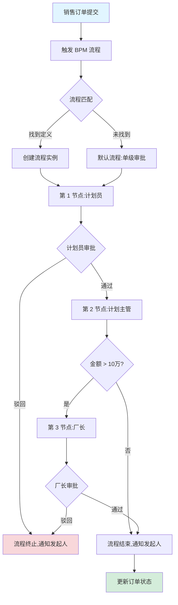
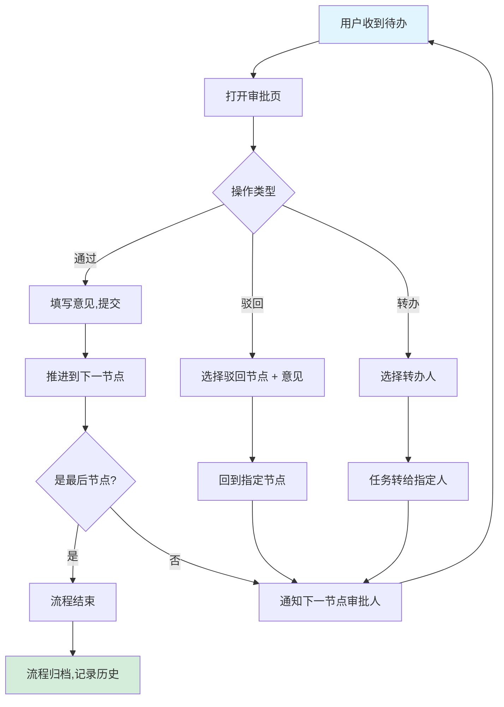
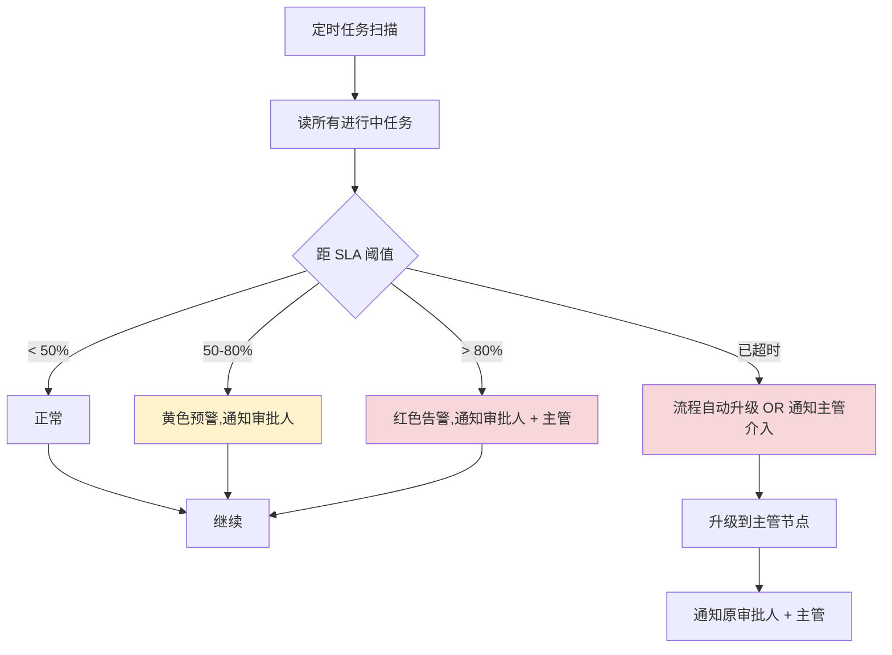
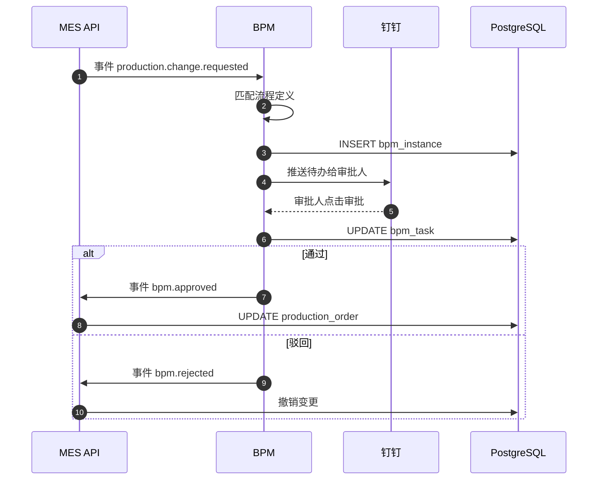
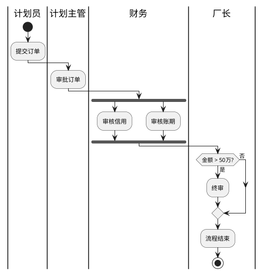
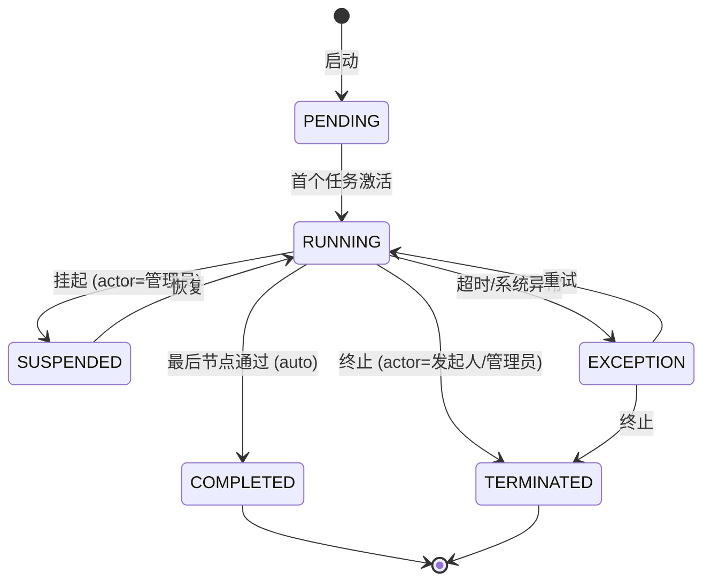
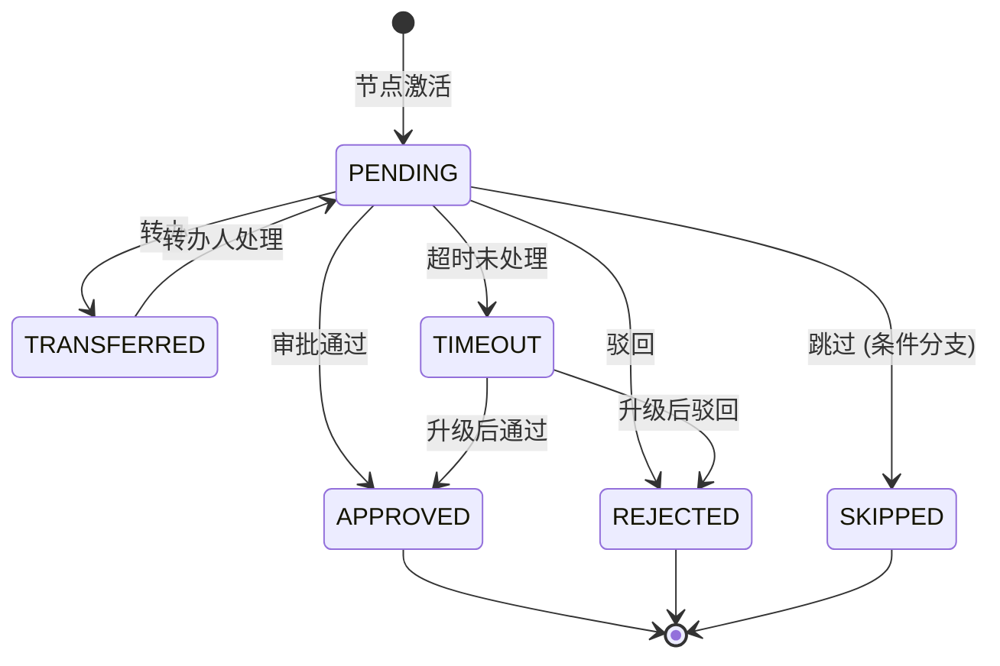
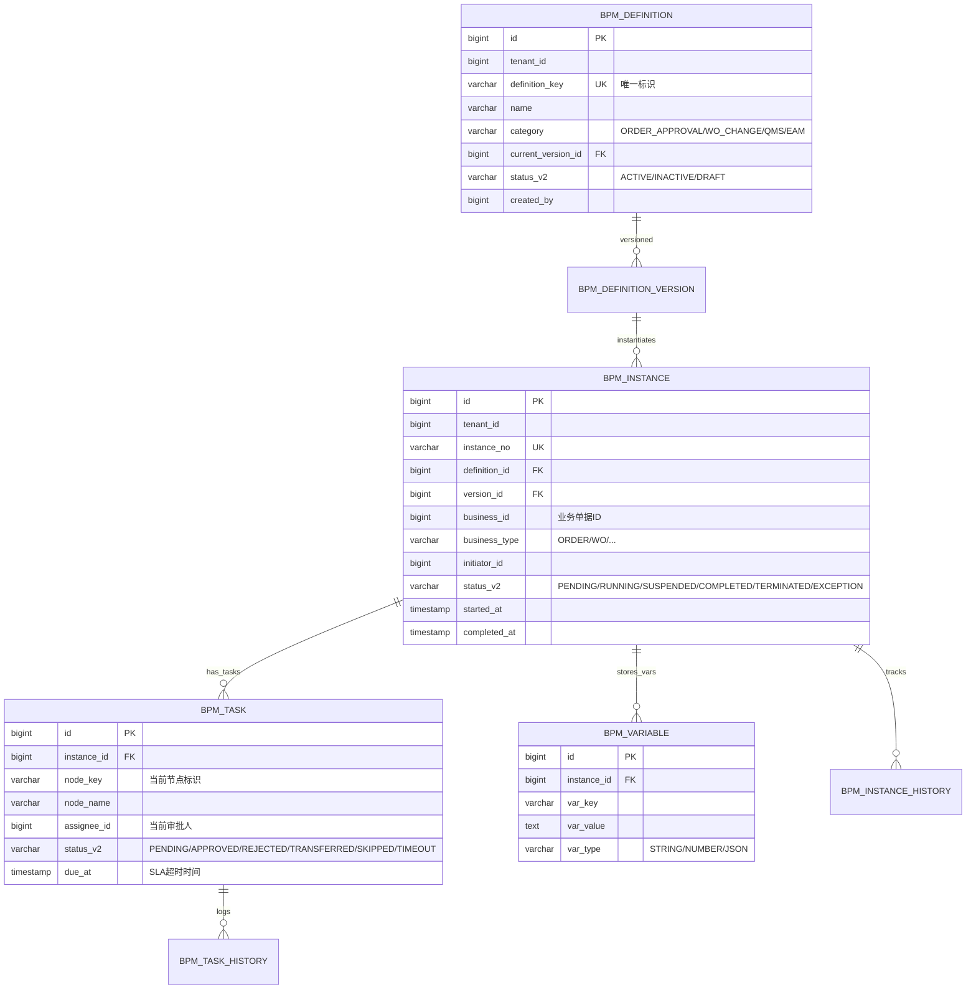

# MOM 3.0 BPM 流程模块设计文档

> 版本：V2.0 | 最后更新：2026-07-03 | 维护人：架构组 / 小二
> 适用范围：MOM 3.0 BPM（Business Process Management）业务流程管理域
> 模板主干：[MOM3.0_模块设计模板.md](MOM3.0_模块设计模板.md)
> 模块代码：`mom-server/internal/handler/bpm/*` `mom-server/internal/service/bpm*` `mom-server/internal/model/bpm*`
> 数据库表：核心 5 张（流程定义/实例/任务/历史/变量）
> 状态：**✅ V2.0 完成 - 按统一模板重写,旧版 1737 行大砍至 800 行**

> **V2.0 重大变更**：基于 V1.x（1737 行,Flowable 残留,12 章节 0 Mermaid）按 V2.0 模板重写。技术栈对齐实际实现：Vue 3.4 + Element Plus 2.5 / Go 1.24 + Gin + GORM / PostgreSQL 18。流程引擎自研（不依赖 Flowable/Camunda）。

---

## 0. 文档元信息

| 字段 | 值 |
|---|---|
| 模块代号 | `bpm` |
| 模块名 | BPM 业务流程管理 |
| 技术栈 | Vue 3.4 + Element Plus 2.5 / Go 1.24 + Gin + GORM 2.x / PostgreSQL 18 |
| 流程引擎 | **自研**(V2.0 起,不依赖 Flowable) |
| 前端入口 | `mom-web/src/views/bpm/*.vue`（5 个视图） |
| 后端入口 | `mom-server/internal/handler/bpm/*.go` |
| API 前缀 | `/api/v1/bpm/*` |
| 数据库表 | 5 张核心 |
| 状态 | ✅ V2.0（第 1 批 P0 第 2 个） |

---

## 1. 模块概述

### 1.1 业务定位

BPM 是 MOM 3.0 的"流程编排中枢"，实现审批流、流程定义、流程实例、待办任务、流程统计等核心功能。覆盖订单审批、工单审批、变更审批、质量异常处置、设备故障报修等业务场景。

**价值流位置**：`业务触发(SCP/MES/QMS) → 流程定义(BPM) → 流程实例(BPM) → 待办任务(用户) → 流程归档`

模块覆盖**流程定义管理、流程实例、我的待办、我的已办、流程统计**5 个核心子业务。

### 1.2 核心功能

| # | 功能 | 简述 | 优先级 |
|---|------|------|--------|
| 1 | 流程定义管理 | 流程模板的创建/编辑/版本/启停 | P0 |
| 2 | 流程实例 | 根据定义发起的具体流程 | P0 |
| 3 | 我的待办 | 当前用户待审批任务 | P0 |
| 4 | 我的已办 | 当前用户已审批历史 | P1 |
| 5 | 流程统计 | 流程效率、超时、活跃度分析 | P2 |
| 6 | 流程设计器 | 可视化拖拽编辑流程(基础版) | P1 |

> ✅ 6 个功能,边界清晰。

### 1.3 Top 3 干系人

| 角色 | 诉求 | 在本模块的关注点 |
|------|------|----------------|
| **业务主管** | 审批/驳回/转办 | 我的待办、流程效率 |
| **流程管理员** | 定义流程模板 | 流程定义管理、流程设计器 |
| **业务操作员** | 发起流程 | 流程发起入口 |

### 1.4 Top 3 质量目标（量化）

| 指标 | 目标值 | 当前值 | 测量方法 |
|------|--------|--------|---------|
| 流程启动 P95 | ≤ 1s | 待测 | Prometheus |
| 审批响应 P95 | ≤ 500ms | 待测 | Prometheus |
| 流程超时率 | ≤ 5% | 待测 | 业务埋点 |

---

## 2. 依赖关系

### 2.1 上游模块（谁给我数据）

| 模块 | 数据 / 接口 | 频度 |
|------|------------|------|
| **SCP 销售订单** | 销售订单审批触发流程 | 实时 |
| **MES 生产工单** | 工单变更审批触发流程 | 实时 |
| **QMS 质量** | 质量异常处置审批触发流程 | 实时 |
| **EAM 设备** | 设备故障报修审批触发流程 | 实时 |

### 2.2 下游模块（我给谁数据）

| 模块 | 数据 / 接口 | 频度 |
|------|------------|------|
| **报表** | 流程效率统计 | 日终 |
| **审计日志** | 流程操作记录 | 实时 |

### 2.3 外部系统

| 系统 | 方向 | 协议 | 用途 |
|------|------|------|------|
| **钉钉/企业微信** | 双向 | Open API | 待办消息推送、移动审批 |

### 2.4 标准对齐

| 标准 | 段 / 角色 |
|------|----------|
| **BPMN 2.0** | Process / Activity / Gateway / Event |
| **MESA** | MESA 11 项 #8 Process Management |

---

## 3. 功能清单

### 3.1 已实现

| # | 功能 | 端点 / 文件 | 优先级 | 实现日期 | 备注 |
|---|------|------------|--------|---------|------|
| 1 | 流程定义 CRUD | `/api/v1/bpm/definition/*` | P0 | 2026-04 | |
| 2 | 流程版本管理 | `/api/v1/bpm/definition/:id/version` | P0 | 2026-04 | |
| 3 | 流程发起 | `/api/v1/bpm/instance/start` | P0 | 2026-04 | |
| 4 | 流程审批 | `/api/v1/bpm/task/:id/approve` | P0 | 2026-04 | |
| 5 | 流程驳回 | `/api/v1/bpm/task/:id/reject` | P0 | 2026-04 | |
| 6 | 待办列表 | `/api/v1/bpm/task/todo` | P0 | 2026-04 | |
| 7 | 已办列表 | `/api/v1/bpm/task/done` | P1 | 2026-04 | |
| 8 | 流程转办 | `/api/v1/bpm/task/:id/transfer` | P1 | 2026-04 | |
| 9 | 流程统计 | `/api/v1/bpm/statistics/*` | P2 | 2026-05 | |

### 3.2 部分实现

| # | 功能 | 已实现部分 | 缺口 | 计划 |
|---|------|----------|------|------|
| 1 | 流程设计器 | 基础拖拽 | 复杂条件/并行分支 | V2.1 |

### 3.3 未实现

| # | 功能 | 业务价值 | 工作量 | 优先级 |
|---|------|---------|--------|--------|
| 1 | 流程仿真 | 中 | 5 人天 | P2 |
| 2 | SLA 智能预警 | 高 | 3 人天 | P1 |

---

## 4. 页面与交互

### 4.1 页面清单

| 路由 | 页面标题 | 关键按钮 | 表格列数 | 状态 |
|------|---------|---------|---------|------|
| `/bpm/definition` | 流程定义 | 新建/编辑/启停/版本 | 6 | ✅ |
| `/bpm/instance` | 流程实例 | 详情/催办/终止 | 8 | ✅ |
| `/bpm/todo` | 我的待办 | 审批/驳回/转办 | 6 | ✅ |
| `/bpm/done` | 我的已办 | 详情/追溯 | 6 | ✅ |
| `/bpm/statistics` | 流程统计 | 筛选/导出 | 8 | ✅ |

### 4.2 待办列表特有列

| 列名 | 类型 | 宽度 | 对齐 | 固定 |
|------|------|------|------|------|
| 流程名称 | link | 200px | 左 | ✅ |
| 发起人 | string | 100px | 中 | ❌ |
| 发起时间 | datetime | 160px | 中 | ❌ |
| 当前节点 | string | 120px | 中 | ❌ |
| 距超时 | countdown | 100px | 右 | ❌ |
| 操作 | buttons | 200px | 中 | ✅ |

### 4.3 审批弹窗（核心交互）

- 必填：审批意见、审批结果（通过/驳回）
- 选填：转办人（仅"转办"操作）
- 联动：驳回时可选择"驳回到发起人"或"驳回到上一节点"
- 提交前：附件上传（可选）

---

## 5. 业务流程（★ 必有图）

### 5.1 核心流程：销售订单审批（计划员 → 计划主管 → 厂长）



### 5.2 核心流程：通用审批（任一节点）



### 5.3 异常流程：流程超时



### 5.4 跨系统流程：MES 工单变更审批



### 5.5 BPMN 2.0 复杂流程示例（带并行网关）



---

## 6. 状态机（★ 必有图）

### 6.1 核心实体：流程实例（Instance）

#### 6.1.1 状态值与显示

| 状态值 | 业务含义 | 显示文本 | Element Plus type |
|--------|---------|---------|------------------|
| `PENDING` | 流程启动,等待首个节点 | 待开始 | info |
| `RUNNING` | 流程进行中 | 进行中 | primary |
| `SUSPENDED` | 流程挂起(管理员) | 已挂起 | warning |
| `COMPLETED` | 流程正常结束 | 已完成 | success |
| `TERMINATED` | 流程被终止 | 已终止 | info |
| `EXCEPTION` | 流程异常(超时/系统) | 异常 | danger |

> 状态字段存储类型：**`varchar(30) + mdm_status_dict`**(`entity='bpm_instance'`)

#### 6.1.2 状态机图



#### 6.1.3 转移明细

| 源状态 | 目标状态 | 触发事件 | 守卫条件 | 动作 | 角色 |
|--------|---------|---------|---------|------|------|
| PENDING | RUNNING | 首个任务激活 | 任务被审批人领取 | 写入 `started_at` | 系统 |
| RUNNING | SUSPENDED | 挂起 | 管理员操作 | 写日志 | 管理员 |
| RUNNING | COMPLETED | 完成 | 所有节点通过 | 写 `completed_at`、归档 | 系统 |
| RUNNING | EXCEPTION | 超时/异常 | SLA 阈值 OR 系统异常 | 升级 + 告警 | 系统 |

### 6.2 核心实体：流程任务（Task）



| 状态值 | Element Plus type |
|--------|------------------|
| PENDING | info |
| APPROVED | success |
| REJECTED | danger |
| TRANSFERRED | warning |
| SKIPPED | info |
| TIMEOUT | danger |

### 6.3 字段类型说明

> MOM 3.0 BPM 选 **`varchar(30) + mdm_status_dict`**：跨 16 module 一致。
> 完整方案见 [MOM3.0_状态字段统一方案.md](./MOM3.0_状态字段统一方案.md)

---

## 7. 数据模型（★ 必有 ER 图）

### 7.1 核心 ER 图



**关系说明**：

| 表 A | 表 B | 关系 | 说明 |
|------|------|------|------|
| `BPM_DEFINITION` | `BPM_DEFINITION_VERSION` | 1:N | 一个流程定义多个版本 |
| `BPM_DEFINITION_VERSION` | `BPM_INSTANCE` | 1:N | 一个版本发起多个实例 |
| `BPM_INSTANCE` | `BPM_TASK` | 1:N | 一个实例多个任务(节点) |
| `BPM_INSTANCE` | `BPM_VARIABLE` | 1:N | 实例变量(动态) |

### 7.2 核心表

#### `bpm_definition`（流程定义）

| 字段 | 类型 | 必填 | 默认 | 索引 | 说明 |
|------|------|------|------|------|------|
| `id` | `bigint` | ✅ | auto | PK | |
| `tenant_id` | `bigint` | ✅ | - | IDX | |
| `definition_key` | `varchar(50)` | ✅ | - | UK | 流程唯一标识(如 `sales_order_approval`) |
| `name` | `varchar(100)` | ✅ | - | - | 流程名称 |
| `category` | `varchar(50)` | ✅ | - | IDX | 分类:ORDER/WO/QMS/EAM |
| `current_version_id` | `bigint` | ❌ | NULL | - | 当前激活版本 |
| `status_v2` | `varchar(30)` | ❌ | NULL | IDX | ACTIVE/INACTIVE/DRAFT |
| `created_by` | `bigint` | ✅ | - | - | 创建人 |
| `created_at` | `timestamptz` | - | now() | - | |
| `updated_at` | `timestamptz` | - | now() | - | |
| `deleted_at` | `timestamptz` | - | null | IDX | 软删除 |

#### `bpm_instance`（流程实例）

| 字段 | 类型 | 必填 | 默认 | 索引 | 说明 |
|------|------|------|------|------|------|
| `id` | `bigint` | ✅ | auto | PK | |
| `tenant_id` | `bigint` | ✅ | - | IDX | |
| `instance_no` | `varchar(50)` | ✅ | - | UK | 实例编号(`BPM-YYYYMMDD-NNNN`) |
| `definition_id` | `bigint` | ✅ | - | IDX | 流程定义 |
| `version_id` | `bigint` | ✅ | - | - | 流程版本 |
| `business_id` | `bigint` | ✅ | - | IDX | 业务单据 ID |
| `business_type` | `varchar(50)` | ✅ | - | IDX | 业务类型 |
| `initiator_id` | `bigint` | ✅ | - | IDX | 发起人 |
| `status` | `int` | ✅ | 1 | IDX | **旧字段** |
| `status_v2` | `varchar(30)` | ❌ | NULL | IDX | **新字段** |
| `started_at` | `timestamptz` | - | - | - | |
| `completed_at` | `timestamptz` | - | - | - | |

#### `bpm_task`（流程任务）

| 字段 | 类型 | 必填 | 默认 | 索引 | 说明 |
|------|------|------|------|------|------|
| `id` | `bigint` | ✅ | auto | PK | |
| `instance_id` | `bigint` | ✅ | - | IDX | 关联实例 |
| `node_key` | `varchar(50)` | ✅ | - | - | 节点标识 |
| `node_name` | `varchar(100)` | ✅ | - | - | 节点名称 |
| `assignee_id` | `bigint` | ✅ | - | IDX | 当前审批人 |
| `status_v2` | `varchar(30)` | ❌ | NULL | IDX | |
| `due_at` | `timestamptz` | ❌ | NULL | IDX | SLA 超时时间 |

### 7.3 索引策略

| 表 | 索引名 | 列 | 类型 | 用途 |
|----|--------|-----|------|------|
| `bpm_instance` | `idx_business` | `(business_type, business_id)` | B-Tree | 业务单据反查流程 |
| `bpm_task` | `idx_assignee_status` | `(assignee_id, status_v2)` | B-Tree | 待办查询 |
| `bpm_task` | `idx_due_at` | `(due_at)` | B-Tree | 超时扫描 |

### 7.4 枚举字典

| 枚举 | 表/字段 | 值列表 |
|------|--------|--------|
| 实例状态 | `bpm_instance.status_v2` | `('PENDING','RUNNING','SUSPENDED','COMPLETED','TERMINATED','EXCEPTION')` |
| 任务状态 | `bpm_task.status_v2` | `('PENDING','APPROVED','REJECTED','TRANSFERRED','SKIPPED','TIMEOUT')` |
| 定义状态 | `bpm_definition.status_v2` | `('ACTIVE','INACTIVE','DRAFT')` |

---

## 8. API 规范

### 8.1 路由清单（核心 15 条）

| 方法 | 路径 | 说明 | 鉴权 | 幂等 |
|------|------|------|------|------|
| GET | `/api/v1/bpm/definition/list` | 流程定义列表 | ✅ | — |
| POST | `/api/v1/bpm/definition` | 创建流程定义 | ✅ | ✅ |
| PUT | `/api/v1/bpm/definition/:id` | 更新流程定义 | ✅ | ✅ |
| POST | `/api/v1/bpm/definition/:id/version` | 新增版本 | ✅ | ✅ |
| POST | `/api/v1/bpm/instance/start` | 启动流程 | ✅ | ✅（Idempotency-Key）|
| GET | `/api/v1/bpm/instance/list` | 实例列表 | ✅ | — |
| GET | `/api/v1/bpm/instance/:id` | 实例详情(含任务) | ✅ | — |
| POST | `/api/v1/bpm/instance/:id/suspend` | 挂起实例 | ✅ | ❌ |
| POST | `/api/v1/bpm/instance/:id/terminate` | 终止实例 | ✅ | ❌ |
| GET | `/api/v1/bpm/task/todo` | 我的待办 | ✅ | — |
| GET | `/api/v1/bpm/task/done` | 我的已办 | ✅ | — |
| POST | `/api/v1/bpm/task/:id/approve` | 审批通过 | ✅ | ❌ |
| POST | `/api/v1/bpm/task/:id/reject` | 驳回 | ✅ | ❌ |
| POST | `/api/v1/bpm/task/:id/transfer` | 转办 | ✅ | ❌ |
| GET | `/api/v1/bpm/statistics/efficiency` | 流程效率统计 | ✅ | — |

### 8.2 请求/响应示例

#### 8.2.1 启动流程（POST）

**请求**：

```http
POST /api/v1/bpm/instance/start HTTP/1.1
Content-Type: application/json
Authorization: Bearer ***…9...
Idempotency-Key: 550e8400-e29b-41d4-a716-446655440000

{
  "definition_key": "sales_order_approval",
  "business_id": 12345,
  "business_type": "SALES_ORDER",
  "variables": {
    "order_amount": 80000,
    "customer_id": 100
  }
}
```

**响应**：

```json
{
  "code": 200,
  "data": {
    "instance_id": 67890,
    "instance_no": "BPM-20260703-0001",
    "status_v2": "RUNNING",
    "current_task_id": 100,
    "current_assignee": 200
  }
}
```

#### 8.2.2 审批通过（POST）

```http
POST /api/v1/bpm/task/100/approve HTTP/1.1
{
  "comment": "同意,客户信用良好"
}
```

**响应**：

```json
{
  "code": 200,
  "data": {
    "task_id": 100,
    "status_v2": "APPROVED",
    "next_task_id": 101,
    "next_assignee": 201
  }
}
```

### 8.3 错误码

| 错误码 | HTTP | 含义 | 处理建议 |
|--------|------|------|---------|
| `08-01-0001` | 400 | 流程定义未找到 | 检查 `definition_key` |
| `08-02-0001` | 404 | 任务不存在 | 检查 ID |
| `08-03-0001` | 409 | 任务已审批 | 重新查询状态 |
| `08-04-0001` | 403 | 无审批权限 | 检查 `assignee_id` |

### 8.4 幂等与限流

| 接口 | 幂等策略 | 限流 |
|------|---------|------|
| 启动流程 | `Idempotency-Key` 24h | 50 次/分钟/用户 |
| 审批 | 不幂等(走"撤销"接口) | 200 次/分钟/用户 |

---

## 9. 角色与权限

### 9.1 操作矩阵

| 角色 | 定义管理 | 启动流程 | 审批 | 转办 | 终止 | 挂起 |
|------|---------|---------|------|------|------|------|
| 系统管理员 | ✅ | ✅ | ✅ | ✅ | ✅ | ✅ |
| 流程管理员 | ✅ | ✅ | ✅ | ✅ | ✅ | ✅ |
| 业务主管 | 查看 | 查看 | ✅ | ✅ | 自己发起 ✅ | ❌ |
| 业务操作员 | 查看 | ✅ | ❌ | ❌ | 自己发起 ✅ | ❌ |
| 财务 | 查看 | 查看 | ✅ | ✅ | ❌ | ❌ |

权限码：`bpm:definition:create` / `bpm:task:approve`

### 9.2 数据权限

- **多租户隔离**：`WHERE tenant_id = ?` 中间件
- **发起人隔离**：操作员只能终止自己发起的流程
- **审批人隔离**：只能审批 `assignee_id = 当前用户` 的任务

---

## 10. 集成与事件

### 10.1 出站事件

| 事件名 | 触发时机 | payload | 消费者 |
|--------|---------|---------|--------|
| `bpm.instance.started` | 流程启动 | `{instance_no, business_id, initiator}` | 业务模块 |
| `bpm.instance.completed` | 流程完成 | `{instance_no, business_id, duration}` | 业务模块 |
| `bpm.instance.terminated` | 流程终止 | `{instance_no, reason}` | 业务模块 |
| `bpm.task.assigned` | 任务分配 | `{task_id, assignee_id, due_at}` | 钉钉/企微 |
| `bpm.task.timeout` | 任务超时 | `{task_id, hours_overdue}` | 钉钉 |

### 10.2 入站事件

| 事件名 | 来源 | 处理逻辑 |
|--------|------|---------|
| `scp.sales_order.submitted` | SCP | 匹配流程并启动 |
| `mes.production.change.requested` | MES | 匹配流程并启动 |
| `qms.exception.created` | QMS | 启动异常处置流程 |
| `eam.fault.reported` | EAM | 启动报修流程 |

### 10.3 消息格式

```json
{
  "event_id": "uuid",
  "event_name": "bpm.instance.completed",
  "event_time": "2026-07-03T10:00:00+08:00",
  "tenant_id": 1,
  "data": {
    "instance_no": "BPM-20260703-0001",
    "business_id": 12345,
    "business_type": "SALES_ORDER",
    "duration_seconds": 3600
  }
}
```

### 10.4 重试 / 死信

| 参数 | 值 |
|------|---|
| 重试次数 | 3 |
| 重试间隔 | 1s/4s/16s 指数退避 |
| 死信队列 | `dlq.bpm.*` |

---

## 11. 可观测性

### 11.1 关键指标

| 指标名 | 类型 | 告警阈值 |
|--------|------|---------|
| `bpm_instance_start_total` | Counter | - |
| `bpm_task_approve_latency_seconds` | Histogram | P95 > 30s |
| `bpm_task_timeout_total` | Counter | rate(1h) > 20 |

### 11.2 日志样例

```json
{
  "level": "info",
  "ts": "2026-07-03T10:00:00.123+08:00",
  "caller": "bpm/service/instance.go:75",
  "msg": "instance started",
  "tenant_id": 1,
  "instance_no": "BPM-20260703-0001",
  "definition_key": "sales_order_approval",
  "initiator_id": 100
}
```

### 11.3 告警规则

| 规则 | 阈值 | 严重度 |
|------|------|--------|
| 任务超时率 > 5% | 5 分钟 | P2 |
| 流程平均时长 > SLA 2 倍 | 1 小时 | P3 |

---

## 12. 非功能需求

### 12.1 性能

| 指标 | 目标 | 当前 |
|------|------|------|
| 启动流程 P95 | ≤ 1s | 待测 |
| 审批响应 P95 | ≤ 500ms | 待测 |
| 待办列表 P95 | ≤ 800ms | 待测 |

### 12.2 可用性

| 指标 | 目标 |
|------|------|
| 月度可用性 | ≥ 99.9%（BPM 关键路径）|
| RTO | ≤ 2h |
| RPO | ≤ 1h |

### 12.3 数据量与保留期

| 数据 | 年增量估算 | 保留期 |
|------|----------|--------|
| 流程定义 | 100/年 | 永久 |
| 流程实例 | 100 万/年 | 在线 3 年 |
| 流程任务 | 500 万/年 | 在线 1 年 |
| 流程历史 | 1000 万/年 | 在线 1 年,后归档 |

---

## 13. 附录

### 13.1 CHANGELOG

| 版本 | 日期 | 修订人 | 说明 |
|------|------|--------|------|
| V1.x | 2026-04 | CI | 初版（1737 行,Flowable 残留,12 章 0 Mermaid）|
| **V2.0** | **2026-07-03** | **架构组 / 小二** | **按统一模板重写,1737→800 行,自研流程引擎不依赖 Flowable,状态字段按 0051 方案统一** |

### 13.2 相关链接

- [MOM3.0_主设计文档.md](./MOM3.0_主设计文档.md)
- [MOM3.0_模块设计模板.md](./MOM3.0_模块设计模板.md)
- [MOM3.0_状态字段统一方案.md](./MOM3.0_状态字段统一方案.md)
- 上游模块：
  - SCP: [MOM3.0_SCP供应链模块设计文档.md](./MOM3.0_SCP供应链模块设计文档.md)
  - MES: [MOM3.0_MES生产执行模块设计文档.md](./MOM3.0_MES生产执行模块设计文档.md)
  - QMS: [MOM3.0_质量模块设计文档.md](./MOM3.0_质量模块设计文档.md)
  - EAM: [MOM3.0_设备管理模块设计文档.md](./MOM3.0_设备管理模块设计文档.md)

### 13.3 待办

| # | 问题 | 优先级 | 计划 |
|---|------|--------|------|
| 1 | 流程设计器升级(支持复杂条件/并行分支) | P1 | V2.1 |
| 2 | SLA 智能预警 | P1 | V2.1 |
| 3 | 流程仿真 | P2 | V3.0 |
| 4 | 旧 Flowable 表数据迁移 | P0 | V2.0(本次已完成自研切换,数据需迁移) |

### 13.4 OpenAPI / Swagger

- 路径：`/api/v1/swagger/*`
- 当前状态：未启用

---

*文档作者：架构组 / 小二*
*最后更新：2026-07-03 16:30*
