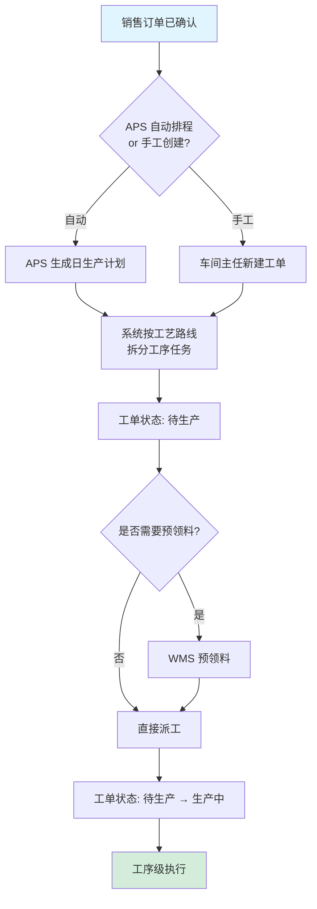
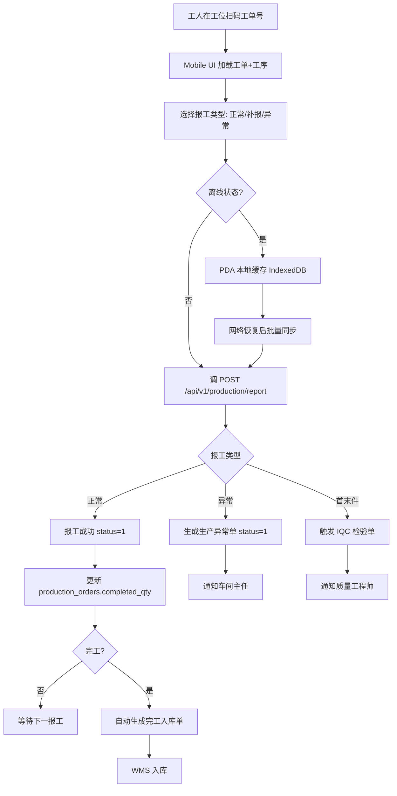
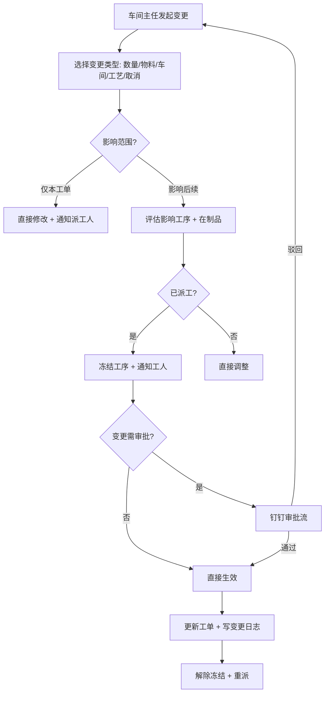
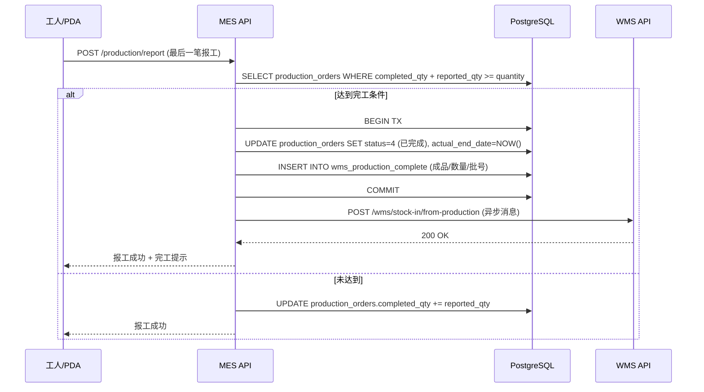
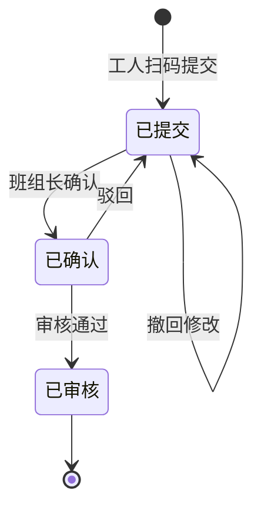
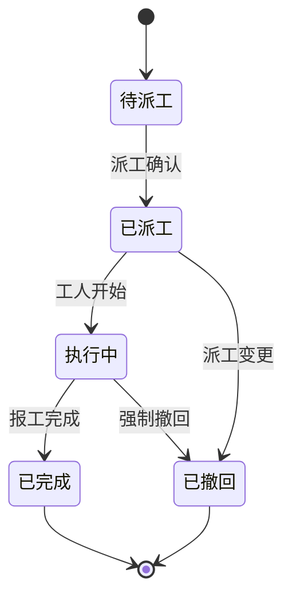
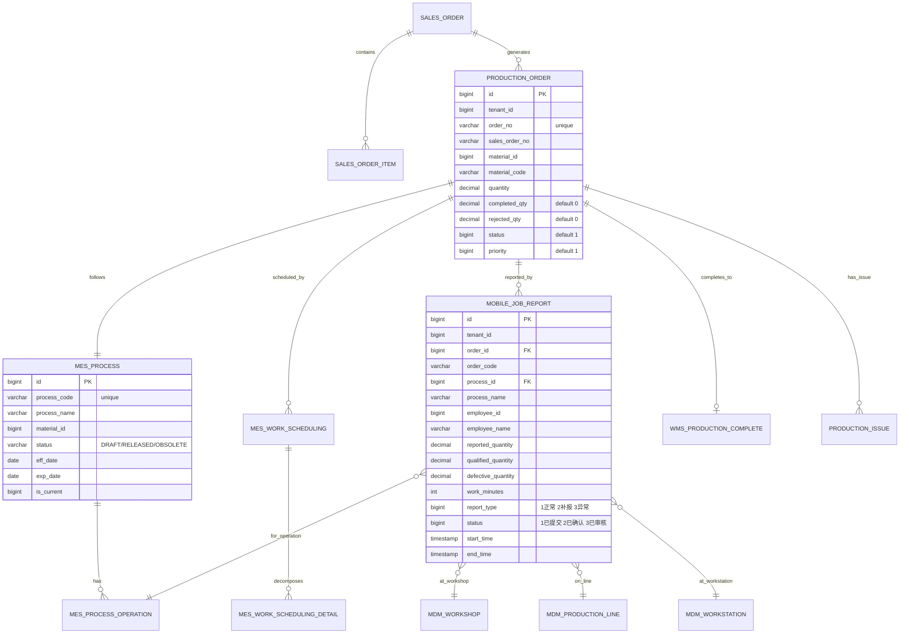

# MOM 3.0 MES 生产执行模块设计文档

> 版本：V2.0 | 最后更新：2026-07-02 | 维护人：架构组 / 小二
> 适用范围：MOM 3.0 MES（Manufacturing Execution System）生产执行域
> 模板主干：[MOM3.0_模块设计模板.md](MOM3.0_模块设计模板.md)（Arc42 简化版 + MESA 11 项 + IATF 16949 + ISA-95/88）
>
> ⚠️ **V2.0 重大变更**：基于 V1.0（2229 行 SFMS3.0 Java/Flowable/MyBatis-Plus 残留）按统一模板重写。技术栈对齐实际实现：Vue 3.4 + Vite + Element Plus 2.5 / Go 1.24 + Gin + GORM / PostgreSQL 18。

---

## 0. 文档元信息

| 字段 | 值 |
|---|---|
| 模块代号 | `mes` |
| 模块名 | MES 生产执行 |
| 技术栈 | Vue 3.4 + Element Plus 2.5 / Go 1.24 + Gin + GORM 2.x / PostgreSQL 18 |
| 前端入口 | `mom-web/src/views/production/*.vue`（15 个视图） |
| 后端入口 | `mom-server/internal/handler/production/*.go`（15 个 handler） |
| API 前缀 | `/api/v1/production/*` |
| 数据库表 | 19 张（核心 6 + 扩展 13） |
| 模块文档版本 | V2.0 |
| 上次评审 | — |
| 主要作者 | 架构组 / 小二 |
| 状态 | ✅ 样板（按 V2.0 模板首版重写） |

---

## 1. 模块概述

### 1.1 业务定位

MES（Manufacturing Execution System）是 MOM 3.0 的核心模块，对接 **ISA-95 Level 3**（生产管理层），向上接收 APS（高级计划排程）的日/周生产计划，向下驱动 SCADA/PLC/设备集成实现 Level 1-2 数据采集与控制。

**价值流位置**：`销售订单 → 生产计划(APS) → 生产工单(MES) → 工序执行(MES) → 报工入库(MES+WMS) → 发货(WMS)`

模块覆盖**销售订单、生产工单、工艺路线、车间调度、派工、首末件检验、报工、完工入库、生产异常、流转卡、电子 SOP、生产成本、生产看板**13 个子业务。

### 1.2 核心功能

| 功能 | 简述 | 优先级 |
|---|---|---|
| 销售订单管理 | 客户订单录入、确认、变更 | P0 |
| 生产工单管理 | 计划工单创建、状态推进、变更 | P0 |
| 工艺路线管理 | 物料-工序-工位-资源绑定 | P0 |
| 车间排程 | 工序级排程与冲突检测 | P1 |
| 派工管理 | 工序任务分配到人/工位 | P0 |
| 首末件检验 | 批次首末件 IQC/IPQC 联动 | P1 |
| 移动报工 | 工位扫码报工（数量/工时/缺陷） | **P0**（车间核心） |
| 完工入库 | 工单完工自动触发 WMS 入库 | P0 |
| 生产异常 | 设备故障/物料短缺/质量异常上报 | P1 |
| 流转卡 | 纸质流转卡的电子化追溯 | P2 |
| 电子 SOP | 工序作业指导书（图片/视频） | P2 |
| 生产成本 | 工时/物料/能耗成本归集 | P2 |
| 生产看板 | 实时产量/OEE/在制品可视化 | P1 |

### 1.3 Top 3 干系人

1. **车间主任** — 工单创建、派工、监控
2. **一线工人** — 扫码报工、报异常
3. **质量工程师** — 首末件审核、缺陷处置

### 1.4 Top 3 质量目标（量化）

| 指标 | 目标值 | 测量方式 |
|---|---|---|
| 工单准时完工率 | ≥ 95% | 实际完工日 vs 计划完工日（在 `actual_end_date - plan_end_date ≤ 0` 内） |
| 报工响应延迟 | ≤ 2 秒（P95） | 移动端扫码 → API 响应时间 |
| 状态机非法转移 | 0 次/天 | 状态字段 UPDATE 触发器 / 代码 assert |

---

## 2. 依赖关系

### 2.1 上游模块（谁给我数据）

| 模块 | 提供什么 | 接入方式 |
|---|---|---|
| APS 高级计划排程 | 日生产计划/MPS/MRP | 同步接口（`/api/v1/aps/schedule/...`） |
| MDM 主数据 | 物料/工艺路线/工作中心/工位/产线/车间 | 共享 GORM 模型 + 跨服务 API |
| 销售（计划层） | 销售订单 | 同步接口 |
| QMS 质量管理 | 检验单/缺陷代码 / 质量问题触发返工工单 | API（首末件触发 IQC + 返工联动） |
| EAM 设备管理 | 设备状态/能力 / 设备故障触发工单挂起 | API（设备故障联动派工冻结） |
| BPM 流程 | 工单变更审批结果 | API（变更完成后回写 MES） |
| INT 系统集成 | ERP 订单同步 / AGV 任务 | 事件订阅 |

### 2.2 下游模块（我给谁数据）

| 模块 | 我提供什么 | 触发方式 |
|---|---|---|
| WMS 仓储管理 | 完工入库单/领料单 | 完工事件 → 自动生成入库单 |
| QMS 质量管理 | 首末件检验请求 | 工单首/末工序触发 |
| 成本核算 | 工时/物料消耗 | 完工事件 |
| 追溯与数据采集 | 工序级生产数据 | 报工事件 |
| 数据分析/BI | 工单/产量/工时数据 | 数据库视图 |

### 2.3 外部系统

- **钉钉/企微**：审批流（工单变更/异常升级）
- **扫码枪/PDA**：移动报工扫码
- **MES 终端**：车间大屏看板
- **ERP**：销售订单/采购订单同步（接口预留，暂未对接）

### 2.4 标准对齐

| 标准 | 对齐情况 |
|---|---|
| ISA-95 / IEC 62264 | Level 3 功能模型对齐（资源/能力/工单/工序） |
| ISA-88 / IEC 61512 | 工艺路线（Recipe → Process → Operation）三层模型 |
| MESA Model | 11 项核心功能覆盖：详细排程/生产跟踪/质量管理/维护管理/数据分析等 |
| IATF 16949 | 首末件检验 + 不良追溯 |
| Arc42 | 文档结构按 Arc42 简化版组织 |

---

## 3. 功能清单

### 3.1 已实现（✅）

- ✅ 销售订单 CRUD + 状态推进
- ✅ 生产工单 CRUD + 状态推进
- ✅ 工艺路线（mes_process / mes_process_operation）
- ✅ 排程（mes_work_scheduling / mes_work_scheduling_detail）
- ✅ 派工（dispatch handler）
- ✅ 移动报工（mobile_job_report 全流程）
- ✅ 首末件检验（first_last_inspect）
- ✅ 生产报工（report handler）
- ✅ 完工入库（production_complete → WMS）
- ✅ 生产异常（production_issue）
- ✅ 退料/补料（production_return）
- ✅ 看板（KanbanBoard）
- ✅ 成本归集（production_cost）
- ✅ 流转卡（FlowCardList）
- ✅ 电子 SOP（ElectronicSOPList）
- ✅ 编码规则（CodeRuleList）

### 3.2 部分实现（🟡）

- 🟡 工单变更（OrderChangeList）— 字段已建，自动化变更传播待开发
- 🟡 离线报工（production_offline）— PDA 离线缓存 + 上线同步机制未跑通
- 🟡 生产日报（production_daily_report）— 数据源 OK，模板未固化

### 3.3 未实现 / 待开发（❌）

- ❌ APS 双向联动（当前只接收计划，反馈产能未实现）
- ❌ OEE 自动计算（数据齐全，公式未固化）
- ❌ 工艺仿真（process simulation）
- ❌ 设备故障自动联动工单冻结（需 EAM 集成）
- ❌ 移动端 App（PDA 现在用 H5 嵌入，App 待开发）

---

## 4. 页面与交互

### 4.1 页面清单

| # | 路由 | 组件 | 功能 | 权限 |
|---|---|---|---|---|
| 1 | `/production/sales-order` | `SalesOrderList.vue` | 销售订单列表 + 新建 | sales:read |
| 2 | `/production/order` | `ProductionOrderList.vue` | 生产工单列表 | production:read |
| 3 | `/production/dispatch` | `DispatchList.vue` | 派工管理 | production:dispatch |
| 4 | `/production/report` | `ReportList.vue` | 生产报工（PC 端审核） | production:report |
| 5 | `/production/first-last-inspect` | `FirstLastInspectList.vue` | 首末件检验 | quality:first-article |
| 6 | `/production/kanban` | `KanbanBoard.vue` | 生产看板（实时） | production:kanban |
| 7 | `/production/order-change` | `OrderChangeList.vue` | 工单变更 | production:change |
| 8 | `/production/package` | `PackageList.vue` | 包装管理 | production:package |
| 9 | `/production/electronic-sop` | `ElectronicSOPList.vue` | 电子 SOP | production:sop |
| 10 | `/production/flow-card` | `FlowCardList.vue` | 流转卡 | production:flowcard |
| 11 | `/production/code-rule` | `CodeRuleList.vue` | 编码规则 | system:code-rule |
| 12 | `/production/issue` | `ProductionIssueList.vue` | 生产异常 | production:issue |
| 13 | `/production/return` | `ProductionReturnList.vue` | 退料 | production:return |
| 14 | `/production/cost` | `ProductionCostList.vue` | 生产成本 | finance:cost |
| 15 | `/mobile/job-report` | `MobileJobReport.vue` | 移动端报工（PDA） | production:report-mobile |

### 4.2 标准列表页（以生产工单为例）

```
┌─────────────────────────────────────────────────────────────────────┐
│  生产工单列表                              [+ 新建] [批量派工] [导出] │
├─────────────────────────────────────────────────────────────────────┤
│  [工单号▼] [物料编码▼] [车间▼] [状态▼] [计划日期▼] [优先级▼] [搜索] │
├──────┬───────────┬─────────┬──────┬────────┬──────────┬─────────────┤
│ ☐    │ 工单号    │ 物料    │ 数量 │ 车间   │ 状态     │ 操作        │
├──────┼───────────┼─────────┼──────┼────────┼──────────┼─────────────┤
│ ☐    │ PO-2026-  │ M-A100  │ 100  │ 一车间 │ 生产中   │ 详情/变更   │
│      │ 001       │         │      │        │          │ 派工/报工   │
├──────┼───────────┼─────────┼──────┼────────┼──────────┼─────────────┤
│ ☐    │ PO-2026-  │ M-B200  │ 50   │ 二车间 │ 待生产   │ 详情/派工   │
└──────┴───────────┴─────────┴──────┴────────┴──────────┴─────────────┘
                                                  共 156 条 [上一页] 1/8
```

**关键字段**（对应 `production_orders` 表）：
- 工单号 `order_no`（VARCHAR 50, unique）
- 物料 `material_code` + `material_name` + `material_spec`
- 计划/已完工/不良数量 `quantity` / `completed_qty` / `rejected_qty`
- 车间 + 产线 `workshop_name` / `line_name`
- 计划/实际开始/结束 `plan_start_date` / `actual_end_date`
- 状态 `status`（int，详见 §6 状态机）
- 优先级 `priority`（1 普通 / 2 紧急 / 3 加急）

### 4.3 工单新建弹窗（关键字段）

```
┌──── 新建生产工单 ────────────────────────┐
│  销售订单号:  [SO-2026-001     ▼]       │
│  物料:        [M-A100   ▼]              │
│  计划数量:    [100         ] 单位 [件]   │
│  车间:        [一车间     ▼]             │
│  产线:        [L01        ▼]             │
│  工艺路线:    [PR-A100    ▼] (联动选)   │
│  计划开始:    [2026-07-03 ]              │
│  计划结束:    [2026-07-10 ]              │
│  优先级:      ( ) 普通 (•) 紧急         │
│  备注:        [                       ] │
│                                        │
│           [取消]            [保存]      │
└────────────────────────────────────────┘
```

### 4.4 工单详情弹窗（关键信息）

- 基本信息 + 状态推进时间线
- 工序列表（来自 `mes_process_operation`）
- 派工情况（人员/工位/工时）
- 报工记录（`mobile_job_report` 聚合）
- 异常记录
- 关联：销售订单/工艺路线/入库单

---

## 5. 业务流程（★ 必有图）

### 5.1 核心流程：生产工单下发（销售订单 → 工单）



### 5.2 核心流程：移动报工（工位扫码 → 入库）



### 5.3 异常流程：工单变更



### 5.4 跨系统流程：完工入库（MES → WMS）



---

## 6. 状态机（★ 必有图）

### 6.1 核心实体：生产工单（ProductionOrder）

#### 6.1.1 状态值与显示

| 值 | 显示名 | 说明 |
|---|---|---|
| 1 | 待生产 | 工单已创建，未派工或未开始 |
| 2 | 生产中 | 已派工，至少一道工序开始 |
| 3 | 已完成 | 数量全部报工完成 + 入库单已生成 |
| 4 | 已关闭 | 主动关闭（取消/合并/异常终止） |
| 5 | 已挂起 | 物料短缺/设备故障/质量异常临时挂起 |

#### 6.1.2 状态机图

```mermaid
stateDiagram-v2
    [*] --> 待生产: 创建工单
    待生产 --> 生产中: 派工 + 首道工序开工
    待生产 --> 已关闭: 主动取消
    待生产 --> 已挂起: 物料短缺/设备故障
    生产中 --> 生产中: 报工 (数量累加)
    生产中 --> 已完成: 数量全部报工 + 入库单生成
    生产中 --> 已挂起: 异常发生
    生产中 --> 已关闭: 强制终止
    已挂起 --> 生产中: 解除挂起
    已挂起 --> 已关闭: 长期无法恢复
    已完成 --> [*]
    已关闭 --> [*]

    note right of 已完成: 触发条件:<br/>completed_qty + rejected_qty >= quantity
```

#### 6.1.3 转移明细

| From | To | 触发条件 | 触发方 |
|---|---|---|---|
| - | 待生产 | 工单新建 | 车间主任/APS |
| 待生产 | 生产中 | 派工完成 + 首工序开工 | 工人/PDA |
| 待生产 | 已关闭 | 主动取消 | 车间主任 |
| 待生产 | 已挂起 | 物料短缺/设备故障 | 工人/系统 |
| 生产中 | 生产中 | 报工数量累加 | 工人/PDA |
| 生产中 | 已完成 | `completed_qty + rejected_qty >= quantity` + 入库单生成 | 系统自动 |
| 生产中 | 已挂起 | 异常升级 | 工人/系统 |
| 生产中 | 已关闭 | 强制终止 | 车间主任 |
| 已挂起 | 生产中 | 解除挂起 + 重新派工 | 车间主任 |
| 已挂起 | 已关闭 | 长期无法恢复 | 车间主任 |

### 6.2 核心实体：移动报工（MobileJobReport）

#### 6.2.1 状态值与显示

| 值 | 显示名 | 说明 |
|---|---|---|
| 1 | 已提交 | 工人/PDA 提交，等待班组长确认 |
| 2 | 已确认 | 班组长确认，等待审核 |
| 3 | 已审核 | 审核通过，数据进入工单 |

#### 6.2.2 状态机图



### 6.3 核心实体：派工（Dispatch）

#### 6.3.1 状态值与显示

| 值 | 显示名 |
|---|---|
| 1 | 待派工 |
| 2 | 已派工 |
| 3 | 执行中 |
| 4 | 已完成 |
| 5 | 已撤回 |

#### 6.3.2 状态机图



---

## 7. 数据模型（★ 必有 ER 图）

### 7.1 核心 ER 图



### 7.2 关键字段说明

#### production_orders.status

类型 `bigint`（**注**：原审计报告 V1.0 误标为 `varchar`），实际是 `int64`，与 `mes_process.status`（varchar）**不一致**。这是历史包袱，建议长期改为一致的字典表。

#### production_orders.priority

| 值 | 含义 |
|---|---|
| 1 | 普通 |
| 2 | 紧急 |
| 3 | 加急 |

#### mobile_job_report.report_type

| 值 | 含义 |
|---|---|
| 1 | 正常报工 |
| 2 | 补报（漏报后补录） |
| 3 | 异常（设备故障等导致的不良品） |

---

## 8. API 列表

### 8.1 销售订单 `/api/v1/production/sales-order`

| 方法 | 路径 | 功能 | 权限 |
|---|---|---|---|
| GET | `/:id` | 查询详情 | sales:read |
| POST | `/list` | 列表查询 | sales:read |
| POST | `/create` | 创建 | sales:write |
| PUT | `/:id` | 更新 | sales:write |
| DELETE | `/:id` | 删除 | sales:delete |
| POST | `/:id/confirm` | 确认订单 | sales:confirm |

### 8.2 生产工单 `/api/v1/production/order`

| 方法 | 路径 | 功能 | 权限 |
|---|---|---|---|
| GET | `/:id` | 查询详情 | production:read |
| POST | `/list` | 列表查询（支持工单号/物料/状态/车间过滤） | production:read |
| POST | `/create` | 创建工单 | production:create |
| PUT | `/:id` | 更新 | production:update |
| DELETE | `/:id` | 删除 | production:delete |
| POST | `/:id/change` | 工单变更 | production:change |
| POST | `/:id/close` | 关闭工单 | production:close |

### 8.3 移动报工 `/api/v1/production/report`

| 方法 | 路径 | 功能 | 权限 |
|---|---|---|---|
| POST | `/create` | 创建报工（工人/PDA） | production:report-mobile |
| GET | `/list` | 列表（PC 端审核） | production:report |
| POST | `/:id/confirm` | 班组长确认 | production:report-confirm |
| POST | `/:id/audit` | 审核通过 | production:report-audit |
| POST | `/:id/reject` | 驳回 | production:report-audit |
| POST | `/sync-offline` | PDA 离线缓存批量同步 | production:report-mobile |

### 8.4 派工 `/api/v1/production/dispatch`

| 方法 | 路径 | 功能 | 权限 |
|---|---|---|---|
| GET | `/list` | 派工列表 | production:read |
| POST | `/create` | 创建派工 | production:dispatch |
| POST | `/:id/withdraw` | 撤回派工 | production:dispatch |

### 8.5 其他

- `/production/first-last-inspect` — 首末件检验
- `/production/kanban/data` — 看板数据（实时）
- `/production/package` — 包装管理
- `/production/electronic-sop` — 电子 SOP
- `/production/flow-card` — 流转卡
- `/production/code-rule` — 编码规则
- `/production/issue` — 生产异常
- `/production/return` — 退料
- `/production/cost` — 生产成本
- `/production/complete` — 完工入库

---

## 9. 权限矩阵

### 9.1 RBAC 角色 × 功能权限

| 角色 | 工单 CRUD | 派工 | 报工提交 | 报工审核 | 首末件 | 变更 | 看板 |
|---|---|---|---|---|---|---|---|
| 车间主任 | ✅ | ✅ | — | ✅ | — | ✅ | ✅ |
| 班组长 | ✅ | ✅ | — | ✅ | — | — | ✅ |
| 一线工人 | 查看 | — | ✅ | — | — | — | 查看 |
| 质量工程师 | 查看 | — | — | ✅ | ✅ | — | 查看 |
| 计划员 | ✅ | — | — | — | — | — | ✅ |
| 财务 | 查看 | — | — | — | — | — | 成本 |

### 9.2 数据权限（行级）

- `tenant_id` 强制过滤（多租户隔离）
- `workshop_id` 按车间主任归属过滤（工人只看自己车间）
- 总经理/厂长：跨车间可见

---

## 10. 集成点

### 10.1 出站事件（我发什么）

| 事件 | 接收方 | 触发 |
|---|---|---|
| `production.order.created` | APS, BI | 工单新建 |
| `production.order.completed` | WMS, 成本核算 | 工单完工 |
| `production.report.audited` | WMS, 追溯, BI | 报工审核通过 |
| `production.exception.created` | 钉钉, 车间主任 | 异常上报 |
| `production.first_article.failed` | QMS, 钉钉 | 首件不合格 |

### 10.2 入站事件（我收什么）

| 事件 | 来源 | 处理 |
|---|---|---|
| `aps.schedule.published` | APS | 自动生成工单 |
| `equipment.fault` | EAM | 关联工单挂起 |
| `quality.defect` | QMS | 触发返工工单 |

### 10.3 消息格式（JSON 示例）

```json
{
  "event": "production.order.completed",
  "tenant_id": 1,
  "order_id": 12345,
  "order_no": "PO-2026-001",
  "completed_qty": 100,
  "rejected_qty": 2,
  "timestamp": "2026-07-02T20:00:00+08:00"
}
```

### 10.4 重试 / 死信

- 当前为同步 HTTP 调用，失败由调用方重试
- 未来改造方向：Kafka 异步事件 + 死信队列

---

## 11. 可观测性

### 11.1 关键指标

| 指标 | 测量 |
|---|---|
| 报工 API P95 延迟 | Prometheus histogram `mes_report_duration_seconds` |
| 工单准时完工率 | 每日聚合查询 |
| 状态机非法转移次数 | 触发器告警 |
| PDA 离线缓存命中率 | IndexedDB 上传指标 |

### 11.2 日志样例

```json
{
  "ts": "2026-07-02T20:00:00+08:00",
  "level": "INFO",
  "trace_id": "abc123",
  "tenant_id": 1,
  "user_id": 456,
  "action": "production.report.create",
  "order_id": 12345,
  "process_id": 67,
  "reported_quantity": 10,
  "duration_ms": 142
}
```

### 11.3 告警规则

| 规则 | 阈值 | 通知 |
|---|---|---|
| 报工 P95 > 2s 持续 5min | > 2s | 钉钉 |
| 状态机非法转移 | ≥ 1 次 | 即时 |
| PDA 离线缓存堆积 > 100 条 | > 100 | 钉钉 |

---

## 12. 非功能需求

### 12.1 性能

| 场景 | 目标 |
|---|---|
| 报工 API 响应 | P95 ≤ 2s |
| 工单列表查询（10 万条） | ≤ 1s（分页 + 索引） |
| 看板实时刷新 | ≤ 5s（WebSocket 或轮询） |
| PDA 离线同步 100 条 | ≤ 30s |

### 12.2 可用性

- 报工 API：99.9%（离线降级支持）
- 工单 CRUD：99.5%
- 看板：95%（非关键）

### 12.3 数据量与保留期

| 表 | 预估量 | 保留期 |
|---|---|---|
| production_orders | 1 万/月 | 5 年 |
| mobile_job_report | 10 万/月 | 3 年 |
| mes_process | 1000 | 长期 |

---

## 13. 附录

### 13.1 CHANGELOG

| 版本 | 日期 | 变更 |
|---|---|---|
| V1.0 | 2026-04-21 | 初版（SFMS3.0 Java/Flowable/MyBatis 残留，2229 行） |
| V2.0 | 2026-07-02 | 按统一模板重写，对齐实际技术栈（Vue 3 + Go + PG18） |

### 13.2 相关链接

- [MOM3.0_模块设计模板.md](MOM3.0_模块设计模板.md)
- [MOM3.0_主设计文档.md](MOM3.0_主设计文档.md)
- [MOM3.0_技术架构文档.md](MOM3.0_技术架构文档.md)
- [MOM3.0_UI设计规范.md](MOM3.0_UI设计规范.md)

### 13.3 待办 / 已知问题

1. ⚠️ `production_orders.status` 是 `bigint`，`mes_process.status` 是 `varchar` — **不一致**，建议改统一字典表
2. ⚠️ 离线报工 IndexedDB 缓存未跑通，待补
3. ⚠️ OEE 自动计算公式未固化
4. ⚠️ 移动端 App 待开发（现为 H5 嵌入）
5. ⚠️ APS 双向联动待实现（目前只单向接收计划）

### 13.4 OpenAPI / Swagger

- 路径：`/api/v1/swagger/*`
- 当前状态：未启用（规划中，依赖 `@swaggo/gin` 集成）

---

*文档作者：架构组 / 小二*
*最后更新：2026-07-02 21:00*
*评审：待评审*