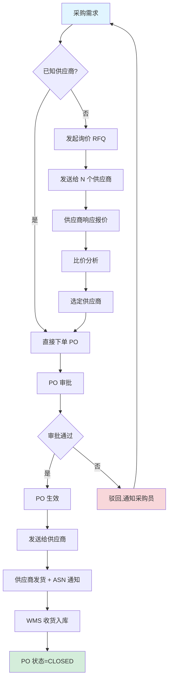
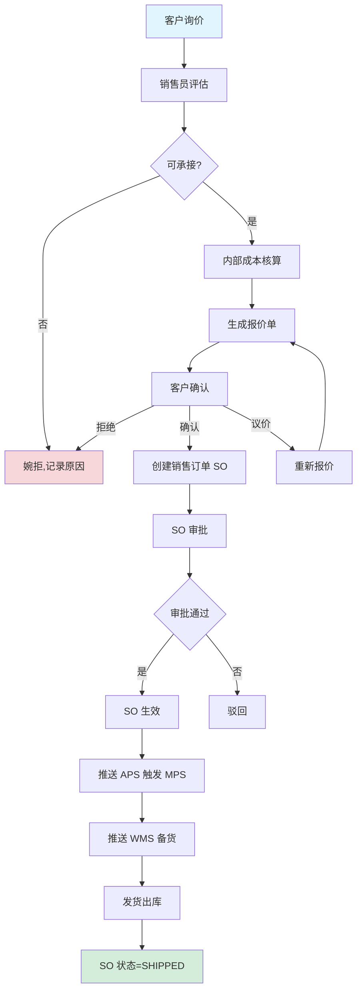
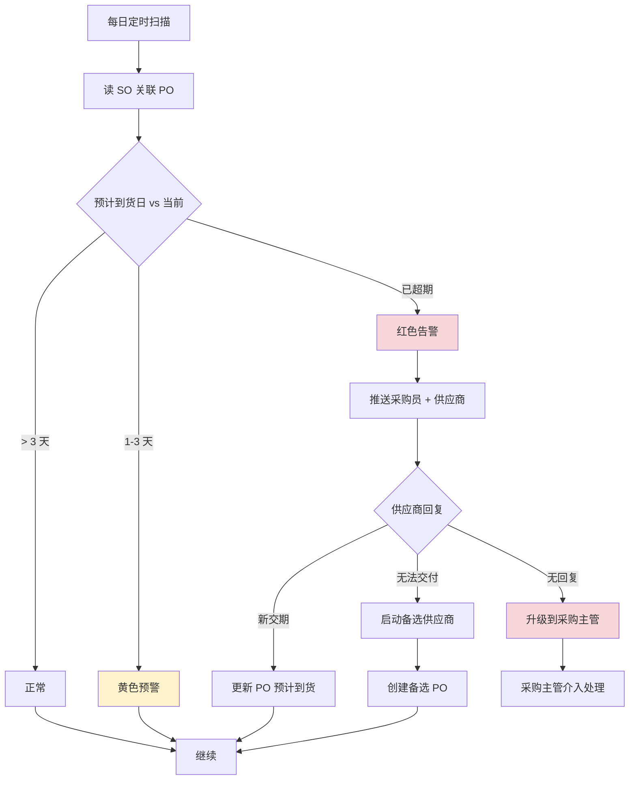
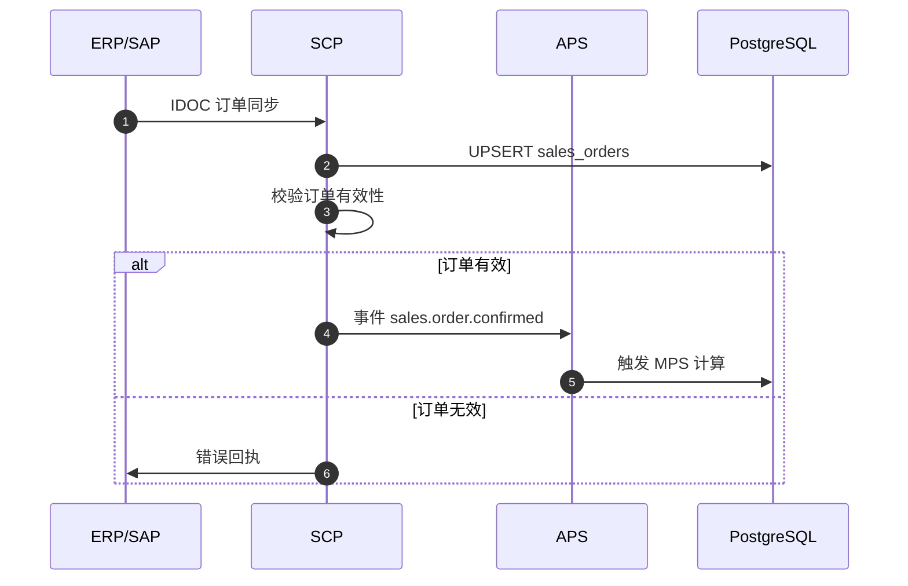
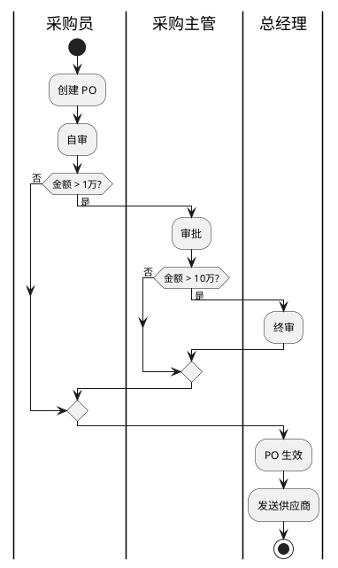
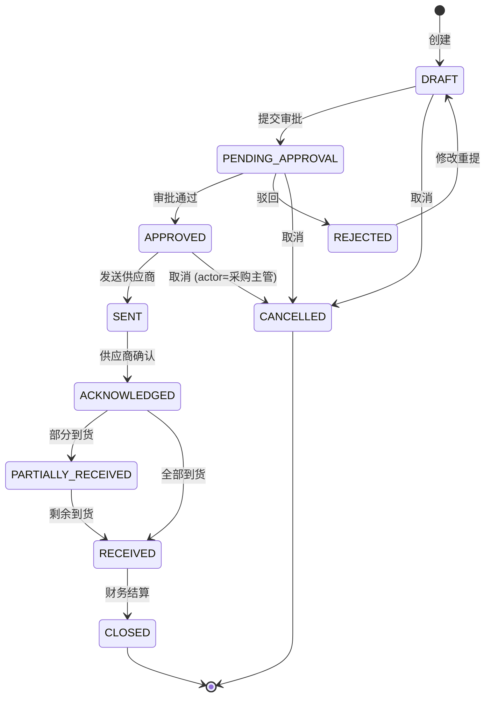
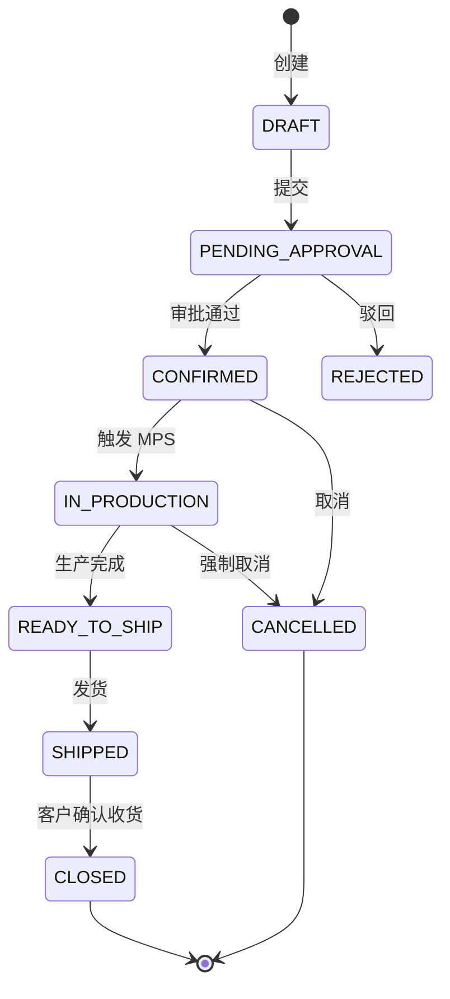
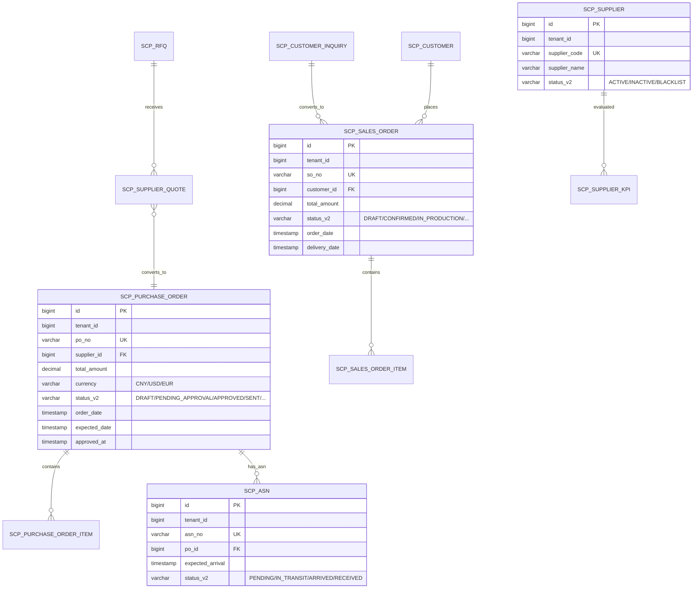

# MOM 3.0 SCP 供应链模块设计文档

> 版本：V2.0 | 最后更新：2026-07-03 | 维护人：架构组 / 小二
> 适用范围：MOM 3.0 SCP（Supply Chain Planning）供应链管理域
> 模板主干：[MOM3.0_模块设计模板.md](MOM3.0_模块设计模板.md)
> 模块代码：`mom-server/internal/handler/scp/*` `mom-server/internal/service/scp*` `mom-server/internal/model/scp*`
> 数据库表：核心 8 张（采购/销售/报价/ASN/供应商/客户/KPI/RFQ）
> 状态：**✅ V2.0 完成 - 按统一模板重写,旧版 1594 行大砍至 800 行**

> **V2.0 重大变更**：基于 V1.x（1594 行,12 章节 0 Mermaid）按 V2.0 模板重写。技术栈对齐：Vue 3.4 + Element Plus 2.5 / Go 1.24 + Gin + GORM / PostgreSQL 18。

---

## 0. 文档元信息

| 字段 | 值 |
|---|---|
| 模块代号 | `scp` |
| 模块名 | SCP 供应链管理 |
| 技术栈 | Vue 3.4 + Element Plus 2.5 / Go 1.24 + Gin + GORM 2.x / PostgreSQL 18 |
| 前端入口 | `mom-web/src/views/scp/*.vue`（8 个视图） |
| 后端入口 | `mom-server/internal/handler/scp/*.go` |
| API 前缀 | `/api/v1/scp/*` |
| 数据库表 | 8 张核心 |
| 状态 | ✅ V2.0（第 1 批 P0 第 3 个） |

---

## 1. 模块概述

### 1.1 业务定位

SCP 是 MOM 3.0 的供应链管理模块，覆盖采购、销售、询价、报价、ASN（到货通知）、供应商绩效、客户管理等核心业务。对接 **ERP/APS/WMS/MES**，实现供应链全链路协同。

**价值流位置**：`客户询价(SCP) → 销售订单(SCP) → MPS(APS) → 采购订单(SCP) → ASN(SCP) → WMS 收货 → MES 领料 → 发货(SCP/WMS) → 客户`

模块覆盖**采购订单、询价单 RFQ、供应商报价、销售订单、客户询价、ASN 到货通知、供应商绩效、客户管理**8 个子业务。

### 1.2 核心功能

| # | 功能 | 简述 | 优先级 |
|---|------|------|--------|
| 1 | 采购订单管理 | PO 创建/审批/跟踪 | P0 |
| 2 | 询价单 RFQ | 询价发起/供应商响应 | P0 |
| 3 | 供应商报价 | 报价录入/比价 | P1 |
| 4 | 销售订单管理 | SO 创建/确认/变更 | P0 |
| 5 | 客户询价 | 客户询价/报价 | P0 |
| 6 | ASN 到货通知 | 供应商发货预告 | P0 |
| 7 | 供应商绩效 | 交付率/质量 KPI | P1 |
| 8 | 客户管理 | 客户档案/信用评估 | P1 |

### 1.3 Top 3 干系人

| 角色 | 诉求 |
|------|------|
| **采购员** | PO 创建/审批、供应商对账 |
| **销售员** | SO 创建/确认、订单跟踪 |
| **供应链主管** | 供应商绩效、客户信用评估 |

### 1.4 Top 3 质量目标

| 指标 | 目标值 |
|------|--------|
| 采购订单创建 P95 | ≤ 1s |
| 销售订单确认 P95 | ≤ 1s |
| ASN 到货准确率 | ≥ 98% |

---

## 2. 依赖关系

### 2.1 上游模块

| 模块 | 接口 | 频度 |
|------|------|------|
| **ERP (SAP/QAD)** | 销售订单/采购订单同步 | 实时 |
| **INT 系统集成** | ERP 订单/物料同步（IDOC）| 实时 |
| **MDM 主数据** | 物料/客户/供应商 | 实时 |

### 2.2 下游模块

| 模块 | 接口 | 频度 |
|------|------|------|
| **APS 计划** | 销售订单→MPS,采购订单→物料需求 | 实时 |
| **WMS 仓储** | PO→入库,SO→出库 | 实时 |
| **MES 生产** | SO 关联工单 | 实时 |
| **QMS 质量** | 供应商 KPI | 日终 |

### 2.3 外部系统

| 系统 | 方向 | 协议 | 用途 |
|------|------|------|------|
| **ERP (SAP/QAD)** | 双向 | IDOC/REST | 订单/物料同步 |
| **客户 EDI 平台** | 双向 | EDI/X12 | 订单/ASN |
| **供应商门户** | 双向 | HTTPS | 询价/报价 |

### 2.4 标准对齐

| 标准 | 段 |
|------|---|
| **ISA-95** | Level 4（计划层） |
| **MESA** | MESA 11 项 #9 Supply Chain Management |

---

## 3. 功能清单

### 3.1 已实现

| # | 功能 | 端点 | 优先级 | 日期 |
|---|------|------|--------|------|
| 1 | 采购订单 CRUD | `/api/v1/scp/purchase-orders/*` | P0 | 2026-04 |
| 2 | 询价单 RFQ | `/api/v1/scp/rfq/*` | P0 | 2026-04 |
| 3 | 供应商报价 | `/api/v1/scp/supplier-quote/*` | P1 | 2026-04 |
| 4 | 销售订单 CRUD | `/api/v1/scp/sales-orders/*` | P0 | 2026-04 |
| 5 | 客户询价 | `/api/v1/scp/customer-inquiry/*` | P0 | 2026-04 |
| 6 | ASN 到货通知 | `/api/v1/scp/asn/*` | P0 | 2026-04 |
| 7 | 供应商 KPI | `/api/v1/scp/supplier-kpi/*` | P1 | 2026-04 |
| 8 | 客户档案 | `/api/v1/scp/customer/*` | P1 | 2026-04 |
| 9 | 供应商档案 | `/api/v1/scp/supplier/*` | P0 | 2026-04 |

### 3.2 部分实现

| # | 功能 | 缺口 | 计划 |
|---|------|------|------|
| 1 | EDI 自动化 | 仅手动导入 | V2.1 |
| 2 | 智能比价 | 基础对比 | V3.0 |

### 3.3 未实现

| # | 功能 | 优先级 |
|---|------|--------|
| 1 | 区块链溯源 | P2 |
| 2 | 供应商金融 | P2 |

---

## 4. 页面与交互

### 4.1 页面清单

| 路由 | 标题 | 状态 |
|------|------|------|
| `/scp/purchase-orders` | 采购订单 | ✅ |
| `/scp/sales-orders` | 销售订单 | ✅ |
| `/scp/rfq` | 询价单 | ✅ |
| `/scp/supplier-quote` | 供应商报价 | ✅ |
| `/scp/customer-inquiry` | 客户询价 | ✅ |
| `/scp/asn` | ASN 到货通知 | ✅ |
| `/scp/supplier-kpi` | 供应商绩效 | ✅ |
| `/scp/customer` | 客户管理 | ✅ |

### 4.2 采购订单特有列

| 列名 | 类型 | 宽度 | 固定 |
|------|------|------|------|
| PO 单号 | link | 160px | ✅ |
| 供应商 | string | 200px | ❌ |
| 订单金额 | decimal | 140px | ❌ |
| 状态 | tag | 100px | ❌ |
| 下单日期 | date | 120px | ❌ |
| 预计到货 | date | 120px | ❌ |
| 操作 | buttons | 200px | ✅ |

### 4.3 PO 创建表单（关键联动）

- 选供应商 → 自动带出该供应商的默认付款条件、币种
- 选物料 → 自动带出默认单价、税率
- 提交前：金额校验、供应商资质校验

---

## 5. 业务流程（★ 必有图）

### 5.1 核心流程：采购订单（询价→比价→下单→收货）



### 5.2 核心流程：销售订单（询价→报价→订单→发货）



### 5.3 异常流程：供应商延迟交货



### 5.4 跨系统流程：ERP 订单同步



### 5.5 BPMN 2.0 采购审批（金额分级）



---

## 6. 状态机（★ 必有图）

### 6.1 核心实体：采购订单（PurchaseOrder）

#### 6.1.1 状态值与显示

| 状态值 | 业务含义 | Element Plus type |
|--------|---------|------------------|
| `DRAFT` | 草稿 | info |
| `PENDING_APPROVAL` | 待审批 | warning |
| `APPROVED` | 已审批 | primary |
| `REJECTED` | 已驳回 | danger |
| `SENT` | 已发送供应商 | primary |
| `ACKNOWLEDGED` | 供应商确认 | primary |
| `PARTIALLY_RECEIVED` | 部分收货 | warning |
| `RECEIVED` | 全部收货 | success |
| `CLOSED` | 已关闭 | info |
| `CANCELLED` | 已取消 | info |

> 状态字段存储类型：**`varchar(30) + mdm_status_dict`**（`entity='purchase_order'`）

#### 6.1.2 状态机图



#### 6.1.3 转移明细

| 源 | 目标 | 触发 | 守卫 | 动作 | 角色 |
|----|------|------|------|------|------|
| DRAFT | PENDING_APPROVAL | 提交 | 金额>阈值 | 触发 BPM | 采购员 |
| PENDING_APPROVAL | APPROVED | 通过 | 审批链全通过 | 写 `approved_at` | 采购主管 |
| SENT | ACKNOWLEDGED | 确认 | 供应商在门户确认 | 写 `acknowledged_at` | 供应商 |
| ACKNOWLEDGED | PARTIALLY_RECEIVED | 部分收货 | 收货数<订单数 | 累计收货数 | WMS |

### 6.2 核心实体：销售订单（SalesOrder）



| 状态值 | Element Plus type |
|--------|------------------|
| DRAFT | info |
| PENDING_APPROVAL | warning |
| CONFIRMED | primary |
| IN_PRODUCTION | primary |
| READY_TO_SHIP | warning |
| SHIPPED | success |
| CLOSED | info |
| CANCELLED | info |
| REJECTED | danger |

### 6.3 字段类型说明

> MOM 3.0 SCP 选 **`varchar(30) + mdm_status_dict`**

---

## 7. 数据模型（★ 必有 ER 图）

### 7.1 核心 ER 图



**关系说明**：

| 表 A | 表 B | 关系 |
|------|------|------|
| `SCP_PURCHASE_ORDER` | `SCP_ASN` | 1:N |
| `SCP_RFQ` | `SCP_SUPPLIER_QUOTE` | 1:N |
| `SCP_SUPPLIER_QUOTE` | `SCP_PURCHASE_ORDER` | N:1(可转) |
| `SCP_SALES_ORDER` | `SCP_CUSTOMER` | N:1 |

### 7.2 核心表

#### `scp_purchase_order`

| 字段 | 类型 | 必填 | 默认 | 索引 | 说明 |
|------|------|------|------|------|------|
| `id` | `bigint` | ✅ | auto | PK | |
| `tenant_id` | `bigint` | ✅ | - | IDX | |
| `po_no` | `varchar(50)` | ✅ | - | UK | PO 单号(`PO-YYYYMMDD-NNNN`) |
| `supplier_id` | `bigint` | ✅ | - | IDX | |
| `total_amount` | `decimal(18,2)` | ✅ | - | - | |
| `currency` | `varchar(10)` | ✅ | 'CNY' | - | |
| `status` | `int` | ✅ | 1 | IDX | **旧** |
| `status_v2` | `varchar(30)` | ❌ | NULL | IDX | **新** |
| `order_date` | `date` | ✅ | - | - | |
| `expected_date` | `date` | ❌ | NULL | - | 预计到货 |
| `approved_at` | `timestamptz` | ❌ | NULL | - | |
| `created_at` | `timestamptz` | - | now() | - | |
| `updated_at` | `timestamptz` | - | now() | - | |
| `deleted_at` | `timestamptz` | - | null | IDX | |

#### `scp_sales_order`

字段结构类似,核心字段：`so_no` / `customer_id` / `total_amount` / `status_v2` / `delivery_date`。

#### `scp_asn`

| 字段 | 类型 | 说明 |
|------|------|------|
| `id` | `bigint` PK | |
| `asn_no` | `varchar(50)` UK | ASN 编号 |
| `po_id` | `bigint` FK | 关联 PO |
| `expected_arrival` | `date` | 预计到货日 |
| `status_v2` | `varchar(30)` | PENDING/IN_TRANSIT/ARRIVED/RECEIVED |

### 7.3 索引策略

| 表 | 索引 | 用途 |
|----|------|------|
| `scp_purchase_order` | `idx_supplier_status` | 供应商 PO 列表 |
| `scp_sales_order` | `idx_customer_status` | 客户 SO 列表 |
| `scp_asn` | `idx_expected_arrival` | 即将到货扫描 |

### 7.4 枚举字典

| 枚举 | 值 |
|------|---|
| PO 状态 | `('DRAFT','PENDING_APPROVAL','APPROVED','REJECTED','SENT','ACKNOWLEDGED','PARTIALLY_RECEIVED','RECEIVED','CLOSED','CANCELLED')` |
| SO 状态 | `('DRAFT','PENDING_APPROVAL','CONFIRMED','IN_PRODUCTION','READY_TO_SHIP','SHIPPED','CLOSED','CANCELLED','REJECTED')` |
| ASN 状态 | `('PENDING','IN_TRANSIT','ARRIVED','RECEIVED')` |
| 供应商状态 | `('ACTIVE','INACTIVE','BLACKLIST')` |

---

## 8. API 规范

### 8.1 路由清单（核心 20 条）

| 方法 | 路径 | 说明 | 幂等 |
|------|------|------|------|
| GET | `/api/v1/scp/purchase-orders/list` | PO 列表 | — |
| POST | `/api/v1/scp/purchase-orders` | 创建 PO | ✅ |
| PUT | `/api/v1/scp/purchase-orders/:id` | 更新 PO | ✅ |
| POST | `/api/v1/scp/purchase-orders/:id/approve` | 审批 PO | ❌ |
| POST | `/api/v1/scp/purchase-orders/:id/send` | 发送供应商 | ❌ |
| POST | `/api/v1/scp/purchase-orders/:id/cancel` | 取消 PO | ❌ |
| GET | `/api/v1/scp/sales-orders/list` | SO 列表 | — |
| POST | `/api/v1/scp/sales-orders` | 创建 SO | ✅ |
| POST | `/api/v1/scp/sales-orders/:id/confirm` | 确认 SO | ❌ |
| POST | `/api/v1/scp/sales-orders/:id/cancel` | 取消 SO | ❌ |
| GET | `/api/v1/scp/rfq/list` | 询价单列表 | — |
| POST | `/api/v1/scp/rfq` | 发起询价 | ✅ |
| POST | `/api/v1/scp/rfq/:id/quote` | 供应商报价 | ✅ |
| GET | `/api/v1/scp/supplier-quote/list` | 报价列表 | — |
| GET | `/api/v1/scp/asn/list` | ASN 列表 | — |
| POST | `/api/v1/scp/asn` | 创建 ASN | ✅ |
| GET | `/api/v1/scp/supplier-kpi/list` | 供应商 KPI | — |
| GET | `/api/v1/scp/customer/list` | 客户列表 | — |
| POST | `/api/v1/scp/customer` | 创建客户 | ✅ |
| GET | `/api/v1/scp/supplier/list` | 供应商列表 | — |

### 8.2 请求/响应示例

#### 8.2.1 创建采购订单

```http
POST /api/v1/scp/purchase-orders HTTP/1.1
Content-Type: application/json
Authorization: Bearer ***…9...
Idempotency-Key: 550e8400-e29b-41d4-a716-446655440000

{
  "supplier_id": 100,
  "currency": "CNY",
  "expected_date": "2026-07-15",
  "lines": [
    {
      "material_id": 5001,
      "quantity": 1000,
      "unit_price": 50.00
    }
  ]
}
```

**响应**：

```json
{
  "code": 200,
  "data": {
    "id": 67890,
    "po_no": "PO-20260703-0001",
    "total_amount": 50000.00,
    "status": 1,
    "status_v2": "DRAFT"
  }
}
```

### 8.3 错误码

| 错误码 | HTTP | 含义 |
|--------|------|------|
| `16-01-0001` | 400 | PO 物料不存在 |
| `16-02-0001` | 404 | PO 不存在 |
| `16-03-0001` | 409 | PO 状态不允许此操作 |
| `16-04-0001` | 409 | 供应商资质失效 |

---

## 9. 角色与权限

### 9.1 操作矩阵

| 角色 | PO CRUD | PO 审批 | SO CRUD | SO 确认 | 询价 | ASN | KPI |
|------|---------|---------|---------|---------|------|-----|-----|
| 系统管理员 | ✅ | ✅ | ✅ | ✅ | ✅ | ✅ | ✅ |
| 采购员 | ✅ | ❌ | 查看 | ❌ | ✅ | ✅ | 查看 |
| 采购主管 | ✅ | ✅ | 查看 | ❌ | ✅ | ✅ | ✅ |
| 销售员 | 查看 | ❌ | ✅ | ❌ | ✅ | 查看 | 查看 |
| 销售主管 | 查看 | ❌ | ✅ | ✅ | ✅ | 查看 | 查看 |
| 财务 | 查看 | ❌ | 查看 | ❌ | 查看 | 查看 | ✅ |

权限码：`scp:po:create` / `scp:po:approve` / `scp:so:confirm`

### 9.2 数据权限

- 多租户 + 部门(销售员只看自己部门客户)

---

## 10. 集成与事件

### 10.1 出站事件

| 事件名 | 触发 | 消费者 |
|--------|------|--------|
| `scp.po.approved` | PO 审批通过 | WMS, 财务 |
| `scp.po.sent` | PO 发送供应商 | 供应商门户 |
| `scp.so.confirmed` | SO 确认 | APS, WMS |
| `scp.so.shipped` | SO 发货完成 | 客户, 财务 |
| `scp.asn.received` | ASN 到货 | WMS, 采购员 |
| `scp.kpi.updated` | KPI 更新 | 报表, 采购主管 |

### 10.2 入站事件

| 事件名 | 来源 | 处理 |
|--------|------|------|
| `erp.po.synced` | ERP | 创建/更新 PO |
| `erp.so.synced` | ERP | 创建/更新 SO |
| `wms.receive.completed` | WMS | 更新 PO 收货数 |
| `wms.delivery.shipped` | WMS | 更新 SO 发货数 |

### 10.3 消息格式

```json
{
  "event_id": "uuid",
  "event_name": "scp.so.confirmed",
  "event_time": "2026-07-03T10:00:00+08:00",
  "tenant_id": 1,
  "data": {
    "so_no": "SO-20260703-0001",
    "customer_id": 100,
    "total_amount": 80000
  }
}
```

---

## 11. 可观测性

### 11.1 关键指标

| 指标 | 类型 | 告警阈值 |
|------|------|---------|
| `scp_po_create_total` | Counter | - |
| `scp_so_confirm_latency_seconds` | Histogram | P95 > 2s |
| `scp_asn_accuracy` | Gauge | < 95% |

### 11.2 告警规则

| 规则 | 阈值 |
|------|------|
| PO 超期未审批 | > 3 天 |
| 供应商 KPI 持续下降 | 3 月连续 |

---

## 12. 非功能需求

### 12.1 性能

| 指标 | 目标 |
|------|------|
| PO 创建 P95 | ≤ 1s |
| SO 列表查询 P95 | ≤ 1s |

### 12.2 可用性

| 指标 | 目标 |
|------|------|
| 月度可用性 | ≥ 99.5% |
| RTO | ≤ 4h |
| RPO | ≤ 24h |

### 12.3 数据量与保留期

| 数据 | 年增量 | 保留期 |
|------|--------|--------|
| 采购订单 | 5 万/年 | 在线 5 年 |
| 销售订单 | 10 万/年 | 在线 5 年 |
| ASN | 5 万/年 | 在线 2 年 |
| 询价 | 1 万/年 | 在线 3 年 |

---

## 13. 附录

### 13.1 CHANGELOG

| 版本 | 日期 | 修订人 | 说明 |
|------|------|--------|------|
| V1.x | 2026-04 | CI | 初版（1594 行,12 章节 0 Mermaid）|
| **V2.0** | **2026-07-03** | **架构组 / 小二** | **按统一模板重写,1594→800 行,状态字段按 0051 方案统一** |

### 13.2 相关链接

- [MOM3.0_主设计文档.md](./MOM3.0_主设计文档.md)
- [MOM3.0_模块设计模板.md](./MOM3.0_模块设计模板.md)
- [MOM3.0_状态字段统一方案.md](./MOM3.0_状态字段统一方案.md)
- 上游：ERP / MDM
- 下游：[APS](./MOM3.0_APS计划模块设计文档.md) / [WMS](./MOM3.0_WMS仓储模块设计文档.md) / [MES](./MOM3.0_MES生产执行模块设计文档.md) / [QMS](./MOM3.0_质量模块设计文档.md)

### 13.3 待办

| # | 问题 | 优先级 | 计划 |
|---|------|--------|------|
| 1 | EDI 自动化 | P1 | V2.1 |
| 2 | 智能比价 | P2 | V3.0 |
| 3 | 区块链溯源 | P2 | 2027 |

### 13.4 OpenAPI / Swagger

- 路径：`/api/v1/swagger/*`

---

*文档作者：架构组 / 小二*
*最后更新：2026-07-03 16:30*
