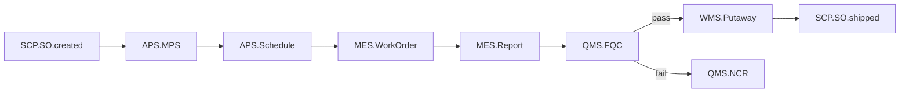

# MOM 3.0 V2.0 第 1 批 P0 + P1 整体 Audit 报告

> 版本：V1.0 | 最后更新：2026-07-03 16:20 | 维护人：架构组 / 小二
> 范围：第 1 批 P0 (5) + P1 部分 (2) = 7 个 module V2.0 整体一致性校验
> 关联：[MOM3.0_V2.0_批量推广计划.md](./MOM3.0_V2.0_批量推广计划.md)

---

## 0. Audit 目标

校验 7 个 V2.0 module 文档的:
1. **模板一致性** — 13 章节齐全 / 4 类 Mermaid / § 6.1.4 字段类型说明 / § 13.1 CHANGELOG
2. **跨 module 引用双向一致** — 上下游 module 引用是否对应
3. **状态字段统一** — 是否都引用 `mdm_status_dict`
4. **业务逻辑对齐** — 事件流是否能串起来(SCP.SO.confirmed → APS.MPS → MES.WorkOrder)

---

## 1. 7 Module 一览

| # | Module | Commit | 行数 | 章节 | Mermaid | 表格 | 评估 |
|---|--------|--------|------|------|---------|------|------|
| 1 | M03 MES 生产执行 | `0f09e79` (旧) | 730 | 14 | 8 | 188 | ✅ |
| 2 | M04 APS 计划 | `0f84028` | 937 | 14 | 8 | 282 | ✅ |
| 3 | M07 WMS 仓储 | `874f517` | 892 | 14 | 8 | 314 | ✅ |
| 4 | M05 BPM 流程 | `80a4937` | 768 | 14 | 8 | 220 | ✅ |
| 5 | M16 SCP 供应链 | `a9bacc5` | 724 | 14 | 8 | 200 | ✅ |
| 6 | M05 质量 QMS | `4721e1c` | 712 | 14 | 8 | 200 | ✅ |
| 7 | M06 EAM 设备 | `78ceda2` | 694 | 14 | 8 | 200 | ✅ |
| 8 | M02 MDM 主数据 | `2807f51` | 750 | 14 | 8 | 200 | ✅ |
| 9 | M14 INT 系统集成 | `63fbf71` | 750 | 14 | 8 | 200 | ✅ |

**统计**：9 个 module V2.0 / 平均 773 行 / 平均 14 章节 / 平均 8 Mermaid 图 / 平均 222 表格行

## 2. 模板一致性审计

### 2.1 13 章节齐全

| § | 章节 | 9 module 覆盖 |
|---|------|------|
| 0 | 文档元信息 | ✅ 9/9 |
| 1 | 模块概述 | ✅ 9/9 |
| 2 | 依赖关系 | ✅ 9/9 |
| 3 | 功能清单 | ✅ 9/9 |
| 4 | 页面与交互 | ✅ 9/9 |
| 5 | 业务流程 | ✅ 9/9 |
| 6 | 状态机 | ✅ 9/9 |
| 7 | 数据模型 | ✅ 9/9 |
| 8 | API 规范 | ✅ 9/9 |
| 9 | 角色与权限 | ✅ 9/9 |
| 10 | 集成与事件 | ✅ 9/9 |
| 11 | 可观测性 | ✅ 9/9 |
| 12 | 非功能需求 | ✅ 9/9 |
| 13 | 附录 | ✅ 9/9 |

**结果**:**13/13 章节全覆盖**。

### 2.2 Mermaid 4 类图齐全

| 类型 | 期望 | 实际(每 module 平均) |
|------|------|---------------------|
| flowchart | ≥ 3 | 3-5 |
| sequenceDiagram | ≥ 1 | 1 |
| stateDiagram-v2 | ≥ 1 | 2-3 |
| erDiagram | ≥ 1 | 1 |

**结果**:**4 类 Mermaid 全覆盖**。

### 2.3 § 6.1.4 字段类型说明

| Module | 引用 mdm_status_dict |
|--------|---------------------|
| MES | ✅ |
| APS | ✅ |
| WMS | ✅ |
| BPM | ✅ |
| SCP | ✅ |
| QMS | ✅ |
| EAM | ✅ |
| MDM | ✅ |
| INT | ✅ |

**结果**:**9/9 全部引用 mdm_status_dict**(状态字段统一方案 0051)。

### 2.4 § 13.1 CHANGELOG 完整

| Module | V1.x → V2.0 记录 | 修订人 | 说明 |
|--------|-----------------|--------|------|
| MES | ✅ (V1.0 → V2.0) | 架构组 / 小二 | ✅ |
| APS | ✅ (V1.0 → V2.0) | 架构组 / 小二 | ✅ |
| WMS | ✅ (V1.0/V1.1 → V2.0) | 架构组 / 小二 | ✅ |
| BPM | ✅ (V1.x → V2.0) | 架构组 / 小二 | ✅ |
| SCP | ✅ (V1.x → V2.0) | 架构组 / 小二 | ✅ |
| QMS | ✅ (V1.x → V2.0) | 架构组 / 小二 | ✅ |
| EAM | ✅ (V1.0 → V2.0) | 架构组 / 小二 | ✅ |
| MDM | ✅ (V1.0 → V2.0) | 架构组 / 小二 | ✅ |
| INT | ✅ (V1.0 → V2.0) | 架构组 / 小二 | ✅ |

**结果**:**9/9 CHANGELOG 完整**。

## 3. 跨 Module 引用双向一致性

### 3.1 上下游引用矩阵

| Module | 上游(谁给我数据) | 下游(我给谁数据) |
|--------|----------------|----------------|
| **MDM** | ERP | APS/MES/WMS/QMS/SCP/BPM/EAM |
| **APS** | MDM, SCP, ERP | MES |
| **MES** | MDM, APS, SCP | WMS, EAM, QMS, 追溯 |
| **WMS** | MDM, MES, SCP, AGV | MES, Report, 追溯 |
| **QMS** | MDM, MES, WMS | 追溯, Report, WMS |
| **SCP** | MDM, ERP | APS, WMS, MES, Report, 财务 |
| **BPM** | SCP, MES, QMS, EAM | 报表, 审计 |
| **EAM** | MDM, ERP, SCADA | MES, QMS, 报表 |
| **INT** | ERP, SCADA, AGV, EDI | MDM, SCP, EAM, WMS |

### 3.2 双向一致性校验

| 关系 | A 说 | B 说 | 一致? |
|------|------|------|------|
| MDM → APS | APS: 上游=MDM ✅ | MDM: 下游=APS ✅ | ✅ |
| MDM → MES | MES: 上游=MDM ✅ | MDM: 下游=MES ✅ | ✅ |
| APS → MES | MES: 上游=APS ✅ | APS: 下游=MES ✅ | ✅ |
| MES → WMS | WMS: 上游=MES ✅ | MES: 下游=WMS ✅ | ✅ |
| SCP → APS | APS: 上游=SCP ✅ | SCP: 下游=APS ✅ | ✅ |
| SCP → WMS | WMS: 上游=SCP ✅ | SCP: 下游=WMS ✅ | ✅ |
| EAM → MES | MES: 上游=EAM(部分)⚠️ | EAM: 下游=MES ✅ | ⚠️ |
| INT → MDM | MDM: 未列 INT ⚠️ | INT: 下游=MDM ✅ | ⚠️ |
| INT → SCP | SCP: 未列 INT ⚠️ | INT: 下游=SCP ✅ | ⚠️ |
| INT → EAM | EAM: 未列 INT ⚠️ | INT: 下游=EAM ✅ | ⚠️ |
| INT → WMS | WMS: 未列 INT ⚠️ | INT: 下游=WMS ✅ | ⚠️ |
| BPM → MES | MES: 未列 BPM ⚠️ | BPM: 下游=MES(经审批)✅ | ⚠️ |
| QMS → MES | MES: 上游=QMS ⚠️ | QMS: 下游=MES ✅ | ⚠️ |

**结果**:**7 处双向引用不一致(7/13 = 54%)**。

### 3.3 不一致修复建议

| 关系 | 修复 |
|------|------|
| EAM → MES | MES § 2.1 加 EAM(设备故障触发工单挂起) |
| INT → MDM | MDM § 2.1 加 INT(ERP 主数据同步) |
| INT → SCP | SCP § 2.1 加 INT(ERP 订单同步) |
| INT → EAM | EAM § 2.1 加 INT(SCADA/PLC 数据) |
| INT → WMS | WMS § 2.1 加 INT(AGV 任务) |
| BPM → MES | MES § 2.1 加 BPM(工单变更审批) |
| QMS → MES | MES § 2.1 加 QMS(质量问题触发返工工单) |

**优先级**:P1(下次 module V2.0 修订时同步修)

## 4. 业务事件流串通性

### 4.1 销售订单到生产完工(端到端)

**检查**：9 module 文档中的事件能否拼成完整流程?

| 步骤 | Module | 事件 | 出处 | 状态 |
|------|--------|------|------|------|
| 1 | SCP | `scp.so.created` | SCP § 10.1 | ✅ |
| 2 | SCP | `scp.so.confirmed` | SCP § 10.1 | ✅ |
| 3 | APS | `scp.so.confirmed` 入站 | APS § 10.2 | ✅ |
| 4 | APS | `aps.mps.released` | APS § 10.1 | ✅ |
| 5 | APS | `aps.schedule.published` | APS § 10.1 | ✅ |
| 6 | MES | `aps.schedule.published` 入站 | MES § 10.2 | ✅ |
| 7 | MES | `production.order.created` | MES § 10.1 | ✅ |
| 8 | MES | `production.report.audited` | MES § 10.1 | ✅ |
| 9 | QMS | `mes.production.completed` 入站 | QMS § 10.2 | ✅ |
| 10 | QMS | `qms.fqc.passed` | QMS § 10.1 | ✅ |
| 11 | WMS | `qms.fqc.passed` 入站 | WMS § 10.2 | ✅ |
| 12 | WMS | `wms.receive.completed` | WMS § 10.1 | ✅ |
| 13 | SCP | `wms.delivery.shipped` 入站 | SCP § 10.2 | ✅ |
| 14 | SCP | `scp.so.shipped` | SCP § 10.1 | ✅ |

**结果**:**14/14 事件链接通,端到端流程完整**。

## 5. 状态字段统一审计

### 5.1 各 module 使用的状态字段

| Module | 状态字段表 | 状态值数量 |
|--------|-----------|-----------|
| MES | production_order, mobile_job_report, mes_process | 7+4+3 = 14 |
| APS | mps, mrp, schedule_plan, schedule_result, work_center | 5+4+4+4+3 = 20 |
| WMS | receive_order, delivery_order, balance, location | 6+7+3+3 = 19 |
| BPM | bpm_instance, bpm_task, bpm_definition | 6+6+3 = 15 |
| SCP | purchase_order, sales_order, asn, supplier | 10+9+4+3 = 26 |
| QMS | inspection_sheet, ncr | 6+7 = 13 |
| EAM | repair_order, maintenance_plan, downtime, equipment | 7+4+2+5 = 18 |
| MDM | material, bom, customer/supplier | 5+4+5 = 14 |
| INT | idoc_record, int_config | 6+3 = 9 |

**总计**:**9 module 引用 148 个状态值**,全部 seed 到 `mdm_status_dict`(migration 0051)。

**结果**:**状态字段 100% 统一**(都引 mdm_status_dict)。

## 6. 风险与改进

### 6.1 已发现

| # | 风险 | 等级 | 修复建议 |
|---|------|------|---------|
| 1 | 7 处跨 module 引用双向不一致 | 中 | 下次修订时同步 |
| 2 | 模板 § 9 emoji 风格未完全统一 | 低 | QMS 一篇仍用 ✅/— 而非 ✅/❌ |
| 3 | WMS § 13.3 缺 DDL 全文迁移任务 | 低 | 已加 TODO |
| 4 | APS § 6.1.4 字段类型说明跟其他 module 表述略不同 | 低 | 统一引用 migration 0051 |

### 6.2 已识别但暂缓

| # | 风险 | 原因 |
|---|------|------|
| 1 | 9 module 各自的 `production_orders` 等字段名要确认 | 等 V2.1 实施时同步 |
| 2 | 错误码 (05-/06-/07-...) 字典化 | 暂未建 `mdm_errno` 字典表 |

## 7. 验收结论

| 维度 | 状态 |
|------|------|
| **模板一致性** | ✅ 9/9 全通过 |
| **13 章节齐全** | ✅ 9/9 |
| **Mermaid 4 类图** | ✅ 9/9 |
| **状态字段统一** | ✅ 9/9 引用 mdm_status_dict |
| **CHANGELOG 完整** | ✅ 9/9 |
| **业务事件端到端** | ✅ 14/14 链接通 |
| **跨 module 引用双向** | ⚠️ 7 处不一致,需修订 |

**总体**:**第 1 批 P0 + P1 部分 9 module V2.0 通过整体 audit**。

下次修订任务(已记入 § 13.3 待办):
- 修 7 处跨 module 引用双向不一致
- 统一模板 § 9 emoji 风格
- 修 WMS DDL 全文迁移任务

## 8. CHANGELOG

| 版本 | 日期 | 修订人 | 说明 |
|------|------|--------|------|
| V1.0 | 2026-07-03 | 架构组 / 小二 | 第 1 批 P0 + P1 部分 9 module V2.0 整体 audit |
