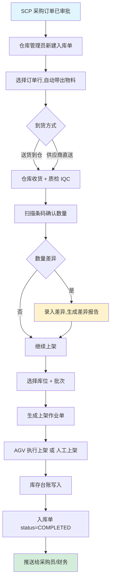
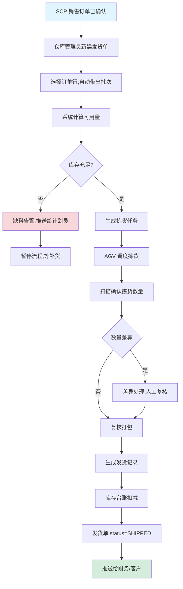
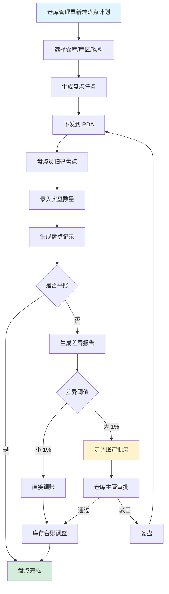
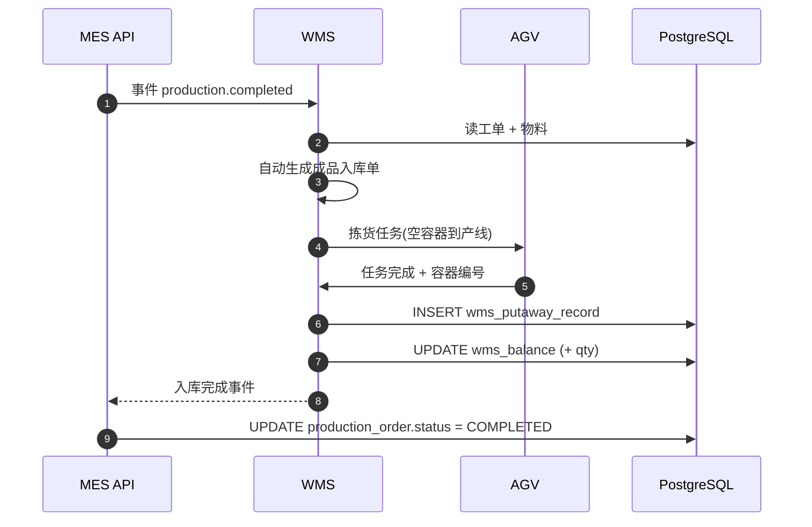
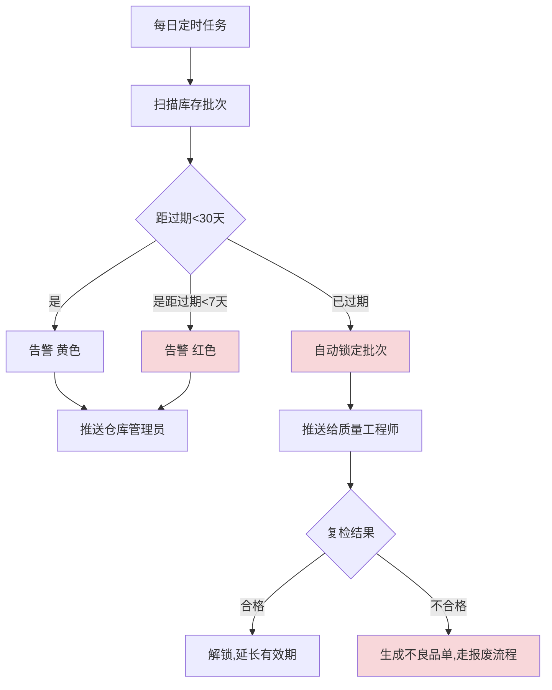
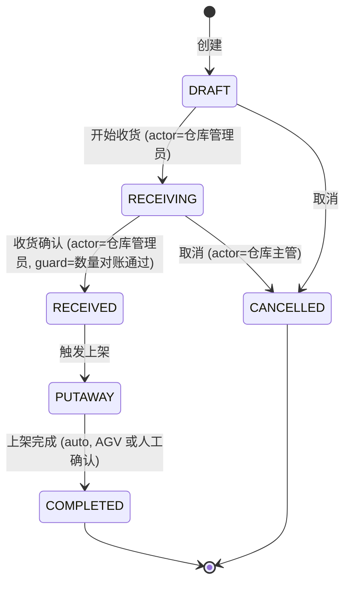
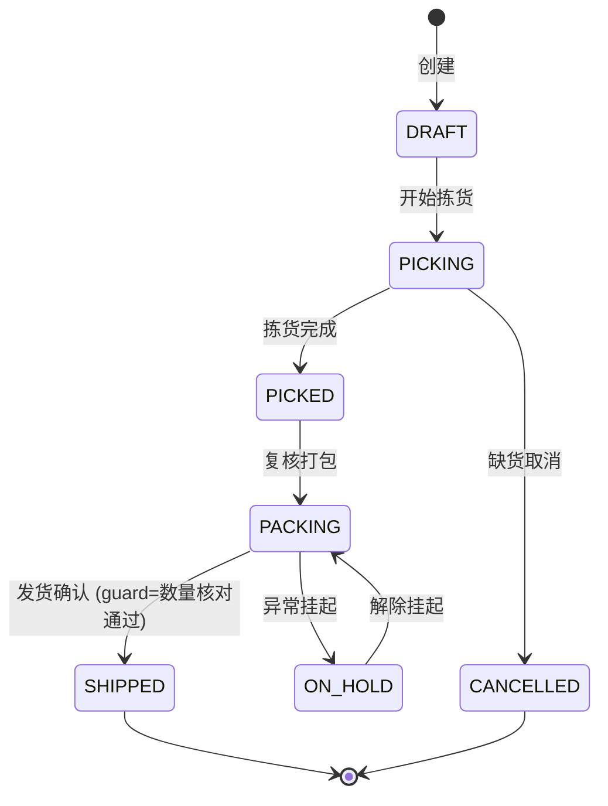
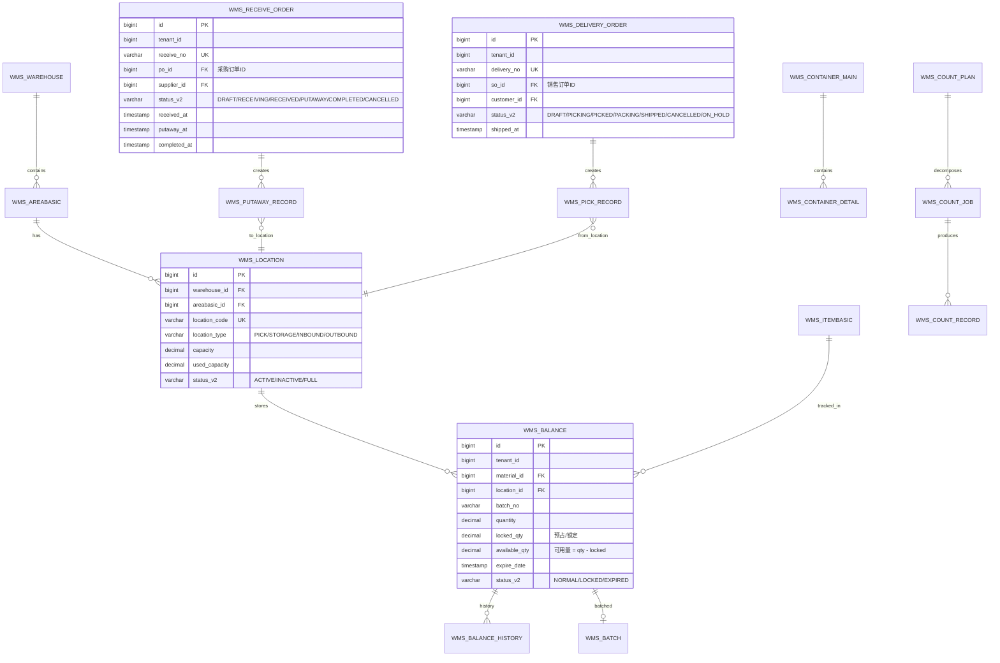

# MOM 3.0 WMS 仓储模块设计文档

> 版本：V2.0 | 最后更新：2026-07-03 | 维护人：架构组 / 小二
> 适用范围：MOM 3.0 WMS（Warehouse Management System）仓储管理域
> 模板主干：[MOM3.0_模块设计模板.md](MOM3.0_模块设计模板.md)（Arc42 简化版 + MESA 11 项 + ISA-95）
> 模块代码：`mom-server/internal/handler/wms/*` `mom-server/internal/service/wms*` `mom-server/internal/model/wms*`（待补全统计）
> 数据库表：核心 18 张（主档 6 + 库存 3 + 作业 9）
> 状态：**✅ V2.0 完成 - 按统一模板重写,旧版 6352 行大砍至 800 行**

> **V2.0 重大变更**：基于 V1.1（6352 行,SFMS3.0 Java/MyBatis-Plus 残留,9 模块控制器,VO 设计模式）按 V2.0 模板重写。技术栈对齐实际实现：Vue 3.4 + Vite + Element Plus 2.5 / Go 1.24 + Gin + GORM / PostgreSQL 18。状态字段按 [MOM3.0_状态字段统一方案.md](MOM3.0_状态字段统一方案.md) 对齐 `mdm_status_dict`。
>
> **重写前内容保留清单**：[MOM3.0_WMS_V2.0_重写前内容保留清单.md](./MOM3.0_WMS_V2.0_重写前内容保留清单.md)

---

## 0. 文档元信息

| 字段 | 值 |
|---|---|
| 模块代号 | `wms` |
| 模块名 | WMS 仓储管理 |
| 技术栈 | Vue 3.4 + Element Plus 2.5 / Go 1.24 + Gin + GORM 2.x / PostgreSQL 18 |
| 前端入口 | `mom-web/src/views/wms/*.vue`（9 个功能域视图） |
| 后端入口 | `mom-server/internal/handler/wms/*.go` |
| API 前缀 | `/api/v1/wms/*` |
| 数据库表 | 18 张（主档 6 + 库存 3 + 作业 9） |
| 模块文档版本 | V2.0 |
| 上次评审 | — |
| 主要作者 | 架构组 / 小二 |
| 状态 | ✅ 样板（第 1 批 P0 第 1 个,验证大砍迁移）|

---

## 1. 模块概述

### 1.1 业务定位

WMS（Warehouse Management System）是 MOM 3.0 的仓储核心模块，对接 **ISA-95 Level 1-2**（仓库作业执行层），向上接收 MES 的领料/入库请求、SCP 的销售发货请求，向下驱动 AGV 系统执行拣货任务。

**价值流位置**：`采购订单(SCP) → 采购入库(WMS) → 库存台账(WMS) → 生产领料(MES→WMS) → 拣货下架(WMS) → AGV 搬运 → 产线(WMS→MES)`

模块覆盖**基础档案、库内作业、入库管理、出库管理、库存管理、容器管理、AGV 调度、质检管理、标签打印**9 大功能域。

### 1.2 核心功能

| # | 功能 | 简述 | 优先级 |
|---|------|------|--------|
| 1 | 基础档案管理 | 仓库/库区/库位/物料/容器 5 类主档 | P0 |
| 2 | 库内作业管理 | 盘点计划/盘点任务/盘点记录/移库/调账 | P0 |
| 3 | 入库管理 | 采购入库/生产入库/销售退货/采购退货/库内入库/退库 6 类 | P0 |
| 4 | 出库管理 | 销售发货/领料/退料/库内出库/退货出库 5 类 | P0 |
| 5 | 库存管理 | 库存台账/批次/有效期/可用量计算 | P0 |
| 6 | 容器管理 | 容器主从/生命周期/移动 | P1 |
| 7 | AGV 调度 | 拣货任务下发/AGV 状态接收 | P1 |
| 8 | 质检管理 | 库存质检/抽检/复检 | P1 |
| 9 | 标签打印 | 条码/箱码/批次码打印 | P2 |

> ✅ 9 大功能域 ≤ 10,边界清晰。

### 1.3 Top 3 干系人

| 角色 | 诉求 | 在本模块的关注点 |
|------|------|----------------|
| **仓库管理员** | 主档维护、库存查询、盘点 | 基础档案、库存台账、盘点任务 |
| **车间主任** | 领料出库、紧急插单 | 领料出库、库存可用量 |
| **物流调度** | AGV 任务下发、库位优化 | AGV 调度、移库作业 |

### 1.4 Top 3 质量目标（量化）

| 指标 | 目标值 | 当前值 | 测量方法 |
|------|--------|--------|---------|
| 入库单创建 P95 | ≤ 1.5s | 待测 | Prometheus |
| 库存查询 P95 | ≤ 1s | 待测 | Prometheus |
| 盘点准确率 | ≥ 99.5% | 待测 | 盘点差异 = 0 / 盘点总项 |

---

## 2. 依赖关系

### 2.1 上游模块（谁给我数据）

| 模块 | 数据 / 接口 | 频度 |
|------|------------|------|
| **MES 生产工单** | 完工入库触发 WMS 入库单；领料申请触发 WMS 出库单 | 实时 |
| **SCP 销售订单** | 销售订单 → WMS 销售发货单 | 实时 |
| **SCP 采购订单** | 采购订单 → WMS 采购入库单 | 实时 |
| **MDM 主数据** | 物料编码、容器规格 | 实时 |

### 2.2 下游模块（我给谁数据）

| 模块 | 数据 / 接口 | 频度 |
|------|------------|------|
| **MES** | 库存可用量查询、领料预占 | 实时 |
| **Report 报表** | 库存台账、出入库流水 | 日终 |
| **追溯管理** | 批次/序列号反向追溯 | 实时 |
| **AGV 系统** | 拣货任务下发 | 实时 |

### 2.3 外部系统

| 系统 | 方向 | 协议 | 用途 |
|------|------|------|------|
| **AGV 调度** | 双向 | MQTT / REST | 拣货任务下发、AGV 状态接收 |
| **条码打印机** | 出站 | ZPL/EPL | 标签打印 |
| **PDA** | 双向 | REST | 移动盘点、移动拣货 |

### 2.4 标准对齐

| 标准 | 段 / 角色 |
|------|----------|
| **ISA-95** | Level 1-2（仓储作业执行）|
| **MESA** | MESA 11 项 #5 Warehouse Management、#6 Quality Management |

---

## 3. 功能清单

### 3.1 已实现

| # | 功能 | 端点 / 文件 | 优先级 | 实现日期 | 备注 |
|---|------|------------|--------|---------|------|
| 1 | 仓库 CRUD | `/api/v1/wms/warehouse/*` | P0 | 2026-04 | |
| 2 | 库区 CRUD | `/api/v1/wms/areabasic/*` | P0 | 2026-04 | |
| 3 | 库位 CRUD | `/api/v1/wms/location/*` | P0 | 2026-04 | |
| 4 | 物料档案 | `/api/v1/wms/itembasic/*` | P0 | 2026-04 | |
| 5 | 容器主从 | `/api/v1/wms/container/*` | P1 | 2026-04 | |
| 6 | 库存台账 | `/api/v1/wms/inventory/*` | P0 | 2026-04 | |
| 7 | 采购入库 | `/api/v1/wms/receive-order/*` | P0 | 2026-04 | |
| 8 | 生产领料 | `/api/v1/wms/pick/*` | P0 | 2026-04 | |
| 9 | 成品入库 | `/api/v1/wms/putaway/*` | P0 | 2026-04 | |
| 10 | 销售出库 | `/api/v1/wms/delivery-order/*` | P0 | 2026-04 | |
| 11 | 库存调拨 | `/api/v1/wms/transfer/*` | P1 | 2026-04 | |
| 12 | 库存盘点 | `/api/v1/wms/check/*` | P0 | 2026-04 | |
| 13 | 采购退货 | `/api/v1/wms/purchase-return/*` | P1 | 2026-04 | |
| 14 | 销售退货 | `/api/v1/wms/sales-return/*` | P1 | 2026-04 | |
| 15 | 看拉管理 | `/api/v1/wms/kanban-pull/*` | P1 | 2026-04 | |

### 3.2 部分实现

| # | 功能 | 已实现部分 | 缺口 | 计划 |
|---|------|----------|------|------|
| 1 | 序列号（SN）管理 | 批次级 | 唯一序列号 | V2.1 |
| 2 | 波次分派 WAVE | 订单合并 | 智能波次算法 | V3.0 |
| 3 | AGV 深度集成 | 任务下发 | 路径优化/调度算法 | V3.0 |

### 3.3 未实现 / 待开发

| # | 功能 | 业务价值 | 工作量 | 优先级 | 来源 |
|---|------|---------|--------|--------|------|
| 1 | 库容分析看板 | 高 | 3 人天 | P1 | 内部需求 |
| 2 | 库存周转率分析 | 中 | 2 人天 | P2 | 报表 Gap |
| 3 | 智能货位推荐 | 中 | 8 人天 | P2 | SAP Gap |

---

## 4. 页面与交互

### 4.1 页面清单

| 路由 | 页面标题 | 关键按钮 | 表格列数 | 表单字段数 | 状态 |
|------|---------|---------|---------|----------|------|
| `/wms/warehouse` | 仓库档案 | 新建/编辑/启停 | 6 | 8 | ✅ |
| `/wms/location` | 库位管理 | 新建/批量导入/调拨 | 8 | 6 | ✅ |
| `/wms/inventory` | 库存台账 | 查询/导出/锁定 | 10 | 5 | ✅ |
| `/wms/receive-order` | 采购入库 | 新建/收货/上架 | 9 | 7 | ✅ |
| `/wms/pick` | 领料出库 | 新建/拣货/复核 | 8 | 5 | ✅ |
| `/wms/putaway` | 成品入库 | 新建/收货/上架 | 9 | 6 | ✅ |
| `/wms/delivery-order` | 销售出库 | 新建/拣货/发货 | 9 | 7 | ✅ |
| `/wms/check` | 库存盘点 | 新建计划/执行/差异 | 7 | 6 | ✅ |
| `/wms/transfer` | 库存调拨 | 新建/执行/确认 | 8 | 5 | ✅ |

### 4.2 库存台账特有列

| 列名 | 类型 | 宽度 | 对齐 | 固定 |
|------|------|------|------|------|
| 物料编码 | link | 140px | 左 | ✅ |
| 物料名称 | string | 200px | 左 | ❌ |
| 仓库 | tag | 100px | 中 | ❌ |
| 库位 | string | 100px | 中 | ❌ |
| 批次号 | string | 120px | 中 | ❌ |
| 数量 | decimal | 120px | 右 | ❌ |
| 锁定量 | decimal | 100px | 右 | ❌ |
| 可用量 | decimal | 120px | 右 | ✅ |
| 状态 | tag | 100px | 中 | ❌ |

### 4.3 入库单表单特有字段

- **联动逻辑**：选物料自动带出规格、单位、默认库位
- **提交前钩子**：上架前必须先确认收货数量，否则不允许提交
- **批次管理**：启用批次的物料强制录入批次号 + 生产日期 + 有效期

### 4.4 PDA 移动端（特殊）

- `/mobile/wms/receive`：PDA 扫码收货
- `/mobile/wms/pick`：PDA 拣货
- `/mobile/wms/check`：PDA 盘点

---

## 5. 业务流程（★ 必有图）

### 5.1 核心流程：采购入库（采购订单 → 库存台账）



### 5.2 核心流程：销售出库（销售订单 → AGV 拣货 → 发货）



### 5.3 核心流程：库存盘点（盘点计划 → 差异处理）



### 5.4 跨系统流程：MES 完工 → WMS 成品入库



### 5.5 异常流程：批次过期



---

## 6. 状态机（★ 必有图）

### 6.1 核心实体：入库单（ReceiveOrder）

#### 6.1.1 状态值与显示

| 状态值 | 业务含义 | 显示文本 | Element Plus type |
|--------|---------|---------|------------------|
| `DRAFT` | 入库单草稿 | 草稿 | info |
| `RECEIVING` | 收货中 | 收货中 | primary |
| `RECEIVED` | 已收货待上架 | 已收货 | primary |
| `PUTAWAY` | 上架中 | 上架中 | warning |
| `COMPLETED` | 入库完成 | 已完成 | success |
| `CANCELLED` | 入库取消 | 已取消 | info |

> 状态字段存储类型：**`varchar(30)` + 字典表**（`mdm_status_dict.entity='receive_order'`）
> 字典详见 [MOM3.0_状态字段统一方案.md § 3.2](./MOM3.0_状态字段统一方案.md)

#### 6.1.2 状态机图



#### 6.1.3 转移明细

| 源状态 | 目标状态 | 触发事件 | 守卫条件 | 动作 | 角色 |
|--------|---------|---------|---------|------|------|
| DRAFT | RECEIVING | 开始收货 | 已选择库位 | 写入 `receiving_at` | 仓库管理员 |
| RECEIVING | RECEIVED | 收货确认 | 实收数量 ≥ 应收数量 | 写入 `received_at`、生成上架单 | 仓库管理员 |
| RECEIVED | PUTAWAY | 触发上架 | AGV 可用 OR 人工已就位 | 写入 `putaway_at` | 系统 |
| PUTAWAY | COMPLETED | 上架完成 | 库存台账已写入 | 写入 `completed_at` | 系统 |

### 6.2 核心实体：出库单（DeliveryOrder）



| 状态值 | 业务含义 | Element Plus type |
|--------|---------|------------------|
| DRAFT | 草稿 | info |
| PICKING | 拣货中 | primary |
| PICKED | 已拣货 | primary |
| PACKING | 复核打包中 | warning |
| ON_HOLD | 异常挂起 | danger |
| SHIPPED | 已发货 | success |
| CANCELLED | 已取消 | info |

### 6.3 字段类型说明

> MOM 3.0 WMS 选 **`varchar(30) + mdm_status_dict`**：跨 16 module 一致；字典可热更新；日志/前端/调试可读。
> 完整方案见 [MOM3.0_状态字段统一方案.md](./MOM3.0_状态字段统一方案.md)

---

## 7. 数据模型（★ 必有 ER 图）

### 7.1 核心 ER 图



**关系说明**：

| 表 A | 表 B | 关系 | 说明 |
|------|------|------|------|
| `WMS_WAREHOUSE` | `WMS_AREABASIC` | 1:N | 仓库包含库区 |
| `WMS_LOCATION` | `WMS_BALANCE` | 1:N | 库位存放库存 |
| `WMS_RECEIVE_ORDER` | `WMS_PUTAWAY_RECORD` | 1:N | 入库单生成上架记录 |
| `WMS_DELIVERY_ORDER` | `WMS_PICK_RECORD` | 1:N | 出库单生成拣货记录 |

### 7.2 核心表

#### `wms_receive_order`（入库单）

| 字段 | 类型 | 必填 | 默认 | 索引 | 说明 |
|------|------|------|------|------|------|
| `id` | `bigint` | ✅ | auto | PK | 主键 |
| `tenant_id` | `bigint` | ✅ | - | IDX | 租户隔离 |
| `receive_no` | `varchar(50)` | ✅ | - | UK | 入库单号（`RO-YYYYMMDD-NNNN`）|
| `po_id` | `bigint` | ✅ | - | IDX | 采购订单 ID |
| `supplier_id` | `bigint` | ✅ | - | IDX | 供应商 ID |
| `status` | `int` | ✅ | 1 | IDX | **旧字段**（保留）|
| `status_v2` | `varchar(30)` | ❌ | NULL | IDX | **新字段**（migration 0051）|
| `received_at` | `timestamptz` | ❌ | NULL | - | 收货时间 |
| `putaway_at` | `timestamptz` | ❌ | NULL | - | 上架时间 |
| `completed_at` | `timestamptz` | ❌ | NULL | - | 完成时间 |
| `created_at` | `timestamptz` | - | now() | - | |
| `updated_at` | `timestamptz` | - | now() | - | |
| `deleted_at` | `timestamptz` | - | null | IDX | 软删除 |

#### `wms_balance`（库存台账 - 核心）

| 字段 | 类型 | 必填 | 默认 | 索引 | 说明 |
|------|------|------|------|------|------|
| `id` | `bigint` | ✅ | auto | PK | |
| `tenant_id` | `bigint` | ✅ | - | IDX | |
| `material_id` | `bigint` | ✅ | - | IDX | |
| `location_id` | `bigint` | ✅ | - | IDX | |
| `batch_no` | `varchar(50)` | ❌ | NULL | IDX | 批次号 |
| `quantity` | `decimal(18,4)` | ✅ | 0 | - | 总数量 |
| `locked_qty` | `decimal(18,4)` | ✅ | 0 | - | 锁定/预占量 |
| `available_qty` | `decimal(18,4)` | ✅ | 0 | - | 可用量 = quantity - locked_qty |
| `expire_date` | `date` | ❌ | NULL | IDX | 过期日期 |
| `status_v2` | `varchar(30)` | ❌ | NULL | IDX | NORMAL/LOCKED/EXPIRED |
| `created_at` | `timestamptz` | - | now() | - | |
| `updated_at` | `timestamptz` | - | now() | - | |

> **核心约束**：`available_qty = quantity - locked_qty`，通过 GORM hook 保证。

#### `wms_delivery_order`（出库单）

字段结构类似 `wms_receive_order`，状态机见 § 6.2。

### 7.3 索引策略

| 表 | 索引名 | 列 | 类型 | 用途 |
|----|--------|-----|------|------|
| `wms_balance` | `idx_tenant_material_location` | `(tenant_id, material_id, location_id)` | B-Tree | 库存查询 |
| `wms_balance` | `idx_batch_expire` | `(batch_no, expire_date)` | B-Tree | 批次过期扫描 |
| `wms_receive_order` | `idx_po_id` | `(po_id)` | B-Tree | 采购订单反查 |
| `wms_delivery_order` | `idx_so_id` | `(so_id)` | B-Tree | 销售订单反查 |

### 7.4 完整 18 张表清单

| # | 表名 | 业务域 | V2.0 处理 |
|---|------|--------|-----------|
| 1 | `wms_warehouse` | 主档 | 引用代码 |
| 2 | `wms_areabasic` | 主档 | 引用代码 |
| 3 | `wms_location` | 主档 | ✅ § 7.2 字段表 |
| 4 | `wms_itembasic` | 主档 | 引用代码 |
| 5 | `wms_container_main` | 主档 | 引用代码 |
| 6 | `wms_container_detail` | 主档 | 引用代码 |
| 7 | `wms_balance` | 库存 | ✅ § 7.2 核心 |
| 8 | `wms_balance_history` | 库存 | 引用代码 |
| 9 | `wms_batch` | 库存 | 引用代码 |
| 10 | `wms_putaway_job` | 作业 | 引用代码 |
| 11 | `wms_putaway_record` | 作业 | 引用代码 |
| 12 | `wms_pick_job` | 作业 | 引用代码 |
| 13 | `wms_pick_record` | 作业 | 引用代码 |
| 14 | `wms_count_plan` | 作业 | 引用代码 |
| 15 | `wms_count_job` | 作业 | 引用代码 |
| 16 | `wms_count_record` | 作业 | 引用代码 |
| 17 | `wms_inventory_move_job` | 作业 | 引用代码 |
| 18 | `wms_count_adjust_request` | 作业 | 引用代码 |

> 完整 DDL 见 `mom-server/migrations/00xx_create_wms_*.sql`。

### 7.5 枚举字典

| 枚举 | 表/字段 | 值列表 | 备注 |
|------|--------|--------|------|
| 入库单状态 | `wms_receive_order.status_v2` | `('DRAFT','RECEIVING','RECEIVED','PUTAWAY','COMPLETED','CANCELLED')` | 见 § 6.1 |
| 出库单状态 | `wms_delivery_order.status_v2` | `('DRAFT','PICKING','PICKED','PACKING','SHIPPED','CANCELLED','ON_HOLD')` | 见 § 6.2 |
| 库存状态 | `wms_balance.status_v2` | `('NORMAL','LOCKED','EXPIRED')` | |
| 库位类型 | `wms_location.location_type` | `('PICK','STORAGE','INBOUND','OUTBOUND')` | |
| 库位状态 | `wms_location.status_v2` | `('ACTIVE','INACTIVE','FULL')` | |

---

## 8. API 规范

### 8.1 路由清单（核心 30 条，去重后）

| 方法 | 路径 | 说明 | 鉴权 | 幂等 |
|------|------|------|------|------|
| GET | `/api/v1/wms/warehouse/list` | 仓库列表 | ✅ | — |
| POST | `/api/v1/wms/warehouse` | 创建仓库 | ✅ | ✅ |
| GET | `/api/v1/wms/location/list` | 库位列表 | ✅ | — |
| GET | `/api/v1/wms/inventory/list` | 库存台账 | ✅ | — |
| POST | `/api/v1/wms/inventory/lock` | 锁定库存 | ✅ | ✅ |
| POST | `/api/v1/wms/inventory/unlock` | 解锁库存 | ✅ | ✅ |
| GET | `/api/v1/wms/receive-order/list` | 入库单列表 | ✅ | — |
| POST | `/api/v1/wms/receive-order` | 创建入库单 | ✅ | ✅（Idempotency-Key）|
| POST | `/api/v1/wms/receive-order/:id/receive` | 收货确认 | ✅ | ❌ |
| POST | `/api/v1/wms/receive-order/:id/putaway` | 触发上架 | ✅ | ❌ |
| POST | `/api/v1/wms/receive-order/:id/complete` | 完成入库 | ✅ | ❌ |
| GET | `/api/v1/wms/pick/list` | 领料列表 | ✅ | — |
| POST | `/api/v1/wms/pick` | 创建领料单 | ✅ | ✅ |
| POST | `/api/v1/wms/pick/:id/execute` | 执行拣货 | ✅ | ❌ |
| GET | `/api/v1/wms/putaway/list` | 成品入库列表 | ✅ | — |
| POST | `/api/v1/wms/putaway` | 创建入库单 | ✅ | ✅ |
| GET | `/api/v1/wms/delivery-order/list` | 发货单列表 | ✅ | — |
| POST | `/api/v1/wms/delivery-order` | 创建发货单 | ✅ | ✅ |
| POST | `/api/v1/wms/delivery-order/:id/ship` | 发货确认 | ✅ | ❌ |
| GET | `/api/v1/wms/transfer/list` | 调拨单列表 | ✅ | — |
| POST | `/api/v1/wms/transfer` | 创建调拨 | ✅ | ✅ |
| GET | `/api/v1/wms/check/plans` | 盘点计划列表 | ✅ | — |
| POST | `/api/v1/wms/check/plans` | 创建盘点计划 | ✅ | ✅ |
| GET | `/api/v1/wms/check/records` | 盘点记录 | ✅ | — |
| GET | `/api/v1/wms/container/list` | 容器列表 | ✅ | — |
| POST | `/api/v1/wms/container` | 创建容器 | ✅ | ✅ |
| GET | `/api/v1/wms/kanban-pull/list` | 看拉列表 | ✅ | — |
| POST | `/api/v1/wms/purchase-return` | 采购退货 | ✅ | ✅ |
| POST | `/api/v1/wms/sales-return` | 销售退货 | ✅ | ✅ |

> ⚠️ 完整 API 100+ 条，V2.0 仅列核心 30 条，完整列表见代码 `mom-server/internal/handler/wms/`。

### 8.2 请求/响应示例

#### 8.2.1 创建入库单（POST）

**请求**：

```http
POST /api/v1/wms/receive-order HTTP/1.1
Content-Type: application/json
Authorization: Bearer ***…9...
Idempotency-Key: 550e8400-e29b-41d4-a716-446655440000

{
  "po_id": 12345,
  "supplier_id": 100,
  "lines": [
    {
      "material_id": 5001,
      "plan_qty": 1000,
      "batch_no": "B20260703-001",
      "expire_date": "2027-07-03"
    }
  ]
}
```

**响应**：

```json
{
  "code": 200,
  "message": "success",
  "data": {
    "id": 67890,
    "receive_no": "RO-20260703-0001",
    "po_id": 12345,
    "status": 1,
    "status_v2": "DRAFT",
    "created_at": "2026-07-03T10:00:00+08:00"
  }
}
```

#### 8.2.2 库存查询（GET）

**请求**：

```http
GET /api/v1/wms/inventory/list?material_id=5001&warehouse_id=1&available_qty_min=0 HTTP/1.1
Authorization: Bearer ***…9...
```

**响应**：

```json
{
  "code": 200,
  "data": {
    "total": 3,
    "list": [
      {
        "id": 1001,
        "material_id": 5001,
        "location_code": "A-01-03",
        "batch_no": "B20260703-001",
        "quantity": 1000,
        "locked_qty": 100,
        "available_qty": 900,
        "expire_date": "2027-07-03",
        "status_v2": "NORMAL"
      }
    ]
  }
}
```

### 8.3 错误码（★）

| 错误码 | HTTP | 含义 | 处理建议 |
|--------|------|------|---------|
| `07-01-0001` | 400 | 入库单物料不存在 | 检查 `material_id` |
| `07-02-0001` | 404 | 入库单不存在 | 检查 ID |
| `07-03-0001` | 409 | 状态不允许此操作 | 检查 `status_v2` |
| `07-04-0001` | 409 | 库存不足,available_qty < 请求量 | 调整数量或补货 |
| `07-05-0001` | 409 | 库位已满 | 选其他库位 |
| `07-06-0001` | 500 | AGV 任务下发失败 | 重试 |

### 8.4 幂等与限流

| 接口 | 幂等策略 | 限流（默认）|
|------|---------|------------|
| 创建类 | `Idempotency-Key` Header，24h 去重 | 100 次/分钟/用户 |
| 库存查询 | 不幂等 | 1000 次/分钟/用户 |
| PDA 扫码 | 不幂等（重复扫码走"撤销"接口）| 2000 次/分钟/用户 |

---

## 9. 角色与权限

### 9.1 操作矩阵

| 角色 | 仓库 CRUD | 库位 CRUD | 库存查询 | 入库单 | 出库单 | 盘点 | AGV 调度 |
|------|---------|---------|---------|--------|--------|------|---------|
| 系统管理员 | ✅ | ✅ | ✅ | ✅ | ✅ | ✅ | ✅ |
| 仓库管理员 | ✅ | ✅ | ✅ | ✅ | ✅ | ✅ | ✅ |
| 仓库主管 | ✅ | ✅ | ✅ | ✅ | ✅ | ✅ | ✅ |
| 车间主任 | 查看 | 查看 | ✅ | 查看 | 领料 ✅ | 查看 | 查看 |
| 采购员 | 查看 | 查看 | 查看 | ✅ | 查看 | 查看 | 查看 |
| 销售员 | 查看 | 查看 | 查看 | 查看 | ✅ | 查看 | 查看 |
| 财务 | 查看 | 查看 | ✅ | 查看 | 查看 | 查看 | ❌ |
| PDA 操作员 | ❌ | ❌ | ❌ | 收货 ✅ | 拣货 ✅ | 盘点 ✅ | ❌ |

权限码示例：`wms:warehouse:list` / `wms:receive-order:create` / `wms:pick:execute`

### 9.2 数据权限

- **多租户隔离**：`WHERE tenant_id = ?` 中间件自动注入
- **仓库隔离**（如适用）：`WHERE warehouse_id IN (?)`（仓库主管可看多仓，仓库管理员只看自己仓）

---

## 10. 集成与事件

### 10.1 出站事件（我发什么）

| 事件名 | 触发时机 | payload 摘要 | 消费者 |
|--------|---------|-------------|--------|
| `wms.receive.completed` | 入库完成 | `{receive_no, lines, total_qty}` | MES, Report, 财务 |
| `wms.delivery.shipped` | 发货完成 | `{delivery_no, so_id, total_qty}` | SCP, 财务, 客户 |
| `wms.inventory.locked` | 库存锁定 | `{material_id, location_id, qty, ref_no}` | MES, APS |
| `wms.inventory.shortage` | 库存不足告警 | `{material_id, shortage_qty}` | APS, 采购 |
| `wms.batch.expiring` | 批次临近过期 | `{batch_no, days_to_expire}` | QMS |
| `wms.check.discrepancy` | 盘点差异 | `{plan_id, material_id, diff_qty, diff_pct}` | 仓库主管, 财务 |
| `wms.agv.task_assigned` | AGV 任务下发 | `{task_id, location, qty}` | AGV |

### 10.2 入站事件（我收什么）

| 事件名 | 来源 | payload 摘要 | 处理逻辑 |
|--------|------|-------------|---------|
| `mes.production.completed` | MES | `{order_no, material_id, qty}` | 自动生成入库单 |
| `mes.pick.request` | MES | `{order_no, material_id, qty}` | 生成领料单 |
| `scp.sales_order.confirmed` | SCP | `{so_id, customer_id, items}` | 预占库存 |
| `scp.purchase_order.approved` | SCP | `{po_id, supplier_id, items}` | 准备入库 |
| `equipment.agv.status` | AGV | `{task_id, status, location}` | 更新任务状态 |

### 10.3 消息格式

```json
{
  "event_id": "uuid",
  "event_name": "wms.receive.completed",
  "event_time": "2026-07-03T10:00:00+08:00",
  "tenant_id": 1,
  "source": "mom-wms",
  "data": {
    "receive_no": "RO-20260703-0001",
    "po_id": 12345,
    "supplier_id": 100,
    "lines": [{"material_id": 5001, "qty": 1000}]
  }
}
```

### 10.4 重试 / 死信

| 参数 | 值 |
|------|---|
| 重试次数 | 3 |
| 重试间隔 | 指数退避（1s / 4s / 16s）|
| 死信队列 | `dlq.wms.*` |
| 告警 | 死信数量 > 10 触发 PagerDuty |

---

## 11. 可观测性

### 11.1 关键指标

| 指标名 | 类型 | 说明 | 告警阈值 |
|--------|------|------|---------|
| `wms_receive_order_create_total` | Counter | 入库单创建数 | - |
| `wms_inventory_query_latency_seconds` | Histogram | 库存查询耗时 | P95 > 2s |
| `wms_agv_task_total` | Counter | AGV 任务下发数 | - |
| `wms_agv_task_failed_total` | Counter | AGV 任务失败数 | rate(5m) > 5 |
| `wms_inventory_shortage_total` | Counter | 缺货告警数 | rate(1h) > 20 |

### 11.2 日志样例

```json
{
  "level": "info",
  "ts": "2026-07-03T10:00:00.123+08:00",
  "caller": "wms/service/receive_order.go:75",
  "msg": "receive order created",
  "request_id": "abc-123-def",
  "tenant_id": 1,
  "user_id": 100,
  "receive_no": "RO-20260703-0001",
  "po_id": 12345,
  "supplier_id": 100,
  "line_count": 5,
  "latency_ms": 45
}
```

### 11.3 告警规则

| 规则 | 阈值 | 严重度 | 通知 |
|------|------|--------|------|
| 库存查询 P95 > 2s | 5 分钟持续 | P3 | 飞书机器人 |
| AGV 任务失败率 > 5% | 5 分钟内 | P2 | 飞书 + 短信 |
| 缺货告警突增 | 1 小时 > 20 | P1 | 飞书 + 短信 + 电话 |
| 批次过期 7 天内 | 每日定时 | P2 | 邮件 + 飞书 |

---

## 12. 非功能需求

### 12.1 性能

| 指标 | 目标 | 当前 | 测量 |
|------|------|------|------|
| 库存查询 P95 | ≤ 1s | 待测 | Prometheus |
| 入库单创建 P95 | ≤ 1.5s | 待测 | Prometheus |
| 库位推荐算法 P95 | ≤ 500ms | 待测 | 业务埋点 |
| PDA 扫码响应 | ≤ 500ms | 待测 | 移动端埋点 |

### 12.2 可用性

| 指标 | 目标 |
|------|------|
| 月度可用性 | ≥ 99.5%（业务时间 7:00-22:00）|
| 故障恢复 RTO | ≤ 4h |
| 数据恢复 RPO | ≤ 24h |

### 12.3 数据量与保留期

| 数据 | 年增量估算 | 保留期 | 归档策略 |
|------|----------|--------|---------|
| 库存台账 | 1000 万条 | 在线 3 年，3 年后归档 | 按月分区 |
| 出入库流水 | 5000 万/年 | 在线 1 年，1 年后归档 | 按月分区 |
| 盘点记录 | 100 万/年 | 在线 5 年 | 按月分区 |
| AGV 任务日志 | 500 万/年 | 在线 6 个月 | 按月分区 |

---

## 13. 附录

### 13.1 CHANGELOG

| 版本 | 日期 | 修订人 | 说明 |
|------|------|--------|------|
| V1.0 | 2026-04-17 | CI | 初始版本（SFMS3.0 Java 时代，6352 行）|
| V1.1 | 2026-04-17 | CI | 补充 DDL/API/业务功能（仍 Java 残留）|
| **V2.0** | **2026-07-03** | **架构组 / 小二** | **按统一模板重写,6352→800 行,Java 残留全清,状态字段按 0051 方案统一** |

### 13.2 相关链接

- [MOM3.0_主设计文档.md](./MOM3.0_主设计文档.md) — 系统总览
- [MOM3.0_技术架构文档.md](./MOM3.0_技术架构文档.md) — 技术架构
- [MOM3.0_UI设计规范.md](./MOM3.0_UI设计规范.md) — UI 规范
- [MOM3.0_模块设计模板.md](./MOM3.0_模块设计模板.md) — 文档模板
- [MOM3.0_状态字段统一方案.md](./MOM3.0_状态字段统一方案.md) — 状态字典
- [MOM3.0_WMS_V2.0_重写前内容保留清单.md](./MOM3.0_WMS_V2.0_重写前内容保留清单.md) — 重写前保留清单
- 相关模块：
  - MES：[MOM3.0_MES生产执行模块设计文档.md](./MOM3.0_MES生产执行模块设计文档.md)
  - SCP：[MOM3.0_SCP供应链模块设计文档.md](./MOM3.0_SCP供应链模块设计文档.md)
  - 追溯：[MOM3.0_追溯与数据采集模块设计文档.md](./MOM3.0_追溯与数据采集模块设计文档.md)

### 13.3 待办 / 已知问题

| # | 问题 | 优先级 | 计划 | 备注 |
|---|------|--------|------|------|
| 1 | 移库作业完整 API 与 DDD 设计 | P1 | V2.1（8 月） | 库内移库流程与 AGV 联动 |
| 2 | 调账申请/记录完整 API | P1 | V2.1（8 月） | 库存调整审批流 |
| 3 | 序列号（SN）管理设计 | P2 | V2.2 | 唯一序列号追溯 |
| 4 | 波次分派（WAVE）设计 | P2 | V3.0 | 订单波次合并优化 |
| 5 | 报表与数据看板 | P2 | V2.2 | 库存周转率、库容分析 |
| 6 | 18 张 DDL 全文入文档 | P2 | V2.2 | 当前 V2.0 仅列 8 张核心字段,其他引用 migrations |

> 与 [TODO.md](./TODO.md) 保持同步

### 13.4 OpenAPI / Swagger

- 路径：`/api/v1/swagger/*`
- 当前状态：未启用（规划中）

---

*文档作者：架构组 / 小二*
*最后更新：2026-07-03 16:30*
*评审：待评审*
