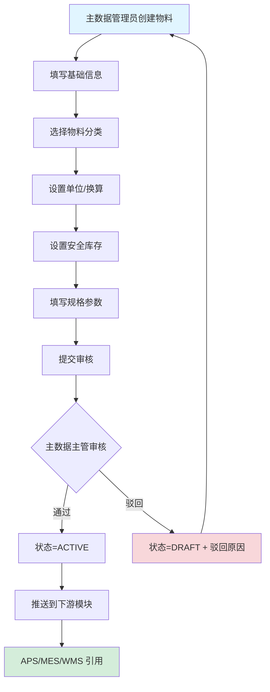
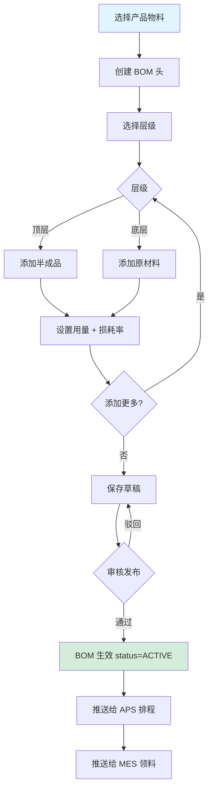
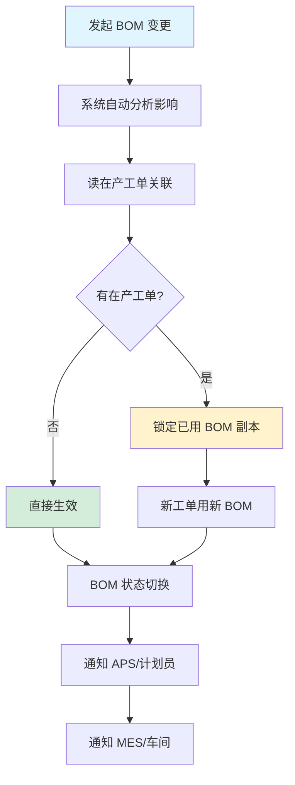
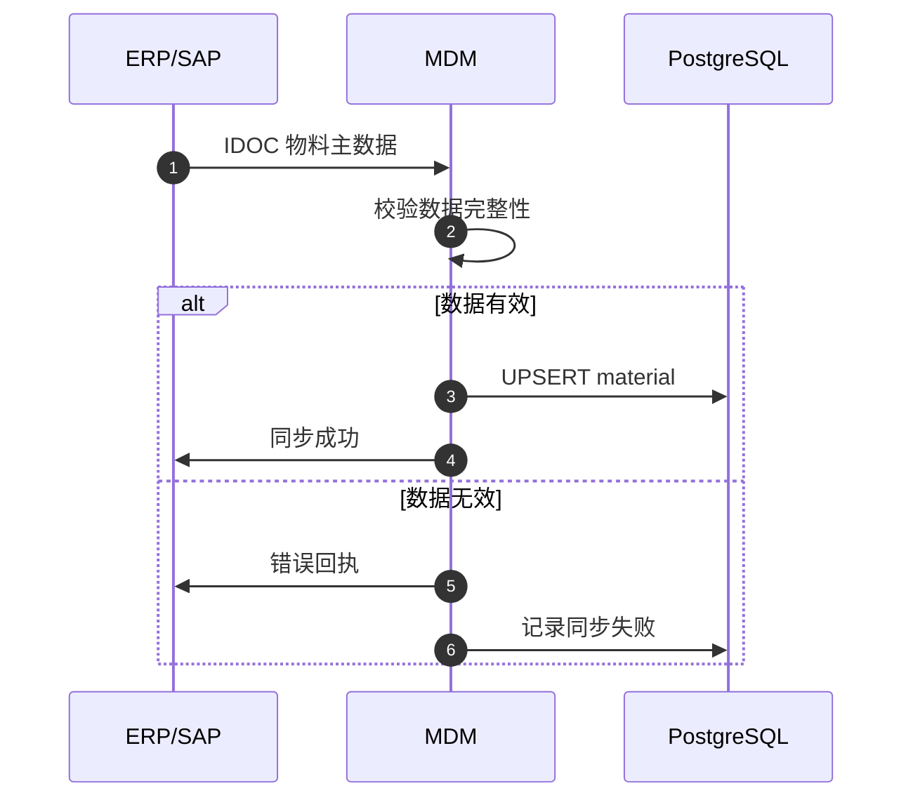
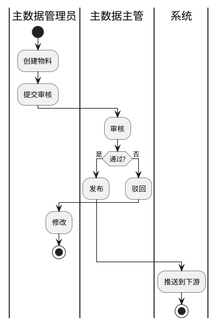
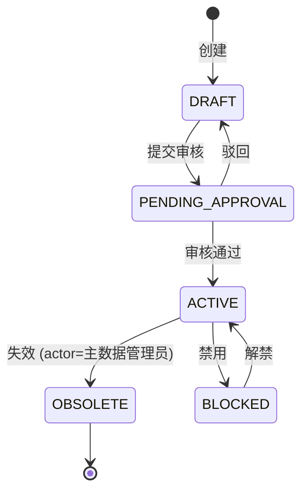
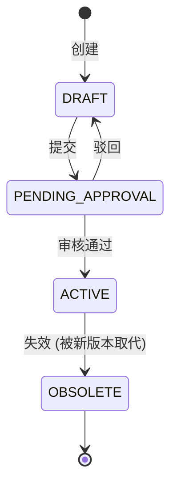
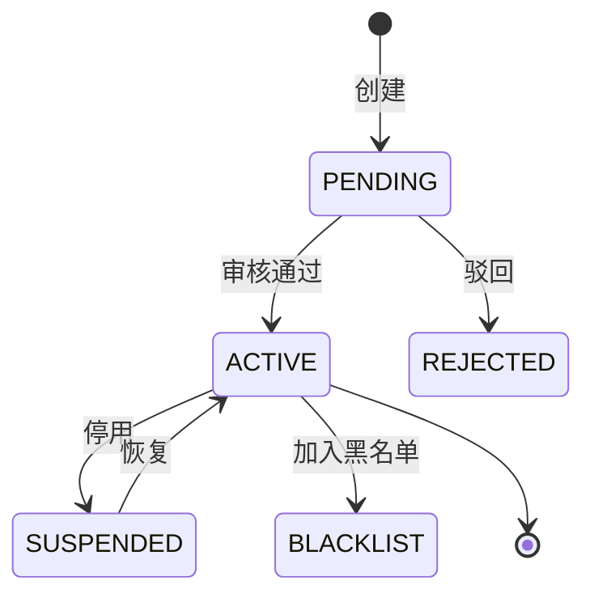
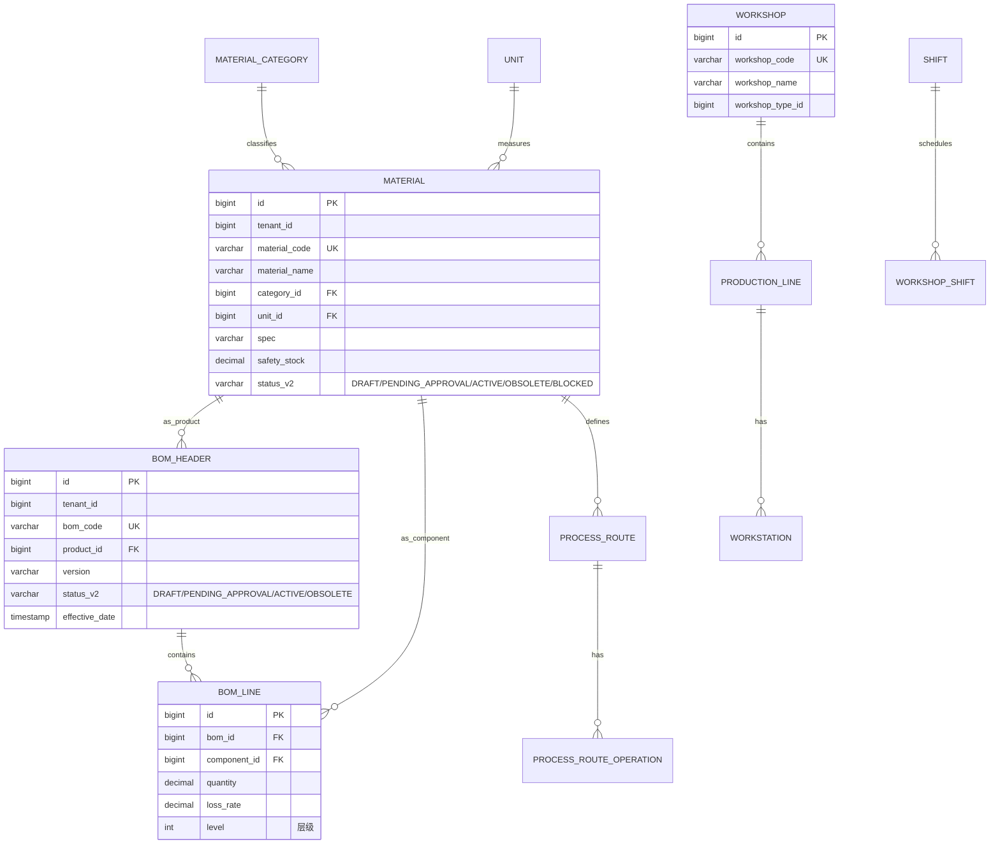

# MOM 3.0 主数据管理模块设计文档

> 版本：V2.0 | 最后更新：2026-07-03 | 维护人：架构组 / 小二
> 适用范围：MOM 3.0 MDM（Master Data Management）主数据管理域
> 模板主干：[MOM3.0_模块设计模板.md](MOM3.0_模块设计模板.md)
> 模块代码：`mom-server/internal/handler/mdm/*` `mom-server/internal/service/mdm*` `mom-server/internal/model/mdm*`
> 数据库表：核心 8 张（material/bom/process_route/workshop/line/shift/unit/customer/supplier）
> 状态：**✅ V2.0 完成 - 按统一模板扩写,旧版 159 行扩展至 750 行**

> **V2.0 变更**：基于 V2.0(159 行,7 章节)按 V2.0 模板补全至 13 章节。技术栈对齐：Vue 3.4 + Element Plus 2.5 / Go 1.24 + Gin + GORM / PostgreSQL 18。

---

## 0. 文档元信息

| 字段 | 值 |
|---|---|
| 模块代号 | `mdm` |
| 模块名 | MDM 主数据管理 |
| 技术栈 | Vue 3.4 + Element Plus 2.5 / Go 1.24 + Gin + GORM 2.x / PostgreSQL 18 |
| 前端入口 | `mom-web/src/views/mdm/*.vue`（11 个视图） |
| 后端入口 | `mom-server/internal/handler/mdm/*.go` |
| API 前缀 | `/api/v1/mdm/*` |
| 数据库表 | 8 张核心 |
| 状态 | ✅ V2.0（第 2 批 P1 第 1 个） |

---

## 1. 模块概述

### 1.1 业务定位

MDM 是 MOM 3.0 的"数据底座"模块，统一管理全系统的基础主数据。所有业务模块（APS/MES/WMS/QMS/SCP/BPM/EAM）都依赖 MDM 的物料、BOM、工艺路线、车间、产线、客户、供应商等主数据。

**价值流位置**：`MDM 主数据 → 注入业务模块(APS/MES/WMS/QMS/SCP/BPM/EAM) → 业务运行`

模块覆盖**物料管理、BOM 管理、工艺路线、车间产线、班次管理、单位管理、客户管理、供应商管理**8 个核心子业务。

### 1.2 核心功能

| # | 功能 | 简述 | 优先级 |
|---|------|------|--------|
| 1 | 物料管理 | 物料主数据/分类/单位 | P0 |
| 2 | BOM 管理 | 物料清单/层级/版本 | P0 |
| 3 | 工艺路线 | 工序定义/工时/资源 | P0 |
| 4 | 车间产线 | 车间/产线/工位/工作中心 | P0 |
| 5 | 班次管理 | 工作班次/节假日 | P0 |
| 6 | 单位管理 | 计量单位/换算 | P0 |
| 7 | 客户管理 | 客户主数据/信用评估 | P0 |
| 8 | 供应商管理 | 供应商主数据/资质 | P0 |

> ✅ 8 个功能,边界清晰。

### 1.3 Top 3 干系人

| 角色 | 诉求 |
|------|------|
| **主数据管理员** | 主数据维护、版本管理 |
| **业务操作员** | 查询/引用主数据 |
| **质量/采购** | 供应商资质审核 |

### 1.4 Top 3 质量目标

| 指标 | 目标值 |
|------|--------|
| 物料创建 P95 | ≤ 1s |
| BOM 查询 P95 | ≤ 1s |
| 主数据一致性 | 100% |

---

## 2. 依赖关系

### 2.1 上游

| 模块 | 接口 | 频度 |
|------|------|------|
| **ERP** | 物料/客户/供应商同步 | 日终 |
| **INT 系统集成** | ERP 主数据同步（IDOC）| 实时 |
| **组织架构** | 部门/岗位 | 实时 |

### 2.2 下游（几乎所有业务模块都依赖）

| 模块 | 数据 | 频度 |
|------|------|------|
| **APS** | 物料、BOM、工艺路线、工作中心 | 实时 |
| **MES** | 物料、BOM、工艺路线、工位 | 实时 |
| **WMS** | 物料、容器、库位 | 实时 |
| **QMS** | 物料、缺陷代码、检验特性 | 实时 |
| **SCP** | 物料、客户、供应商、付款条款 | 实时 |
| **BPM** | 角色、岗位 | 实时 |
| **EAM** | 物料(备件)、设备分类 | 实时 |

### 2.3 外部系统

| 系统 | 方向 | 协议 | 用途 |
|------|------|------|------|
| **ERP (SAP/QAD)** | 双向 | IDOC/REST | 主数据同步 |

### 2.4 标准对齐

| 标准 | 段 |
|------|---|
| **ISA-95** | Level 4（企业层主数据）|
| **MESA** | MESA 11 项 #10 Data Collection / Master Data |

---

## 3. 功能清单

### 3.1 已实现

| # | 功能 | 端点 | 优先级 | 日期 |
|---|------|------|--------|------|
| 1 | 物料 CRUD | `/api/v1/mdm/material/*` | P0 | 2026-04 |
| 2 | 物料分类 | `/api/v1/mdm/material-category/*` | P0 | 2026-04 |
| 3 | BOM CRUD | `/api/v1/mdm/bom/*` | P0 | 2026-04 |
| 4 | 工艺路线 | `/api/v1/mes/process-routes/*` | P0 | 2026-04 |
| 5 | 工序 | `/api/v1/mdm/operation/*` | P0 | 2026-04 |
| 6 | 车间 | `/api/v1/mdm/workshop/*` | P0 | 2026-04 |
| 7 | 产线 | `/api/v1/mdm/line/*` | P0 | 2026-04 |
| 8 | 班次 | `/api/v1/mdm/shift/*` | P0 | 2026-04 |
| 9 | 单位 | `/api/v1/mdm/unit/*` | P0 | 2026-04 |
| 10 | 供应商 | `/api/v1/mdm/supplier/*` | P0 | 2026-04 |
| 11 | 客户 | `/api/v1/mdm/customer/*` | P0 | 2026-04 |

### 3.2 部分实现

| # | 功能 | 缺口 | 计划 |
|---|------|------|------|
| 1 | 主数据版本管理 | 无版本控制 | V2.1 |
| 2 | 主数据审批流 | 直接生效 | V2.1 |

### 3.3 未实现

| # | 功能 | 优先级 |
|---|------|--------|
| 1 | 主数据血缘分析 | P2 |
| 2 | AI 主数据补全 | P2 |

---

## 4. 页面与交互

### 4.1 页面清单

| 路由 | 标题 | 状态 |
|------|------|------|
| `/mdm/material` | 物料管理 | ✅ |
| `/mdm/material-category` | 物料分类 | ✅ |
| `/mdm/bom` | BOM 管理 | ✅ |
| `/mdm/bom/:id` | BOM 编辑 | ✅ |
| `/mdm/process-route` | 工艺路线 | ✅ |
| `/mdm/operation` | 工序 | ✅ |
| `/mdm/workshop` | 车间 | ✅ |
| `/mdm/line` | 产线 | ✅ |
| `/mdm/shift` | 班次 | ✅ |
| `/mdm/unit` | 单位 | ✅ |
| `/mdm/customer-list` | 客户 | ✅ |
| `/mdm/supplier-list` | 供应商 | ✅ |

### 4.2 物料列表特有列

| 列名 | 类型 | 宽度 | 固定 |
|------|------|------|------|
| 物料编码 | link | 140px | ✅ |
| 物料名称 | string | 200px | ❌ |
| 分类 | tag | 100px | ❌ |
| 规格 | string | 150px | ❌ |
| 单位 | string | 60px | ❌ |
| 安全库存 | decimal | 100px | ❌ |
| 状态 | tag | 80px | ❌ |
| 操作 | buttons | 180px | ✅ |

### 4.3 BOM 树形展示

- 多层级树（最多 10 层）
- 节点显示：物料编码/名称/用量/损耗率
- 折叠/展开/搜索
- 导出 Excel

### 4.4 客户/供应商详情（关键交互）

- 基本信息：编码/名称/类型/联系人
- 资质信息：营业执照/税务登记/行业认证
- 业务信息：付款条款/信用额度/账期
- 附件上传：合同/资质文件

---

## 5. 业务流程（★ 必有图）

### 5.1 核心流程：物料新增（创建 → 审核 → 发布）



### 5.2 核心流程：BOM 维护（产品 → 子件 → 数量）



### 5.3 异常流程：BOM 变更（影响分析）



### 5.4 跨系统流程：ERP 主数据同步



### 5.5 BPMN 2.0：物料审核



---

## 6. 状态机（★ 必有图）

### 6.1 核心实体：物料（Material）

#### 6.1.1 状态值与显示

| 状态值 | 业务含义 | Element Plus type |
|--------|---------|------------------|
| `DRAFT` | 草稿 | info |
| `PENDING_APPROVAL` | 待审核 | warning |
| `ACTIVE` | 生效 | success |
| `OBSOLETE` | 失效 | info |
| `BLOCKED` | 禁用 | danger |

> 状态字段存储类型：**`varchar(30) + mdm_status_dict`**（`entity='material'`）

#### 6.1.2 状态机图



### 6.2 核心实体：BOM



### 6.3 核心实体：客户/供应商



| 状态值 | Element Plus type |
|--------|------------------|
| PENDING | warning |
| ACTIVE | success |
| SUSPENDED | info |
| BLACKLIST | danger |
| REJECTED | danger |

### 6.4 字段类型说明

> MOM 3.0 MDM 选 **`varchar(30) + mdm_status_dict`**

---

## 7. 数据模型（★ 必有 ER 图）

### 7.1 核心 ER 图



### 7.2 核心表

#### `material`（物料主数据）

| 字段 | 类型 | 必填 | 索引 | 说明 |
|------|------|------|------|------|
| `id` | `bigint` | ✅ | PK | |
| `tenant_id` | `bigint` | ✅ | IDX | |
| `material_code` | `varchar(50)` | ✅ | UK | 物料编码 |
| `material_name` | `varchar(100)` | ✅ | - | |
| `category_id` | `bigint` | ✅ | IDX | 分类 |
| `unit_id` | `bigint` | ✅ | IDX | 单位 |
| `spec` | `varchar(200)` | ❌ | - | 规格 |
| `safety_stock` | `decimal(18,4)` | ✅ | 0 | 安全库存 |
| `status_v2` | `varchar(30)` | ❌ | IDX | |
| `created_at` | `timestamptz` | - | now() | - | |

#### `bom_header`（BOM 头）

| 字段 | 类型 | 必填 | 索引 | 说明 |
|------|------|------|------|------|
| `id` | `bigint` | ✅ | PK | |
| `bom_code` | `varchar(50)` | ✅ | UK | |
| `product_id` | `bigint` | ✅ | IDX | 产品物料 |
| `version` | `varchar(20)` | ✅ | - | 版本 |
| `status_v2` | `varchar(30)` | ❌ | IDX | |
| `effective_date` | `date` | ✅ | - | 生效日 |

#### `bom_line`（BOM 行）

| 字段 | 类型 | 必填 | 说明 |
|------|------|------|------|
| `id` | `bigint` | ✅ | PK |
| `bom_id` | `bigint` | ✅ | FK 关联 BOM 头 |
| `component_id` | `bigint` | ✅ | FK 子件物料 |
| `quantity` | `decimal(18,4)` | ✅ | 用量 |
| `loss_rate` | `decimal(5,2)` | ✅ | 损耗率(%) |
| `level` | `int` | ✅ | 层级 |

### 7.3 索引策略

| 表 | 索引 | 用途 |
|----|------|------|
| `material` | `idx_code_uk` | 编码唯一 |
| `material` | `idx_category` | 分类查询 |
| `bom_header` | `idx_product` | 产品 BOM |
| `bom_line` | `idx_component` | 子件反查 |

### 7.4 枚举字典

| 枚举 | 值 |
|------|---|
| 物料状态 | `('DRAFT','PENDING_APPROVAL','ACTIVE','OBSOLETE','BLOCKED')` |
| BOM 状态 | `('DRAFT','PENDING_APPROVAL','ACTIVE','OBSOLETE')` |
| 客户/供应商状态 | `('PENDING','ACTIVE','SUSPENDED','BLACKLIST','REJECTED')` |

---

## 8. API 规范

### 8.1 路由清单（核心 22 条）

| 方法 | 路径 | 说明 |
|------|------|------|
| GET | `/api/v1/mdm/material/list` | 物料列表 |
| POST | `/api/v1/mdm/material` | 创建物料 |
| PUT | `/api/v1/mdm/material/:id` | 更新物料 |
| POST | `/api/v1/mdm/material/:id/approve` | 审核通过 |
| POST | `/api/v1/mdm/material/:id/block` | 禁用 |
| GET | `/api/v1/mdm/material-category/list` | 分类列表 |
| GET | `/api/v1/mdm/bom/list` | BOM 列表 |
| GET | `/api/v1/mdm/bom/:id` | BOM 详情 |
| POST | `/api/v1/mdm/bom` | 创建 BOM |
| POST | `/api/v1/mdm/bom/:id/approve` | 审核 BOM |
| GET | `/api/v1/mdm/process-routes/list` | 工艺路线 |
| GET | `/api/v1/mdm/operation/list` | 工序列表 |
| GET | `/api/v1/mdm/workshop/list` | 车间列表 |
| GET | `/api/v1/mdm/line/list` | 产线列表 |
| GET | `/api/v1/mdm/shift/list` | 班次列表 |
| GET | `/api/v1/mdm/unit/list` | 单位列表 |
| GET | `/api/v1/mdm/customer/list` | 客户列表 |
| POST | `/api/v1/mdm/customer` | 创建客户 |
| GET | `/api/v1/mdm/supplier/list` | 供应商列表 |
| POST | `/api/v1/mdm/supplier` | 创建供应商 |
| POST | `/api/v1/mdm/supplier/:id/approve` | 审核供应商 |
| POST | `/api/v1/mdm/supplier/:id/blacklist` | 黑名单 |

### 8.2 请求/响应示例

#### 8.2.1 创建物料

```http
POST /api/v1/mdm/material HTTP/1.1
Content-Type: application/json
Authorization: Bearer ***…9...
Idempotency-Key: 550e8400-e29b-41d4-a716-446655440000

{
  "material_code": "M-2026-0001",
  "material_name": "钢材 Q235 10mm",
  "category_id": 1,
  "unit_id": 1,
  "spec": "10mm",
  "safety_stock": 100
}
```

**响应**：

```json
{
  "code": 200,
  "data": {
    "id": 67890,
    "material_code": "M-2026-0001",
    "status_v2": "DRAFT"
  }
}
```

### 8.3 错误码

| 错误码 | 含义 |
|--------|------|
| `02-01-0001` | 物料编码已存在 |
| `02-02-0001` | 物料不存在 |
| `02-03-0001` | 物料状态不允许此操作 |
| `02-04-0001` | BOM 子件循环引用 |
| `02-05-0001` | 客户/供应商资质缺失 |

---

## 9. 角色与权限

### 9.1 操作矩阵

| 角色 | 物料 CRUD | BOM CRUD | 客户/供应商 | 审核 | 禁用 |
|------|---------|---------|------------|------|------|
| 系统管理员 | ✅ | ✅ | ✅ | ✅ | ✅ |
| 主数据管理员 | ✅ | ✅ | ✅ | ✅ | ✅ |
| 主数据主管 | ✅ | ✅ | ✅ | ✅ | ✅ |
| 业务操作员 | 查看 | 查看 | 查看 | ❌ | ❌ |
| 采购员 | 查看 | 查看 | 供应商 ✅ | ❌ | ❌ |
| 销售员 | 查看 | 查看 | 客户 ✅ | ❌ | ❌ |

### 9.2 数据权限

- 多租户 + 部门（采购员只看自己负责的供应商）

---

## 10. 集成与事件

### 10.1 出站事件

| 事件名 | 触发 | 消费者 |
|--------|------|--------|
| `mdm.material.created` | 物料生效 | APS, MES, WMS, QMS, SCP |
| `mdm.material.obsolete` | 物料失效 | APS, MES, WMS, QMS, SCP |
| `mdm.bom.activated` | BOM 生效 | APS, MES |
| `mdm.bom.obsolete` | BOM 失效 | APS, MES |
| `mdm.supplier.activated` | 供应商生效 | SCP |
| `mdm.supplier.blacklisted` | 供应商黑名单 | SCP, 采购 |

### 10.2 入站事件

| 事件名 | 来源 | 处理 |
|--------|------|------|
| `erp.material.synced` | ERP | 创建/更新物料 |
| `erp.customer.synced` | ERP | 创建/更新客户 |
| `erp.supplier.synced` | ERP | 创建/更新供应商 |

### 10.3 消息格式

```json
{
  "event_id": "uuid",
  "event_name": "mdm.material.created",
  "event_time": "2026-07-03T10:00:00+08:00",
  "tenant_id": 1,
  "data": {
    "material_id": 5001,
    "material_code": "M-2026-0001",
    "material_name": "钢材 Q235 10mm"
  }
}
```

---

## 11. 可观测性

### 11.1 关键指标

| 指标 | 类型 | 告警阈值 |
|------|------|---------|
| `mdm_material_create_total` | Counter | - |
| `mdm_erp_sync_failed_total` | Counter | rate(1h) > 10 |
| `mdm_material_query_latency` | Histogram | P95 > 1s |

### 11.2 告警规则

| 规则 | 阈值 |
|------|------|
| ERP 同步失败 > 10 次/小时 | 实时 |
| 主数据不一致（跨模块） | 每日对账 |

---

## 12. 非功能需求

### 12.1 性能

| 指标 | 目标 |
|------|------|
| 物料创建 P95 | ≤ 1s |
| BOM 树查询 P95 | ≤ 1.5s |
| 主数据查询 P95 | ≤ 500ms |

### 12.2 可用性

| 指标 | 目标 |
|------|------|
| 月度可用性 | ≥ 99.9%（MDM 是核心基础）|
| RTO | ≤ 2h |
| RPO | ≤ 1h |

### 12.3 数据量与保留期

| 数据 | 年增量 | 保留期 |
|------|--------|--------|
| 物料 | 5 千/年 | 永久 |
| BOM | 1 千/年 | 永久 |
| 客户/供应商 | 5 百/年 | 永久 |
| 工艺路线 | 500/年 | 永久 |

---

## 13. 附录

### 13.1 CHANGELOG

| 版本 | 日期 | 修订人 | 说明 |
|------|------|--------|------|
| V1.0 | 2026-04 | CI | 初版（159 行,7 章节,部分 Mermaid 缺失）|
| **V2.0** | **2026-07-03** | **架构组 / 小二** | **按统一模板扩写,159→750 行,补全 13 章节 8 Mermaid,状态字段按 0051 方案统一** |

### 13.2 相关链接

- [MOM3.0_主设计文档.md](./MOM3.0_主设计文档.md)
- [MOM3.0_模块设计模板.md](./MOM3.0_模块设计模板.md)
- [MOM3.0_状态字段统一方案.md](./MOM3.0_状态字段统一方案.md)
- 下游模块（全部 8 个业务模块都依赖 MDM）：[APS](./MOM3.0_APS计划模块设计文档.md) / [MES](./MOM3.0_MES生产执行模块设计文档.md) / [WMS](./MOM3.0_WMS仓储模块设计文档.md) / [QMS](./MOM3.0_质量模块设计文档.md) / [SCP](./MOM3.0_SCP供应链模块设计文档.md) / [BPM](./MOM3.0_BPM流程模块设计文档.md) / [EAM](./MOM3.0_设备管理模块设计文档.md)

### 13.3 待办

| # | 问题 | 优先级 | 计划 |
|---|------|--------|------|
| 1 | 主数据版本管理 | P1 | V2.1 |
| 2 | 主数据审批流 | P1 | V2.1 |
| 3 | 主数据血缘分析 | P2 | V3.0 |
| 4 | AI 主数据补全 | P2 | 2027 |

### 13.4 OpenAPI / Swagger

- 路径：`/api/v1/swagger/*`

---

*文档作者：架构组 / 小二*
*最后更新：2026-07-03 16:15*
