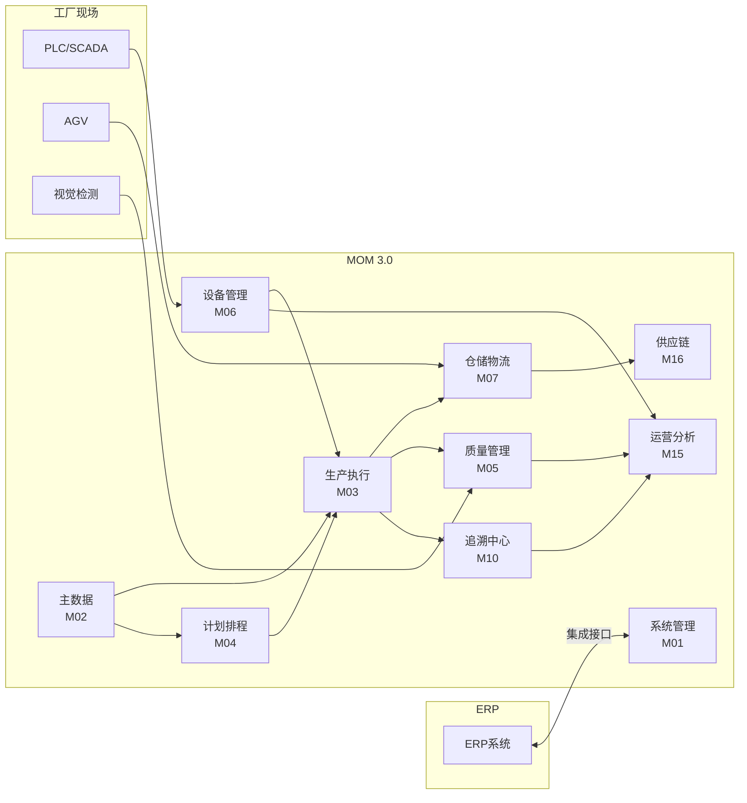

# MOM 3.0 主设计文档

> 版本：V1.0 | 最后更新：2026-07-01 | 维护人：架构组
> 适用范围：MOM 3.0 全系统

> **重要**：本文件**之前长期被各模块文档引用但不存在**（是设计文档系统的「幻影引用」）。自 2026-07-01 起正式建立。后续所有模块文档的「关联文档」节必须改为引用本文件。

---

## 1. 系统概述

### 1.1 是什么

**MOM 3.0**（Manufacturing Operations Management，制造运营管理系统）是**峰梅动力**面向**汽车零部件多品种小批量**生产场景自研的工业软件。

- **行业定位**：对标 SAP S/4HANA Manufacturing、Siemens Opcenter Execution、Dassault DELMIA Apriso 等国际主流 MOM 产品；遵循 ISA-95 / IEC 62264 企业-控制系统集成标准、MESA 11 项 MES 核心功能、IATF 16949 / VDA 6.3 质量管理要求
- **核心场景**：销售订单 → 主生产计划（MPS）→ 物料需求（MRP）→ 高级排程（APS）→ 工单下发 → 派工 → 报工 → 完工入库 → 交付追溯
- **业务价值**：把车间从「纸质工单 + Excel」数字化到「全流程可追溯、可分析、可优化」，目标是把汽车零部件行业的人均产值提升 20-30%

### 1.2 业务范围（做什么 / 不做什么）

| 范畴 | 范围内（In Scope） | 范围外（Out of Scope） |
|------|-------------------|----------------------|
| **核心** | 生产计划、生产执行、质量管理、设备管理、仓储管理、追溯、APS 排程 | - |
| **协同** | 主数据、供应链（采购/销售/询价）、报表 | - |
| **集成** | ERP（SAP/金蝶）、AGV、视觉检测、SCADA/PLC、SCADA | - |
| **不做** | - | 完整 ERP（财务、HR）、CRM、PLM、SRM（仅做接口） |
| **不做** | - | 完整 APS（高级排程引擎外部采购 OR-Tools，集成层在 MOM） |
| **不做** | - | 完整 SCM（运输管理 TMS、订单承诺 ATP/CTP 不做） |
| **不做** | - | 数字孪生 3D 可视化（P3 阶段才考虑） |

### 1.3 核心目标（Top 5 业务目标）

1. **OEE 提升**：试点车间从 60% → 80%
2. **追溯时效**：批次追溯查询 P95 ≤ 2 秒
3. **质量闭环**：从不良发现到 8D 关闭 ≤ 14 天（行业平均 30 天）
4. **库存周转**：原材料周转天数从 45 天 → 25 天
5. **报工效率**：车间报工时间从 5 分钟/单 → 30 秒/单（扫码 + 模板）

### 1.4 干系人

| 角色 | 主要诉求 | 在 MOM 中的位置 |
|------|---------|----------------|
| **车间主任** | 生产进度、设备状态、人员效率 | 生产看板、车间报表 |
| **计划员** | MPS/MRP/APS、排程合理性 | APS 模块 |
| **班组长** | 派工、报工、首末件 | 生产执行模块 |
| **操作工** | 扫码报工、SOP 查看、缺陷上报 | 移动端/PDA、工位终端 |
| **质检员** | 来料/过程/成品检验、不良记录 | 质量模块 |
| **设备工程师** | 点检、保养、维修、OEE | 设备模块 |
| **仓储员** | 收货、上架、拣货、盘点 | WMS 模块 |
| **采购/销售** | PO/SO、询价、供应商 KPI | SCP 模块 |
| **管理层** | OEE、产能利用率、交付率 | 运营分析报表 |
| **IT** | 部署、监控、安全、合规 | 系统管理 + 运维手册 |

---

## 2. 模块地图

MOM 3.0 由 **11 个一级菜单**（业务域）+ **25 个后端模块**（handler 目录）+ **20 个前端视图目录**组成。

### 2.1 一级菜单（用户视角，按 SAP S/4HANA 风格分组）

| ID | 一级菜单 | 主要功能 | 后端模块 | 前端 views |
|----|---------|---------|---------|-----------|
| 1 | **首页** | 仪表盘 | - | `Dashboard.vue` |
| 100 | **生产执行** | 工单、报工、派工、发料、退料、流转卡、首末件、电子 SOP、看板、包装 | `production` `mes` `dc` `container` `business` | `production/` `mes/` |
| 200 | **质量管理** | IQC/IPQC/FQC/OQC、NCR、缺陷代码/记录、SPC、QRCI、LPA、AQL、检验计划、实验室 | `quality` | `quality/` |
| 300 | **计划排程** | MPS、MRP、APS 排程、工作中心、滚动排程、交付分析、缺料分析、换型矩阵 | `aps` | `aps/` |
| 400 | **设备管理** | 设备台账、点检、保养、维修、OEE、TEEP、模具、量检具、停机、能源 | `equipment` `eam` | `equipment/` `eam/` `energy/` |
| 500 | **仓储物流** | 仓库/库位/库存、收货/发货/调拨/盘点、容器、AGV | `wms` `agv` | `wms/` `agv/` |
| 600 | **供应链** | 采购订单、询价 RFQ、供应商报价、销售订单、客户询价、供应商 KPI、ASN、采购/销售退货 | `scp` `supplier` `supplier_asn` `fin` | `scp/` `supplier/` `fin/` |
| 700 | **主数据** | 物料、BOM、工艺路线、工序、车间、产线、工位、班次、单位、客户、供应商、银行、联系人 | `mdm` | `mdm/` |
| 800 | **追溯中心** | 序列号追溯、批次追溯、工单追溯、安灯呼叫、安灯统计、升级规则 | `trace` `andon` `alert` | `trace/` `alert/` |
| 900 | **运营分析** | 生产日报、质量周报、OEE 报表、交付报表、安灯报表 | `report` | `report/` |
| 2000 | **系统管理** | 用户、角色、菜单、部门、岗位、字典、租户、登录日志、操作日志、BPM 流程、集成配置、ERP 同步、告警 | `system` `bpm` `integration` `erp_sync` `ai` | `system/` `bpm/` `integration/` |

> 详细菜单与权限见 [`mom-server/data/sys_menu_seed_v2.sql`](../mom-server/data/sys_menu_seed_v2.sql)（100+ 个菜单项）

### 2.2 后端模块（开发者视角，按 handler 目录）

```
mom-server/internal/handler/
├── agv/              # AGV 任务/设备/库位/回调
├── ai/               # AI 聊天/视觉检测/AI 配置
├── alert/            # 告警规则/记录/通知
├── andon/            # 安灯呼叫/统计/升级规则
├── aps/              # MPS/MRP/排程/工作中心/换型矩阵
├── bpm/              # 流程定义/实例/任务/转移
├── business/         # 业务通用（编码规则、通知公告等）
├── container/        # 容器生命周期/移动/绑定
├── dc/               # 数据采集点/记录
├── eam/              # EAM 资产/层级/厂区
├── equipment/        # 设备台账/点检/保养/维修/备件/OEE
├── erp_sync/         # ERP 同步日志/状态
├── fin/              # 财务结算（付款/采购/销售结算）
├── integration/      # 接口配置/字段映射/触发器/执行日志
├── mdm/              # 主数据（物料/BOM/工序/车间/产线/客户/供应商/单位/银行）
├── mes/              # MES 执行（班组/工艺路线/离线/SOP/报工/排程）
├── production/       # 生产执行（工单/派工/报工/发料/退料/SOP/看板）
├── quality/          # 质量（IQC/IPQC/FQC/OQC/NCR/SPC/QRCI/LPA/实验室）
├── report/           # 报表（生产日报/质量周报/OEE/交付/安灯）
├── scp/              # 供应链（采购/销售/RFQ/报价/询价/KPI）
├── supplier/         # 供应商（银行/联系人/物料映射）
├── supplier_asn/     # ASN 到货通知
├── system/           # 系统（用户/角色/菜单/部门/字典/租户/日志/通知）
├── trace/            # 追溯（序列号/批次/工单/物料）
└── wms/              # 仓储（仓库/库位/库存/收货/发货/调拨/盘点）
```

### 2.3 前端视图（按 src/views 目录）

```
mom-web/src/views/
├── Dashboard.vue / Login.vue / Error404.vue
├── agv/ alert/ aps/ bpm/ eam/ energy/ equipment/
├── fin/ integration/ mdm/ mes/ production/ quality/
├── report/ scp/ supplier/ system/ trace/ wms/
```

### 2.4 模块关系图



---

## 3. 业务能力矩阵（MESA 11 项对齐）

MESA（Manufacturing Enterprise Solutions Association）定义了 MES 的 11 项核心功能。MOM 3.0 的覆盖情况：

| # | MESA 功能 | MOM 3.0 对应模块 | 覆盖率 | 备注 |
|---|----------|-----------------|--------|------|
| 1 | **Operations Detail Tracking** | 生产执行（报工、流转卡）| 90% | 含 PDA 移动报工 |
| 2 | **Operations/Resource Scheduling & Dispatching** | APS 排程、派工管理 | 80% | 排程引擎基于 FIFO/EDD/SPT/LPT，缺高级优化算法 |
| 3 | **Dispatching Production Units** | 派工管理 | 90% | - |
| 4 | **Document Control** | BPM 流程 + 编码规则 + 电子 SOP | 75% | BPM 已集成 Flowable；SOP 已支持 PDF + 版本管理 |
| 5 | **Labor Management** | 班组管理、人员能力矩阵 | 80% | - |
| 6 | **Quality Management** | 质量管理 | 90% | IQC/IPQC/FQC/OQC + SPC + AQL + QRCI + LPA |
| 7 | **Process Management** | 工艺路线、工序管理 | 85% | 工艺路线版本化 |
| 8 | **Maintenance Management** | 设备管理 | 90% | 点检 + 保养 + 维修 + OEE |
| 9 | **Product Tracking & Genealogy** | 追溯中心 | 90% | 序列号 + 批次 + 工单 + 物料前向/反向追溯 |
| 10 | **Performance Analysis** | 运营分析报表 | 85% | 生产日报/质量周报/OEE/交付/安灯 |
| 11 | **Data Collection / Acquisition** | 数据采集 | 85% | 数据点 + 采集记录 + 扫码日志 |

**整体覆盖**：约 **86%**（11 项平均）

> 详细覆盖见 [`DEVELOPMENT_STATUS.md`](./DEVELOPMENT_STATUS.md)

---

## 4. 行业标准对齐

| 标准 | 用途 | 在 MOM 中的体现 |
|------|------|----------------|
| **ISA-95 / IEC 62264** | 企业-控制系统集成 | MOM 处于 Level 3（MES 层）；与 Level 4 ERP 通过集成模块对接；使用 Common Object Model 思想设计主数据 |
| **ISA-88 / IEC 61512** | 批次控制 | 工艺路线（Procedure）+ 配方（Formula）+ 设备能力（Equipment Requirements）的三层结构 |
| **MESA Functional Model** | MES 11 项核心功能 | 见 § 3 业务能力矩阵 |
| **IATF 16949:2016** | 汽车质量管理体系 | QRCI 闭环 + 8D + SPC + 不良品审理 + 生产件批准 |
| **VDA 6.3** | 过程审核标准 | LPA 分层审核 + 检验计划 + 过程能力指数（Cpk）|
| **ISO 9001:2015** | 通用质量管理 | 操作日志 + 审计追踪 + 文档控制 |
| **OPC UA / IEC 62541** | 设备数据采集接口 | 设备集成接口（已留扩展点，待实施）|
| **BPMN 2.0** | 业务流程建模 | BPM 模块（基于 Flowable）|

详见 [`docs/research/mes-design-best-practices-2026-07-01.md § 3`](./research/mes-design-best-practices-2026-07-01.md)

---

## 5. 术语表（Glossary）

### 5.1 业务术语

| 术语 | 英文 | 解释 |
|------|------|------|
| **BOM** | Bill of Materials | 物料清单，描述产品由哪些子件组成及其数量关系 |
| **工艺路线** | Routing | 产品在车间经过哪些工序、按什么顺序 |
| **工单** | Production Order | 对一个具体数量产品的生产指令 |
| **派工** | Dispatch | 把工序分配给具体的工位/班组/人员 |
| **报工** | Job Report | 操作工汇报工序完成情况（数量、时长、不良）|
| **首末件检验** | First & Last Piece Inspection | 每批次第一件和最后一件必须检验 |
| **IQC** | Incoming Quality Control | 来料检验 |
| **IPQC** | In-Process Quality Control | 过程检验 |
| **FQC** | Final Quality Control | 成品检验 |
| **OQC** | Outgoing Quality Control | 出货检验 |
| **NCR** | Non-Conformance Report | 不合格品报告 |
| **QRCI** | Quick Response Continuous Improvement | 快速响应持续改进 |
| **LPA** | Layered Process Audit | 分层过程审核 |
| **SPC** | Statistical Process Control | 统计过程控制（控制图）|
| **AQL** | Acceptable Quality Level | 可接受质量水平（抽样标准）|
| **MPS** | Master Production Schedule | 主生产计划 |
| **MRP** | Material Requirements Planning | 物料需求计划 |
| **APS** | Advanced Planning & Scheduling | 高级计划排程 |
| **RFQ** | Request For Quotation | 询价单 |
| **ASN** | Advance Ship Notice | 预先到货通知 |
| **PSA** | Production Supply Area | 生产供应区（线边暂存）|
| **JIT/JIS** | Just-In-Time / Just-In-Sequence | 准时化生产 / 准时顺序配送 |
| **VMI** | Vendor Managed Inventory | 供应商管理库存 |
| **OEE** | Overall Equipment Effectiveness | 设备综合效率（可用率×性能×良率）|
| **MTBF** | Mean Time Between Failures | 平均故障间隔时间 |
| **MTTR** | Mean Time To Repair | 平均维修时间 |
| **FPY** | First Pass Yield | 一次合格率 |
| **WMS** | Warehouse Management System | 仓库管理系统 |
| **AGV** | Automated Guided Vehicle | 自动导引车 |
| **DCS** | Distributed Control System | 分布式控制系统 |
| **SCADA** | Supervisory Control And Data Acquisition | 数据采集与监视控制系统 |

### 5.2 系统术语

| 术语 | 解释 |
|------|------|
| **租户（Tenant）** | 系统最高数据隔离单元，对应一个法人公司或独立事业部 |
| **站点（Site）/ 工厂（Factory）** | 租户下的具体工厂，目前 MOM 3.0 通过 `factory_id` 实现 |
| **车间（Workshop）** | 工厂下的生产单位 |
| **产线（Line）** | 车间下的连续生产线 |
| **工位（Workstation）** | 产线上最小执行单元 |
| **资源（Resource）** | 设备/工位/人员的统称，可被工艺路线引用 |
| **物料（Material）** | 原料、半成品、成品、包装材料的统称 |
| **批次（Lot/Batch）** | 同条件下生产的一组物料，有共同追溯码 |
| **序列号（Serial Number / SN）** | 单件物料的唯一标识 |
| **工作日历（Working Calendar）** | 工厂的上班时间、节假日、班次定义 |

### 5.3 技术术语

| 术语 | 解释 |
|------|------|
| **JWT** | JSON Web Token，用于用户认证 |
| **AutoMigrate** | GORM 自动迁移，根据 model 结构同步数据库 schema |
| **Pre-flight** | 启动前的数据库健康检查（外键约束、缺失主键）|
| **Webhook** | HTTP 回调，集成模块中用于事件触发 |

完整术语表见 [`MOM3.0_附录.md`](./MOM3.0_附录.md)（待阶段 2 补充）

---

## 6. 文档阅读路径

### 6.1 按角色

| 角色 | 推荐阅读顺序 |
|------|--------------|
| **新员工入职** | 本文档 → [`DEVELOPMENT_STATUS.md`](./DEVELOPMENT_STATUS.md) → 负责模块的设计文档 |
| **后端开发** | [`MOM3.0_技术架构文档.md`](./MOM3.0_技术架构文档.md) → [`MOM3.0_模块设计模板.md`](./MOM3.0_模块设计模板.md) → 负责模块的 `MOM3.0_<模块名>模块设计文档.md` → [`TODO.md`](./TODO.md) |
| **前端开发** | [`MOM3.0_UI设计规范.md`](./MOM3.0_UI设计规范.md) → [`MOM3.0_模块设计模板.md`](./MOM3.0_模块设计模板.md) → 负责模块的 `MOM3.0前端_<模块名>模块设计文档.md` → `rules/前端/` |
| **产品 / 业务** | 本文档 § 2 模块地图 → 各模块设计文档的「模块概述」「业务流程」节 → [`MOM3.0_SAP_Gap_Analysis_and_Development_Plan.md`](./MOM3.0_SAP_Gap_Analysis_and_Development_Plan.md) |
| **实施 / 客户演示** | 本文档 § 3 业务能力矩阵 → [`DEVELOPMENT_STATUS.md`](./DEVELOPMENT_STATUS.md) → 演示模块的 `MOM3.0_<模块名>模块设计文档.md` |
| **运维 / 部署** | [`MOM3.0_技术架构文档.md`](./MOM3.0_技术架构文档.md) 的「部署视图」+「安全分区」节 |
| **架构评审** | [`MOM3.0_技术架构文档.md`](./MOM3.0_技术架构文档.md) + `research/MOM3.0-design-doc-improvement-2026-07-01.md` |

### 6.2 关联文档清单

#### 总览 / 规约

- [`README.md`](./README.md) — 文档中心入口
- [`DOCUMENTATION_GUIDE.md`](./DOCUMENTATION_GUIDE.md) — 文档维护规约
- [`MOM3.0_UI设计规范.md`](./MOM3.0_UI设计规范.md) — UI 设计规范
- [`MOM3.0_技术架构文档.md`](./MOM3.0_技术架构文档.md) — 技术架构（C4 图、部署图、数据流）
- [`MOM3.0_模块设计模板.md`](./MOM3.0_模块设计模板.md) — 模块文档统一模板
- [`MOM3.0_附录.md`](./MOM3.0_附录.md) — 通用附录（错误码字典、术语表、角色定义、字段命名）

#### 模块设计文档（后端，按业务域）

| 业务域 | 文档 |
|--------|------|
| 系统管理 | [`MOM3.0_系统集成模块设计文档.md`](./MOM3.0_系统集成模块设计文档.md)（含集成 + 告警） |
| 主数据 | [`MOM3.0_主数据管理模块设计文档.md`](./MOM3.0_主数据管理模块设计文档.md) |
| 生产执行 | [`MOM3.0_MES生产执行模块设计文档.md`](./MOM3.0_MES生产执行模块设计文档.md) + [`MOM3.0_其他模块设计文档.md`](./MOM3.0_其他模块设计文档.md)（含 eSOP/BPM/容器/AI 质检）|
| 计划排程 | [`MOM3.0_APS计划模块设计文档.md`](./MOM3.0_APS计划模块设计文档.md) |
| 质量管理 | [`MOM3.0_质量模块设计文档.md`](./MOM3.0_质量模块设计文档.md) + [`MOM3.0_实验室模块设计文档.md`](./MOM3.0_实验室模块设计文档.md) |
| 设备管理 | [`MOM3.0_设备管理模块设计文档.md`](./MOM3.0_设备管理模块设计文档.md) |
| 仓储物流 | [`MOM3.0_WMS仓储模块设计文档.md`](./MOM3.0_WMS仓储模块设计文档.md) |
| 供应链 | [`MOM3.0_SCP供应链模块设计文档.md`](./MOM3.0_SCP供应链模块设计文档.md) + [`MOM3.0_客户与供应商管理设计文档.md`](./MOM3.0_客户与供应商管理设计文档.md) + [`MOM3.0_结算模块设计文档.md`](./MOM3.0_结算模块设计文档.md) |
| 追溯 | [`MOM3.0_追溯与数据采集模块设计文档.md`](./MOM3.0_追溯与数据采集模块设计文档.md) + [`MOM3.0_安灯系统模块设计文档.md`](./MOM3.0_安灯系统模块设计文档.md) |
| 运营分析 | [`MOM3.0_报表模块设计文档.md`](./MOM3.0_报表模块设计文档.md) |
| JIT/JIS | [`JIT_JIS_DESIGN.md`](./JIT_JIS_DESIGN.md) |

#### 配套资产

- [`DEVELOPMENT_STATUS.md`](./DEVELOPMENT_STATUS.md) — 模块实现状态（API 覆盖率）
- [`MOM3.0-页面清单与功能元素.md`](./MOM3.0-页面清单与功能元素.md) — 已验证页面（Playwright）
- [`MOM3.0-页面问题清单-2026-04-23.md`](./MOM3.0-页面问题清单-2026-04-23.md) — 待修复问题
- [`TODO.md`](./TODO.md) — P0/P1/P2 问题清单
- [`MOM3.0_SAP_Gap_Analysis_and_Development_Plan.md`](./MOM3.0_SAP_Gap_Analysis_and_Development_Plan.md) — SAP 对照 + 整改计划
- [`rules/`](./rules/) — 项目开发规范（Vue/后端/工作流）

#### 调研 / 审计

- [`research/MOM3.0-design-doc-audit-2026-07-01.md`](./research/MOM3.0-design-doc-audit-2026-07-01.md) — 现状审计
- [`research/MOM3.0-design-doc-improvement-2026-07-01.md`](./research/MOM3.0-design-doc-improvement-2026-07-01.md) — 提升建议
- [`research/mes-design-best-practices-2026-07-01.md`](./research/mes-design-best-practices-2026-07-01.md) — 行业最佳实践

---

## 7. 修订记录

| 版本 | 日期 | 修订人 | 说明 |
|------|------|--------|------|
| V1.0 | 2026-07-01 | 架构组 | 初版；修复「幻影引用」问题；整合 11 个一级菜单 + 25 个后端模块 + 20 个前端视图的完整地图；补充 MESA 11 项对齐 + 行业标准对齐 + 完整术语表 |

---

**下一步**：阶段 2 将基于本框架建立统一模板（13 章节 Arc42 简化版）+ Mermaid/PlantUML 图表工具链 + 12 个核心状态机 + 7 张 ER 图。详见 [`MOM3.0-design-doc-improvement-2026-07-01.md`](./research/MOM3.0-design-doc-improvement-2026-07-01.md)。