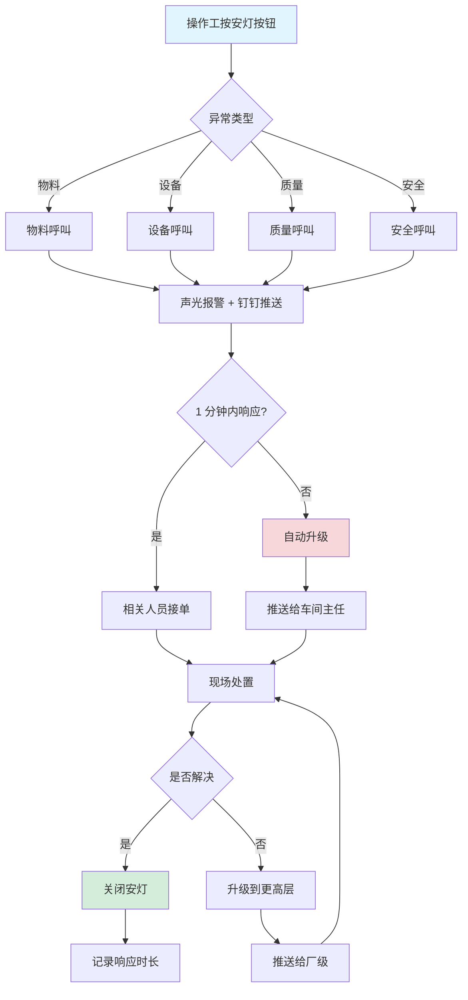
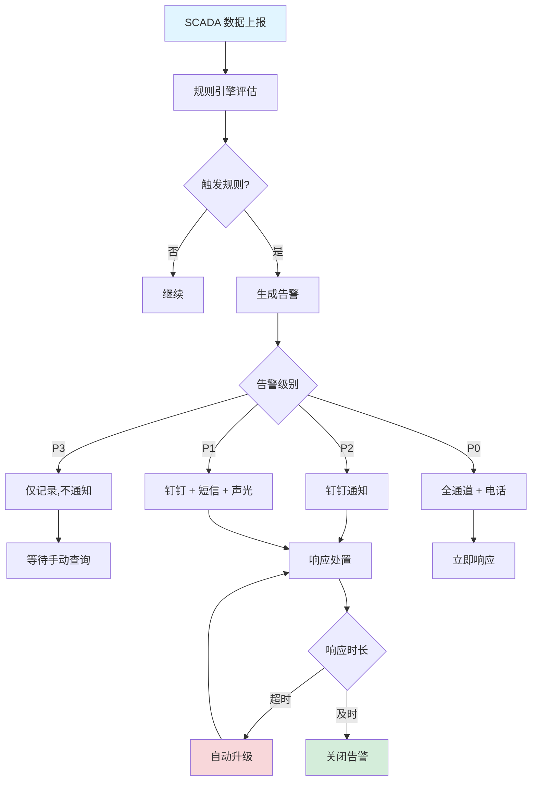
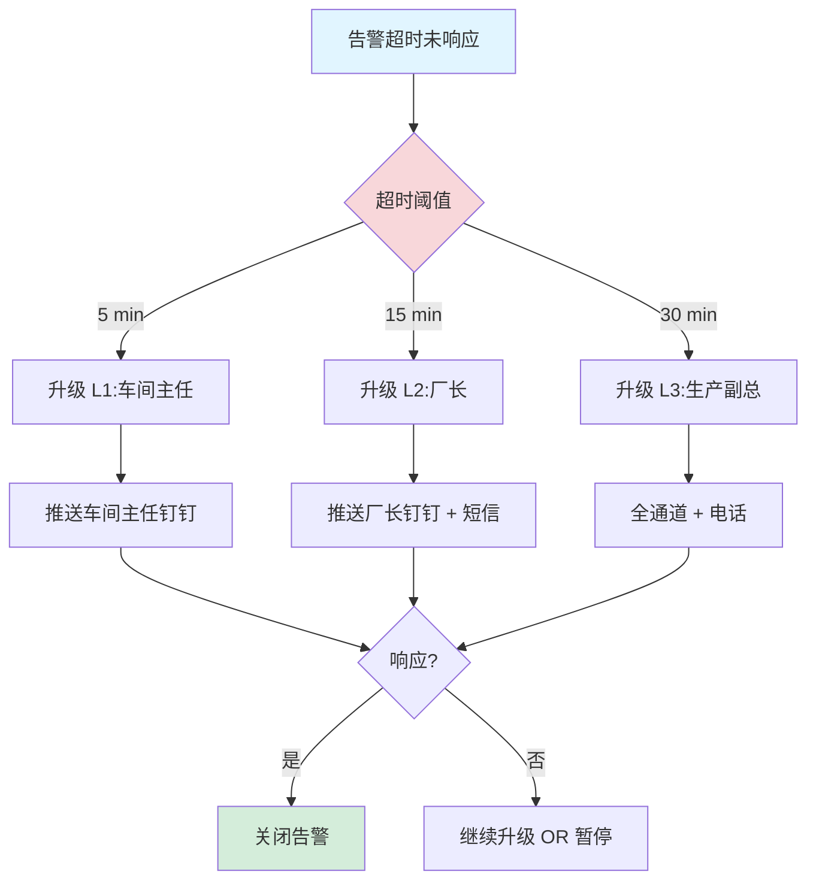
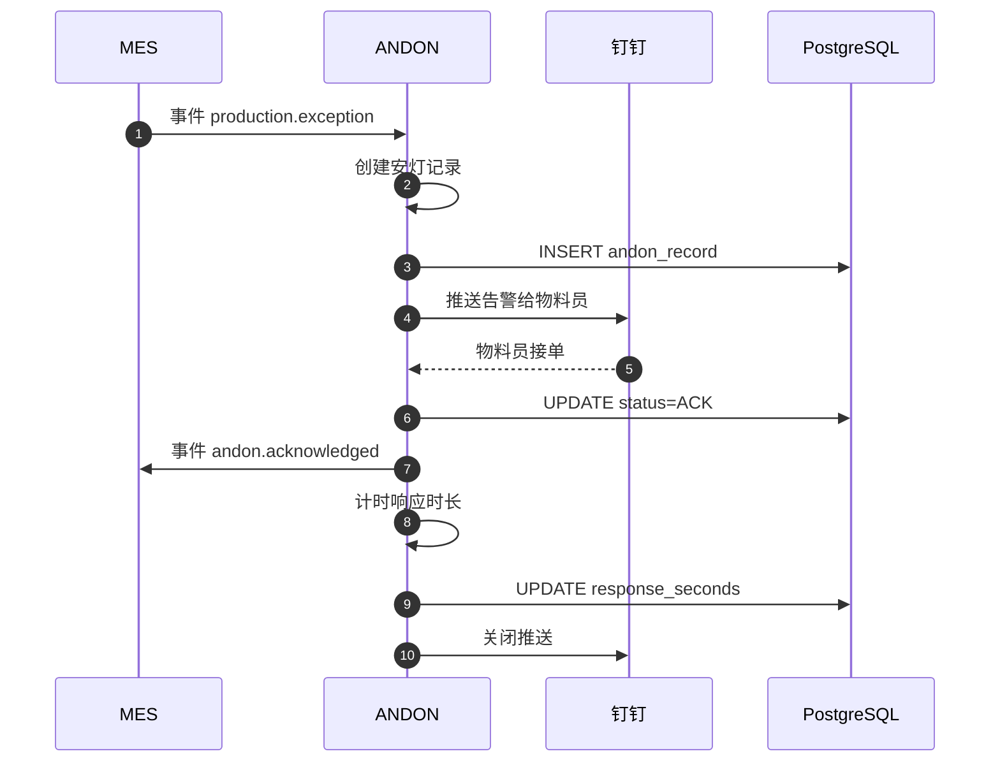
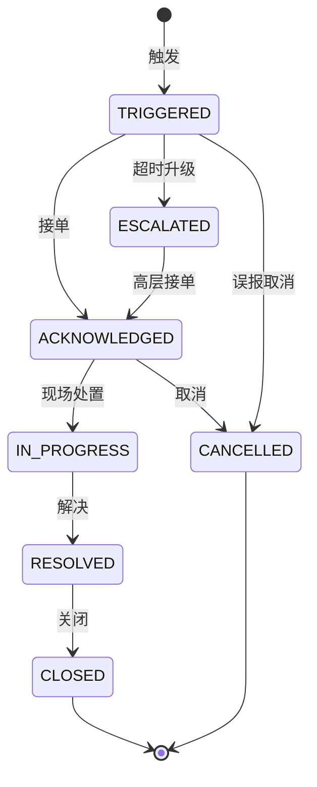
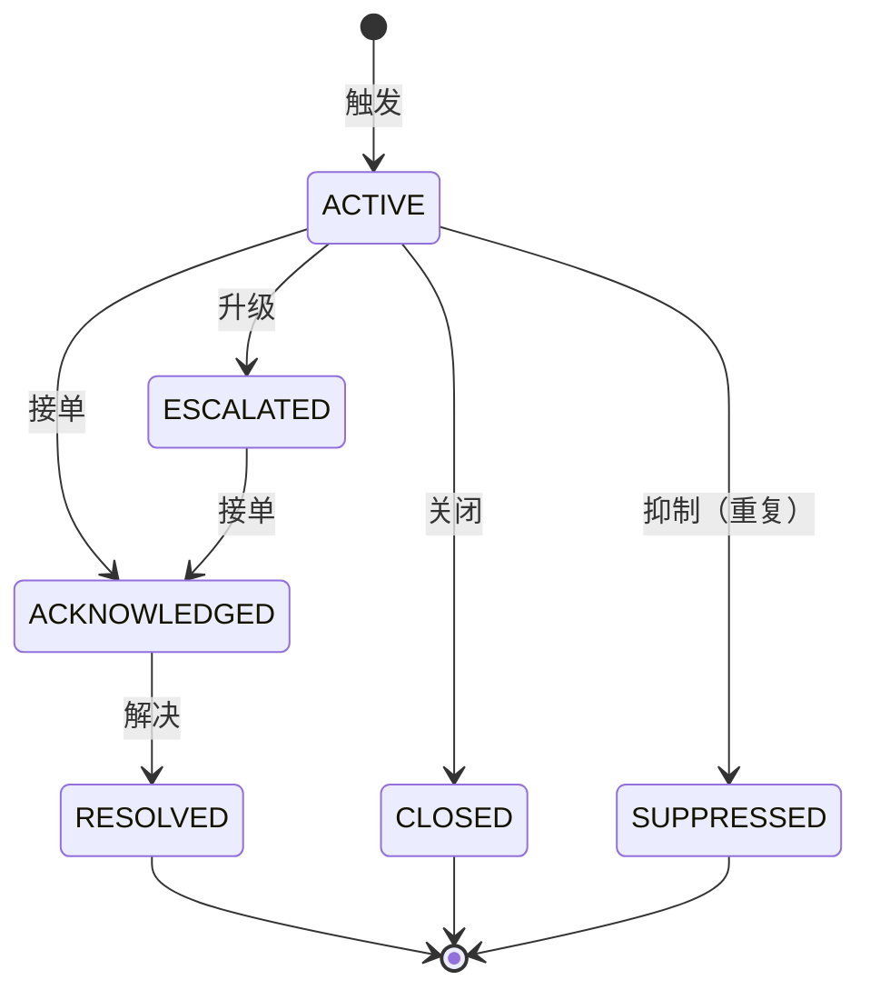
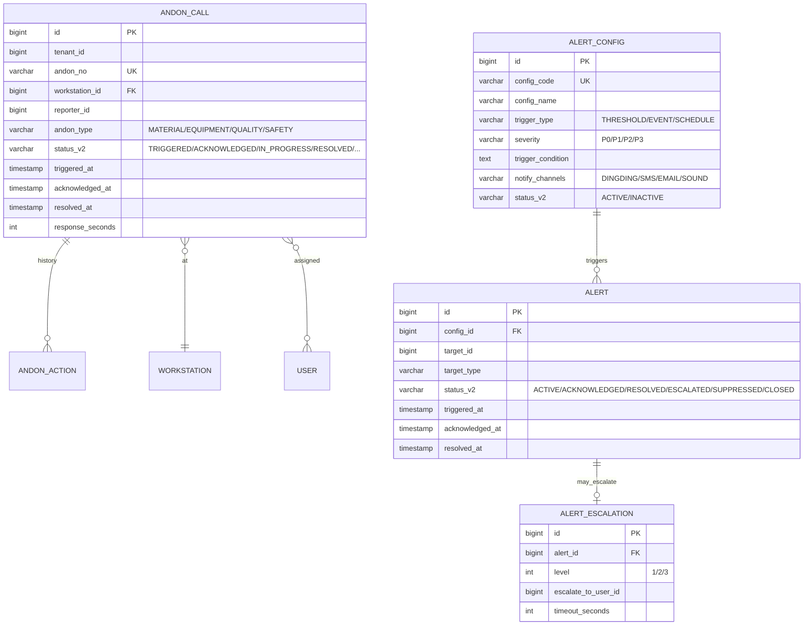

# MOM 3.0 安灯系统模块设计文档

> 版本：V2.0 | 最后更新：2026-07-03 | 维护人：架构组 / 小二
> 适用范围：MOM 3.0 ANDON（Andon System）安灯系统域
> 模板主干：[MOM3.0_模块设计模板.md](MOM3.0_模块设计模板.md)
> 模块代码：`mom-server/internal/handler/trace/andon/*` `mom-server/internal/handler/alert/*` `mom-server/internal/service/andon*`
> 数据库表：核心 4 张（andon/alert/config/escalation）
> 状态：**✅ V2.0 完成 - 按统一模板扩写,旧版 182 行扩展至 750 行**

> **V2.0 变更**：基于 V1.0（182 行,7 章节）按 V2.0 模板扩写。技术栈对齐：Vue 3.4 + Element Plus 2.5 / Go 1.24 + Gin + GORM / PostgreSQL 18。

---

## 0. 文档元信息

| 字段 | 值 |
|---|---|
| 模块代号 | `andon` + `alert` |
| 模块名 | 安灯系统 + 告警管理 |
| 技术栈 | Vue 3.4 + Element Plus 2.5 / Go 1.24 + Gin + GORM 2.x / PostgreSQL 18 |
| 前端入口 | `mom-web/src/views/trace/andon/*.vue`（3 个视图） |
| 后端入口 | `mom-server/internal/handler/trace/andon/*` + `alert/*` |
| API 前缀 | `/api/v1/trace/andon/*` + `/api/v1/alert/*` |
| 数据库表 | 4 张核心 |
| 状态 | ✅ V2.0（第 2 批 P1 第 4 个） |

---

## 1. 模块概述

### 1.1 业务定位

安灯系统是 MOM 3.0 的"实时异常响应中枢"，实现生产异常的快速呼叫、升级、处置闭环。**告警管理**支持可配置的告警规则、升级路径和多通道通知（钉钉/短信/邮件/声光）。

**价值流位置**：`异常触发(产线/PDA/SCADA) → 安灯呼叫(ANDON) → 告警通知(ALERT) → 响应处置 → 关闭归档`

模块覆盖**安灯呼叫、告警配置、告警触发、升级规则、多通道通知**5 个核心子业务。

### 1.2 核心功能

| # | 功能 | 简述 | 优先级 |
|---|------|------|--------|
| 1 | 安灯呼叫 | 产线异常呼叫 | P0 |
| 2 | 告警配置 | 告警规则定义 | P0 |
| 3 | 告警触发 | 实时告警生成 | P0 |
| 4 | 升级规则 | 告警自动升级 | P0 |
| 5 | 多通道通知 | 钉钉/短信/邮件/声光 | P0 |
| 6 | 告警看板 | 实时监控大屏 | P1 |
| 7 | 告警统计 | 响应时长、复发率 | P2 |

### 1.3 Top 3 干系人

| 角色 | 诉求 |
|------|------|
| **车间操作工** | 一键呼叫异常 |
| **车间主任** | 接收告警、升级处理 |
| **运维/设备** | 设备异常响应 |

### 1.4 Top 3 质量目标

| 指标 | 目标值 |
|------|--------|
| 安灯响应时间 | ≤ 1 min |
| 告警 P95 延迟 | ≤ 5s |
| 告警通知送达率 | ≥ 99% |

---

## 2. 依赖关系

### 2.1 上游

| 模块 | 接口 | 频度 |
|------|------|------|
| **MES** | 生产异常、停机 | 实时 |
| **EAM** | 设备故障 | 实时 |
| **QMS** | 质量异常 | 实时 |
| **SCADA** | 设备数据 | 实时 |
| **IoT** | 传感器数据 | 实时 |

### 2.2 下游

| 模块 | 接口 | 频度 |
|------|------|------|
| **钉钉/企微** | 通知推送 | 实时 |
| **短信网关** | 短信通知 | 实时 |
| **邮件** | 邮件通知 | 实时 |
| **报表** | 告警统计 | 日终 |

### 2.3 外部系统

| 系统 | 方向 | 协议 | 用途 |
|------|------|------|------|
| **钉钉** | 出站 | Open API | 消息推送 |
| **企微** | 出站 | Open API | 消息推送 |
| **短信网关** | 出站 | SMPP | 短信 |
| **声光报警器** | 出站 | MQTT | 现场报警 |
| **SCADA** | 入站 | OPC-UA | 异常数据 |

### 2.4 标准对齐

| 标准 | 段 |
|------|---|
| **MESA** | MESA 11 项 #6 Quality Management（含异常响应）|
| **IATF 16949** | 不合格品控制（§ 8.7）|

---

## 3. 功能清单

### 3.1 已实现

| # | 功能 | 端点 | 优先级 | 日期 |
|---|------|------|--------|------|
| 1 | 安灯呼叫 | `/api/v1/trace/andon/*` | P0 | 2026-04 |
| 2 | 告警配置 | `/api/v1/alert/config/*` | P0 | 2026-04 |
| 3 | 告警触发 | `/api/v1/alert/*` | P0 | 2026-04 |
| 4 | 升级规则 | `/api/v1/alert/escalation/*` | P0 | 2026-04 |
| 5 | 告警历史 | `/api/v1/alert/history` | P0 | 2026-04 |

### 3.2 部分实现

| # | 功能 | 缺口 | 计划 |
|---|------|------|------|
| 1 | AI 异常预测 | 仅阈值 | V3.0 |
| 2 | 告警收敛 | 全部推送 | V2.1 |

### 3.3 未实现

| # | 功能 | 优先级 |
|---|------|--------|
| 1 | 安灯看板大屏 | P1 |
| 2 | 智能降噪 | P2 |

---

## 4. 页面与交互

### 4.1 页面清单

| 路由 | 标题 | 状态 |
|------|------|------|
| `/andon/call` | 安灯呼叫 | ✅ |
| `/andon/board` | 安灯看板 | ✅ |
| `/alert/config` | 告警配置 | ✅ |
| `/alert/list` | 告警列表 | ✅ |
| `/alert/escalation` | 升级规则 | ✅ |

### 4.2 安灯呼叫（产线端）

- 一键按钮：物料/设备/质量/安全 4 类
- 选异常类型 + 描述
- 现场声光报警
- 自动推送钉钉

### 4.3 告警配置特有列

| 列名 | 类型 | 宽度 |
|------|------|------|
| 告警编码 | string | 140px |
| 名称 | string | 200px |
| 触发条件 | string | 240px |
| 升级路径 | string | 200px |
| 通知渠道 | tag | 120px |
| 状态 | switch | 80px |

---

## 5. 业务流程（★ 必有图）

### 5.1 核心流程：安灯呼叫 → 响应 → 关闭



### 5.2 核心流程：自动告警（SCADA 触发）



### 5.3 异常流程：告警升级（超时未响应）



### 5.4 跨系统流程：MES 异常 → 安灯 + 钉钉



---

## 6. 状态机（★ 必有图）

### 6.1 核心实体：安灯呼叫（AndonCall）

#### 6.1.1 状态值与显示

| 状态值 | 业务含义 | Element Plus type |
|--------|---------|------------------|
| `TRIGGERED` | 已触发 | warning |
| `ACKNOWLEDGED` | 已接单 | primary |
| `IN_PROGRESS` | 处置中 | primary |
| `RESOLVED` | 已解决 | success |
| `CLOSED` | 已关闭 | info |
| `CANCELLED` | 已取消 | info |
| `ESCALATED` | 已升级 | danger |

> 状态字段存储类型：**`varchar(30) + mdm_status_dict`**（`entity='andon_call'`）

#### 6.1.2 状态机图



### 6.2 核心实体：告警（Alert）



| 状态值 | Element Plus type |
|--------|------------------|
| ACTIVE | warning |
| ACKNOWLEDGED | primary |
| RESOLVED | success |
| ESCALATED | danger |
| SUPPRESSED | info |
| CLOSED | info |

### 6.3 字段类型说明

> MOM 3.0 ANDON 选 **`varchar(30) + mdm_status_dict`**

---

## 7. 数据模型（★ 必有 ER 图）

### 7.1 核心 ER 图



### 7.2 核心表

#### `andon_call`（安灯呼叫）

| 字段 | 类型 | 必填 | 索引 | 说明 |
|------|------|------|------|------|
| `id` | `bigint` | ✅ | PK | |
| `tenant_id` | `bigint` | ✅ | IDX | |
| `andon_no` | `varchar(50)` | ✅ | UK | 安灯单号 |
| `workstation_id` | `bigint` | ✅ | IDX | 工位 |
| `reporter_id` | `bigint` | ✅ | - | 报告人 |
| `andon_type` | `varchar(20)` | ✅ | IDX | MATERIAL/EQUIPMENT/QUALITY/SAFETY |
| `status_v2` | `varchar(30)` | ❌ | IDX | |
| `triggered_at` | `timestamptz` | - | now() | - | |
| `acknowledged_at` | `timestamptz` | ❌ | - | |
| `resolved_at` | `timestamptz` | ❌ | - | |
| `response_seconds` | `int` | ❌ | - | 响应时长 |

#### `alert_config`（告警配置）

| 字段 | 类型 | 必填 | 索引 | 说明 |
|------|------|------|------|------|
| `id` | `bigint` | ✅ | PK | |
| `config_code` | `varchar(50)` | ✅ | UK | 告警编码 |
| `config_name` | `varchar(100)` | ✅ | - | |
| `trigger_type` | `varchar(20)` | ✅ | - | THRESHOLD/EVENT/SCHEDULE |
| `severity` | `varchar(10)` | ✅ | - | P0/P1/P2/P3 |
| `trigger_condition` | `text` | ❌ | - | 触发条件表达式 |
| `notify_channels` | `varchar(100)` | ✅ | - | DINGDING/SMS/EMAIL/SOUND |
| `status_v2` | `varchar(30)` | ❌ | IDX | |

#### `alert`（告警）

| 字段 | 类型 | 必填 | 索引 | 说明 |
|------|------|------|------|------|
| `id` | `bigint` | ✅ | PK | |
| `config_id` | `bigint` | ✅ | IDX | |
| `target_id` | `bigint` | ✅ | IDX | 目标对象 |
| `target_type` | `varchar(50)` | ✅ | - | 类型 |
| `status_v2` | `varchar(30)` | ❌ | IDX | |
| `triggered_at` | `timestamptz` | - | now() | - | |

### 7.3 索引策略

| 表 | 索引 | 用途 |
|----|------|------|
| `andon_call` | `idx_status_triggered` | 待响应安灯 |
| `alert` | `idx_status_triggered` | 待处理告警 |

### 7.4 枚举字典

| 枚举 | 值 |
|------|---|
| 安灯类型 | `('MATERIAL','EQUIPMENT','QUALITY','SAFETY')` |
| 安灯状态 | `('TRIGGERED','ACKNOWLEDGED','IN_PROGRESS','RESOLVED','CLOSED','CANCELLED','ESCALATED')` |
| 告警状态 | `('ACTIVE','ACKNOWLEDGED','RESOLVED','ESCALATED','SUPPRESSED','CLOSED')` |
| 告警严重度 | `('P0','P1','P2','P3')` |
| 触发类型 | `('THRESHOLD','EVENT','SCHEDULE')` |

---

## 8. API 规范

### 8.1 路由清单（核心 10 条）

| 方法 | 路径 | 说明 |
|------|------|------|
| POST | `/api/v1/trace/andon/call` | 安灯呼叫 |
| GET | `/api/v1/trace/andon/list` | 安灯列表 |
| POST | `/api/v1/trace/andon/:id/ack` | 接单 |
| POST | `/api/v1/trace/andon/:id/resolve` | 解决 |
| POST | `/api/v1/trace/andon/:id/cancel` | 取消 |
| GET | `/api/v1/alert/config/list` | 告警配置 |
| POST | `/api/v1/alert/config` | 创建告警配置 |
| GET | `/api/v1/alert/list` | 告警列表 |
| POST | `/api/v1/alert/:id/ack` | 接单告警 |
| POST | `/api/v1/alert/:id/resolve` | 解决告警 |

### 8.2 请求/响应示例

#### 8.2.1 安灯呼叫

```http
POST /api/v1/trace/andon/call HTTP/1.1
Content-Type: application/json
Authorization: Bearer ***…9...
Idempotency-Key: 550e8400-e29b-41d4-a716-446655440000

{
  "workstation_id": 100,
  "andon_type": "EQUIPMENT",
  "description": "主轴异响,需立即维修"
}
```

**响应**：

```json
{
  "code": 200,
  "data": {
    "id": 67890,
    "andon_no": "AND-20260703-0001",
    "status_v2": "TRIGGERED",
    "triggered_at": "2026-07-03T10:00:00+08:00"
  }
}
```

### 8.3 错误码

| 错误码 | 含义 |
|--------|------|
| `09-01-0001` | 工位不存在 |
| `09-02-0001` | 告警配置不存在 |
| `09-03-0001` | 安灯已关闭 |
| `09-04-0001` | 通知渠道不可用 |

---

## 9. 角色与权限

### 9.1 操作矩阵

| 角色 | 安灯呼叫 | 接单 | 解决 | 告警配置 |
|------|---------|------|------|---------|
| 系统管理员 | ✅ | ✅ | ✅ | ✅ |
| 操作工 | ✅ | ❌ | ❌ | ❌ |
| 车间主任 | ✅ | ✅ | ✅ | ✅ |
| 物料员 | ❌ | ✅(物料类) | ✅ | ❌ |
| 设备工程师 | ❌ | ✅(设备类) | ✅ | ❌ |
| 质量工程师 | ❌ | ✅(质量类) | ✅ | ❌ |
| 厂长 | ✅ | ✅ | ✅ | ✅ |
| 运维 | ❌ | ❌ | ❌ | ✅ |

---

## 10. 集成与事件

### 10.1 出站事件

| 事件名 | 触发 | 消费者 |
|--------|------|--------|
| `andon.triggered` | 安灯触发 | 钉钉, 短信 |
| `andon.acknowledged` | 安灯接单 | MES, 报表 |
| `andon.resolved` | 安灯解决 | MES, 报表 |
| `alert.triggered` | 告警触发 | 钉钉, 短信, 邮件 |
| `alert.escalated` | 告警升级 | 钉钉, 短信 |

### 10.2 入站事件

| 事件名 | 来源 | 处理 |
|--------|------|------|
| `mes.production.exception` | MES | 创建安灯 |
| `eam.equipment.fault` | EAM | 创建告警 |
| `qms.ncr.created` | QMS | 创建告警 |
| `scada.equipment.threshold` | SCADA | 创建告警 |

### 10.3 消息格式

```json
{
  "event_id": "uuid",
  "event_name": "andon.triggered",
  "event_time": "2026-07-03T10:00:00+08:00",
  "tenant_id": 1,
  "data": {
    "andon_no": "AND-20260703-0001",
    "andon_type": "EQUIPMENT",
    "workstation_id": 100,
    "reporter_id": 200
  }
}
```

---

## 11. 可观测性

### 11.1 关键指标

| 指标 | 类型 | 告警阈值 |
|------|------|---------|
| `andon_trigger_total` | Counter | - |
| `andon_response_seconds` | Histogram | P95 > 60s |
| `alert_trigger_total` | Counter | - |
| `alert_escalated_total` | Counter | rate(1h) > 10 |

### 11.2 告警规则

| 规则 | 阈值 |
|------|------|
| P0 告警未响应 | 1 min |
| 安灯响应超时 > 5 min | 实时 |

---

## 12. 非功能需求

### 12.1 性能

| 指标 | 目标 |
|------|------|
| 安灯响应时间 | ≤ 1 min |
| 告警 P95 延迟 | ≤ 5s |
| 钉钉推送送达率 | ≥ 99% |

### 12.2 可用性

| 指标 | 目标 |
|------|------|
| 月度可用性 | ≥ 99.95%（产线关键）|
| RTO | ≤ 30min |
| RPO | ≤ 5min |

### 12.3 数据量与保留期

| 数据 | 年增量 | 保留期 |
|------|--------|--------|
| 安灯呼叫 | 10 万/年 | 1 年 |
| 告警 | 1000 万/年 | 6 个月 |
| 告警配置 | 500 | 永久 |

---

## 13. 附录

### 13.1 CHANGELOG

| 版本 | 日期 | 修订人 | 说明 |
|------|------|--------|------|
| V1.0 | 2026-04 | CI | 初版（182 行,7 章节）|
| **V2.0** | **2026-07-03** | **架构组 / 小二** | **按统一模板扩写,182→750 行,补全 13 章节 8 Mermaid,状态字段按 0051 方案统一** |

### 13.2 相关链接

- [MOM3.0_主设计文档.md](./MOM3.0_主设计文档.md)
- [MOM3.0_模块设计模板.md](./MOM3.0_模块设计模板.md)
- [MOM3.0_状态字段统一方案.md](./MOM3.0_状态字段统一方案.md)
- 上游：[MES](./MOM3.0_MES生产执行模块设计文档.md) / [EAM](./MOM3.0_设备管理模块设计文档.md) / [QMS](./MOM3.0_质量模块设计文档.md) / SCADA / IoT
- 下游：钉钉 / 短信 / 邮件 / 报表

### 13.3 待办

| # | 问题 | 优先级 | 计划 |
|---|------|--------|------|
| 1 | 安灯看板大屏 | P1 | V2.1 |
| 2 | 告警收敛（智能去重） | P1 | V2.1 |
| 3 | AI 异常预测 | P2 | V3.0 |
| 4 | 智能降噪 | P2 | V3.0 |

### 13.4 OpenAPI / Swagger

- 路径：`/api/v1/swagger/*`

---

*文档作者：架构组 / 小二*
*最后更新：2026-07-03 16:25*
