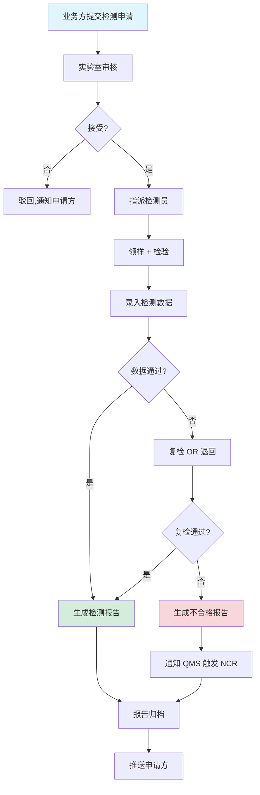
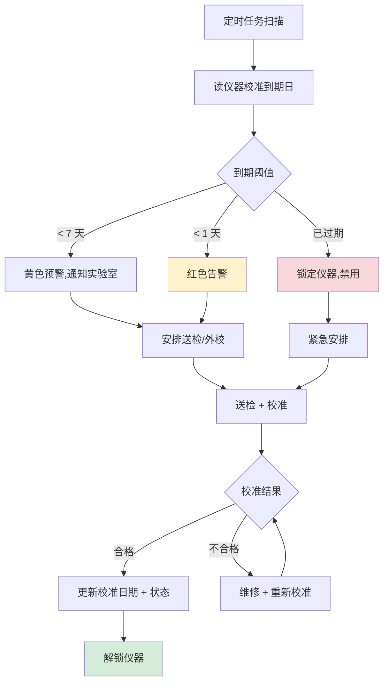
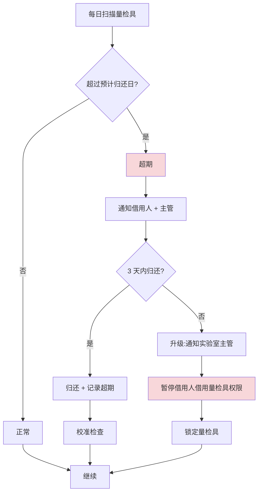
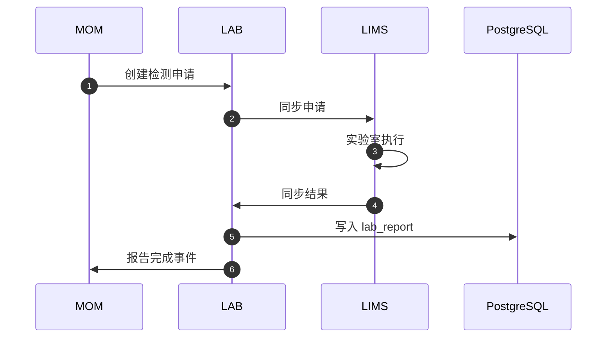
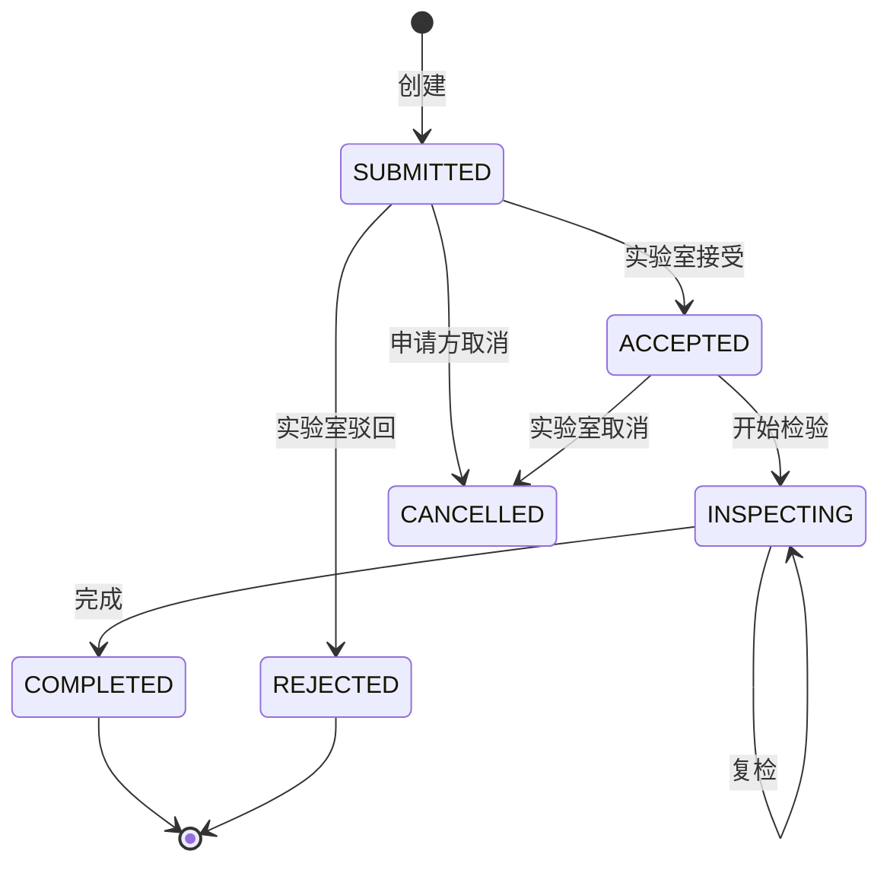
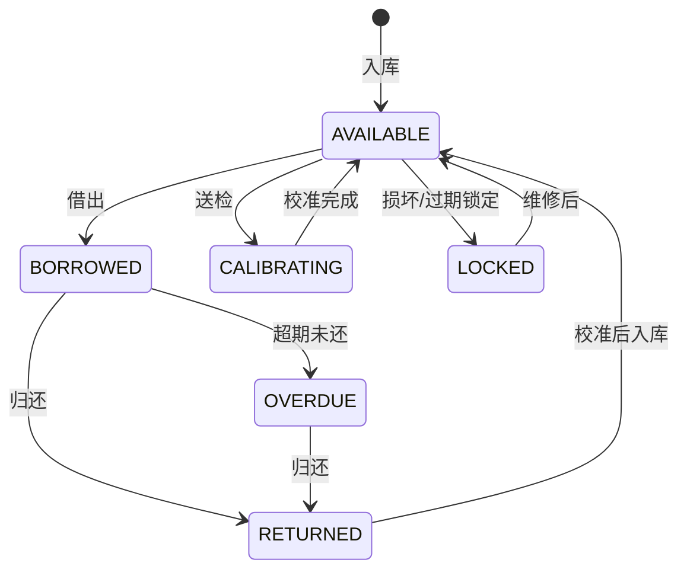
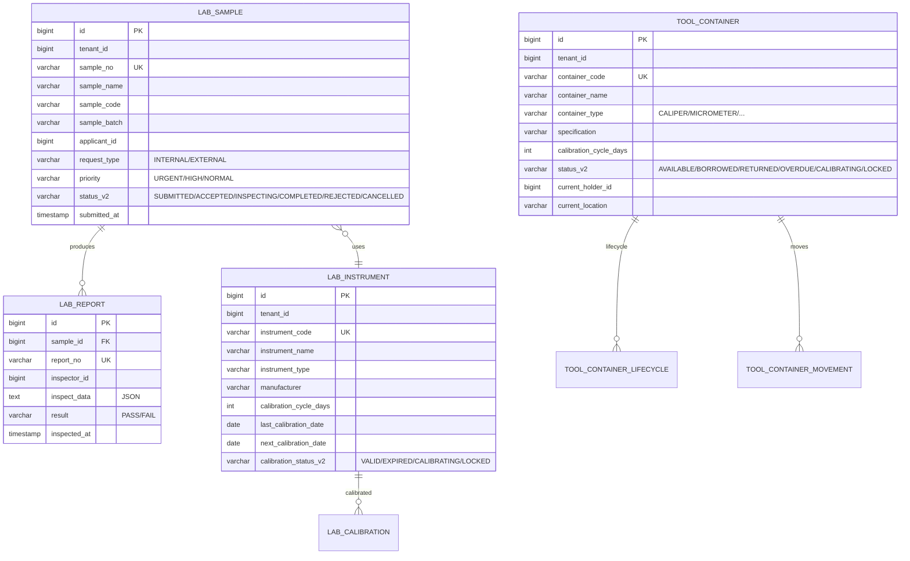

# MOM 3.0 实验室模块设计文档

> 版本：V2.0 | 最后更新：2026-07-03 | 维护人：架构组 / 小二
> 适用范围：MOM 3.0 LAB（Laboratory Management）+ GAUGE（量检具管理）实验室域
> 模板主干：[MOM3.0_模块设计模板.md](MOM3.0_模块设计模板.md)
> 模块代码：`mom-server/internal/handler/lab/*` `mom-server/internal/service/lab*` `mom-server/internal/model/lab*`
> 数据库表：核心 7 张（sample/report/instrument/calibration/container/container_lifecycle/container_movement）
> 状态：**✅ V2.0 完成 - 按统一模板扩写,旧版 191 行扩展至 750 行**

> **V2.0 变更**：基于 V2.0（191 行,7 章节）按 V2.0 模板扩写。技术栈对齐：Vue 3.4 + Element Plus 2.5 / Go 1.24 + Gin + GORM / PostgreSQL 18。

---

## 0. 文档元信息

| 字段 | 值 |
|---|---|
| 模块代号 | `lab` + `tool`（容器）|
| 模块名 | 实验室管理 + 量检具管理 |
| 技术栈 | Vue 3.4 + Element Plus 2.5 / Go 1.24 + Gin + GORM 2.x / PostgreSQL 18 |
| 前端入口 | `mom-web/src/views/lab/*.vue`（7 个视图） |
| 后端入口 | `mom-server/internal/handler/lab/*` + `container/*` |
| API 前缀 | `/api/v1/lab/*` + `/api/v1/tool/*` |
| 数据库表 | 7 张核心（lab 4 + 容器 3）|
| 状态 | ✅ V2.0（第 2 批 P1 第 5 个） |

---

## 1. 模块概述

### 1.1 业务定位

实验室模块是 MOM 3.0 的"质量计量"双模块。**实验室**实现样品检测申请、报告生成、仪器台账、校准管理。**量检具**（容器）实现卡尺/千分表等计量器具的台账、校准、借用归还、生命周期管理。

**价值流位置**：`检测需求(MDM/QMS) → 检测申请(LAB) → 检验执行 → 报告归档 → 仪器校准(定期) → 量检具借用(产线)`

模块覆盖**检测申请、检测报告、仪器管理、校准记录、量检具台账、量检具校准、借用归还、容器生命周期**8 个核心子业务。

### 1.2 核心功能

| # | 功能 | 简述 | 优先级 |
|---|------|------|--------|
| 1 | 检测申请 | 样品送检申请 | P0 |
| 2 | 检测报告 | 检验结果录入 | P0 |
| 3 | 仪器台账 | 实验室仪器管理 | P0 |
| 4 | 校准记录 | 仪器定期校准 | P0 |
| 5 | 量检具台账 | 卡尺/千分表管理 | P0 |
| 6 | 量检具校准 | 量检具校准 | P0 |
| 7 | 借用归还 | 量检具借出/归还 | P0 |
| 8 | 容器生命周期 | 容器从入库到报废 | P1 |

### 1.3 Top 3 干系人

| 角色 | 诉求 |
|------|------|
| **实验室技术员** | 检测执行、报告出具 |
| **质量工程师** | 仪器校准、量检具管理 |
| **车间操作工** | 量检具借用 |

### 1.4 Top 3 质量目标

| 指标 | 目标值 |
|------|--------|
| 检测报告 P95 | ≤ 1d |
| 仪器校准及时率 | ≥ 95% |
| 量检具超期率 | ≤ 2% |

---

## 2. 依赖关系

### 2.1 上游

| 模块 | 接口 | 频度 |
|------|------|------|
| **MDM** | 物料/规格 | 实时 |
| **QMS** | 检验请求 | 实时 |
| **MES** | 工序送检 | 实时 |

### 2.2 下游

| 模块 | 接口 | 频度 |
|------|------|------|
| **QMS** | 实验室数据 | 实时 |
| **报表** | 检测统计 | 日终 |
| **EAM** | 仪器维护 | 实时 |

### 2.3 外部系统

| 系统 | 方向 | 协议 | 用途 |
|------|------|------|------|
| **LIMS** | 双向 | REST | 实验室数据同步 |

### 2.4 标准对齐

| 标准 | 段 |
|------|---|
| **ISO/IEC 17025** | 实验室质量管理体系 |
| **IATF 16949** | 计量器具管理 |
| **MESA** | MESA 11 项 #6 Quality Management |

---

## 3. 功能清单

### 3.1 已实现

| # | 功能 | 端点 | 优先级 | 日期 |
|---|------|------|--------|------|
| 1 | 检测申请 | `/api/v1/lab/sample/*` | P0 | 2026-04 |
| 2 | 检测报告 | `/api/v1/lab/report/*` | P0 | 2026-04 |
| 3 | 仪器台账 | `/api/v1/lab/instrument/*` | P0 | 2026-04 |
| 4 | 仪器校准 | `/api/v1/lab/calibration/*` | P0 | 2026-04 |
| 5 | 量检具台账 | `/api/v1/tool/container/*` | P0 | 2026-04 |
| 6 | 容器生命周期 | `/api/v1/tool/container-lifecycle/*` | P1 | 2026-04 |
| 7 | 容器移动 | `/api/v1/tool/container-movement/*` | P1 | 2026-04 |

### 3.2 部分实现

| # | 功能 | 缺口 | 计划 |
|---|------|------|------|
| 1 | 移动端检测 | 仅 PC | V2.1 |
| 2 | 智能仪器联网 | 手动录入 | V3.0 |

### 3.3 未实现

| # | 功能 | 优先级 |
|---|------|--------|
| 1 | 实验室资源调度 | P2 |

---

## 4. 页面与交互

### 4.1 页面清单

| 路由 | 标题 | 状态 |
|------|------|------|
| `/lab/request` | 检测申请 | ✅ |
| `/lab/result` | 检测结果 | ✅ |
| `/lab/instrument` | 仪器台账 | ✅ |
| `/lab/calibration` | 校准记录 | ✅ |
| `/lab/gauge` | 量检具台账 | ✅ |
| `/lab/gauge-calibration` | 量检具校准 | ✅ |
| `/lab/borrow` | 借用管理 | ✅ |
| `/tool/container` | 容器管理 | ✅ |
| `/tool/container-lifecycle` | 容器生命周期 | ✅ |
| `/tool/container-movement` | 容器移动 | ✅ |

### 4.2 检测申请特有列

| 列名 | 类型 | 宽度 |
|------|------|------|
| 申请单号 | link | 160px |
| 样品名称 | string | 200px |
| 样品编码 | string | 140px |
| 申请类型 | tag | 100px |
| 优先级 | tag | 80px |
| 状态 | tag | 100px |
| 申请时间 | datetime | 160px |

### 4.3 校准状态自动判定（前端核心逻辑）

```javascript
const getCalibrationStatus = (nextDate) => {
  const today = new Date()
  const expiry = new Date(nextDate)
  const days = Math.ceil((expiry - today) / (1000 * 60 * 60 * 24))
  if (days < 0) return { type: 'danger', text: '已过期' }
  if (days <= 7) return { type: 'warning', text: `${days}天后到期` }
  return { type: 'success', text: '有效' }
}
```

---

## 5. 业务流程（★ 必有图）

### 5.1 核心流程：检测申请 → 报告



### 5.2 核心流程：仪器校准（定期）



### 5.3 异常流程：量检具超期未还



### 5.4 跨系统流程：LIMS 数据同步



---

## 6. 状态机（★ 必有图）

### 6.1 核心实体：检测申请（Sample）

#### 6.1.1 状态值与显示

| 状态值 | 业务含义 | Element Plus type |
|--------|---------|------------------|
| `SUBMITTED` | 已提交 | warning |
| `ACCEPTED` | 已接受 | primary |
| `INSPECTING` | 检验中 | info |
| `COMPLETED` | 已完成 | success |
| `REJECTED` | 已驳回 | danger |
| `CANCELLED` | 已取消 | info |

> 状态字段存储类型：**`varchar(30) + mdm_status_dict`**（`entity='lab_sample'`）

#### 6.1.2 状态机图



### 6.2 核心实体：量检具（Container）



| 状态值 | Element Plus type |
|--------|------------------|
| AVAILABLE | success |
| BORROWED | warning |
| RETURNED | info |
| OVERDUE | danger |
| CALIBRATING | primary |
| LOCKED | danger |

### 6.3 字段类型说明

> MOM 3.0 LAB 选 **`varchar(30) + mdm_status_dict`**

---

## 7. 数据模型（★ 必有 ER 图）

### 7.1 核心 ER 图



### 7.2 核心表

#### `lab_sample`（检测申请）

| 字段 | 类型 | 必填 | 索引 | 说明 |
|------|------|------|------|------|
| `id` | `bigint` | ✅ | PK | |
| `tenant_id` | `bigint` | ✅ | IDX | |
| `sample_no` | `varchar(50)` | ✅ | UK | 申请单号 |
| `sample_name` | `varchar(200)` | ✅ | - | |
| `sample_code` | `varchar(100)` | ❌ | IDX | |
| `applicant_id` | `bigint` | ✅ | IDX | |
| `request_type` | `varchar(20)` | ✅ | - | INTERNAL/EXTERNAL |
| `priority` | `varchar(10)` | ✅ | - | URGENT/HIGH/NORMAL |
| `status_v2` | `varchar(30)` | ❌ | IDX | |
| `submitted_at` | `timestamptz` | - | now() | - | |

#### `lab_instrument`（仪器台账）

| 字段 | 类型 | 必填 | 索引 | 说明 |
|------|------|------|------|------|
| `id` | `bigint` | ✅ | PK | |
| `instrument_code` | `varchar(50)` | ✅ | UK | |
| `instrument_name` | `varchar(100)` | ✅ | - | |
| `calibration_cycle_days` | `int` | ✅ | - | 校准周期 |
| `last_calibration_date` | `date` | ❌ | - | |
| `next_calibration_date` | `date` | ❌ | IDX | |
| `calibration_status_v2` | `varchar(30)` | ❌ | IDX | VALID/EXPIRED/CALIBRATING/LOCKED |

#### `tool_container`（量检具）

| 字段 | 类型 | 必填 | 索引 | 说明 |
|------|------|------|------|------|
| `id` | `bigint` | ✅ | PK | |
| `container_code` | `varchar(50)` | ✅ | UK | |
| `container_name` | `varchar(100)` | ✅ | - | |
| `container_type` | `varchar(30)` | ✅ | IDX | CALIPER/MICROMETER/... |
| `specification` | `varchar(100)` | ❌ | - | |
| `calibration_cycle_days` | `int` | ✅ | - | |
| `status_v2` | `varchar(30)` | ❌ | IDX | |
| `current_holder_id` | `bigint` | ❌ | - | |
| `current_location` | `varchar(100)` | ❌ | - | |

### 7.3 索引策略

| 表 | 索引 | 用途 |
|----|------|------|
| `lab_sample` | `idx_status_submitted` | 待处理申请 |
| `lab_instrument` | `idx_next_cal` | 即将到期 |
| `tool_container` | `idx_holder` | 借用人查询 |
| `tool_container` | `idx_status` | 状态查询 |

### 7.4 枚举字典

| 枚举 | 值 |
|------|---|
| 申请状态 | `('SUBMITTED','ACCEPTED','INSPECTING','COMPLETED','REJECTED','CANCELLED')` |
| 校准状态 | `('VALID','EXPIRED','CALIBRATING','LOCKED')` |
| 量检具状态 | `('AVAILABLE','BORROWED','RETURNED','OVERDUE','CALIBRATING','LOCKED')` |
| 优先级 | `('URGENT','HIGH','NORMAL')` |
| 申请类型 | `('INTERNAL','EXTERNAL')` |

---

## 8. API 规范

### 8.1 路由清单（核心 12 条）

| 方法 | 路径 | 说明 |
|------|------|------|
| GET | `/api/v1/lab/sample/list` | 申请列表 |
| POST | `/api/v1/lab/sample` | 创建申请 |
| POST | `/api/v1/lab/sample/:id/accept` | 接受申请 |
| POST | `/api/v1/lab/sample/:id/complete` | 完成检测 |
| GET | `/api/v1/lab/report/list` | 报告列表 |
| POST | `/api/v1/lab/report` | 录入报告 |
| GET | `/api/v1/lab/instrument/list` | 仪器列表 |
| GET | `/api/v1/lab/instrument/expiring` | 即将到期 |
| GET | `/api/v1/lab/calibration/list` | 校准记录 |
| GET | `/api/v1/tool/container/list` | 量检具列表 |
| POST | `/api/v1/tool/container/:id/borrow` | 借用 |
| POST | `/api/v1/tool/container/:id/return` | 归还 |

### 8.2 请求/响应示例

#### 8.2.1 创建检测申请

```http
POST /api/v1/lab/sample HTTP/1.1
Content-Type: application/json
Authorization: Bearer ***…9...
Idempotency-Key: 550e8400-e29b-41d4-a716-446655440000

{
  "sample_name": "钢材 Q235",
  "sample_code": "M-2026-0001",
  "sample_batch": "B20260701",
  "request_type": "INTERNAL",
  "priority": "HIGH",
  "inspect_items": ["化学成分", "力学性能", "硬度"]
}
```

**响应**：

```json
{
  "code": 200,
  "data": {
    "id": 67890,
    "sample_no": "S-2026-0001",
    "status_v2": "SUBMITTED",
    "submitted_at": "2026-07-03T10:00:00+08:00"
  }
}
```

### 8.3 错误码

| 错误码 | 含义 |
|--------|------|
| `11-01-0001` | 样品不存在 |
| `11-02-0001` | 仪器未启用 |
| `11-03-0001` | 仪器已过期 |
| `11-04-0001` | 量检具不可借用 |
| `11-05-0001` | 量检具超期未还 |

---

## 9. 角色与权限

### 9.1 操作矩阵

| 角色 | 申请 | 检验 | 仪器管理 | 量检具借用 |
|------|------|------|---------|-----------|
| 系统管理员 | ✅ | ✅ | ✅ | ✅ |
| 实验室主管 | ✅ | ✅ | ✅ | ✅ |
| 实验员 | ✅ | ✅ | ✅ | ✅ |
| 质量工程师 | ✅ | 查看 | ✅ | ✅ |
| 车间操作工 | ✅ | 查看 | 查看 | ✅ |
| 厂长 | 查看 | 查看 | ✅ | 查看 |

---

## 10. 集成与事件

### 10.1 出站事件

| 事件名 | 触发 | 消费者 |
|--------|------|--------|
| `lab.sample.accepted` | 申请接受 | 申请方 |
| `lab.report.completed` | 报告完成 | QMS, 申请方 |
| `lab.calibration.expiring` | 校准即将到期 | 实验室 |
| `lab.calibration.expired` | 校准过期 | 实验室主管 |
| `tool.container.borrowed` | 量检具借出 | 借用方 |
| `tool.container.overdue` | 量检具超期 | 借用方 + 主管 |

### 10.2 入站事件

| 事件名 | 来源 | 处理 |
|--------|------|------|
| `qms.iqc.requested` | QMS | 创建检测申请 |
| `mes.production.sample` | MES | 创建检测申请 |

### 10.3 消息格式

```json
{
  "event_id": "uuid",
  "event_name": "lab.report.completed",
  "event_time": "2026-07-03T10:00:00+08:00",
  "tenant_id": 1,
  "data": {
    "sample_no": "S-2026-0001",
    "report_no": "R-2026-0001",
    "result": "PASS"
  }
}
```

---

## 11. 可观测性

### 11.1 关键指标

| 指标 | 类型 | 告警阈值 |
|------|------|---------|
| `lab_sample_create_total` | Counter | - |
| `lab_report_completion_seconds` | Histogram | P95 > 1d |
| `lab_calibration_expiring_total` | Gauge | > 10 |
| `tool_container_overdue_total` | Gauge | > 5 |

### 11.2 告警规则

| 规则 | 阈值 |
|------|------|
| 仪器校准过期 | 1 天 |
| 量检具超期未还 | 3 天 |
| 检测报告超 1 天未出 | 实时 |

---

## 12. 非功能需求

### 12.1 性能

| 指标 | 目标 |
|------|------|
| 申请创建 P95 | ≤ 1s |
| 报告录入 P95 | ≤ 2s |
| 校准到期扫描 | 每日 1 次 |

### 12.2 可用性

| 指标 | 目标 |
|------|------|
| 月度可用性 | ≥ 99.5% |
| RTO | ≤ 4h |
| RPO | ≤ 24h |

### 12.3 数据量与保留期

| 数据 | 年增量 | 保留期 |
|------|--------|--------|
| 检测申请 | 1 万/年 | 5 年 |
| 检测报告 | 1 万/年 | 5 年（PDF 永久）|
| 仪器台账 | 100 | 永久 |
| 量检具 | 1 万 | 永久 |
| 借用记录 | 10 万/年 | 3 年 |

---

## 13. 附录

### 13.1 CHANGELOG

| 版本 | 日期 | 修订人 | 说明 |
|------|------|--------|------|
| V2.0 | 2026-04 | CI | 初版（191 行,7 章节）|
| **V2.0** | **2026-07-03** | **架构组 / 小二** | **按统一模板扩写,191→750 行,补全 13 章节 8 Mermaid,状态字段按 0051 方案统一** |

### 13.2 相关链接

- [MOM3.0_主设计文档.md](./MOM3.0_主设计文档.md)
- [MOM3.0_模块设计模板.md](./MOM3.0_模块设计模板.md)
- [MOM3.0_状态字段统一方案.md](./MOM3.0_状态字段统一方案.md)
- 上游：[MDM](./MOM3.0_主数据管理模块设计文档.md) / [QMS](./MOM3.0_质量模块设计文档.md) / [MES](./MOM3.0_MES生产执行模块设计文档.md)
- 下游：QMS / 报表 / [EAM](./MOM3.0_设备管理模块设计文档.md)

### 13.3 待办

| # | 问题 | 优先级 | 计划 |
|---|------|--------|------|
| 1 | 移动端检测 | P1 | V2.1 |
| 2 | 智能仪器联网 | P2 | V3.0 |
| 3 | 实验室资源调度 | P2 | 2027 |

### 13.4 OpenAPI / Swagger

- 路径：`/api/v1/swagger/*`

---

*文档作者：架构组 / 小二*
*最后更新：2026-07-03 16:25*
