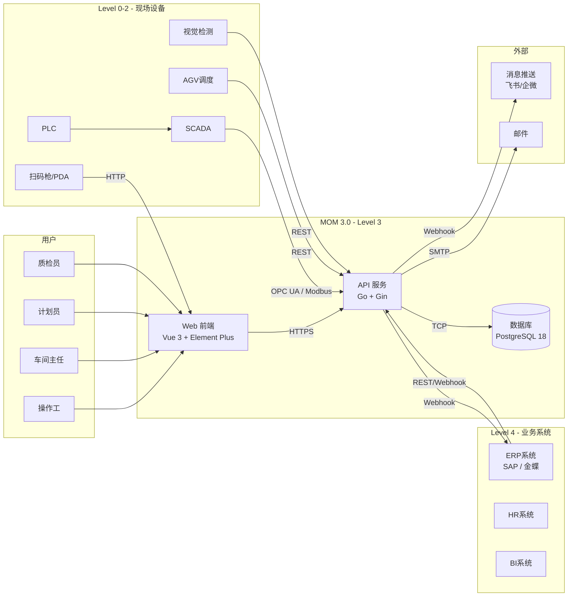
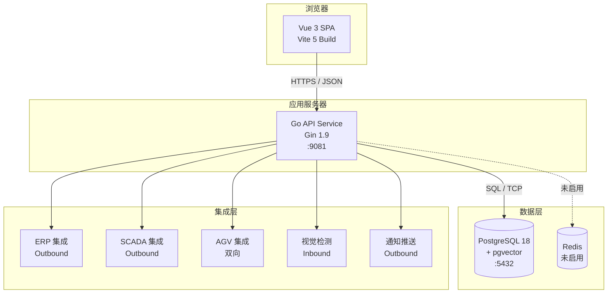
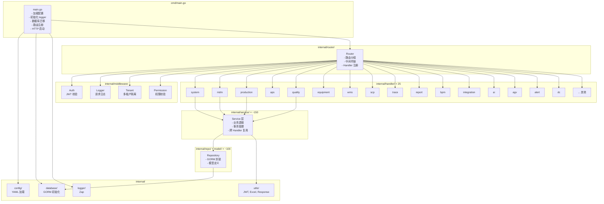
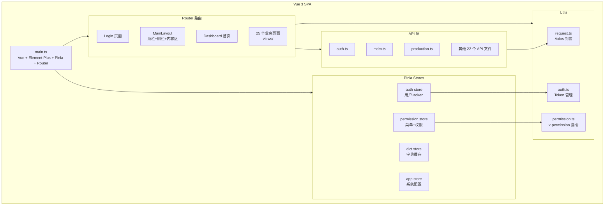
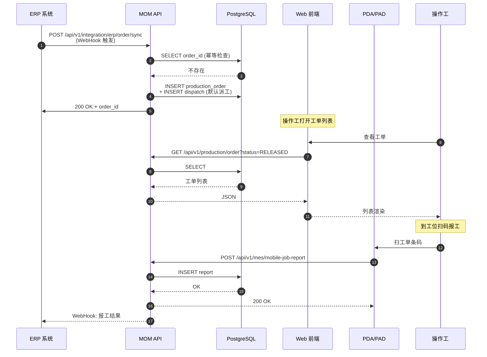
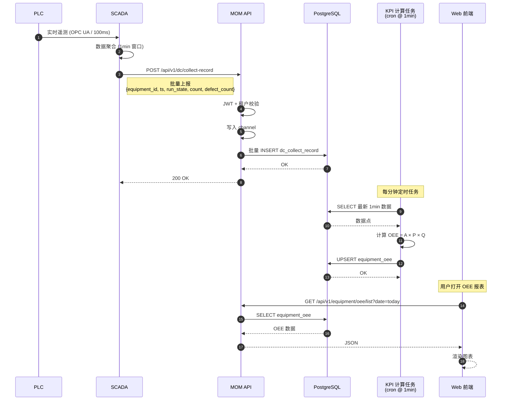
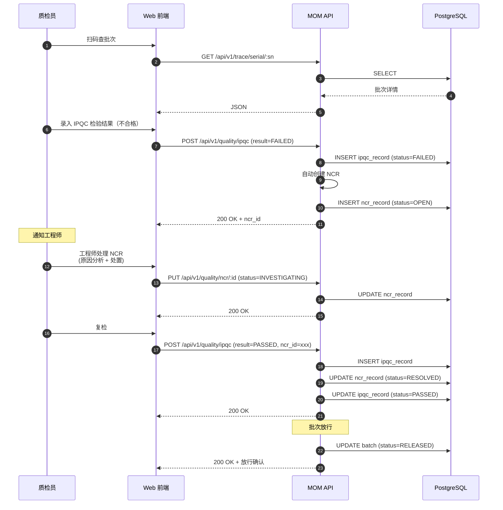
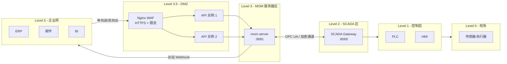
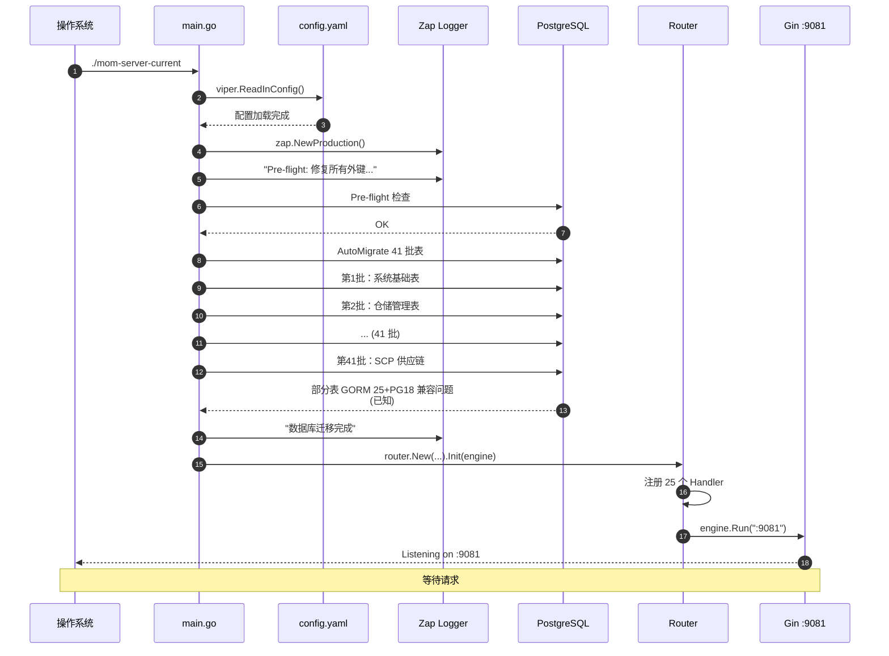

# MOM 3.0 技术架构文档

> 版本：V1.0 | 最后更新：2026-07-01 | 维护人：架构组
> 适用范围：MOM 3.0 全系统架构（前端、后端、数据库、集成、部署）
> 模板：Arc42 + C4 Model

---

## 1. 架构总览

### 1.1 一句话架构

> **Vue 3 + Vite 5** 单页应用 + **Go 1.24 + Gin** RESTful API + **PostgreSQL 18 + pgvector** 数据库；JWT 鉴权；25 个业务模块通过 GORM AutoMigrate 维护 schema；通过 OPC UA / ERP 接口模块与外部系统集成。

### 1.2 关键技术决策（Top 10）

| # | 决策 | 选型 | 理由 |
|---|------|------|------|
| 1 | 后端语言 | **Go 1.24** | 性能好、并发模型适合实时采集、部署简单（单一二进制） |
| 2 | 后端框架 | **Gin 1.9** | 性能优异、生态成熟、中间件丰富 |
| 3 | ORM | **GORM 1.25 + PostgreSQL Driver 1.5** | AutoMigrate 省心；支持复杂关联 |
| 4 | 数据库 | **PostgreSQL 18 + pgvector** | 支持向量检索（AI 聊天）、JSONB、全文检索、窗口函数 |
| 5 | 前端框架 | **Vue 3.4 + Composition API + TypeScript 5.3** | 中文社区成熟；TS 类型安全 |
| 6 | UI 库 | **Element Plus 2.5** | 桌面端组件齐全；适合中后台 |
| 7 | 状态管理 | **Pinia 2.1** | Vue 3 官方推荐；TS 友好 |
| 8 | 构建 | **Vite 5.0** | 开发体验好（ESM + HMR）；构建快 |
| 9 | 配置 | **Viper 1.18**（后端）/ 环境变量（前端）| 多环境支持；YAML 友好 |
| 10 | 日志 | **Zap 1.21**（后端）/ `console` + 拦截器（前端）| 高性能结构化日志 |

---

## 2. 系统上下文（C4 Level 1）

**MOM 3.0 在工厂 IT/OT 网络中的位置**：



**邻接系统清单**：

| 系统 | 方向 | 协议 | 频度 | 用途 |
|------|------|------|------|------|
| ERP（SAP/金蝶）| 双向 | REST / Webhook / IDOC | 实时 | 工单下发、报工回传、BOM/物料同步 |
| SCADA / PLC | 上行 | OPC UA / Modbus / Profinet | 100ms-1s | 设备数据采集、参数下发 |
| AGV 调度 | 双向 | REST | 实时 | 任务下发、状态回调 |
| 视觉检测 | 上行 | REST | 实时 | 检测结果接收、人工复核 |
| PDA / 扫码枪 | 上行 | HTTP / WebSocket | 实时 | 扫码报工 |
| 飞书 / 企微 | 下行 | Webhook | 实时 | 告警推送、审批通知 |
| 邮件 | 下行 | SMTP | 周期 | 日报、异常通知 |

---

## 3. 容器视图（C4 Level 2）

**MOM 3.0 内部的容器拆分**：



**容器清单**：

| 容器 | 技术 | 端口 | 说明 |
|------|------|------|------|
| **浏览器 SPA** | Vue 3.4 + Vite 5 | 80/443 | 静态资源 |
| **API 服务** | Go 1.24 + Gin 1.9 | 9081 | REST API + WebSocket（如有）|
| **数据库** | PostgreSQL 18 + pgvector | 5432 | 主存储 |
| **缓存** | Redis（**未启用**） | 6379 | 配置中已注释，无实际使用 |

---

## 4. 组件视图（C4 Level 3）

**API 服务内部组件**：



**后端目录结构**（事实）：

```
mom-server/
├── cmd/main.go                # 入口
├── internal/
│   ├── config/                # 配置（YAML）
│   ├── database/              # GORM 初始化 + 迁移
│   ├── middleware/            # JWT、日志、租户、权限
│   ├── handler/               # 25 个 HTTP Handler
│   ├── service/               # 业务逻辑层
│   ├── model/                 # GORM 模型（数据库表结构）
│   ├── router/                # 路由注册
│   ├── auth/                  # JWT 签发/校验
│   ├── utils/                 # 工具（Response, Excel, ID 生成）
│   └── ...
├── migrations/                # 手写 SQL（部分）
├── data/                      # 种子数据
├── uploads/                   # 文件上传
├── config.yaml                # 配置文件
└── go.mod                     # Go 模块
```

---

## 5. 前端组件视图



**前端目录结构**：

```
mom-web/src/
├── api/                    # 25 个 API 文件
├── views/                  # 25 个业务模块目录
├── components/             # 公共组件
├── composables/            # 组合式函数
├── stores/                 # Pinia stores
├── router/index.ts         # 路由
├── utils/
│   ├── request.ts          # Axios 封装
│   ├── permission.ts       # 权限指令
│   └── auth.ts             # Token 管理
├── types/                  # TypeScript 类型
├── styles/                 # 样式
├── App.vue
└── main.ts
```

---

## 6. 数据流（关键场景）

### 6.1 工单下发（ERP → MOM → 车间）



### 6.2 OEE 数据采集（PLC → SCADA → MOM → KPI）



### 6.3 批次质量放行（IPQC → NCR → 复检 → 放行）



---

## 7. 集成拓扑

### 7.1 集成模式

| 模式 | 用途 | 频度 | 错误处理 |
|------|------|------|---------|
| **REST API 同步** | ERP 物料/BOM/工单/报工 | 实时 / 准实时 | 重试 3 次 + 死信队列 |
| **Webhook 回调** | ERP 接收 MOM 状态变更 | 实时 | 接收方失败则丢入重试队列 |
| **OPC UA / Modbus** | SCADA 设备数据 | 100ms-1s | 自动重连 |
| **消息推送** | 飞书/企微告警 | 实时 | 失败降级到邮件 |
| **文件导入** | 主数据批量（物料、BOM、客户）| 人工触发 | 全有/全无事务 |
| **数据导出** | 报表（Excel/PDF）| 人工触发 | 同步生成 |

### 7.2 集成接口清单

| 模块 | 外部系统 | 接口 | 鉴权 |
|------|---------|------|------|
| `integration/erp_sync` | SAP / 金蝶 | `/api/v1/integration/erp/*` | OAuth 2.0 / API Key |
| `integration/idoc` | SAP IDOC | `/api/v1/integration/idoc/*` | mTLS |
| `integration/interface-config` | 通用 HTTP | 配置式 | API Key |
| `agv` | AGV 调度系统 | `/api/v1/agv/*` | API Key |
| `dc` | SCADA / PLC | `POST /api/v1/dc/collect-record` | API Key |
| `ai` | 视觉检测 / LLM | `/api/v1/ai/*` | API Key |
| `alert` | 飞书/企微 | Webhook 出站 | App Token |

---

## 8. 部署视图

### 8.1 部署拓扑

```mermaid
graph TB
    subgraph DMZ[DMZ 区]
        LB[Nginx 反向代理<br/>HTTPS 443]
    end

    subgraph AppZone[应用区]
        APP1[mom-server<br/>Go API :9081]
        APP2[mom-server<br/>Go API :9081<br/>(HA 双实例)]
    end

    subgraph DataZone[数据区]
        PG[(PostgreSQL 18<br/>+ pgvector :5432)]
        PG_BAK[(备份存储)]
    end

    subgraph OTZone[OT 区]
        SCADA[SCADA 网关<br/>:8000]
        PLC[PLC 网络<br/>:102/502]
    end

    User[用户浏览器] -->|HTTPS| LB
    LB -->|HTTP| APP1
    LB -->|HTTP| APP2
    APP1 -->|SQL| PG
    APP2 -->|SQL| PG
    PG -->|pg_dump| PG_BAK
    SCADA -->|OPC UA / Modbus| APP1
    SCADA -.-> PLC
```

### 8.2 环境清单

| 环境 | 用途 | 部署 |
|------|------|------|
| **dev** | 开发 | 本机 `docker compose` 或直接运行 |
| **test** | 单元测试 + 集成测试 | CI（GitHub Actions）|
| **uat** | 用户验收测试 | 内网服务器 |
| **prod** | 生产 | 客户机房或私有云 |

### 8.3 部署命令

**后端（开发）**：

```bash
cd /data/mom3.0/mom-server
# 配置
cat config.yaml  # 确认数据库连接
# 启动
./bin/mom-server-current   # 或 go run cmd/main.go
```

**前端（开发）**：

```bash
cd /data/mom3.0/mom-web
npm install      # 首次
npm run dev      # 开发（Vite 5）
npm run build    # 生产构建（输出 dist/）
```

**数据库初始化**（首次）：

```bash
# 启动 PostgreSQL
docker run -d --name pg-mom -p 5432:5432 \
  -e POSTGRES_USER=momadmin \
  -e POSTGRES_PASSWORD=mom123456 \
  -e POSTGRES_DB=mom3.0 \
  pgvector/pgvector:pg18

# 启动后端会自动 AutoMigrate 创建表
./bin/mom-server-current
```

---

## 9. 安全视图（Purdue Model + 零信任）

### 9.1 安全分区



### 9.2 安全控制

| 层面 | 控制项 | 实现 |
|------|--------|------|
| **网络** | IT/OT 隔离 | DMZ + 单向网关 |
| **网络** | HTTPS | Nginx TLS 终止 |
| **认证** | 用户登录 | JWT（Access 2h + Refresh 7d）|
| **认证** | 服务间 | mTLS / API Key |
| **授权** | 功能权限 | RBAC（角色 × 菜单权限码）|
| **授权** | 数据权限 | 多租户 `tenant_id` 隔离 |
| **审计** | 操作日志 | `sys_oper_log` 自动记录 |
| **审计** | 登录日志 | `sys_login_log` 自动记录 |
| **数据** | 密码加密 | bcrypt（cost=12）|
| **数据** | 传输加密 | TLS 1.2+ |
| **数据** | 备份 | 每日 `pg_dump` |

### 9.3 待加强项

- 🔴 字段级权限（ABAC）：尚未实现，目前 RBAC 只能到菜单/按钮
- 🟡 敏感数据加密（如银行账号、税号）：当前明文
- 🟡 防 SQL 注入：依赖 GORM 参数化查询，但手写 SQL 需 review
- 🟡 DDoS 防护：依赖 Nginx limit_req，缺少应用层防护

---

## 10. 运行时视图（启动流程）



**启动耗时**：本地环境约 5-10 秒（含 41 批表迁移）

---

## 11. 数据库视图

### 11.1 数据库服务器

| 项 | 值 |
|----|---|
| 版本 | PostgreSQL 18 |
| 扩展 | pgvector |
| 部署 | Docker 容器 `db19` |
| 默认 DB | `mom3.0` |
| 默认用户 | `momadmin` |

### 11.2 Schema 分布

| 业务域 | 表前缀 | 表数（估算）|
|--------|--------|-------------|
| 系统 | `sys_*` | ~20 |
| 主数据 | `mdm_*` | ~15 |
| 生产 | `production_*` | ~10 |
| 质量 | `quality_*` / `qms_*` / `lpa_*` | ~25 |
| 设备 | `equipment_*` / `eam_*` | ~15 |
| WMS | `wms_*` | ~20 |
| 供应链 | `scp_*` / `supplier_*` | ~15 |
| 追溯 | `trace_*` | ~5 |
| APS | `aps_*` | ~10 |
| 集成 | `integration_*` / `agv_*` | ~10 |
| 其他 | (其余) | ~30 |
| **合计** | | **~180** |

> 实际表数 186 张（来自 `information_schema.tables` 查询）

### 11.3 通用字段约定

每张业务表都包含：

| 字段 | 类型 | 说明 |
|------|------|------|
| `id` | bigint, PK, auto-increment | 主键 |
| `created_at` | timestamp | 创建时间 |
| `updated_at` | timestamp | 更新时间 |
| `deleted_at` | timestamp, nullable | 软删除 |
| `tenant_id` | bigint | 租户隔离 |

---

## 12. 性能与可用性目标（SLO）

### 12.1 性能指标

| 指标 | 目标 | 测量方法 |
|------|------|---------|
| **首屏渲染** | ≤ 1.5s | Lighthouse |
| **列表查询 P95** | ≤ 1s | Prometheus histogram |
| **详情查询 P95** | ≤ 0.5s | 同上 |
| **表单保存 P95** | ≤ 1.5s | 同上 |
| **工单下发到车间 P95** | ≤ 2s | 集成接口埋点 |
| **追溯查询 P95** | ≤ 2s | trace 模块 |

### 12.2 可用性

| 指标 | 目标 |
|------|------|
| **月度可用性** | ≥ 99.5%（业务时间 8:00-22:00）|
| **故障恢复 RTO** | ≤ 4 小时 |
| **数据恢复 RPO** | ≤ 24 小时（每日备份）|

---

## 13. 监控与可观测性

### 13.1 监控指标（建议补充）

| 类别 | 指标 |
|------|------|
| **HTTP** | 请求量、错误率、P50/P95/P99 延迟、状态码分布 |
| **数据库** | 连接数、慢查询、TPS、锁等待 |
| **业务** | 工单数、报工数、追溯查询次数、设备 OEE 均值 |
| **集成** | ERP 同步成功率、AGV 任务完成率、SCADA 数据采集频率 |
| **系统** | CPU、内存、磁盘、网络、Go runtime GC |

### 13.2 日志

- **结构化日志**：JSON 格式（Zap）
- **字段**：`timestamp` / `level` / `msg` / `request_id` / `user_id` / `tenant_id` / `latency_ms`
- **存储**：当前 stdout；建议生产对接 ELK/Loki

### 13.3 链路追踪

- **当前**：request_id 通过 HTTP Header 透传
- **建议**：引入 OpenTelemetry（Jaeger / Tempo）

---

## 14. ADR（架构决策记录）

### ADR-001: 选择 Go + Gin + GORM + PostgreSQL

**Context**：车间现场需要实时数据采集、并发高、单机部署；多数据库技术栈评估。

**Decision**：Go 1.24 + Gin 1.9 + GORM 1.25 + PostgreSQL 18。

**Status**：✅ Accepted（2026-04-21）

**Consequences**：
- ✅ 单二进制部署简单
- ✅ 并发模型适合实时采集
- ✅ PostgreSQL JSONB 灵活
- ⚠️ GORM 在 PG 18 上有兼容问题（`insufficient arguments`，已知）
- ⚠️ Go 生态对工业协议（OPC UA/Modbus）支持弱于 C#/Java

### ADR-002: 选择 Vue 3 + Element Plus + Pinia

**Context**：中后台系统，需要快速开发、组件丰富、TS 友好。

**Decision**：Vue 3.4 + Vite 5 + Element Plus 2.5 + Pinia 2.1 + TypeScript 5.3。

**Status**：✅ Accepted

**Consequences**：
- ✅ 中文社区成熟、招聘容易
- ✅ Vite 5 开发体验好
- ⚠️ Element Plus 风格偏中规中矩，定制空间有限

### ADR-003: 数据库迁移用 GORM AutoMigrate，禁用手写 SQL

**Context**：快速迭代期，schema 频繁变动。

**Decision**：以 GORM AutoMigrate 为主，手写 SQL 仅在 AutoMigrate 不能表达时使用（如复杂索引、视图、触发器）。

**Status**：🟡 Accepted with caveats

**Consequences**：
- ✅ 改 model 即改 schema，省心
- ⚠️ 生产环境禁用 AutoMigrate 失败退出（已实现 `env: production` 强制）
- ⚠️ 已有 5 个手写 SQL（`migrations/0046-0050`）需手动跑

### ADR-004: 暂不启用 Redis

**Context**：当前并发量不大，DB 直连可承受。

**Decision**：配置保留 Redis 但代码不启用，文档说明。

**Status**：✅ Accepted（2026-04）

**Consequences**：
- ✅ 减少运维依赖
- ⚠️ 后期大并发需引入缓存层

---

## 15. 未来架构演进

### 15.1 短期（3-6 个月）

- 引入 OpenTelemetry 链路追踪
- 数据库读写分离（主从）
- API 网关（Kong/Traefik）
- OpenAPI 3.1 自动生成

### 15.2 中期（6-12 个月）

- 多工厂架构（tenant → site → area → line → cell）
- 数字孪生 3D 可视化
- 高级排程引擎（集成 OR-Tools）
- 谱系图数据库（Neo4j）

### 15.3 长期（12 个月+）

- SaaS 多租户版本
- 边缘计算（车间边缘节点）
- 联邦学习（多工厂联合模型）

---

## 16. 关联文档

- [`MOM3.0_主设计文档.md`](./MOM3.0_主设计文档.md) — 系统总览
- [`MOM3.0_UI设计规范.md`](./MOM3.0_UI设计规范.md) — UI 规范
- [`DOCUMENTATION_GUIDE.md`](./DOCUMENTATION_GUIDE.md) — 文档维护规约
- [`MOM3.0_模块设计模板.md`](./MOM3.0_模块设计模板.md) — 模块文档统一模板（待建）
- [`research/mes-design-best-practices-2026-07-01.md`](./research/mes-design-best-practices-2026-07-01.md) — 行业最佳实践

---

## 17. 修订记录

| 版本 | 日期 | 修订人 | 说明 |
|------|------|--------|------|
| V1.0 | 2026-07-01 | 架构组 | 初版；建立 4 张 C4 图（C1 上下文、C2 容器、C3 组件）+ 3 张关键时序图（工单下发/OEE 采集/批次放行）+ 部署图 + 安全分区图 + ADR；覆盖 Arc42 11 个章节 |

---

**下一步**：阶段 2 将基于本文档建立统一模块设计模板 + 12 个核心状态机 + 7 张 ER 图 + OpenAPI 3.1 文档生成。详见 [`MOM3.0-design-doc-improvement-2026-07-01.md`](./research/MOM3.0-design-doc-improvement-2026-07-01.md)。