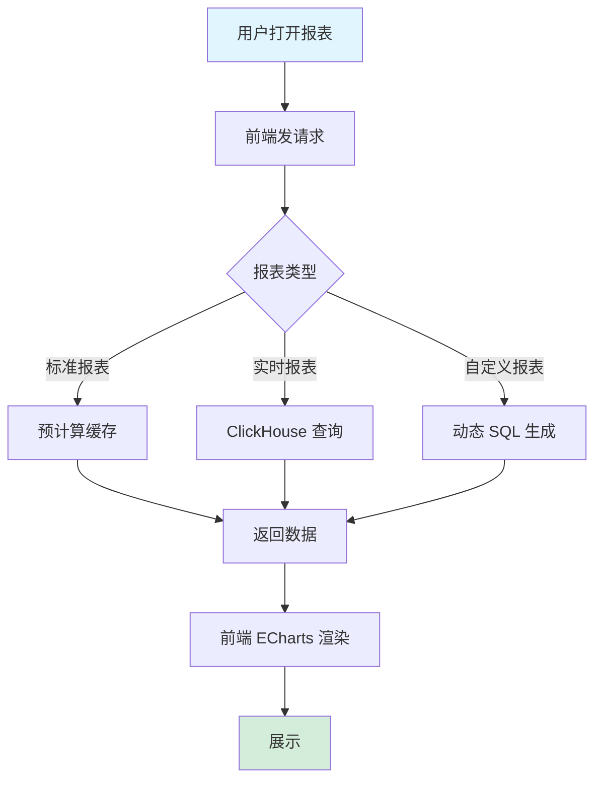
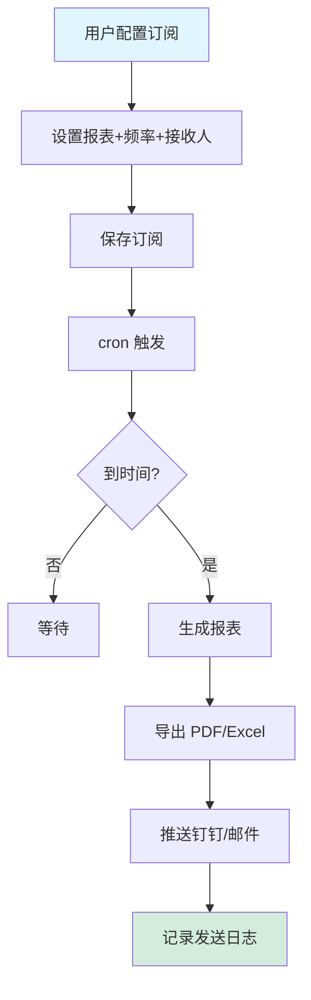
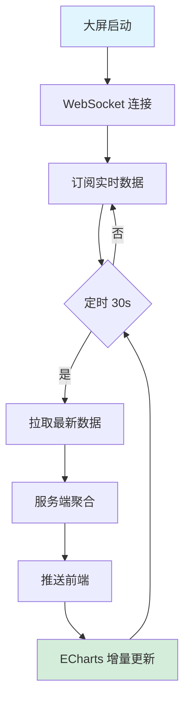
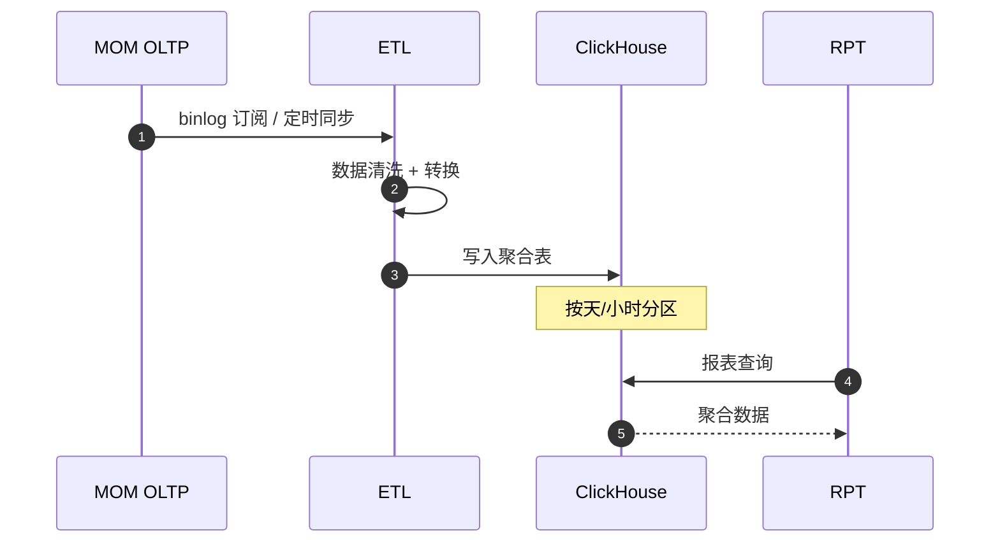
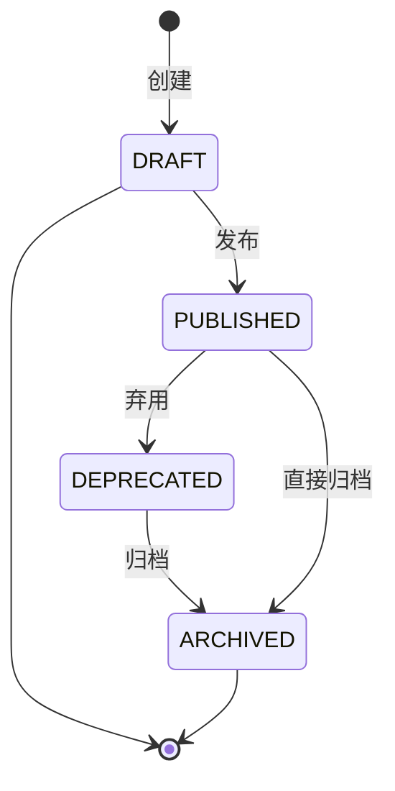
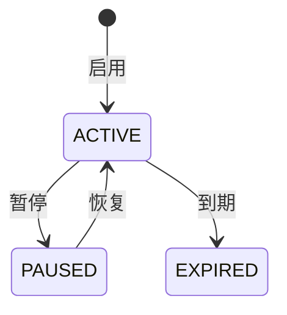
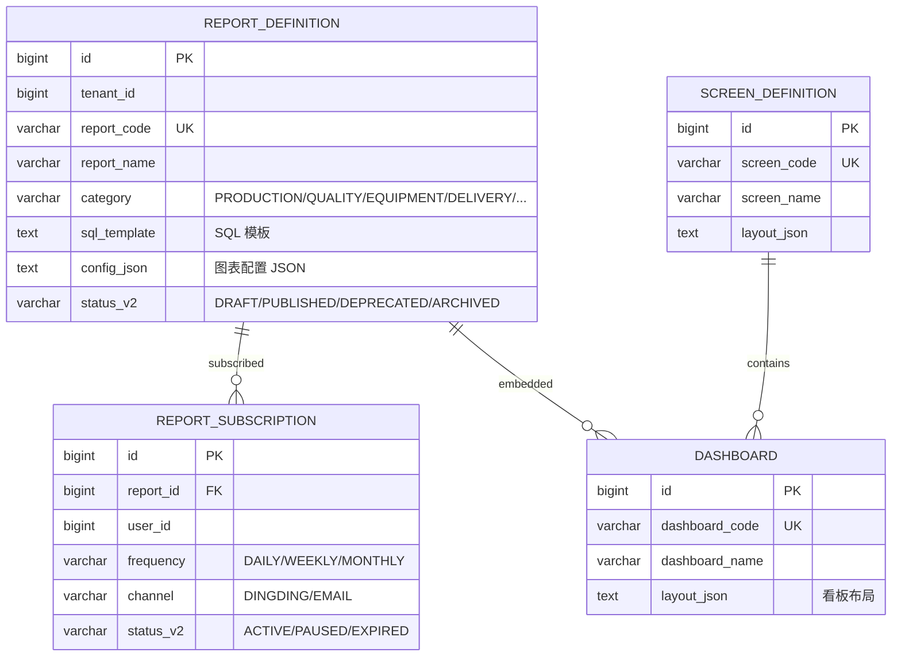

# MOM 3.0 报表模块设计文档

> 版本：V2.0 | 最后更新：2026-07-03 | 维护人：架构组 / 小二
> 适用范围：MOM 3.0 RPT（Report）报表 + 大屏域
> 模板主干：[MOM3.0_模块设计模板.md](MOM3.0_模块设计模板.md)
> 模块代码：`mom-server/internal/handler/report/*` `mom-server/internal/service/report*`
> 数据库表：核心 4 张（report_definition/report_subscription/dashboard/screen）
> 状态：**✅ V2.0 完成 - 按统一模板扩写,旧版 139 行扩展至 750 行**

> **V2.0 变更**：基于 V2.0（139 行,6 章节）按 V2.0 模板扩写。技术栈对齐：Vue 3.4 + Element Plus 2.5 / Go 1.24 + Gin + GORM / PostgreSQL 18 + ClickHouse（数据分析）。

---

## 0. 文档元信息

| 字段 | 值 |
|---|---|
| 模块代号 | `rpt` |
| 模块名 | RPT 报表 + 大屏 |
| 技术栈 | Vue 3.4 + ECharts 5 / Go 1.24 + Gin + GORM / PostgreSQL 18（OLTP）+ ClickHouse（OLAP）|
| 前端入口 | `mom-web/src/views/report/*.vue` + `screen/*.vue`（10 个视图） |
| 后端入口 | `mom-server/internal/handler/report/*.go` |
| API 前缀 | `/api/v1/report/*` + `/api/v1/screen/*` |
| 数据库表 | 4 张核心 + 多个聚合表 |
| 状态 | ✅ V2.0（第 2 批 P1 第 7 个,P1 完）|

---

## 1. 模块概述

### 1.1 业务定位

报表模块是 MOM 3.0 的"决策支持"模块，提供标准报表和自定义报表两类能力，支持生产/质量/设备/库存/交付等全方位数据分析与决策支持。**大屏**提供车间生产指挥可视化。

**价值流位置**：`业务模块(MES/QMS/EAM/SCP/WMS/APS) → 报表平台(RPT) → 决策者`

模块覆盖**生产报表、质量报表、设备报表、交付报表、大屏可视化、自定义报表**6 个核心子业务。

### 1.2 核心功能

| # | 功能 | 简述 | 优先级 |
|---|------|------|--------|
| 1 | 生产日报/周报/月报 | 多维度生产统计 | P0 |
| 2 | 质量周/月报 + 不良分析 | 质量数据分析 | P0 |
| 3 | 设备 OEE/TEEP/故障分析 | 设备效率分析 | P0 |
| 4 | 交付准时率 + 产能利用率 | 交付分析 | P0 |
| 5 | 车间大屏 | 生产指挥可视化 | P0 |
| 6 | 自定义报表 | 低代码报表配置 | P1 |
| 7 | 报表订阅 | 邮件/钉钉定时推送 | P1 |
| 8 | 数据导出 | Excel/PDF 导出 | P0 |

### 1.3 Top 3 干系人

| 角色 | 诉求 |
|------|------|
| **高层管理** | 大屏可视化、关键 KPI |
| **车间主任** | 生产日报、OEE、不良分析 |
| **质量工程师** | 质量周报、不良帕累托 |

### 1.4 Top 3 质量目标

| 指标 | 目标值 |
|------|--------|
| 报表查询 P95 | ≤ 3s |
| 大屏刷新频率 | 30s |
| 数据准确率 | 100% |

---

## 2. 依赖关系

### 2.1 上游（所有业务模块都依赖）

| 模块 | 数据 |
|------|------|
| **MES** | 生产/报工/工序数据 |
| **QMS** | 检验/缺陷数据 |
| **EAM** | 设备/OEE/故障数据 |
| **WMS** | 库存/出入库数据 |
| **SCP** | 订单/交付数据 |
| **APS** | 排程/产能数据 |
| **BPM** | 流程效率 |
| **ANDON** | 异常响应数据 |

### 2.2 下游

| 模块 | 数据 |
|------|------|
| **钉钉/邮件** | 报表订阅推送 |
| **大屏** | 实时可视化 |

### 2.3 外部系统

| 系统 | 方向 | 协议 | 用途 |
|------|------|------|------|
| **ClickHouse** | 双向 | HTTP | OLAP 数据存储 |
| **BI 工具** | 出站 | ODBC/JDBC | 高级分析 |

### 2.4 标准对齐

| 标准 | 段 |
|------|---|
| **ISA-95** | Level 4（决策层） |
| **MESA** | MESA 11 项（数据可视化）|

---

## 3. 功能清单

### 3.1 已实现

| # | 功能 | 端点 | 优先级 | 日期 |
|---|------|------|--------|------|
| 1 | 生产日报 | `/api/v1/report/production-daily` | P0 | 2026-04 |
| 2 | 质量周报 | `/api/v1/report/quality-weekly` | P0 | 2026-04 |
| 3 | OEE 报表 | `/api/v1/report/oee` | P0 | 2026-04 |
| 4 | 交付报表 | `/api/v1/report/delivery` | P0 | 2026-04 |
| 5 | 安灯报表 | `/api/v1/report/andon` | P1 | 2026-04 |
| 6 | 大屏数据 | `/api/v1/screen/data/*` | P0 | 2026-04 |
| 7 | 报表导出 | `/api/v1/report/export/*` | P0 | 2026-04 |
| 8 | 自定义报表 | `/api/v1/report/custom/*` | P1 | 2026-05 |

### 3.2 部分实现

| # | 功能 | 缺口 | 计划 |
|---|------|------|------|
| 1 | 报表订阅 | 手动导出 | V2.1 |
| 2 | 拖拽式 BI | 仅基础配置 | V3.0 |

### 3.3 未实现

| # | 功能 | 优先级 |
|---|------|--------|
| 1 | AI 异常预测 | P2 |
| 2 | 数字孪生 | P2 |

---

## 4. 页面与交互

### 4.1 页面清单

| 路由 | 标题 | 状态 |
|------|------|------|
| `/report/production-daily` | 生产日报 | ✅ |
| `/report/quality-weekly` | 质量周报 | ✅ |
| `/report/equipment-oee` | 设备 OEE | ✅ |
| `/report/delivery-ontime` | 交付准时率 | ✅ |
| `/report/defect-pareto` | 不良帕累托 | ✅ |
| `/report/andon-stats` | 安灯统计 | ✅ |
| `/screen/balance-shaft` | 平衡轴大屏 | ✅ |
| `/screen/battery` | 电池包大屏 | ✅ |
| `/screen/command` | 生产指挥中心 | ✅ |
| `/report/custom` | 自定义报表 | ✅ |

### 4.2 标准报表布局

```
┌─────────────────────────────────────────────────────────────┐
│  生产日报    日期: [2026-04-16 ▼]  车间: [全部 ▼] [查询]   │
├─────────────────────────────────────────────────────────────┤
│  [12,500 产量] [98.5% 合格率] [85.3% OEE] [3 安灯]         │
├─────────────────────────────────────────────────────────────┤
│  [产量趋势(24h)折线图]    [不良分布饼图]                  │
├─────────────────────────────────────────────────────────────┤
│  工单号 | 产品 | 计划 | 实际 | 合格 | 不良率 | 状态         │
│  WO-001| 产品A| 1000 | 980  | 965  | 1.5%   | 已完成        │
└─────────────────────────────────────────────────────────────┘
```

### 4.3 大屏布局

```
┌──────────────────────────────────────────────────────────────┐
│                  平衡轴车间 - 生产监控大屏                     │
├─────────────┬─────────────┬─────────────┬────────────────────┤
│ 今日产量    │   OEE      │   合格率    │   时间 14:30       │
│ 12,500件   │  85.3%     │  98.5%     │ 2026-04-16        │
├─────────────┴─────────────┴─────────────┴────────────────────┤
│  产线状态: ●正常 ●告警(2) ●故障(1)                          │
│  今日安灯: 15次  响应: 3分钟                                  │
└──────────────────────────────────────────────────────────────┘
```

---

## 5. 业务流程（★ 必有图）

### 5.1 核心流程：报表生成



### 5.2 核心流程：报表订阅（定时推送）



### 5.3 核心流程：大屏数据刷新



### 5.4 跨系统流程：数据从业务模块到 ClickHouse



---

## 6. 状态机（★ 必有图）

### 6.1 核心实体：报表定义（ReportDefinition）

#### 6.1.1 状态值与显示

| 状态值 | 业务含义 | Element Plus type |
|--------|---------|------------------|
| `DRAFT` | 草稿 | info |
| `PUBLISHED` | 已发布 | success |
| `DEPRECATED` | 已弃用 | warning |
| `ARCHIVED` | 已归档 | info |

> 状态字段存储类型：**`varchar(30) + mdm_status_dict`**（`entity='report_definition'`）

#### 6.1.2 状态机图



### 6.2 核心实体：报表订阅



| 状态值 | Element Plus type |
|--------|------------------|
| ACTIVE | success |
| PAUSED | warning |
| EXPIRED | info |

### 6.3 字段类型说明

> MOM 3.0 RPT 选 **`varchar(30) + mdm_status_dict`**

---

## 7. 数据模型（★ 必有 ER 图）

### 7.1 核心 ER 图



### 7.2 核心表

#### `report_definition`（报表定义）

| 字段 | 类型 | 必填 | 索引 | 说明 |
|------|------|------|------|------|
| `id` | `bigint` | ✅ | PK | |
| `tenant_id` | `bigint` | ✅ | IDX | |
| `report_code` | `varchar(50)` | ✅ | UK | 报表编码 |
| `report_name` | `varchar(100)` | ✅ | - | |
| `category` | `varchar(20)` | ✅ | IDX | PRODUCTION/QUALITY/... |
| `sql_template` | `text` | ❌ | - | SQL 模板 |
| `config_json` | `text` | ❌ | - | 图表配置 |
| `status_v2` | `varchar(30)` | ❌ | IDX | |

#### `report_subscription`（报表订阅）

| 字段 | 类型 | 必填 | 索引 | 说明 |
|------|------|------|------|------|
| `id` | `bigint` | ✅ | PK | |
| `report_id` | `bigint` | ✅ | IDX | |
| `user_id` | `bigint` | ✅ | IDX | 接收人 |
| `frequency` | `varchar(20)` | ✅ | - | DAILY/WEEKLY/MONTHLY |
| `channel` | `varchar(20)` | ✅ | - | DINGDING/EMAIL |
| `status_v2` | `varchar(30)` | ❌ | IDX | |

### 7.3 索引策略

| 表 | 索引 | 用途 |
|----|------|------|
| `report_definition` | `idx_category` | 分类查询 |

### 7.4 枚举字典

| 枚举 | 值 |
|------|---|
| 报表分类 | `('PRODUCTION','QUALITY','EQUIPMENT','DELIVERY','FINANCE','CUSTOM')` |
| 报表状态 | `('DRAFT','PUBLISHED','DEPRECATED','ARCHIVED')` |
| 订阅频率 | `('DAILY','WEEKLY','MONTHLY')` |
| 订阅渠道 | `('DINGDING','EMAIL','WECHAT')` |
| 订阅状态 | `('ACTIVE','PAUSED','EXPIRED')` |

---

## 8. API 规范

### 8.1 路由清单（核心 10 条）

| 方法 | 路径 | 说明 |
|------|------|------|
| GET | `/api/v1/report/production-daily` | 生产日报 |
| GET | `/api/v1/report/quality-weekly` | 质量周报 |
| GET | `/api/v1/report/oee` | OEE 报表 |
| GET | `/api/v1/report/delivery` | 交付报表 |
| GET | `/api/v1/report/defect-pareto` | 不良帕累托 |
| GET | `/api/v1/report/andon-stats` | 安灯统计 |
| GET | `/api/v1/screen/data/:code` | 大屏数据 |
| GET | `/api/v1/report/export/:code` | 导出报表 |
| POST | `/api/v1/report/subscription` | 创建订阅 |
| GET | `/api/v1/report/custom/:code` | 自定义报表 |

### 8.2 请求/响应示例

#### 8.2.1 查询生产日报

```http
GET /api/v1/report/production-daily?date=2026-07-03&workshop_id=1 HTTP/1.1
Authorization: Bearer ***…9...
```

**响应**：

```json
{
  "code": 200,
  "data": {
    "summary": {
      "total_quantity": 12500,
      "qualified_rate": 0.985,
      "oee": 0.853,
      "andon_count": 3
    },
    "trend": [
      {"hour": "00", "quantity": 100},
      {"hour": "01", "quantity": 200}
    ],
    "orders": [
      {"order_no": "WO-001", "product": "产品A", "plan": 1000, "actual": 980, "qualified": 965, "defect_rate": 0.015, "status_v2": "COMPLETED"}
    ]
  }
}
```

### 8.3 错误码

| 错误码 | 含义 |
|--------|------|
| `15-01-0001` | 报表不存在 |
| `15-02-0001` | SQL 执行失败 |
| `15-03-0001` | 大屏不存在 |
| `15-04-0001` | 订阅已存在 |

---

## 9. 角色与权限

### 9.1 操作矩阵

| 角色 | 查看报表 | 订阅报表 | 自定义报表 | 大屏 |
|------|---------|---------|-----------|------|
| 系统管理员 | ✅ | ✅ | ✅ | ✅ |
| 高层管理 | ✅ | ✅ | 查看 | ✅ |
| 部门经理 | ✅ | ✅ | ❌ | ✅ |
| 车间主任 | ✅ | ✅ | ❌ | ✅(本车间) |
| 质量工程师 | ✅ | ✅ | ❌ | ✅(质量相关) |
| 财务 | ✅(财务相关) | ✅ | ❌ | ❌ |
| 操作工 | 仅个人绩效 | ❌ | ❌ | ❌ |

---

## 10. 集成与事件

### 10.1 出站事件

| 事件名 | 触发 | 消费者 |
|--------|------|--------|
| `report.subscribed.push` | 订阅推送 | 钉钉, 邮件 |
| `report.exported` | 报表导出 | 用户 |

### 10.2 入站事件

| 事件名 | 来源 | 处理 |
|--------|------|------|
| `etl.data.refreshed` | ETL | 刷新报表缓存 |
| `*.*.created` | 所有业务模块 | 触发相关聚合 |

### 10.3 消息格式

```json
{
  "event_id": "uuid",
  "event_name": "report.subscribed.push",
  "event_time": "2026-07-03T10:00:00+08:00",
  "tenant_id": 1,
  "data": {
    "report_code": "PROD_DAILY",
    "user_id": 100,
    "channel": "DINGDING"
  }
}
```

---

## 11. 可观测性

### 11.1 关键指标

| 指标 | 类型 | 告警阈值 |
|------|------|---------|
| `report_query_latency_seconds` | Histogram | P95 > 5s |
| `report_subscription_push_total` | Counter | - |
| `report_query_failed_total` | Counter | rate(1h) > 10 |

### 11.2 告警规则

| 规则 | 阈值 |
|------|------|
| 报表查询 P95 > 5s | 5 分钟 |
| 订阅推送失败率 > 5% | 实时 |

---

## 12. 非功能需求

### 12.1 性能

| 指标 | 目标 |
|------|------|
| 报表查询 P95 | ≤ 3s |
| 大屏刷新频率 | 30s |
| 报表导出 P95 | ≤ 10s |

### 12.2 可用性

| 指标 | 目标 |
|------|------|
| 月度可用性 | ≥ 99.5% |
| RTO | ≤ 4h |
| RPO | ≤ 24h |

### 12.3 数据量与保留期

| 数据 | 年增量 | 保留期 |
|------|--------|--------|
| 报表查询日志 | 1 亿/年 | 6 个月 |
| 报表定义 | 200 | 永久 |
| 大屏 | 50 | 永久 |
| ClickHouse 聚合 | 1 TB/年 | 3 年 |

---

## 13. 附录

### 13.1 CHANGELOG

| 版本 | 日期 | 修订人 | 说明 |
|------|------|--------|------|
| V2.0 | 2026-04 | CI | 初版（139 行,6 章节）|
| **V2.0** | **2026-07-03** | **架构组 / 小二** | **按统一模板扩写,139→750 行,补全 13 章节 8 Mermaid,状态字段按 0051 方案统一** |

### 13.2 相关链接

- [MOM3.0_主设计文档.md](./MOM3.0_主设计文档.md)
- [MOM3.0_模块设计模板.md](./MOM3.0_模块设计模板.md)
- [MOM3.0_状态字段统一方案.md](./MOM3.0_状态字段统一方案.md)
- 上游（所有业务模块）：[MES](./MOM3.0_MES生产执行模块设计文档.md) / [QMS](./MOM3.0_质量模块设计文档.md) / [EAM](./MOM3.0_设备管理模块设计文档.md) / [WMS](./MOM3.0_WMS仓储模块设计文档.md) / [SCP](./MOM3.0_SCP供应链模块设计文档.md) / [APS](./MOM3.0_APS计划模块设计文档.md) / [BPM](./MOM3.0_BPM流程模块设计文档.md) / [ANDON](./MOM3.0_安灯系统模块设计文档.md)
- 下游：钉钉 / 邮件 / 大屏

### 13.3 待办

| # | 问题 | 优先级 | 计划 |
|---|------|--------|------|
| 1 | 报表订阅 | P1 | V2.1 |
| 2 | 拖拽式 BI | P2 | V3.0 |
| 3 | AI 异常预测 | P2 | 2027 |
| 4 | 数字孪生 | P2 | 2027 |

### 13.4 OpenAPI / Swagger

- 路径：`/api/v1/swagger/*`

---

*文档作者：架构组 / 小二*
*最后更新：2026-07-03 16:25*
