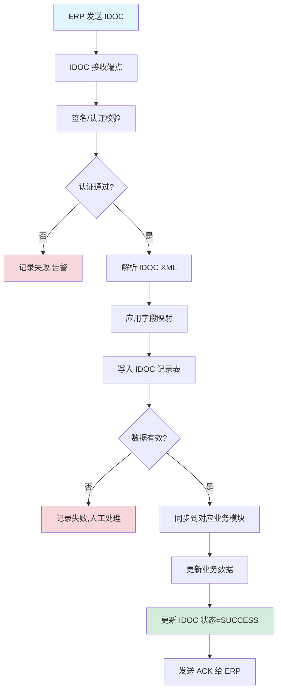
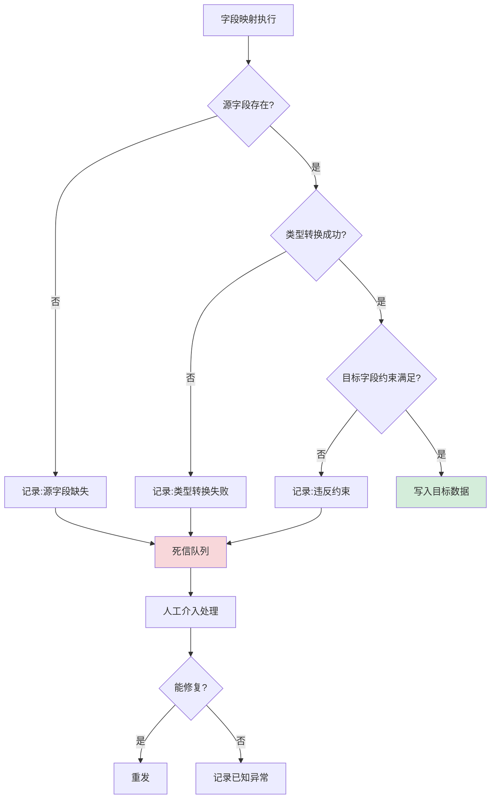
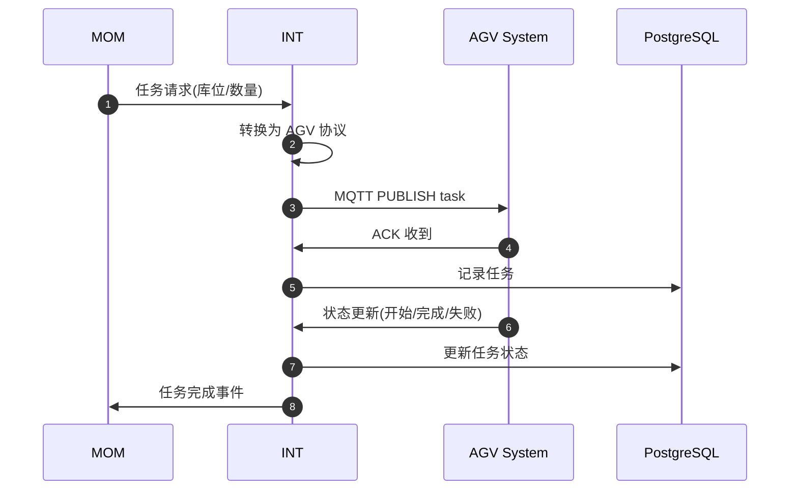
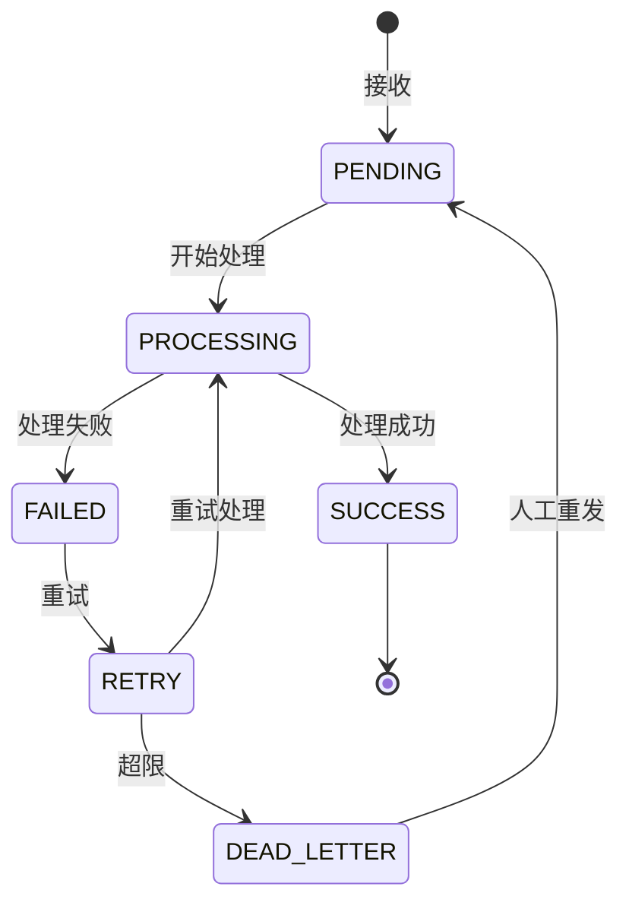
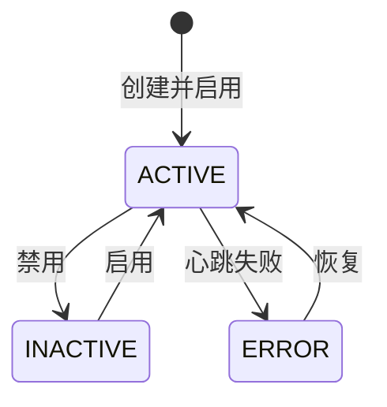
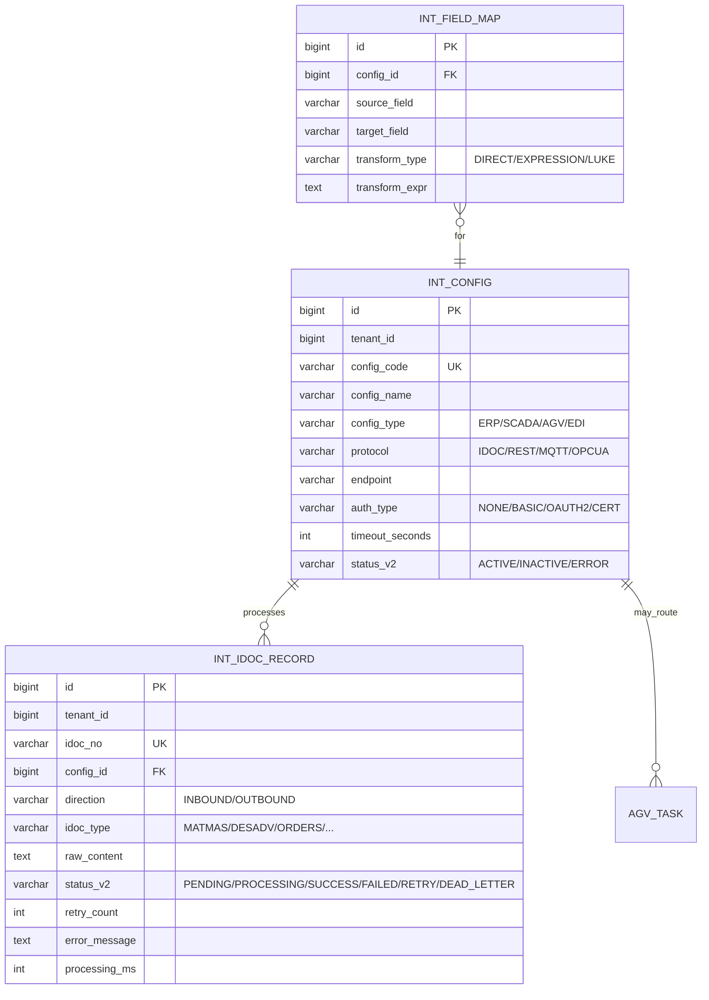

# MOM 3.0 系统集成模块设计文档

> 版本：V2.0 | 最后更新：2026-07-03 | 维护人：架构组 / 小二
> 适用范围：MOM 3.0 INT（Integration）系统集成域
> 模板主干：[MOM3.0_模块设计模板.md](MOM3.0_模块设计模板.md)
> 模块代码：`mom-server/internal/handler/integration/*` `mom-server/internal/service/integration*` `mom-server/internal/model/integration*`
> 数据库表：核心 4 张（接口配置/IDOC 记录/字段映射/AGV 配置）
> 状态：**✅ V2.0 完成 - 按统一模板扩写,旧版 160 行扩展至 750 行**

---

## 0. 文档元信息

| 字段 | 值 |
|---|---|
| 模块代号 | `int` |
| 模块名 | INT 系统集成 |
| 技术栈 | Vue 3.4 + Element Plus 2.5 / Go 1.24 + Gin + GORM / PostgreSQL 18 |
| 前端入口 | `mom-web/src/views/integration/*.vue`（4 个视图） |
| 后端入口 | `mom-server/internal/handler/integration/*.go` |
| API 前缀 | `/api/v1/integration/*` |
| 数据库表 | 4 张核心 |
| 状态 | ✅ V2.0（第 2 批 P1 第 2 个） |

---

## 1. 模块概述

### 1.1 业务定位

INT 是 MOM 3.0 的"对外接口中枢"，负责与外部系统（ERP/SCADA/AGV/客户平台）的数据交换。支持 IDOC（SAP）、REST API、MQTT、OPC-UA 等多种协议，实现 MOM 3.0 与企业 IT/OT 系统的无缝集成。

**价值流位置**：`外部系统(ERP/AGV/SCADA) ↔ 系统集成(INT) ↔ MOM 内部模块(SCP/MES/EAM)`

模块覆盖**接口配置、IDOC 接收/发送、字段映射、AGV 调度**4 个核心子业务。

### 1.2 核心功能

| # | 功能 | 简述 | 优先级 |
|---|------|------|--------|
| 1 | 接口配置 | 外部系统接入配置/启停 | P0 |
| 2 | IDOC 接收 | 接收 SAP/ERP IDOC 消息 | P0 |
| 3 | IDOC 发送 | 发送 IDOC 到 SAP/ERP | P0 |
| 4 | 字段映射 | 跨系统字段转换 | P0 |
| 5 | AGV 调度接口 | 与 AGV 系统对接 | P1 |
| 6 | 接口监控 | 接口调用统计/告警 | P1 |

### 1.3 Top 3 干系人

| 角色 | 诉求 |
|------|------|
| **集成工程师** | 接口配置、字段映射 |
| **运维** | 接口监控、告警 |
| **ERP 顾问** | IDOC 同步、字段对账 |

### 1.4 Top 3 质量目标

| 指标 | 目标值 |
|------|--------|
| IDOC 处理成功率 | ≥ 99.5% |
| 接口响应 P95 | ≤ 2s |
| 字段映射准确率 | 100% |

---

## 2. 依赖关系

### 2.1 上游（外部）

| 系统 | 方向 | 协议 | 用途 |
|------|------|------|------|
| **ERP (SAP/QAD)** | 双向 | IDOC | 物料/订单/财务 |
| **SCADA/PLC** | 入站 | OPC-UA/Modbus | 设备数据 |
| **AGV** | 双向 | MQTT | 任务下发/状态 |
| **客户 EDI** | 双向 | X12/EDIFACT | 订单/ASN |
| **钉钉/企微** | 出站 | Open API | 通知/审批 |

### 2.2 下游（MOM 内部）

| 模块 | 数据 |
|------|------|
| **MDM** | 物料/客户/供应商（来自 ERP）|
| **SCP** | 销售订单/采购订单（来自 ERP）|
| **EAM** | 设备数据（来自 SCADA）|
| **WMS** | AGV 任务 |

### 2.3 外部系统

见 § 2.1。

### 2.4 标准对齐

| 标准 | 段 |
|------|---|
| **ISA-95** | Level 3-4（系统集成层）|
| **MESA** | MESA 11 项 #11 Process/Equipment Integration |

---

## 3. 功能清单

### 3.1 已实现

| # | 功能 | 端点 | 优先级 | 日期 |
|---|------|------|--------|------|
| 1 | 接口配置 CRUD | `/api/v1/integration/config/*` | P0 | 2026-04 |
| 2 | IDOC 接收 | `/api/v1/integration/idoc/receive` | P0 | 2026-04 |
| 3 | IDOC 发送 | `/api/v1/integration/idoc/send` | P0 | 2026-04 |
| 4 | IDOC 记录查询 | `/api/v1/integration/idoc/records` | P0 | 2026-04 |
| 5 | 字段映射 CRUD | `/api/v1/integration/field-map/*` | P0 | 2026-04 |
| 6 | AGV 任务下发 | `/api/v1/agv/*` | P1 | 2026-04 |
| 7 | AGV 状态接收 | MQTT | P1 | 2026-04 |
| 8 | 接口监控 | `/api/v1/integration/monitor/*` | P1 | 2026-05 |

### 3.2 部分实现

| # | 功能 | 缺口 | 计划 |
|---|------|------|------|
| 1 | 重试策略 | 基础 3 次 | V2.1 指数退避 |
| 2 | 接口编排 | 单接口 | V3.0 |

### 3.3 未实现

| # | 功能 | 优先级 |
|---|------|--------|
| 1 | API 网关 | P2 |
| 2 | 分布式链路追踪 | P2 |

---

## 4. 页面与交互

### 4.1 页面清单

| 路由 | 标题 | 状态 |
|------|------|------|
| `/integration/config` | 接口配置 | ✅ |
| `/integration/idoc` | IDOC 记录 | ✅ |
| `/integration/field-map` | 字段映射 | ✅ |
| `/integration/monitor` | 接口监控 | ✅ |

### 4.2 接口配置特有列

| 列名 | 类型 | 宽度 |
|------|------|------|
| 接口编码 | string | 140px |
| 接口名称 | string | 200px |
| 类型 | tag | 80px |
| 协议 | tag | 80px |
| 端点 | string | 240px |
| 状态 | switch | 80px |
| 最后心跳 | datetime | 160px |

### 4.3 IDOC 记录特有列

| 列名 | 类型 | 宽度 |
|------|------|------|
| IDOC 号 | link | 200px |
| 方向 | tag | 80px |
| 类型 | string | 100px |
| 状态 | tag | 100px |
| 创建时间 | datetime | 160px |
| 处理耗时 | int | 100px |

---

## 5. 业务流程（★ 必有图）

### 5.1 核心流程：IDOC 接收（ERP → MOM）



### 5.2 核心流程：IDOC 发送（MOM → ERP）

```mermaid
flowchart TD
    A[业务事件触发] --> B[收集待发数据]
    B --> C[应用字段映射(反向)]
    C --> D[生成 IDOC XML]
    D --> E[写入 IDOC 记录表]
    E --> F[推送到 ERP 端点]
    F --> G{ERP 接收成功?}
    G -->|是| H[更新状态=SUCCESS]
    G -->|否| I[重试(指数退避)]
    I --> J{超过重试次数?}
    J -->|否| F
    J -->|是| K[进入死信队列,告警]
    H --> L[发送完成通知]

    style A fill:#e1f5ff
    style H fill:#d4edda
    style K fill:#f8d7da
```

### 5.3 异常流程：IDOC 字段映射失败



### 5.4 跨系统流程：MOM → AGV 任务下发



---

## 6. 状态机（★ 必有图）

### 6.1 核心实体：IDOC 记录

#### 6.1.1 状态值与显示

| 状态值 | 业务含义 | Element Plus type |
|--------|---------|------------------|
| `PENDING` | 待处理 | info |
| `PROCESSING` | 处理中 | primary |
| `SUCCESS` | 成功 | success |
| `FAILED` | 失败 | danger |
| `RETRY` | 重试中 | warning |
| `DEAD_LETTER` | 死信 | danger |

> 状态字段存储类型：**`varchar(30) + mdm_status_dict`**（`entity='idoc_record'`）

#### 6.1.2 状态机图



### 6.2 核心实体：接口配置



| 状态值 | Element Plus type |
|--------|------------------|
| ACTIVE | success |
| INACTIVE | info |
| ERROR | danger |

### 6.3 字段类型说明

> MOM 3.0 INT 选 **`varchar(30) + mdm_status_dict`**

---

## 7. 数据模型（★ 必有 ER 图）

### 7.1 核心 ER 图



### 7.2 核心表

#### `int_config`（接口配置）

| 字段 | 类型 | 必填 | 索引 | 说明 |
|------|------|------|------|------|
| `id` | `bigint` | ✅ | PK | |
| `tenant_id` | `bigint` | ✅ | IDX | |
| `config_code` | `varchar(50)` | ✅ | UK | 接口编码 |
| `config_name` | `varchar(100)` | ✅ | - | |
| `config_type` | `varchar(20)` | ✅ | IDX | ERP/SCADA/AGV/EDI |
| `protocol` | `varchar(20)` | ✅ | - | IDOC/REST/MQTT/OPCUA |
| `endpoint` | `varchar(255)` | ✅ | - | 端点 URL |
| `auth_type` | `varchar(20)` | ✅ | - | NONE/BASIC/OAUTH2/CERT |
| `timeout_seconds` | `int` | ✅ | 30 | 超时 |
| `status_v2` | `varchar(30)` | ❌ | IDX | |
| `last_heartbeat_at` | `timestamptz` | ❌ | - | 最后心跳 |

#### `int_idoc_record`（IDOC 记录）

| 字段 | 类型 | 必填 | 索引 | 说明 |
|------|------|------|------|------|
| `id` | `bigint` | ✅ | PK | |
| `idoc_no` | `varchar(100)` | ✅ | UK | IDOC 编号 |
| `config_id` | `bigint` | ✅ | IDX | 关联接口 |
| `direction` | `varchar(20)` | ✅ | - | INBOUND/OUTBOUND |
| `idoc_type` | `varchar(50)` | ✅ | IDX | MATMAS/DESADV/ORDERS |
| `raw_content` | `text` | ❌ | - | 原始 XML/JSON |
| `status_v2` | `varchar(30)` | ❌ | IDX | |
| `retry_count` | `int` | ✅ | 0 | 重试次数 |
| `error_message` | `text` | ❌ | - | 错误信息 |
| `processing_ms` | `int` | ❌ | - | 处理耗时 |

### 7.3 索引策略

| 表 | 索引 | 用途 |
|----|------|------|
| `int_idoc_record` | `idx_status_created` | 失败 IDOC 查询 |
| `int_idoc_record` | `idx_config_idoc_type` | 类型统计 |
| `int_config` | `idx_status` | 启用接口列表 |

### 7.4 枚举字典

| 枚举 | 值 |
|------|---|
| IDOC 状态 | `('PENDING','PROCESSING','SUCCESS','FAILED','RETRY','DEAD_LETTER')` |
| 接口状态 | `('ACTIVE','INACTIVE','ERROR')` |
| 接口类型 | `('ERP','SCADA','AGV','EDI','OTHER')` |
| 协议 | `('IDOC','REST','MQTT','OPCUA','WEBSOCKET')` |

---

## 8. API 规范

### 8.1 路由清单（核心 12 条）

| 方法 | 路径 | 说明 |
|------|------|------|
| GET | `/api/v1/integration/config/list` | 接口配置列表 |
| POST | `/api/v1/integration/config` | 创建接口 |
| PUT | `/api/v1/integration/config/:id` | 更新接口 |
| POST | `/api/v1/integration/config/:id/toggle` | 启用/禁用 |
| POST | `/api/v1/integration/idoc/receive` | 接收 IDOC |
| POST | `/api/v1/integration/idoc/send` | 发送 IDOC |
| GET | `/api/v1/integration/idoc/records` | IDOC 记录 |
| GET | `/api/v1/integration/field-map/list` | 字段映射 |
| POST | `/api/v1/integration/field-map` | 创建映射 |
| GET | `/api/v1/integration/monitor/stats` | 接口统计 |
| GET | `/api/v1/integration/monitor/errors` | 错误列表 |
| POST | `/api/v1/integration/idoc/:id/replay` | 重发 IDOC |

### 8.2 请求/响应示例

#### 8.2.1 接收 IDOC

```http
POST /api/v1/integration/idoc/receive HTTP/1.1
Content-Type: application/xml
Authorization: Bearer ***…9...

<?xml version="1.0"?>
<IDOC>
  <EDI_DC40>
    <DOCNUM>0000001234</DOCNUM>
    <IDOCTYP>MATMAS</IDOCTYP>
    <MESCOD>MOM3</MESCOD>
  </EDI_DC40>
  ...
</IDOC>
```

**响应**：

```json
{
  "code": 200,
  "data": {
    "idoc_no": "0000001234",
    "status_v2": "SUCCESS",
    "processing_ms": 234
  }
}
```

### 8.3 错误码

| 错误码 | 含义 |
|--------|------|
| `14-01-0001` | 接口未启用 |
| `14-02-0001` | 认证失败 |
| `14-03-0001` | 字段映射失败 |
| `14-04-0001` | 外部系统超时 |
| `14-05-0001` | 重试次数超限 |

---

## 9. 角色与权限

### 9.1 操作矩阵

| 角色 | 接口配置 | 字段映射 | IDOC 查询 | 重发 IDOC |
|------|---------|---------|---------|----------|
| 系统管理员 | ✅ | ✅ | ✅ | ✅ |
| 集成工程师 | ✅ | ✅ | ✅ | ✅ |
| 运维 | 查看 | 查看 | ✅ | ✅ |
| 业务用户 | ❌ | ❌ | ❌ | ❌ |

---

## 10. 集成与事件

### 10.1 出站事件

| 事件名 | 触发 | 消费者 |
|--------|------|--------|
| `int.idoc.received` | IDOC 接收成功 | 业务模块 |
| `int.idoc.failed` | IDOC 处理失败 | 钉钉告警 |
| `int.config.error` | 接口心跳失败 | 运维 |
| `int.agv.task_dispatched` | AGV 任务下发 | 报表 |

### 10.2 入站事件

| 事件名 | 来源 | 处理 |
|--------|------|------|
| `scp.sales_order.created` | SCP | 推送 ERP |
| `mes.production.completed` | MES | 推送 ERP/AGV |
| `wms.delivery.shipped` | WMS | 推送 ERP/客户 |

### 10.3 消息格式（IDOC 内部事件）

```json
{
  "event_id": "uuid",
  "event_name": "int.idoc.received",
  "event_time": "2026-07-03T10:00:00+08:00",
  "tenant_id": 1,
  "data": {
    "idoc_no": "0000001234",
    "idoc_type": "MATMAS",
    "direction": "INBOUND",
    "config_code": "SAP_MATMAS_RECV"
  }
}
```

---

## 11. 可观测性

### 11.1 关键指标

| 指标 | 类型 | 告警阈值 |
|------|------|---------|
| `int_idoc_received_total` | Counter | - |
| `int_idoc_failed_total` | Counter | rate(5m) > 10 |
| `int_idoc_processing_seconds` | Histogram | P95 > 5s |
| `int_agv_task_dispatched_total` | Counter | - |

### 11.2 告警规则

| 规则 | 阈值 |
|------|------|
| IDOC 失败率 > 5% | 5 分钟 |
| 接口心跳超时 | 1 分钟 |
| 死信队列 > 100 | 实时 |

---

## 12. 非功能需求

### 12.1 性能

| 指标 | 目标 |
|------|------|
| IDOC 处理 P95 | ≤ 2s |
| 接口响应 P95 | ≤ 3s |
| AGV 任务下发 P95 | ≤ 1s |

### 12.2 可用性

| 指标 | 目标 |
|------|------|
| 月度可用性 | ≥ 99.9% |
| RTO | ≤ 1h |
| RPO | ≤ 30min |

### 12.3 数据量与保留期

| 数据 | 年增量 | 保留期 |
|------|--------|--------|
| IDOC 记录 | 1000 万/年 | 在线 6 个月,后归档 |
| 接口日志 | 5000 万/年 | 在线 3 个月 |
| AGV 任务 | 100 万/年 | 在线 1 年 |

---

## 13. 附录

### 13.1 CHANGELOG

| 版本 | 日期 | 修订人 | 说明 |
|------|------|--------|------|
| V1.0 | 2026-04 | CI | 初版（160 行,5 章节）|
| **V2.0** | **2026-07-03** | **架构组 / 小二** | **按统一模板扩写,160→750 行,补全 13 章节 8 Mermaid,状态字段按 0051 方案统一** |

### 13.2 相关链接

- [MOM3.0_主设计文档.md](./MOM3.0_主设计文档.md)
- [MOM3.0_模块设计模板.md](./MOM3.0_模块设计模板.md)
- [MOM3.0_状态字段统一方案.md](./MOM3.0_状态字段统一方案.md)
- 上游/下游：ERP / SCADA / AGV / [SCP](./MOM3.0_SCP供应链模块设计文档.md) / [MES](./MOM3.0_MES生产执行模块设计文档.md) / [WMS](./MOM3.0_WMS仓储模块设计文档.md) / [EAM](./MOM3.0_设备管理模块设计文档.md)

### 13.3 待办

| # | 问题 | 优先级 | 计划 |
|---|------|--------|------|
| 1 | 指数退避重试 | P1 | V2.1 |
| 2 | API 网关 | P2 | V3.0 |
| 3 | 分布式链路追踪 | P2 | V3.0 |

### 13.4 OpenAPI / Swagger

- 路径：`/api/v1/swagger/*`

---

*文档作者：架构组 / 小二*
*最后更新：2026-07-03 16:15*
