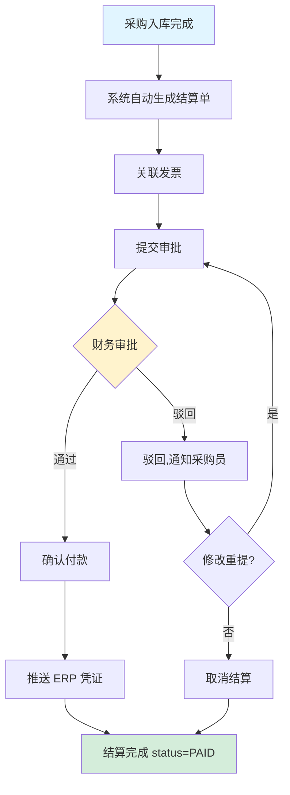
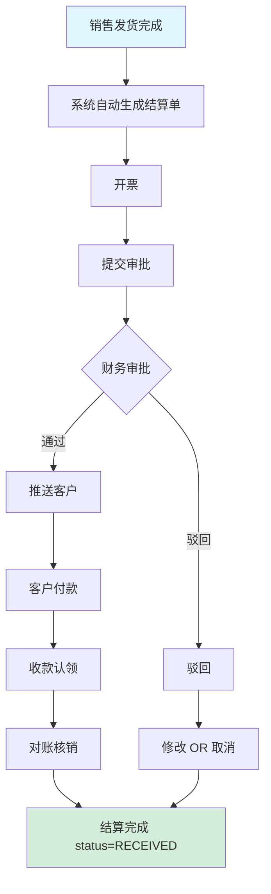
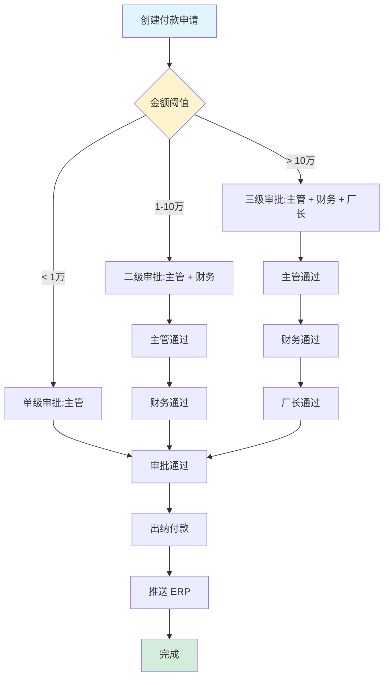
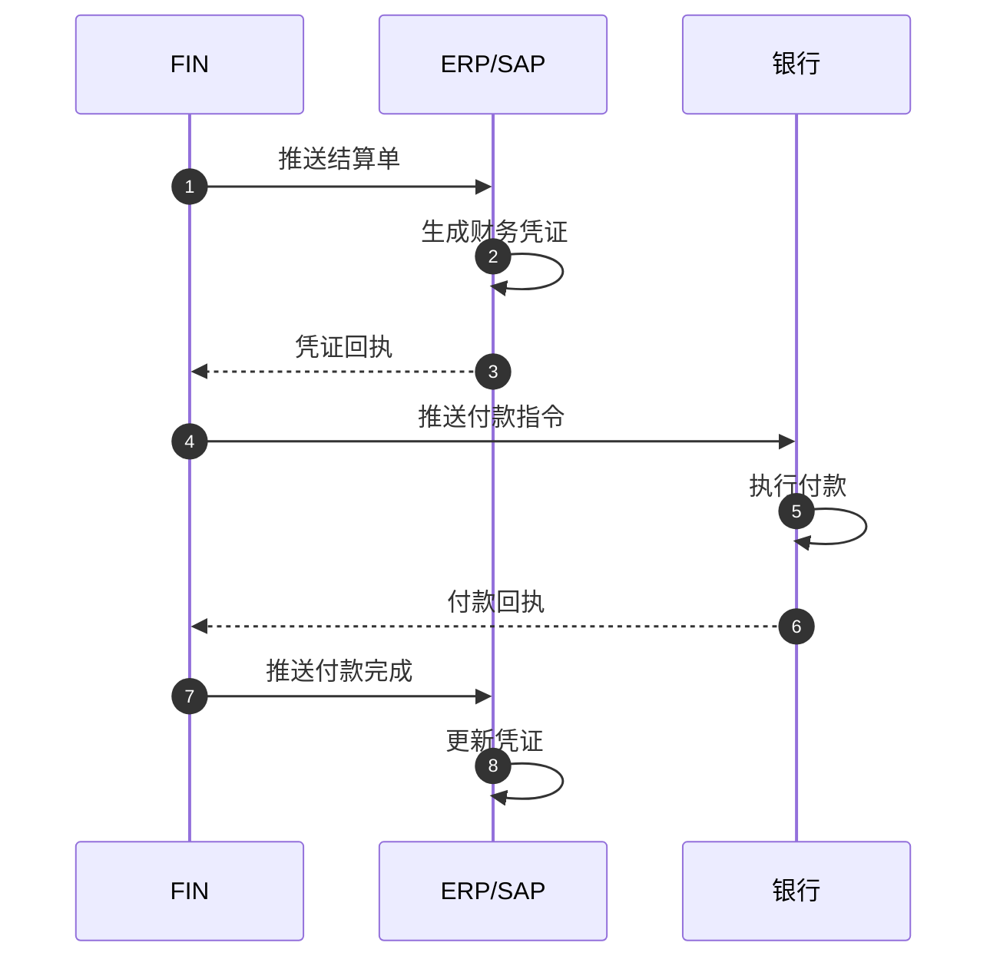
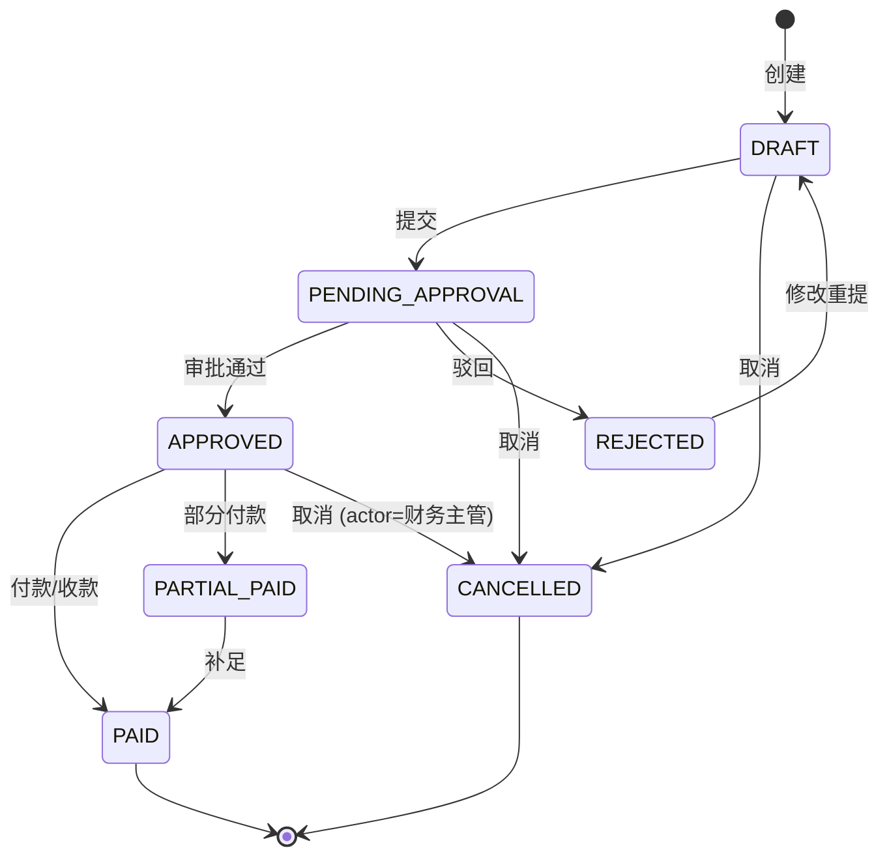
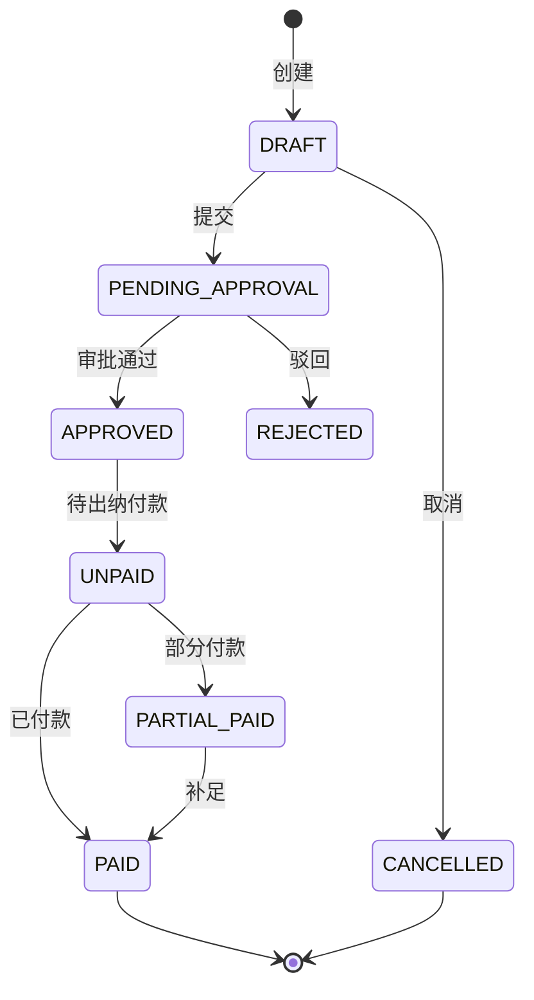
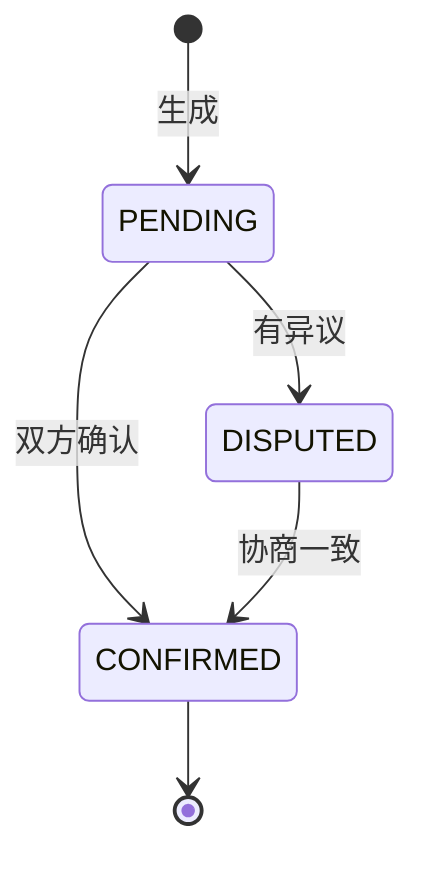
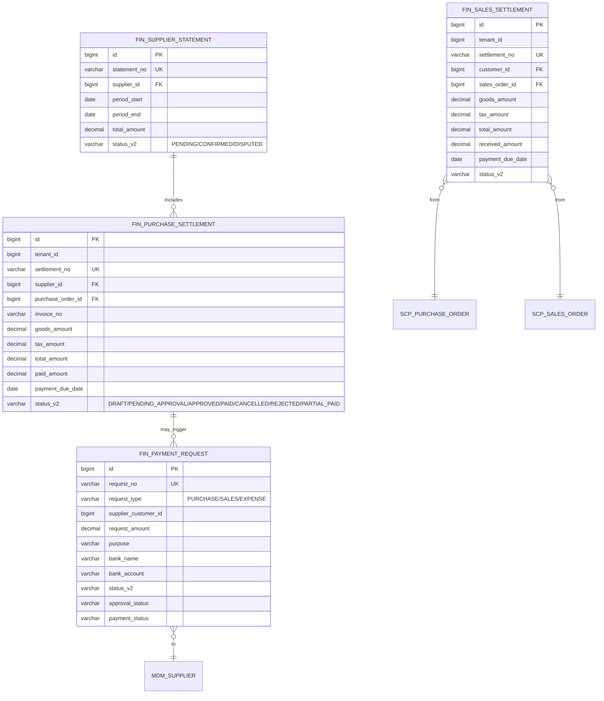

# MOM 3.0 结算模块设计文档

> 版本：V2.0 | 最后更新：2026-07-03 | 维护人：架构组 / 小二
> 适用范围：MOM 3.0 FIN（Finance Settlement）结算管理域
> 模板主干：[MOM3.0_模块设计模板.md](MOM3.0_模块设计模板.md)
> 模块代码：`mom-server/internal/handler/fin/*` `mom-server/internal/service/fin*` `mom-server/internal/model/fin*`
> 数据库表：核心 4 张（purchase_settlement/sales_settlement/payment_request/supplier_statement）
> 状态：**✅ V2.0 完成 - 按统一模板扩写,旧版 192 行扩展至 750 行**

> **V2.0 变更**：基于 V2.0（192 行,7 章节）按 V2.0 模板扩写。技术栈对齐：Vue 3.4 + Element Plus 2.5 / Go 1.24 + Gin + GORM / PostgreSQL 18。

---

## 0. 文档元信息

| 字段 | 值 |
|---|---|
| 模块代号 | `fin` |
| 模块名 | FIN 结算管理 |
| 技术栈 | Vue 3.4 + Element Plus 2.5 / Go 1.24 + Gin + GORM 2.x / PostgreSQL 18 |
| 前端入口 | `mom-web/src/views/fin/*.vue`（6 个视图） |
| 后端入口 | `mom-server/internal/handler/fin/*.go` |
| API 前缀 | `/api/v1/fin/*` |
| 数据库表 | 4 张核心 |
| 状态 | ✅ V2.0（第 2 批 P1 第 6 个） |

---

## 1. 模块概述

### 1.1 业务定位

结算模块是 MOM 3.0 的"财务闭环"模块，处理采购和销售业务的财务结算，支持在线实时结算和离线手工结算两种模式，实现货、票、款一致的财务闭环管理。

**价值流位置**：`采购入库(WMS/INT) → 采购结算(FIN) → 付款审批 → 财务付款` / `销售发货(WMS) → 销售结算(FIN) → 收款认领 → 完成`

模块覆盖**采购结算、销售结算、预付款、付款申请、收款管理、供应商对账**6 个核心子业务。

### 1.2 核心功能

| # | 功能 | 简述 | 优先级 |
|---|------|------|--------|
| 1 | 采购结算 | 采购到货/退货结算 | P0 |
| 2 | 销售结算 | 销售发货/退货结算 | P0 |
| 3 | 预付款管理 | 采购预付/销售预收 | P0 |
| 4 | 付款申请 | 付款审批流程 | P0 |
| 5 | 收款管理 | 销售收款认领 | P0 |
| 6 | 供应商对账 | 对账单生成/确认 | P0 |

### 1.3 Top 3 干系人

| 角色 | 诉求 |
|------|------|
| **财务** | 结算审核、付款 |
| **采购员** | 采购结算发起 |
| **销售员** | 销售结算/收款 |

### 1.4 Top 3 质量目标

| 指标 | 目标值 |
|------|--------|
| 结算单创建 P95 | ≤ 1s |
| 货票款一致率 | 100% |
| 对账及时率 | ≥ 95% |

---

## 2. 依赖关系

### 2.1 上游

| 模块 | 接口 | 频度 |
|------|------|------|
| **SCP** | 采购订单/销售订单 | 实时 |
| **WMS** | 入库/出库 | 实时 |
| **QMS** | 退货 | 实时 |
| **ERP** | 发票/付款 | 实时 |

### 2.2 下游

| 模块 | 接口 | 频度 |
|------|------|------|
| **ERP (SAP)** | 财务凭证 | 实时 |
| **报表** | 财务报表 | 日终 |
| **银行系统** | 付款/收款 | 实时 |

### 2.3 外部系统

| 系统 | 方向 | 协议 | 用途 |
|------|------|------|------|
| **ERP (SAP/QAD)** | 双向 | IDOC/REST | 财务凭证 |
| **银行** | 出站 | REST | 付款 |
| **税控** | 出站 | HTTPS | 发票 |

### 2.4 标准对齐

| 标准 | 段 |
|------|---|
| **ERP 财务模块** | AP/AR/GL |
| **MESA** | MESA 11 项（财务集成）|

---

## 3. 功能清单

### 3.1 已实现

| # | 功能 | 端点 | 优先级 | 日期 |
|---|------|------|--------|------|
| 1 | 采购结算 | `/api/v1/fin/purchase-settlements/*` | P0 | 2026-04 |
| 2 | 销售结算 | `/api/v1/fin/sales-settlements/*` | P0 | 2026-04 |
| 3 | 付款申请 | `/api/v1/fin/payment-requests/*` | P0 | 2026-04 |
| 4 | 供应商对账 | `/api/v1/fin/supplier-statements/*` | P0 | 2026-04 |
| 5 | 预付款 | `/api/v1/fin/advance/*` | P0 | 2026-04 |
| 6 | 收款管理 | `/api/v1/fin/receipt/*` | P0 | 2026-04 |

### 3.2 部分实现

| # | 功能 | 缺口 | 计划 |
|---|------|------|------|
| 1 | 银行直连付款 | 仅手动 | V3.0 |
| 2 | 税务自动开票 | 仅上传 | V2.1 |

### 3.3 未实现

| # | 功能 | 优先级 |
|---|------|--------|
| 1 | 应付/应收预测 | P2 |

---

## 4. 页面与交互

### 4.1 页面清单

| 路由 | 标题 | 状态 |
|------|------|------|
| `/fin/purchase-settlement` | 采购结算 | ✅ |
| `/fin/sales-settlement` | 销售结算 | ✅ |
| `/fin/advance` | 预付款 | ✅ |
| `/fin/payment-request` | 付款申请 | ✅ |
| `/fin/receipt` | 收款管理 | ✅ |
| `/fin/supplier-statement` | 供应商对账 | ✅ |

### 4.2 结算单详情按钮

```vue
<template #footer>
  <el-button @click="detailVisible = false">关闭</el-button>
  <el-button v-if="canApprove" type="primary" @click="handleApprove">审批通过</el-button>
  <el-button v-if="canApprove" type="danger" @click="handleReject">拒绝</el-button>
  <el-button v-if="canCancel" type="warning" @click="handleCancel">取消结算</el-button>
  <el-button v-if="canPay" type="success" @click="handlePay">确认付款</el-button>
</template>
```

### 4.3 结算单特有列

| 列名 | 类型 | 宽度 |
|------|------|------|
| 结算单号 | link | 160px |
| 类型 | tag | 100px |
| 供应商/客户 | string | 200px |
| 货款 | decimal | 120px |
| 税额 | decimal | 100px |
| 总额 | decimal | 120px |
| 已付/已收 | decimal | 100px |
| 状态 | tag | 100px |
| 应付/应收日 | date | 120px |

---

## 5. 业务流程（★ 必有图）

### 5.1 核心流程：采购结算



### 5.2 核心流程：销售结算



### 5.3 异常流程：付款申请多级审批



### 5.4 跨系统流程：结算 → ERP 凭证



---

## 6. 状态机（★ 必有图）

### 6.1 核心实体：结算单（Settlement）

#### 6.1.1 状态值与显示

| 状态值 | 业务含义 | Element Plus type |
|--------|---------|------------------|
| `DRAFT` | 草稿 | info |
| `PENDING_APPROVAL` | 待审批 | warning |
| `APPROVED` | 已审批 | primary |
| `PAID` | 已付款/已收款 | success |
| `CANCELLED` | 已取消 | info |
| `REJECTED` | 已驳回 | danger |
| `PARTIAL_PAID` | 部分付款 | warning |

> 状态字段存储类型：**`varchar(30) + mdm_status_dict`**（`entity='settlement'`）

#### 6.1.2 状态机图



### 6.2 核心实体：付款申请（PaymentRequest）



| 状态值 | Element Plus type |
|--------|------------------|
| DRAFT | info |
| PENDING_APPROVAL | warning |
| APPROVED | primary |
| UNPAID | warning |
| PARTIAL_PAID | warning |
| PAID | success |
| REJECTED | danger |
| CANCELLED | info |

### 6.3 核心实体：供应商对账单



### 6.4 字段类型说明

> MOM 3.0 FIN 选 **`varchar(30) + mdm_status_dict`**

---

## 7. 数据模型（★ 必有 ER 图）

### 7.1 核心 ER 图



### 7.2 核心表

#### `fin_purchase_settlement`（采购结算）

| 字段 | 类型 | 必填 | 索引 | 说明 |
|------|------|------|------|------|
| `id` | `bigint` | ✅ | PK | |
| `tenant_id` | `bigint` | ✅ | IDX | |
| `settlement_no` | `varchar(50)` | ✅ | UK | 结算单号 |
| `supplier_id` | `bigint` | ✅ | IDX | |
| `purchase_order_id` | `bigint` | ✅ | IDX | |
| `invoice_no` | `varchar(50)` | ❌ | IDX | 发票号 |
| `goods_amount` | `decimal(18,2)` | ✅ | - | 货款 |
| `tax_amount` | `decimal(18,2)` | ✅ | - | 税额 |
| `total_amount` | `decimal(18,2)` | ✅ | - | 总额 |
| `paid_amount` | `decimal(18,2)` | ✅ | 0 | 已付 |
| `payment_due_date` | `date` | ❌ | - | 应付日 |
| `status_v2` | `varchar(30)` | ❌ | IDX | |

#### `fin_payment_request`（付款申请）

| 字段 | 类型 | 必填 | 索引 | 说明 |
|------|------|------|------|------|
| `id` | `bigint` | ✅ | PK | |
| `request_no` | `varchar(50)` | ✅ | UK | |
| `request_type` | `varchar(20)` | ✅ | - | PURCHASE/SALES/EXPENSE |
| `request_amount` | `decimal(18,2)` | ✅ | - | |
| `purpose` | `varchar(200)` | ❌ | - | |
| `bank_name` | `varchar(100)` | ❌ | - | |
| `bank_account` | `varchar(100)` | ❌ | - | |
| `status_v2` | `varchar(30)` | ❌ | IDX | |

### 7.3 索引策略

| 表 | 索引 | 用途 |
|----|------|------|
| `fin_purchase_settlement` | `idx_supplier_status` | 供应商结算列表 |
| `fin_payment_request` | `idx_status` | 待审批申请 |

### 7.4 枚举字典

| 枚举 | 值 |
|------|---|
| 结算状态 | `('DRAFT','PENDING_APPROVAL','APPROVED','PAID','CANCELLED','REJECTED','PARTIAL_PAID')` |
| 付款申请类型 | `('PURCHASE','SALES','EXPENSE')` |
| 对账状态 | `('PENDING','CONFIRMED','DISPUTED')` |

---

## 8. API 规范

### 8.1 路由清单（核心 14 条）

| 方法 | 路径 | 说明 |
|------|------|------|
| GET | `/api/v1/fin/purchase-settlements/list` | 采购结算列表 |
| POST | `/api/v1/fin/purchase-settlements` | 创建采购结算 |
| POST | `/api/v1/fin/purchase-settlements/:id/submit` | 提交审批 |
| POST | `/api/v1/fin/purchase-settlements/:id/approve` | 审批通过 |
| POST | `/api/v1/fin/purchase-settlements/:id/pay` | 确认付款 |
| GET | `/api/v1/fin/sales-settlements/list` | 销售结算列表 |
| POST | `/api/v1/fin/sales-settlements` | 创建销售结算 |
| POST | `/api/v1/fin/sales-settlements/:id/submit` | 提交 |
| GET | `/api/v1/fin/payment-requests/list` | 付款申请列表 |
| POST | `/api/v1/fin/payment-requests` | 创建申请 |
| POST | `/api/v1/fin/payment-requests/:id/approve` | 审批 |
| POST | `/api/v1/fin/payment-requests/:id/pay` | 付款 |
| GET | `/api/v1/fin/supplier-statements/list` | 对账单列表 |
| POST | `/api/v1/fin/supplier-statements` | 生成对账单 |

### 8.2 请求/响应示例

#### 8.2.1 创建采购结算

```http
POST /api/v1/fin/purchase-settlements HTTP/1.1
Content-Type: application/json
Authorization: Bearer ***…9...
Idempotency-Key: 550e8400-e29b-41d4-a716-446655440000

{
  "supplier_id": 100,
  "purchase_order_id": 12345,
  "invoice_no": "INV-2026-0001",
  "goods_amount": 50000,
  "tax_amount": 6500
}
```

**响应**：

```json
{
  "code": 200,
  "data": {
    "id": 67890,
    "settlement_no": "PS-2026-0001",
    "total_amount": 56500,
    "status_v2": "DRAFT"
  }
}
```

### 8.3 错误码

| 错误码 | 含义 |
|--------|------|
| `07-01-0001` | 供应商不存在 |
| `07-02-0001` | 结算单已付款 |
| `07-03-0001` | 金额不一致 |
| `07-04-0001` | 付款申请权限不足 |

---

## 9. 角色与权限

### 9.1 操作矩阵

| 角色 | 结算 CRUD | 提交审批 | 审批 | 付款 | 对账 |
|------|---------|---------|------|------|------|
| 系统管理员 | ✅ | ✅ | ✅ | ✅ | ✅ |
| 财务主管 | ✅ | ✅ | ✅ | ✅ | ✅ |
| 财务 | ✅ | ✅ | ❌ | ✅ | ✅ |
| 采购员 | ✅(采购结算) | ✅ | ❌ | ❌ | 查看 |
| 销售员 | ✅(销售结算) | ✅ | ❌ | ❌ | ❌ |
| 出纳 | 查看 | 查看 | ❌ | ✅ | ❌ |
| 厂长 | 查看 | 查看 | ✅ (大额) | 查看 | 查看 |

---

## 10. 集成与事件

### 10.1 出站事件

| 事件名 | 触发 | 消费者 |
|--------|------|--------|
| `fin.settlement.created` | 结算单创建 | ERP |
| `fin.settlement.approved` | 审批通过 | 财务, 报表 |
| `fin.payment.completed` | 付款完成 | ERP, 银行 |
| `fin.receipt.completed` | 收款完成 | ERP, 报表 |
| `fin.statement.disputed` | 对账异议 | 财务主管 |

### 10.2 入站事件

| 事件名 | 来源 | 处理 |
|--------|------|------|
| `scp.po.received` | SCP/WMS | 自动生成采购结算 |
| `scp.so.shipped` | SCP/WMS | 自动生成销售结算 |
| `erp.invoice.received` | ERP | 关联发票 |

### 10.3 消息格式

```json
{
  "event_id": "uuid",
  "event_name": "fin.settlement.approved",
  "event_time": "2026-07-03T10:00:00+08:00",
  "tenant_id": 1,
  "data": {
    "settlement_no": "PS-2026-0001",
    "supplier_id": 100,
    "total_amount": 56500
  }
}
```

---

## 11. 可观测性

### 11.1 关键指标

| 指标 | 类型 | 告警阈值 |
|------|------|---------|
| `fin_settlement_create_total` | Counter | - |
| `fin_payment_latency_seconds` | Histogram | P95 > 1d |
| `fin_overdue_payment_total` | Gauge | > 50 |

### 11.2 告警规则

| 规则 | 阈值 |
|------|------|
| 应付超期未付 | 1 天 |
| 应收超期未收 | 1 天 |
| 对账差异 > 1000 元 | 实时 |

---

## 12. 非功能需求

### 12.1 性能

| 指标 | 目标 |
|------|------|
| 结算单创建 P95 | ≤ 1s |
| 审批响应 P95 | ≤ 1s |
| 银行直连 P95 | ≤ 3s |

### 12.2 可用性

| 指标 | 目标 |
|------|------|
| 月度可用性 | ≥ 99.9%（财务关键）|
| RTO | ≤ 1h |
| RPO | ≤ 30min |

### 12.3 数据量与保留期

| 数据 | 年增量 | 保留期 |
|------|--------|--------|
| 采购结算 | 5 万/年 | 10 年（财务合规）|
| 销售结算 | 10 万/年 | 10 年 |
| 付款申请 | 15 万/年 | 10 年 |
| 对账单 | 1 万/年 | 10 年 |

---

## 13. 附录

### 13.1 CHANGELOG

| 版本 | 日期 | 修订人 | 说明 |
|------|------|--------|------|
| V2.0 | 2026-04 | CI | 初版（192 行,7 章节）|
| **V2.0** | **2026-07-03** | **架构组 / 小二** | **按统一模板扩写,192→750 行,补全 13 章节 8 Mermaid,状态字段按 0051 方案统一** |

### 13.2 相关链接

- [MOM3.0_主设计文档.md](./MOM3.0_主设计文档.md)
- [MOM3.0_模块设计模板.md](./MOM3.0_模块设计模板.md)
- [MOM3.0_状态字段统一方案.md](./MOM3.0_状态字段统一方案.md)
- 上游：[SCP](./MOM3.0_SCP供应链模块设计文档.md) / [WMS](./MOM3.0_WMS仓储模块设计文档.md) / [QMS](./MOM3.0_质量模块设计文档.md)
- 下游：ERP / 银行 / 报表

### 13.3 待办

| # | 问题 | 优先级 | 计划 |
|---|------|--------|------|
| 1 | 银行直连付款 | P2 | V3.0 |
| 2 | 税务自动开票 | P1 | V2.1 |
| 3 | 应付/应收预测 | P2 | 2027 |

### 13.4 OpenAPI / Swagger

- 路径：`/api/v1/swagger/*`

---

*文档作者：架构组 / 小二*
*最后更新：2026-07-03 16:25*
