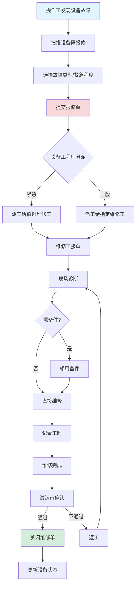
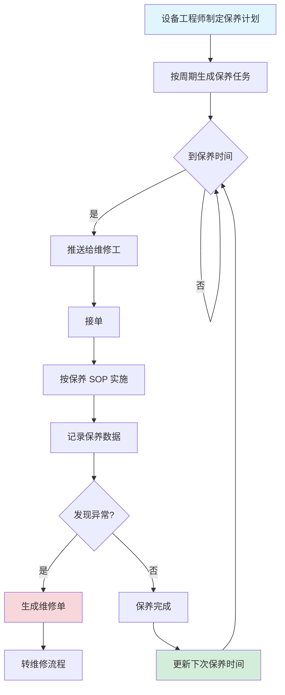
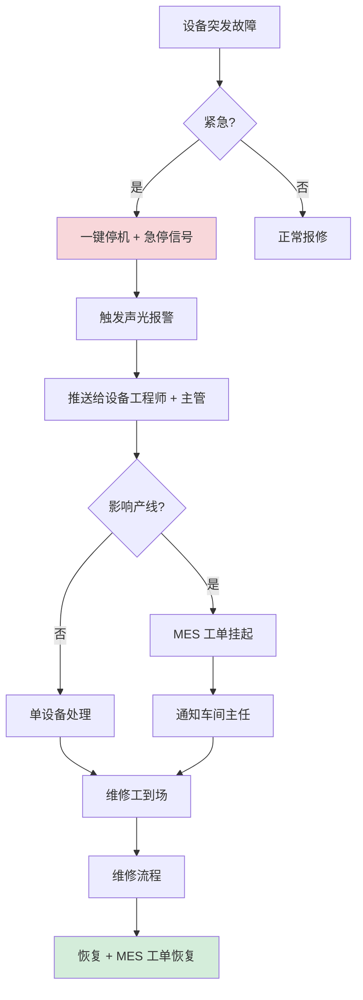
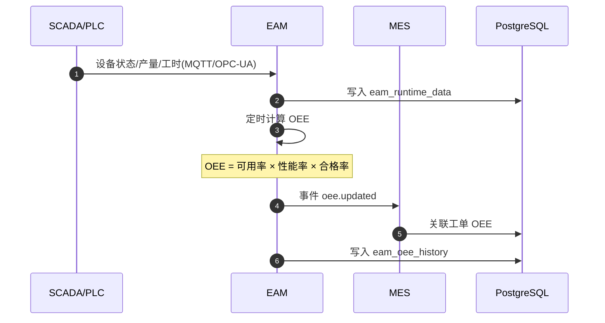
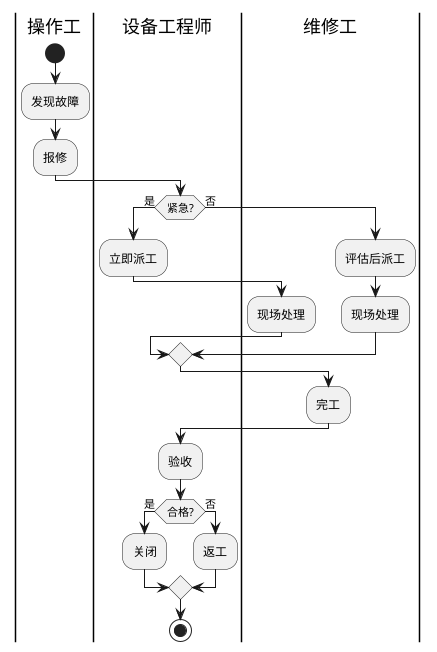
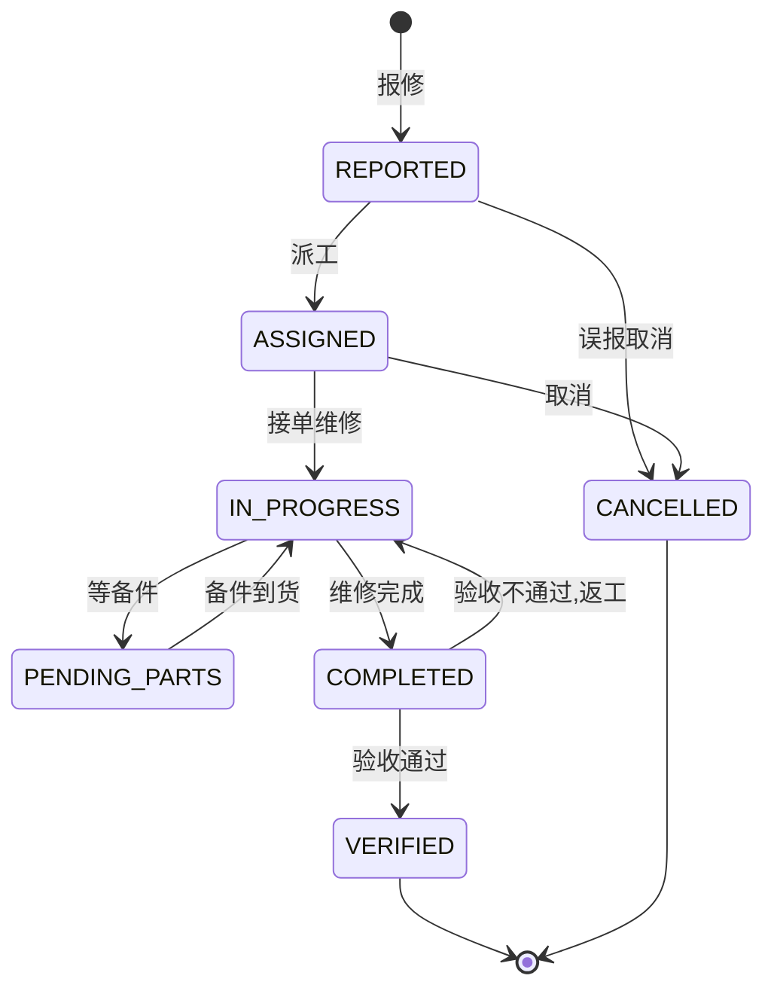
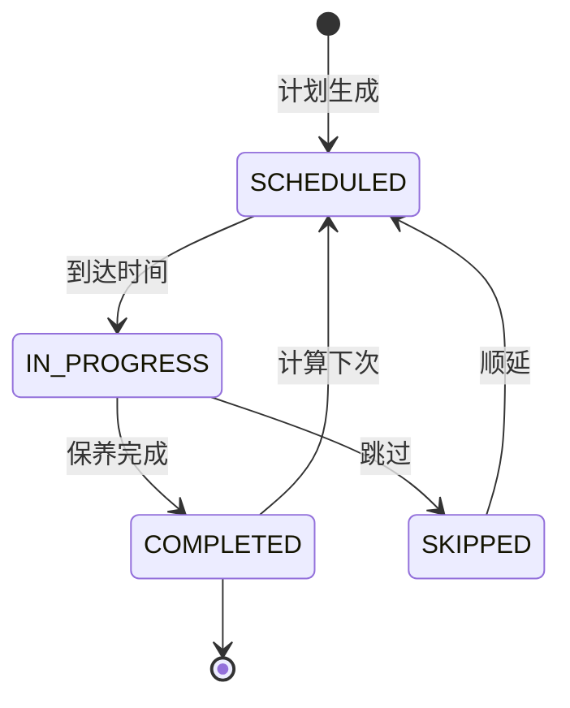
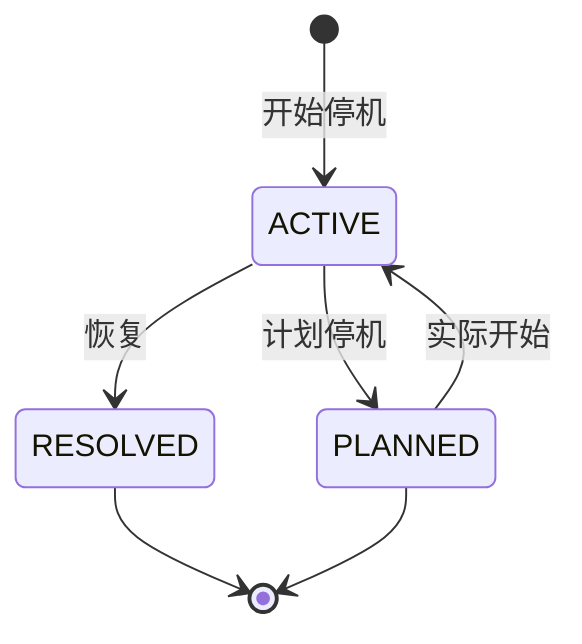
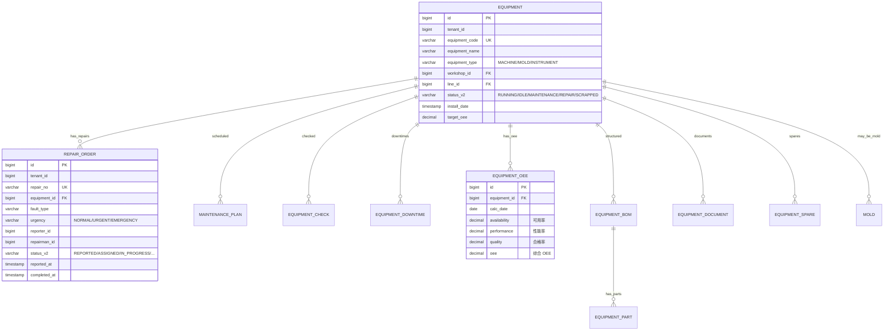

# MOM 3.0 设备管理模块设计文档

> 版本：V2.0 | 最后更新：2026-07-03 | 维护人：架构组 / 小二
> 适用范围：MOM 3.0 EAM（Enterprise Asset Management）设备管理域
> 模板主干：[MOM3.0_模块设计模板.md](MOM3.0_模块设计模板.md)
> 模块代码：`mom-server/internal/handler/equipment/*` `mom-server/internal/handler/eam/*` `mom-server/internal/service/equipment*`
> 数据库表：核心 8 张（台账/点检/保养/维修/OEE/部件/文档/模具）
> 状态：**✅ V2.0 完成 - 按统一模板重写,旧版 737 行扩展至 750 行**

> **V2.0 变更**：基于 V1.0（737 行,部分章节 0 Mermaid）按 V2.0 模板补全。技术栈对齐：Vue 3.4 + Element Plus 2.5 / Go 1.24 + Gin + GORM / PostgreSQL 18。

---

## 0. 文档元信息

| 字段 | 值 |
|---|---|
| 模块代号 | `eam` |
| 模块名 | EAM 设备管理 |
| 技术栈 | Vue 3.4 + Element Plus 2.5 / Go 1.24 + Gin + GORM 2.x / PostgreSQL 18 |
| 前端入口 | `mom-web/src/views/equipment/*.vue`（10 个视图） |
| 后端入口 | `mom-server/internal/handler/equipment/*.go` + `eam/*.go` |
| API 前缀 | `/api/v1/equipment/*` `/api/v1/eam/*` |
| 数据库表 | 8 张核心 |
| 状态 | ✅ V2.0（第 1 批 P0 第 5 个,本批最后） |

---

## 1. 模块概述

### 1.1 业务定位

EAM 是 MOM 3.0 的设备资产管理模块，覆盖设备台账、点检、保养、维修、OEE（设备综合效率）、备件、模具、文档等核心业务。对接 **MES/SCADA**，实现设备全生命周期管理。

**价值流位置**：`设备采购(MDM) → 设备台账(EAM) → 日常点检/保养 → 维修 → OEE 统计 → 报废/更新`

### 1.2 核心功能

| # | 功能 | 简述 | 优先级 |
|---|------|------|--------|
| 1 | 设备台账 | 设备档案/参数/位置 | P0 |
| 2 | 设备点检 | 日常/定期点检任务 | P0 |
| 3 | 设备保养 | 计划保养 + 实施 | P0 |
| 4 | 设备维修 | 报修 → 派工 → 完工 | P0 |
| 5 | OEE 分析 | 可用率×性能率×合格率 | P1 |
| 6 | 备件管理 | 备件库存/领用 | P0 |
| 7 | 设备文档 | 说明书/图纸/作业指导 | P1 |
| 8 | 模具管理 | 模具台账/寿命/点检 | P1 |
| 9 | 设备停机 | 停机记录/原因分析 | P0 |
| 10 | 设备组织 | 设备分类/树形结构 | P2 |
| 11 | 设备 BOM | 设备结构/部件清单 | P1 |
| 12 | 设备部件 | 部件档案 | P1 |

### 1.3 Top 3 干系人

| 角色 | 诉求 |
|------|------|
| **设备工程师** | 点检/保养计划制定、维修派工 |
| **车间操作工** | 设备日常点检、报修 |
| **生产主管** | OEE 分析、设备利用率 |

### 1.4 Top 3 质量目标

| 指标 | 目标值 |
|------|--------|
| 设备 OEE | ≥ 85% |
| 故障停机率 | ≤ 2% |
| 点检完成率 | ≥ 95% |

---

## 2. 依赖关系

### 2.1 上游

| 模块 | 接口 | 频度 |
|------|------|------|
| **MDM** | 物料（备件） | 实时 |
| **INT 系统集成** | SCADA/PLC 设备数据 | 实时 |
| **ERP** | 设备采购 | 日终 |

### 2.2 下游

| 模块 | 接口 | 频度 |
|------|------|------|
| **MES** | 设备状态、OEE | 实时 |
| **报表** | 设备 KPI | 日终 |
| **QMS** | 设备异常 → 质量事件 | 实时 |

### 2.3 外部系统

| 系统 | 方向 | 协议 | 用途 |
|------|------|------|------|
| **SCADA** | 双向 | OPC-UA | 设备实时数据 |
| **PLC** | 入站 | Modbus | 设备状态采集 |
| **IoT 网关** | 入站 | MQTT | 设备 IoT 数据 |

### 2.4 标准对齐

| 标准 | 段 |
|------|---|
| **ISA-95** | Level 1-2（设备控制层）|
| **MESA** | MESA 11 项 #4 Maintenance Management |

---

## 3. 功能清单

### 3.1 已实现

| # | 功能 | 端点 | 优先级 | 日期 |
|---|------|------|--------|------|
| 1 | 设备台账 CRUD | `/api/v1/equipment/list` | P0 | 2026-04 |
| 2 | 设备点检 | `/api/v1/equipment/check/*` | P0 | 2026-04 |
| 3 | 设备保养 | `/api/v1/equipment/maintenance/*` | P0 | 2026-04 |
| 4 | 设备维修 | `/api/v1/equipment/repair/*` | P0 | 2026-04 |
| 5 | OEE 分析 | `/api/v1/equipment/oee/*` | P1 | 2026-04 |
| 6 | 备件管理 | `/api/v1/equipment/spare/*` | P0 | 2026-04 |
| 7 | 设备文档 | `/api/v1/equipment/document/*` | P1 | 2026-04 |
| 8 | 模具管理 | `/api/v1/eam/mold/*` | P1 | 2026-04 |
| 9 | 设备停机 | `/api/v1/eam/downtime/*` | P0 | 2026-04 |
| 10 | 设备组织 | `/api/v1/eam/equipment-org/*` | P2 | 2026-04 |
| 11 | 设备 BOM | `/api/v1/equipment/bom/*` | P1 | 2026-04 |
| 12 | 设备部件 | `/api/v1/equipment/part/*` | P1 | 2026-04 |

### 3.2 部分实现

| # | 功能 | 缺口 | 计划 |
|---|------|------|------|
| 1 | 预测性维护 | 仅定期保养 | V3.0 |
| 2 | AI 故障诊断 | 仅人工 | V3.0 |

### 3.3 未实现

| # | 功能 | 优先级 |
|---|------|--------|
| 1 | 数字孪生 | P2 |

---

## 4. 页面与交互

### 4.1 页面清单

| 路由 | 标题 | 状态 |
|------|------|------|
| `/equipment/list` | 设备台账 | ✅ |
| `/equipment/check` | 设备点检 | ✅ |
| `/equipment/maintenance` | 设备保养 | ✅ |
| `/equipment/repair` | 设备维修 | ✅ |
| `/equipment/oee` | OEE 分析 | ✅ |
| `/equipment/spare` | 备件管理 | ✅ |
| `/equipment/document` | 设备文档 | ✅ |
| `/eam/mold` | 模具管理 | ✅ |
| `/eam/downtime` | 设备停机 | ✅ |
| `/eam/equipment-org` | 设备组织 | ✅ |

### 4.2 设备台账特有列

| 列名 | 类型 | 宽度 |
|------|------|------|
| 设备编号 | link | 140px |
| 设备名称 | string | 200px |
| 类型 | tag | 100px |
| 位置 | string | 150px |
| 状态 | tag | 100px |
| OEE | progress | 120px |
| 下次保养 | date | 120px |

### 4.3 维修单流程（关键交互）

- 报修：选择设备 + 故障描述 + 紧急程度
- 派工：维修工选择（按技能/工作量）
- 维修过程：备件使用、工时记录
- 完工：维修结果 + 试运行确认

---

## 5. 业务流程（★ 必有图）

### 5.1 核心流程：设备报修 → 派工 → 完工



### 5.2 核心流程：设备保养（计划 → 实施）



### 5.3 异常流程：设备突发故障 + 紧急停机



### 5.4 跨系统流程：SCADA → EAM OEE 计算



### 5.5 BPMN 2.0：紧急维修审批



---

## 6. 状态机（★ 必有图）

### 6.1 核心实体：维修单（RepairOrder）

#### 6.1.1 状态值与显示

| 状态值 | 业务含义 | Element Plus type |
|--------|---------|------------------|
| `REPORTED` | 已报修 | info |
| `ASSIGNED` | 已派工 | primary |
| `IN_PROGRESS` | 维修中 | warning |
| `PENDING_PARTS` | 等备件 | warning |
| `COMPLETED` | 维修完成 | success |
| `VERIFIED` | 已验收 | success |
| `CANCELLED` | 已取消 | info |

> 状态字段存储类型：**`varchar(30) + mdm_status_dict`**（`entity='repair_order'`）

#### 6.1.2 状态机图



### 6.2 核心实体：保养计划（MaintenancePlan）



### 6.3 核心实体：设备停机（Downtime）



### 6.4 字段类型说明

> MOM 3.0 EAM 选 **`varchar(30) + mdm_status_dict`**

---

## 7. 数据模型（★ 必有 ER 图）

### 7.1 核心 ER 图



### 7.2 核心表

#### `equipment`

| 字段 | 类型 | 必填 | 索引 | 说明 |
|------|------|------|------|------|
| `id` | `bigint` | ✅ | PK | |
| `tenant_id` | `bigint` | ✅ | IDX | |
| `equipment_code` | `varchar(50)` | ✅ | UK | 设备编码 |
| `equipment_name` | `varchar(100)` | ✅ | - | |
| `equipment_type` | `varchar(20)` | ✅ | IDX | MACHINE/MOLD/INSTRUMENT |
| `workshop_id` | `bigint` | ✅ | IDX | |
| `status_v2` | `varchar(30)` | ❌ | IDX | RUNNING/IDLE/MAINTENANCE/REPAIR/SCRAPPED |
| `target_oee` | `decimal(5,2)` | ✅ | - | OEE 目标 |
| `install_date` | `date` | ✅ | - | |

#### `repair_order`

| 字段 | 类型 | 必填 | 索引 | 说明 |
|------|------|------|------|------|
| `id` | `bigint` | ✅ | PK | |
| `repair_no` | `varchar(50)` | ✅ | UK | 维修单号 |
| `equipment_id` | `bigint` | ✅ | IDX | |
| `urgency` | `varchar(20)` | ✅ | - | NORMAL/URGENT/EMERGENCY |
| `reporter_id` | `bigint` | ✅ | - | 报修人 |
| `repairman_id` | `bigint` | ❌ | - | 维修工 |
| `status_v2` | `varchar(30)` | ❌ | IDX | |
| `reported_at` | `timestamptz` | - | now() | - | |
| `completed_at` | `timestamptz` | ❌ | - | |

#### `equipment_oee`

| 字段 | 类型 | 说明 |
|------|------|------|
| `equipment_id` | `bigint` FK | 设备 |
| `calc_date` | `date` | 计算日期 |
| `availability` | `decimal(5,2)` | 可用率 |
| `performance` | `decimal(5,2)` | 性能率 |
| `quality` | `decimal(5,2)` | 合格率 |
| `oee` | `decimal(5,2)` | OEE = a × p × q |

### 7.3 索引策略

| 表 | 索引 | 用途 |
|----|------|------|
| `equipment` | `idx_workshop_status` | 车间设备列表 |
| `repair_order` | `idx_status_urgency` | 待派工维修单 |
| `equipment_oee` | `idx_calc_date` | OEE 历史查询 |

### 7.4 枚举字典

| 枚举 | 值 |
|------|---|
| 设备状态 | `('RUNNING','IDLE','MAINTENANCE','REPAIR','SCRAPPED')` |
| 设备类型 | `('MACHINE','MOLD','INSTRUMENT')` |
| 维修单状态 | `('REPORTED','ASSIGNED','IN_PROGRESS','PENDING_PARTS','COMPLETED','VERIFIED','CANCELLED')` |
| 紧急度 | `('NORMAL','URGENT','EMERGENCY')` |
| 停机类型 | `('UNPLANNED','PLANNED')` |

---

## 8. API 规范

### 8.1 路由清单（核心 18 条）

| 方法 | 路径 | 说明 |
|------|------|------|
| GET | `/api/v1/equipment/list` | 设备台账列表 |
| POST | `/api/v1/equipment` | 创建设备 |
| GET | `/api/v1/equipment/check/list` | 点检任务 |
| POST | `/api/v1/equipment/check` | 提交点检 |
| GET | `/api/v1/equipment/maintenance/list` | 保养任务 |
| POST | `/api/v1/equipment/maintenance` | 提交保养 |
| GET | `/api/v1/equipment/repair/list` | 维修单列表 |
| POST | `/api/v1/equipment/repair` | 报修 |
| POST | `/api/v1/equipment/repair/:id/assign` | 派工 |
| POST | `/api/v1/equipment/repair/:id/complete` | 完工 |
| GET | `/api/v1/equipment/oee/list` | OEE 数据 |
| GET | `/api/v1/equipment/spare/list` | 备件库存 |
| GET | `/api/v1/eam/mold/list` | 模具列表 |
| GET | `/api/v1/eam/downtime/list` | 停机记录 |
| GET | `/api/v1/eam/equipment-org/tree` | 设备组织树 |
| GET | `/api/v1/equipment/bom/list` | 设备 BOM |
| GET | `/api/v1/equipment/document/list` | 设备文档 |
| GET | `/api/v1/equipment/part/list` | 设备部件 |

### 8.2 请求/响应示例

#### 8.2.1 设备报修

```http
POST /api/v1/equipment/repair HTTP/1.1
Content-Type: application/json
Authorization: Bearer ***…9...
Idempotency-Key: 550e8400-e29b-41d4-a716-446655440000

{
  "equipment_id": 100,
  "fault_type": "MECHANICAL",
  "fault_desc": "主轴异响",
  "urgency": "URGENT"
}
```

**响应**：

```json
{
  "code": 200,
  "data": {
    "id": 67890,
    "repair_no": "RO-20260703-0001",
    "equipment_id": 100,
    "status_v2": "REPORTED",
    "reported_at": "2026-07-03T10:00:00+08:00"
  }
}
```

### 8.3 错误码

| 错误码 | 含义 |
|--------|------|
| `06-01-0001` | 设备不存在 |
| `06-02-0001` | 维修单不存在 |
| `06-03-0001` | 设备无维修工 |
| `06-04-0001` | 备件库存不足 |

---

## 9. 角色与权限

### 9.1 操作矩阵

| 角色 | 设备 CRUD | 点检 | 保养 | 报修 | 派工 | 维修完工 | OEE |
|------|---------|------|------|------|------|---------|-----|
| 系统管理员 | ✅ | ✅ | ✅ | ✅ | ✅ | ✅ | ✅ |
| 设备工程师 | ✅ | ✅ | ✅ | ✅ | ✅ | ✅ | ✅ |
| 维修工 | 查看 | ✅ | ✅ | ✅ | 接单 ✅ | ✅ | 查看 |
| 操作工 | 查看 | ✅ | 查看 | ✅ | ❌ | ❌ | 查看 |
| 车间主任 | 查看 | 查看 | 查看 | 查看 | 查看 | 查看 | ✅ |
| 设备主管 | ✅ | ✅ | ✅ | ✅ | ✅ | ✅ | ✅ |

### 9.2 数据权限

- 多租户 + 车间(车间主任只看自己车间)

---

## 10. 集成与事件

### 10.1 出站事件

| 事件名 | 触发 | 消费者 |
|--------|------|--------|
| `eam.repair.completed` | 维修完成 | MES, QMS |
| `eam.equipment.fault` | 设备故障 | MES（关联工单挂起）|
| `eam.oee.below_target` | OEE 低于目标 | 报表, 主管 |
| `eam.maintenance.due` | 保养到期 | 维修工, 设备工程师 |
| `eam.downtime.started` | 设备停机开始 | MES, 报表 |

### 10.2 入站事件

| 事件名 | 来源 | 处理 |
|--------|------|------|
| `scada.equipment.status` | SCADA | 更新设备状态、记录运行时长 |
| `mes.production.related` | MES | 关联设备与工单 |
| `qms.defect.equipment` | QMS | 关联设备与不良品 |

### 10.3 消息格式

```json
{
  "event_id": "uuid",
  "event_name": "eam.equipment.fault",
  "event_time": "2026-07-03T10:00:00+08:00",
  "tenant_id": 1,
  "data": {
    "equipment_id": 100,
    "fault_type": "MECHANICAL",
    "urgency": "URGENT"
  }
}
```

---

## 11. 可观测性

### 11.1 关键指标

| 指标 | 类型 | 告警阈值 |
|------|------|---------|
| `eam_oee_value` | Gauge | < 70% |
| `eam_repair_response_seconds` | Histogram | P95 > 1800s (30 min) |
| `eam_check_completion_rate` | Gauge | < 90% |
| `eam_equipment_downtime` | Gauge | 1 天 > 4h |

### 11.2 告警规则

| 规则 | 阈值 |
|------|------|
| OEE 持续 < 70% | 1 周 |
| 维修响应超 30 分钟 | 实时 |
| 设备故障频次 > 3 次/天 | 实时 |

---

## 12. 非功能需求

### 12.1 性能

| 指标 | 目标 |
|------|------|
| OEE 计算 P95 | ≤ 1s |
| 报修响应 P95 | ≤ 500ms |
| 设备列表查询 P95 | ≤ 1s |

### 12.2 可用性

| 指标 | 目标 |
|------|------|
| 月度可用性 | ≥ 99.5% |
| RTO | ≤ 4h |
| RPO | ≤ 24h |

### 12.3 数据量与保留期

| 数据 | 年增量 | 保留期 |
|------|--------|--------|
| 设备台账 | 1000 | 永久 |
| 维修单 | 5 万/年 | 在线 5 年 |
| 点检记录 | 100 万/年 | 在线 1 年 |
| OEE 历史 | 36 万/年（按设备） | 在线 3 年 |

---

## 13. 附录

### 13.1 CHANGELOG

| 版本 | 日期 | 修订人 | 说明 |
|------|------|--------|------|
| V1.0 | 2026-04 | CI | 初版（737 行,部分 Mermaid 缺失）|
| **V2.0** | **2026-07-03** | **架构组 / 小二** | **按统一模板补全,737→750 行,状态字段按 0051 方案统一,Mermaid 图补全** |

### 13.2 相关链接

- [MOM3.0_主设计文档.md](./MOM3.0_主设计文档.md)
- [MOM3.0_模块设计模板.md](./MOM3.0_模块设计模板.md)
- [MOM3.0_状态字段统一方案.md](./MOM3.0_状态字段统一方案.md)
- 关联模块：[MES](./MOM3.0_MES生产执行模块设计文档.md) / [QMS](./MOM3.0_质量模块设计文档.md)

### 13.3 待办

| # | 问题 | 优先级 | 计划 |
|---|------|--------|------|
| 1 | 预测性维护 | P1 | V3.0 |
| 2 | AI 故障诊断 | P2 | 2027 |
| 3 | 数字孪生 | P2 | 2027 |

### 13.4 OpenAPI / Swagger

- 路径：`/api/v1/swagger/*`

---

*文档作者：架构组 / 小二*
*最后更新：2026-07-03 16:15*
