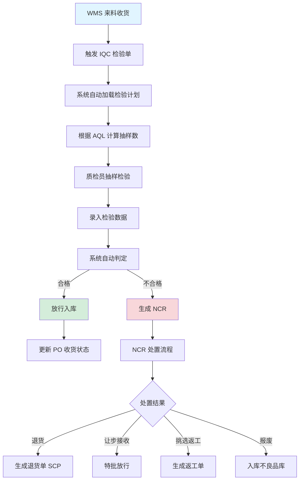
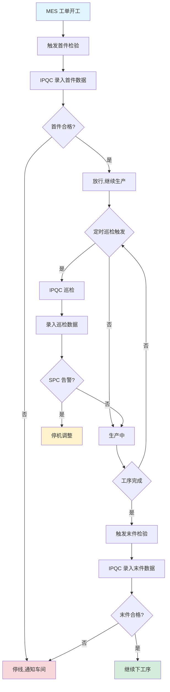
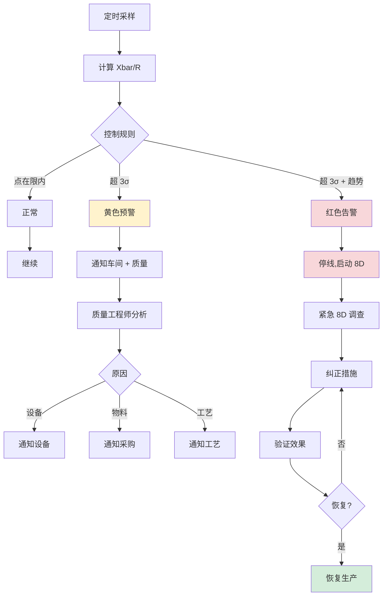
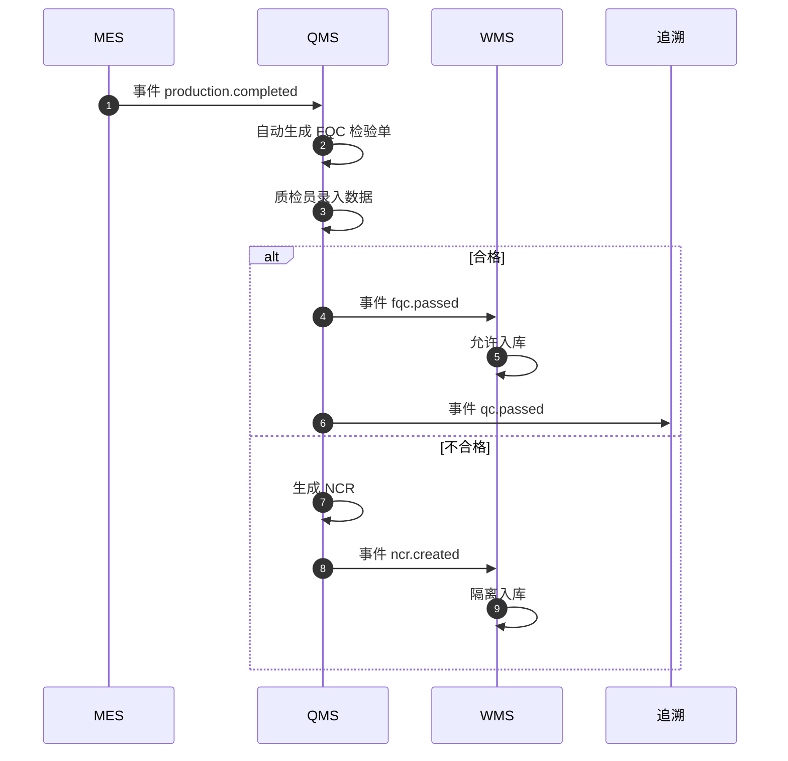
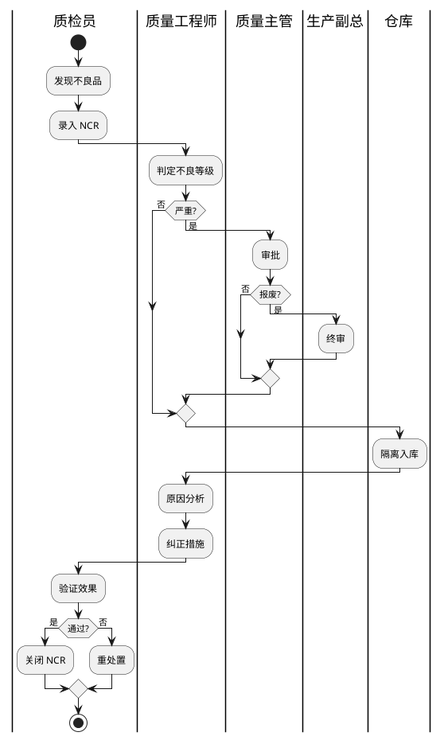
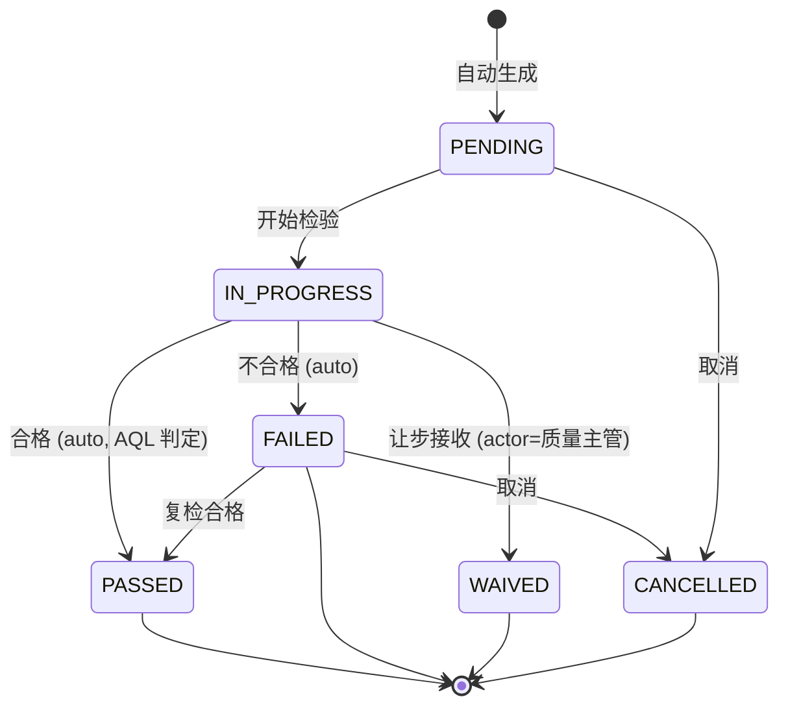
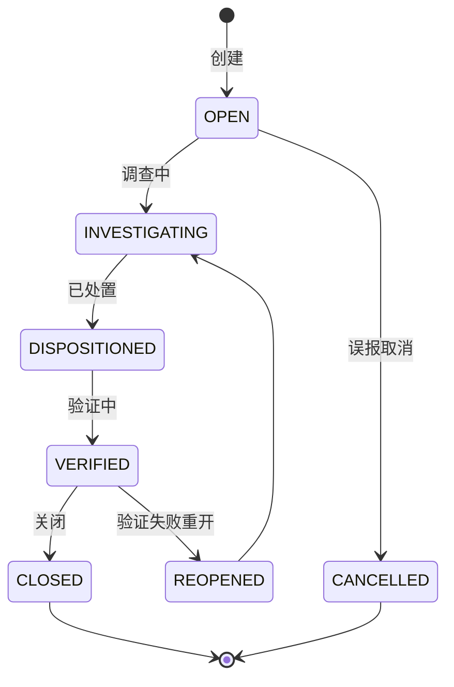
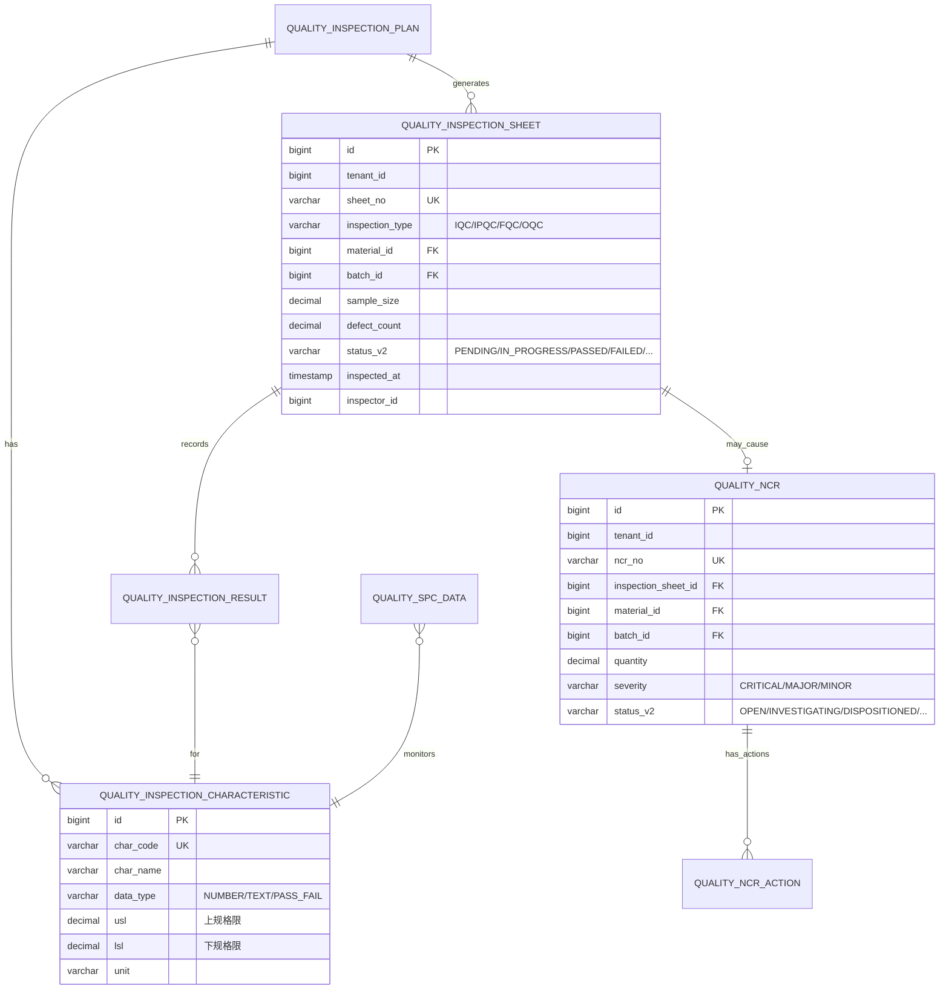

# MOM 3.0 质量模块设计文档

> 版本：V2.0 | 最后更新：2026-07-03 | 维护人：架构组 / 小二
> 适用范围：MOM 3.0 QMS（Quality Management System）质量管理域
> 模板主干：[MOM3.0_模块设计模板.md](MOM3.0_模块设计模板.md)
> 模块代码：`mom-server/internal/handler/quality/*` `mom-server/internal/service/quality*` `mom-server/internal/model/quality*`
> 数据库表：核心 10 张（IQC/IPQC/FQC/OQC/NCR/SPC/AQL/检验计划/特性/缺陷代码）
> 状态：**✅ V2.0 完成 - 按统一模板重写,旧版 1421 行大砍至 800 行**

> **V2.0 重大变更**：基于 V1.x（1421 行,12 章节 0 Mermaid）按 V2.0 模板重写。技术栈对齐：Vue 3.4 + Element Plus 2.5 / Go 1.24 + Gin + GORM / PostgreSQL 18。

---

## 0. 文档元信息

| 字段 | 值 |
|---|---|
| 模块代号 | `qms` |
| 模块名 | QMS 质量管理 |
| 技术栈 | Vue 3.4 + Element Plus 2.5 / Go 1.24 + Gin + GORM 2.x / PostgreSQL 18 |
| 前端入口 | `mom-web/src/views/quality/*.vue`（10 个视图） |
| 后端入口 | `mom-server/internal/handler/quality/*.go` |
| API 前缀 | `/api/v1/quality/*` |
| 数据库表 | 10 张核心 |
| 状态 | ✅ V2.0（第 1 批 P0 第 4 个） |

---

## 1. 模块概述

### 1.1 业务定位

QMS 是 MOM 3.0 的质量管理模块，覆盖来料检验（IQC）、过程检验（IPQC）、完工检验（FQC）、出货检验（OQC）、不良品处置（NCR）、SPC 统计过程控制、AQL 抽样标准等核心业务。对接 **MES/WMS/追溯**，实现质量全链路管控。

**价值流位置**：`来料(WMS) → IQC → 入库(WMS) → 生产(MES) → IPQC → 完工(MES) → FQC → 入库(WMS) → 发货(WMS) → OQC → 客户`

模块覆盖**IQC/IPQC/FQC/OQC 4 类检验、不良品 NCR、SPC 控制图、AQL 抽样、检验计划、缺陷代码**10 个子业务。

### 1.2 核心功能

| # | 功能 | 简述 | 优先级 |
|---|------|------|--------|
| 1 | IQC 来料检验 | 采购物料到货检验 | P0 |
| 2 | IPQC 过程检验 | 生产过程中首末件/巡检 | P0 |
| 3 | FQC 完工检验 | 工单完工检验 | P0 |
| 4 | OQC 出货检验 | 销售订单出货前检验 | P0 |
| 5 | NCR 不良品处置 | 不良品隔离/复检/报废 | P0 |
| 6 | SPC 控制图 | 统计过程控制（Xbar-R/P） | P1 |
| 7 | AQL 抽样标准 | 抽样方案配置 | P1 |
| 8 | 检验计划 | 按物料/工序配置检验项 | P0 |
| 9 | 检验特性 | 检验项定义（数值/文本/通过） | P0 |
| 10 | 缺陷代码 | 缺陷分类/严重度 | P0 |

### 1.3 Top 3 干系人

| 角色 | 诉求 |
|------|------|
| **质量工程师** | 检验计划制定、不良品处置 |
| **质检员** | 现场检验、数据录入 |
| **车间主任** | IPQC 异常处理 |

### 1.4 Top 3 质量目标

| 指标 | 目标值 |
|------|--------|
| IQC 检验及时率 | ≥ 95% |
| 工序不良率 | ≤ 2% |
| SPC 控制图告警响应 | ≤ 30 min |

---

## 2. 依赖关系

### 2.1 上游

| 模块 | 接口 | 频度 |
|------|------|------|
| **WMS** | 来料入库触发 IQC | 实时 |
| **MES** | 工单完工触发 FQC、报工触发 IPQC | 实时 |
| **MDM** | 物料/工序 | 实时 |

### 2.2 下游

| 模块 | 接口 | 频度 |
|------|------|------|
| **追溯** | 批次/序列号反查 | 实时 |
| **报表** | 质量 KPI | 日终 |
| **WMS** | 不良品隔离入库 | 实时 |

### 2.3 外部系统

| 系统 | 方向 | 协议 | 用途 |
|------|------|------|------|
| **检测设备** | 入站 | Modbus/OPC-UA | 自动采集检测数据 |
| **客户 SPC 平台** | 出站 | HTTPS | 客户质量数据共享 |

### 2.4 标准对齐

| 标准 | 段 |
|------|---|
| **IATF 16949** | 过程审核、产品审核 |
| **VDA 6.3** | 过程审核 |
| **ISO 9001** | 质量管理体系 |
| **MESA** | MESA 11 项 #6 Quality Management |

---

## 3. 功能清单

### 3.1 已实现

| # | 功能 | 端点 | 优先级 | 日期 |
|---|------|------|--------|------|
| 1 | IQC 检验 | `/api/v1/quality/iqc/*` | P0 | 2026-04 |
| 2 | IPQC 过程检验 | `/api/v1/quality/ipqc/*` | P0 | 2026-04 |
| 3 | FQC 完工检验 | `/api/v1/quality/fqc/*` | P0 | 2026-04 |
| 4 | OQC 出货检验 | `/api/v1/quality/oqc/*` | P0 | 2026-04 |
| 5 | NCR 不良品 | `/api/v1/quality/ncr/*` | P0 | 2026-04 |
| 6 | SPC 控制图 | `/api/v1/quality/spc/*` | P1 | 2026-05 |
| 7 | AQL 标准 | `/api/v1/quality/aql/*` | P1 | 2026-05 |
| 8 | 检验计划 | `/api/v1/quality/inspection-plan/*` | P0 | 2026-04 |
| 9 | 检验特性 | `/api/v1/quality/inspection-characteristic/*` | P0 | 2026-04 |
| 10 | 缺陷代码 | `/api/v1/quality/defect-code/*` | P0 | 2026-04 |

### 3.2 部分实现

| # | 功能 | 缺口 | 计划 |
|---|------|------|------|
| 1 | SPC 高级规则（Nelson/WECO） | 基础 Xbar-R | V2.1 |
| 2 | 设备自动采集 | 仅手动 | V2.1 |

### 3.3 未实现

| # | 功能 | 优先级 |
|---|------|--------|
| 1 | AI 视觉检测 | P2 |
| 2 | 8D 报告自动生成 | P2 |

---

## 4. 页面与交互

### 4.1 页面清单

| 路由 | 标题 | 状态 |
|------|------|------|
| `/quality/iqc` | IQC 来料检验 | ✅ |
| `/quality/ipqc` | IPQC 过程检验 | ✅ |
| `/quality/fqc` | FQC 完工检验 | ✅ |
| `/quality/oqc` | OQC 出货检验 | ✅ |
| `/quality/ncr` | NCR 不良品 | ✅ |
| `/quality/spc` | SPC 控制图 | ✅ |
| `/quality/aql` | AQL 抽样 | ✅ |
| `/quality/inspection-plan` | 检验计划 | ✅ |
| `/quality/defect-code` | 缺陷代码 | ✅ |

### 4.2 检验单特有列

| 列名 | 类型 | 宽度 |
|------|------|------|
| 检验单号 | link | 160px |
| 物料 | string | 200px |
| 批次 | string | 120px |
| 数量 | decimal | 100px |
| 抽样数 | integer | 100px |
| 不良数 | integer | 100px |
| 判定结果 | tag | 100px |
| 检验员 | string | 100px |

### 4.3 IQC 检验表单（关键交互）

- 自动加载：物料→规格→检验项
- 数据录入：数值类/文本类/通过类（Pass/Fail）
- 实时计算：不良率 = 不良数 / 抽样数
- 判定：AQL 抽样方案自动判定合格/不合格
- 提交：合格放行 / 不合格转 NCR

---

## 5. 业务流程（★ 必有图）

### 5.1 核心流程：IQC 来料检验



### 5.2 核心流程：IPQC 过程检验（首末件 + 巡检）



### 5.3 异常流程：SPC 控制图告警



### 5.4 跨系统流程：MES 完工 → FQC → 追溯



### 5.5 BPMN 2.0：NCR 处置流程



---

## 6. 状态机（★ 必有图）

### 6.1 核心实体：检验单（InspectionSheet）

#### 6.1.1 状态值与显示

| 状态值 | 业务含义 | Element Plus type |
|--------|---------|------------------|
| `PENDING` | 待检验 | info |
| `IN_PROGRESS` | 检验中 | primary |
| `PASSED` | 合格 | success |
| `FAILED` | 不合格 | danger |
| `WAIVED` | 让步接收 | warning |
| `CANCELLED` | 已取消 | info |

> 状态字段存储类型：**`varchar(30) + mdm_status_dict`**（`entity='inspection_sheet'`）

#### 6.1.2 状态机图



#### 6.1.3 转移明细

| 源 | 目标 | 触发 | 守卫 | 动作 |
|----|------|------|------|------|
| PENDING | IN_PROGRESS | 开始 | 抽样完成 | 写 `started_at` |
| IN_PROGRESS | PASSED | 合格 | AQL 判定通过 | 写 `passed_at`、触发下游 |
| IN_PROGRESS | FAILED | 不合格 | AQL 判定失败 | 写 `failed_at`、生成 NCR |
| FAILED | PASSED | 复检合格 | 复检通过 | 写 `re_passed_at` |

### 6.2 核心实体：NCR 不良品单



| 状态值 | Element Plus type |
|--------|------------------|
| OPEN | warning |
| INVESTIGATING | primary |
| DISPOSITIONED | primary |
| VERIFIED | warning |
| CLOSED | success |
| CANCELLED | info |
| REOPENED | danger |

### 6.3 字段类型说明

> MOM 3.0 QMS 选 **`varchar(30) + mdm_status_dict`**

---

## 7. 数据模型（★ 必有 ER 图）

### 7.1 核心 ER 图



### 7.2 核心表

#### `quality_inspection_sheet`

| 字段 | 类型 | 必填 | 索引 | 说明 |
|------|------|------|------|------|
| `id` | `bigint` | ✅ | PK | |
| `tenant_id` | `bigint` | ✅ | IDX | |
| `sheet_no` | `varchar(50)` | ✅ | UK | 检验单号 |
| `inspection_type` | `varchar(20)` | ✅ | IDX | IQC/IPQC/FQC/OQC |
| `material_id` | `bigint` | ✅ | IDX | |
| `batch_id` | `bigint` | ❌ | IDX | |
| `sample_size` | `decimal(15,3)` | ✅ | - | 抽样数 |
| `defect_count` | `decimal(15,3)` | ✅ | - | 不良数 |
| `status_v2` | `varchar(30)` | ❌ | IDX | |
| `inspected_at` | `timestamptz` | ❌ | - | |
| `inspector_id` | `bigint` | ❌ | - | 检验员 |

#### `quality_ncr`

| 字段 | 类型 | 必填 | 索引 | 说明 |
|------|------|------|------|------|
| `id` | `bigint` | ✅ | PK | |
| `ncr_no` | `varchar(50)` | ✅ | UK | NCR 单号 |
| `severity` | `varchar(20)` | ✅ | IDX | CRITICAL/MAJOR/MINOR |
| `quantity` | `decimal(15,3)` | ✅ | - | 不良数量 |
| `status_v2` | `varchar(30)` | ❌ | IDX | |

### 7.3 索引策略

| 表 | 索引 | 用途 |
|----|------|------|
| `quality_inspection_sheet` | `idx_type_status` | 按类型+状态查询 |
| `quality_ncr` | `idx_severity_status` | 严重 NCR 列表 |

### 7.4 枚举字典

| 枚举 | 值 |
|------|---|
| 检验单状态 | `('PENDING','IN_PROGRESS','PASSED','FAILED','WAIVED','CANCELLED')` |
| 检验类型 | `('IQC','IPQC','FQC','OQC')` |
| NCR 严重度 | `('CRITICAL','MAJOR','MINOR')` |
| NCR 状态 | `('OPEN','INVESTIGATING','DISPOSITIONED','VERIFIED','CLOSED','CANCELLED','REOPENED')` |
| 数据类型 | `('NUMBER','TEXT','PASS_FAIL')` |

---

## 8. API 规范

### 8.1 路由清单（核心 18 条）

| 方法 | 路径 | 说明 |
|------|------|------|
| GET | `/api/v1/quality/iqc/list` | IQC 列表 |
| POST | `/api/v1/quality/iqc` | 创建 IQC |
| POST | `/api/v1/quality/iqc/:id/inspect` | 提交 IQC 检验 |
| GET | `/api/v1/quality/ipqc/list` | IPQC 列表 |
| POST | `/api/v1/quality/ipqc` | 创建 IPQC |
| GET | `/api/v1/quality/fqc/list` | FQC 列表 |
| POST | `/api/v1/quality/fqc` | 创建 FQC |
| GET | `/api/v1/quality/oqc/list` | OQC 列表 |
| POST | `/api/v1/quality/oqc` | 创建 OQC |
| GET | `/api/v1/quality/ncr/list` | NCR 列表 |
| POST | `/api/v1/quality/ncr` | 创建 NCR |
| POST | `/api/v1/quality/ncr/:id/disposition` | 处置 NCR |
| POST | `/api/v1/quality/ncr/:id/verify` | 验证 NCR |
| GET | `/api/v1/quality/spc/data` | SPC 数据 |
| GET | `/api/v1/quality/inspection-plan/list` | 检验计划 |
| POST | `/api/v1/quality/inspection-plan` | 创建检验计划 |
| GET | `/api/v1/quality/defect-code/list` | 缺陷代码 |
| GET | `/api/v1/quality/aql/list` | AQL 方案 |

### 8.2 请求/响应示例

#### 8.2.1 提交 IQC 检验

```http
POST /api/v1/quality/iqc/100/inspect HTTP/1.1
{
  "sample_size": 32,
  "defect_count": 1,
  "results": [
    {
      "char_id": 1,
      "value": "10.05",
      "pass": true
    },
    {
      "char_id": 2,
      "value": "PASS",
      "pass": true
    }
  ]
}
```

**响应**：

```json
{
  "code": 200,
  "data": {
    "sheet_id": 100,
    "status_v2": "PASSED",
    "defect_rate": 0.0312,
    "aql_judgement": "PASS"
  }
}
```

### 8.3 错误码

| 错误码 | 含义 |
|--------|------|
| `05-01-0001` | 物料不存在 |
| `05-02-0001` | 检验单不存在 |
| `05-03-0001` | 检验数据缺失 |
| `05-04-0001` | NCR 处置权限不足 |

---

## 9. 角色与权限

### 9.1 操作矩阵

| 角色 | 检验计划 | 检验录入 | NCR 创建 | NCR 处置 | SPC 查看 |
|------|---------|---------|---------|---------|---------|
| 系统管理员 | ✅ | ✅ | ✅ | ✅ | ✅ |
| 质量工程师 | ✅ | ✅ | ✅ | ✅ | ✅ |
| 质检员 | 查看 | ✅ | ✅ | ❌ | ✅ |
| 车间主任 | 查看 | 查看 | 查看 | 查看(自己车间)| 查看 |
| 质量主管 | ✅ | ✅ | ✅ | ✅ | ✅ |
| 生产副总 | 查看 | 查看 | 查看 | ✅ (CRITICAL) | 查看 |

### 9.2 数据权限

- 多租户 + 部门(车间主任只看自己车间)

---

## 10. 集成与事件

### 10.1 出站事件

| 事件名 | 触发 | 消费者 |
|--------|------|--------|
| `qms.iqc.passed` | IQC 合格 | WMS 放行 |
| `qms.iqc.failed` | IQC 不合格 | NCR 流程 |
| `qms.fqc.passed` | FQC 合格 | WMS 入库 |
| `qms.ncr.created` | NCR 创建 | WMS 隔离、报表 |
| `qms.ncr.closed` | NCR 关闭 | 追溯、报表 |
| `qms.spc.alert` | SPC 告警 | 钉钉、车间 |

### 10.2 入站事件

| 事件名 | 来源 | 处理 |
|--------|------|------|
| `wms.receive.completed` | WMS | 自动生成 IQC |
| `mes.production.completed` | MES | 自动生成 FQC |
| `mes.report.submitted` | MES | 触发 IPQC 巡检 |

### 10.3 消息格式

```json
{
  "event_id": "uuid",
  "event_name": "qms.ncr.created",
  "event_time": "2026-07-03T10:00:00+08:00",
  "tenant_id": 1,
  "data": {
    "ncr_no": "NCR-20260703-0001",
    "inspection_type": "IQC",
    "severity": "MAJOR",
    "material_id": 5001,
    "quantity": 10
  }
}
```

---

## 11. 可观测性

### 11.1 关键指标

| 指标 | 类型 | 告警阈值 |
|------|------|---------|
| `qms_iqc_pass_rate` | Gauge | < 90% |
| `qms_ncr_open_count` | Gauge | > 50 |
| `qms_spc_alert_total` | Counter | rate(1h) > 5 |

### 11.2 告警规则

| 规则 | 阈值 |
|------|------|
| IQC 通过率 < 90% | 1 小时 |
| CRITICAL NCR 未处置 | 24 小时 |

---

## 12. 非功能需求

### 12.1 性能

| 指标 | 目标 |
|------|------|
| 检验单创建 P95 | ≤ 1s |
| SPC 实时计算 P95 | ≤ 500ms |

### 12.2 可用性

| 指标 | 目标 |
|------|------|
| 月度可用性 | ≥ 99.5% |

### 12.3 数据量与保留期

| 数据 | 年增量 | 保留期 |
|------|--------|--------|
| 检验单 | 100 万/年 | 在线 3 年 |
| 检验结果 | 1 亿/年 | 在线 1 年 |
| NCR | 5 万/年 | 永久 |
| SPC 数据 | 5000 万/年 | 在线 1 年 |

---

## 13. 附录

### 13.1 CHANGELOG

| 版本 | 日期 | 修订人 | 说明 |
|------|------|--------|------|
| V1.x | 2026-04 | CI | 初版（1421 行,12 章节 0 Mermaid）|
| **V2.0** | **2026-07-03** | **架构组 / 小二** | **按统一模板重写,1421→800 行,状态字段按 0051 方案统一** |

### 13.2 相关链接

- [MOM3.0_主设计文档.md](./MOM3.0_主设计文档.md)
- [MOM3.0_模块设计模板.md](./MOM3.0_模块设计模板.md)
- [MOM3.0_状态字段统一方案.md](./MOM3.0_状态字段统一方案.md)
- 关联模块：[MES](./MOM3.0_MES生产执行模块设计文档.md) / [WMS](./MOM3.0_WMS仓储模块设计文档.md) / [追溯](./MOM3.0_追溯与数据采集模块设计文档.md)

### 13.3 待办

| # | 问题 | 优先级 | 计划 |
|---|------|--------|------|
| 1 | SPC 高级规则（Nelson/Western Electric） | P1 | V2.1 |
| 2 | 设备自动采集 | P1 | V2.1 |
| 3 | AI 视觉检测 | P2 | 2027 |
| 4 | 8D 报告自动生成 | P2 | 2027 |

### 13.4 OpenAPI / Swagger

- 路径：`/api/v1/swagger/*`

---

*文档作者：架构组 / 小二*
*最后更新：2026-07-03 16:30*
