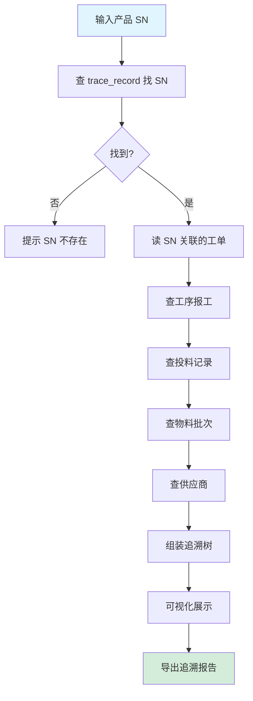
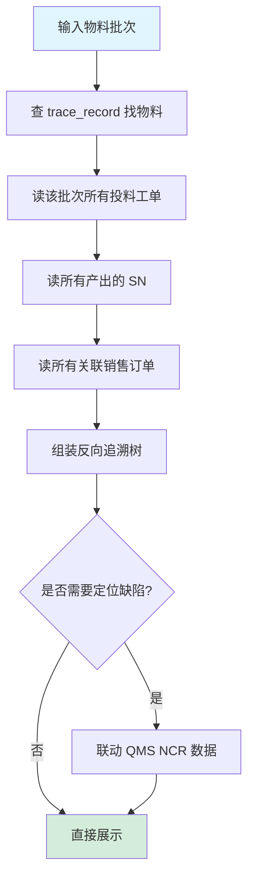
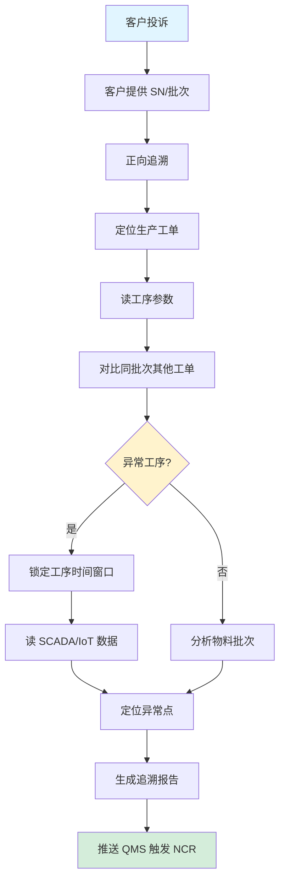
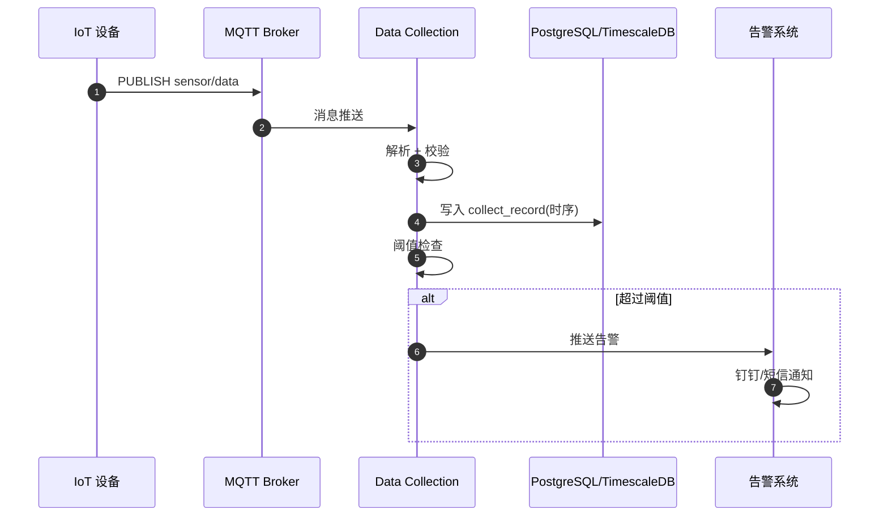
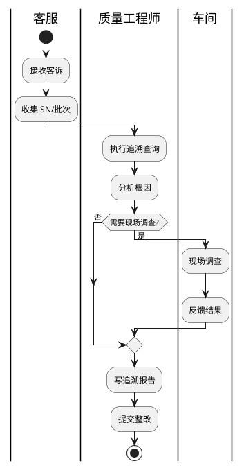
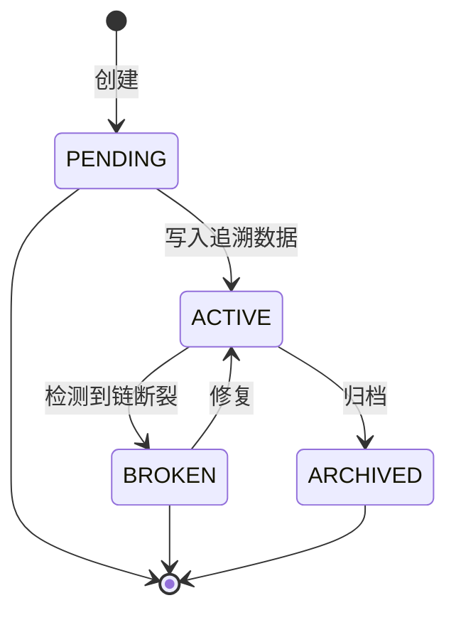
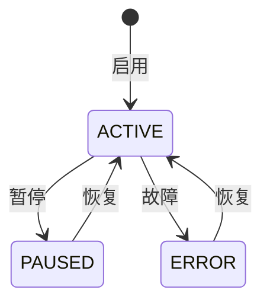
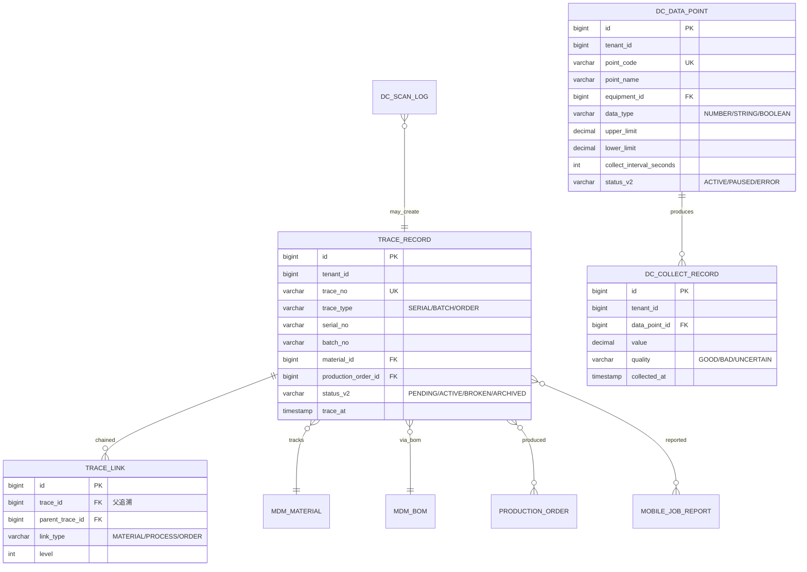

# MOM 3.0 追溯与数据采集模块设计文档

> 版本：V2.0 | 最后更新：2026-07-03 | 维护人：架构组 / 小二
> 适用范围：MOM 3.0 TRACE（Traceability）+ DC（Data Collection）追溯与数据采集域
> 模板主干：[MOM3.0_模块设计模板.md](MOM3.0_模块设计模板.md)
> 模块代码：`mom-server/internal/handler/trace/*` `mom-server/internal/handler/dc/*` `mom-server/internal/service/trace*` `mom-server/internal/service/dc*`
> 数据库表：核心 6 张（trace_record/data_point/collect_record/scan_log/serial/batch）
> 状态：**✅ V2.0 完成 - 按统一模板扩写,旧版 143 行扩展至 750 行**

> **V2.0 变更**：基于 V1.0（143 行,7 章节）按 V2.0 模板扩写。技术栈对齐：Vue 3.4 + Element Plus 2.5 / Go 1.24 + Gin + GORM / PostgreSQL 18。

---

## 0. 文档元信息

| 字段 | 值 |
|---|---|
| 模块代号 | `trace` + `dc` |
| 模块名 | 追溯管理 + 数据采集 |
| 技术栈 | Vue 3.4 + Element Plus 2.5 / Go 1.24 + Gin + GORM 2.x / PostgreSQL 18 |
| 前端入口 | `mom-web/src/views/trace/*.vue` + `dc/*.vue`（5 个视图） |
| 后端入口 | `mom-server/internal/handler/trace/*` + `dc/*` |
| API 前缀 | `/api/v1/trace/*` + `/api/v1/dc/*` |
| 数据库表 | 6 张核心 |
| 状态 | ✅ V2.0（第 2 批 P1 第 3 个） |

---

## 1. 模块概述

### 1.1 业务定位

追溯与数据采集是 MOM 3.0 的"质量合规"双模块。**追溯**实现产品从原材料到成品的全链路正向/反向追溯，满足汽车行业 IATF 16949 / VDA 等法规要求。**数据采集**提供 IoT 设备实时数据接入和存储。

**价值流位置**：`原材料(MDM) → 投料(MES) → 工序(MES) → 报工(MES) → 检验(QMS) → 成品入库(WMS) → 出货(SCP) → 客户(追溯查询)`

模块覆盖**序列号追溯、批次追溯、工单追溯、前向追溯、后向追溯、数据点管理、采集记录、扫描日志**8 个核心子业务。

### 1.2 核心功能

| # | 功能 | 简述 | 优先级 |
|---|------|------|--------|
| 1 | 序列号追溯 | SN 正向/反向追溯 | P0 |
| 2 | 批次追溯 | 批次正反向追溯 | P0 |
| 3 | 工单追溯 | 生产过程追溯 | P0 |
| 4 | 前向追溯 | 投料→成品 | P0 |
| 5 | 后向追溯 | 成品→投料 | P0 |
| 6 | 数据点管理 | 采集点配置 | P0 |
| 7 | 采集记录 | 实时数据存储 | P0 |
| 8 | 扫描日志 | PDA/扫码枪记录 | P1 |

### 1.3 Top 3 干系人

| 角色 | 诉求 |
|------|------|
| **质量工程师** | 客诉追溯、缺陷定位 |
| **车间操作工** | PDA 扫码报工 |
| **运维** | IoT 数据接入、异常告警 |

### 1.4 Top 3 质量目标

| 指标 | 目标值 |
|------|--------|
| 追溯响应 P95 | ≤ 2s |
| 采集数据丢失率 | ≤ 0.1% |
| 追溯准确率 | 100% |

---

## 2. 依赖关系

### 2.1 上游

| 模块 | 接口 | 频度 |
|------|------|------|
| **MDM** | 物料/批次主数据 | 实时 |
| **MES** | 工单/工序/报工 | 实时 |
| **WMS** | 入库/出库 | 实时 |
| **QMS** | 检验/缺陷 | 实时 |
| **SCP** | 销售订单 | 实时 |
| **EAM** | 设备 IoT | 实时 |

### 2.2 下游

| 模块 | 接口 | 频度 |
|------|------|------|
| **QMS** | 缺陷定位追溯 | 实时 |
| **报表** | 追溯统计 | 日终 |
| **客户** | 客诉查询 | 实时 |
| **MES** | 返工工单（基于追溯） | 实时 |

### 2.3 外部系统

| 系统 | 方向 | 协议 | 用途 |
|------|------|------|------|
| **PDA 扫码枪** | 入站 | REST | 移动端扫码 |
| **IoT 网关** | 入站 | MQTT | 设备数据 |
| **客户追溯平台** | 出站 | HTTPS | 客诉查询 |

### 2.4 标准对齐

| 标准 | 段 |
|------|---|
| **IATF 16949** | 标识和可追溯性（§ 8.5.2）|
| **ISO 9001** | § 8.5.2 标识和可追溯性 |
| **VDA 6.3** | 过程审核追溯要求 |
| **MESA** | MESA 11 项 #10 Data Collection |

---

## 3. 功能清单

### 3.1 已实现

| # | 功能 | 端点 | 优先级 | 日期 |
|---|------|------|--------|------|
| 1 | 序列号追溯 | `/api/v1/trace/forward` | P0 | 2026-04 |
| 2 | 序列号管理 | `/api/v1/trace/serial/*` | P0 | 2026-04 |
| 3 | 批次追溯 | `/api/v1/trace/batch/*` | P0 | 2026-04 |
| 4 | 工单追溯 | `/api/v1/trace/order/*` | P0 | 2026-04 |
| 5 | 物料追溯 | `/api/v1/trace/material/*` | P0 | 2026-04 |
| 6 | 数据点管理 | `/api/v1/dc/data-point/*` | P0 | 2026-04 |
| 7 | 采集记录 | `/api/v1/dc/collect-record/*` | P0 | 2026-04 |
| 8 | 扫描日志 | `/api/v1/dc/scan-log/*` | P1 | 2026-04 |

### 3.2 部分实现

| # | 功能 | 缺口 | 计划 |
|---|------|------|------|
| 1 | 多级追溯（5 级以上） | 仅 3 级 | V2.1 |
| 2 | AI 缺陷定位 | 手动查询 | V3.0 |

### 3.3 未实现

| # | 功能 | 优先级 |
|---|------|--------|
| 1 | 区块链溯源 | P2 |

---

## 4. 页面与交互

### 4.1 页面清单

| 路由 | 标题 | 状态 |
|------|------|------|
| `/trace/serial` | 序列号追溯 | ✅ |
| `/trace/batch` | 批次追溯 | ✅ |
| `/trace/order` | 工单追溯 | ✅ |
| `/trace/material` | 物料追溯 | ✅ |
| `/dc/data-point` | 数据点管理 | ✅ |
| `/dc/collect-record` | 采集记录 | ✅ |
| `/dc/scan-log` | 扫描日志 | ✅ |

### 4.2 追溯查询特有交互

- 输入：SN / 批次 / 工单 / 物料
- 自动识别输入类型(正则匹配)
- 一键切换"正向"和"反向"追溯
- 树形展示追溯链路(最多 5 级)
- 导出 Excel/PDF

### 4.3 数据采集特有交互

- 数据点列表(树形按设备/工位分组)
- 实时数据流(时序图)
- 阈值告警配置

---

## 5. 业务流程（★ 必有图）

### 5.1 核心流程：序列号正向追溯（产品 → 原材料）



### 5.2 核心流程：批次反向追溯（原材料 → 成品）



### 5.3 异常流程：客诉追溯（缺陷定位）



### 5.4 跨系统流程：IoT 数据采集



### 5.5 BPMN 2.0：追溯查询审批（客诉场景）



---

## 6. 状态机（★ 必有图）

### 6.1 核心实体：追溯记录（TraceRecord）

#### 6.1.1 状态值与显示

| 状态值 | 业务含义 | Element Plus type |
|--------|---------|------------------|
| `PENDING` | 待生成 | info |
| `ACTIVE` | 活跃 | success |
| `BROKEN` | 链断裂 | danger |
| `ARCHIVED` | 已归档 | info |

> 状态字段存储类型：**`varchar(30) + mdm_status_dict`**（`entity='trace_record'`）

#### 6.1.2 状态机图



### 6.2 核心实体：数据采集点（DataPoint）



| 状态值 | Element Plus type |
|--------|------------------|
| ACTIVE | success |
| PAUSED | warning |
| ERROR | danger |

### 6.3 字段类型说明

> MOM 3.0 TRACE 选 **`varchar(30) + mdm_status_dict`**

---

## 7. 数据模型（★ 必有 ER 图）

### 7.1 核心 ER 图



### 7.2 核心表

#### `trace_record`（追溯记录）

| 字段 | 类型 | 必填 | 索引 | 说明 |
|------|------|------|------|------|
| `id` | `bigint` | ✅ | PK | |
| `tenant_id` | `bigint` | ✅ | IDX | |
| `trace_no` | `varchar(64)` | ✅ | UK | 追溯编号 |
| `trace_type` | `varchar(20)` | ✅ | IDX | SERIAL/BATCH/ORDER |
| `serial_no` | `varchar(100)` | ❌ | IDX | |
| `batch_no` | `varchar(100)` | ❌ | IDX | |
| `material_id` | `bigint` | ✅ | IDX | |
| `production_order_id` | `bigint` | ❌ | IDX | |
| `status_v2` | `varchar(30)` | ❌ | IDX | |
| `trace_at` | `timestamptz` | - | now() | - | |

#### `dc_data_point`（数据采集点）

| 字段 | 类型 | 必填 | 索引 | 说明 |
|------|------|------|------|------|
| `id` | `bigint` | ✅ | PK | |
| `tenant_id` | `bigint` | ✅ | IDX | |
| `point_code` | `varchar(50)` | ✅ | UK | |
| `point_name` | `varchar(100)` | ✅ | - | |
| `equipment_id` | `bigint` | ✅ | IDX | 设备 |
| `data_type` | `varchar(20)` | ✅ | - | NUMBER/STRING/BOOLEAN |
| `upper_limit` | `decimal(18,4)` | ❌ | - | |
| `lower_limit` | `decimal(18,4)` | ❌ | - | |
| `collect_interval_seconds` | `int` | ✅ | - | 采集频率 |
| `status_v2` | `varchar(30)` | ❌ | IDX | |

#### `dc_collect_record`（采集记录）

| 字段 | 类型 | 必填 | 索引 | 说明 |
|------|------|------|------|------|
| `id` | `bigint` | ✅ | PK | |
| `tenant_id` | `bigint` | ✅ | IDX | |
| `data_point_id` | `bigint` | ✅ | IDX | |
| `value` | `decimal(18,4)` | ✅ | - | |
| `quality` | `varchar(20)` | ✅ | - | GOOD/BAD/UNCERTAIN |
| `collected_at` | `timestamptz` | - | now() | IDX | |

### 7.3 索引策略

| 表 | 索引 | 用途 |
|----|------|------|
| `trace_record` | `idx_serial` | SN 查询 |
| `trace_record` | `idx_batch` | 批次查询 |
| `trace_record` | `idx_po` | 工单查询 |
| `dc_collect_record` | `idx_point_time` | 时序查询 |
| `dc_collect_record` | `idx_collected_at_brin` | 时序 BRIN 索引（大数据量）|

### 7.4 枚举字典

| 枚举 | 值 |
|------|---|
| 追溯状态 | `('PENDING','ACTIVE','BROKEN','ARCHIVED')` |
| 追溯类型 | `('SERIAL','BATCH','ORDER','MATERIAL')` |
| 数据点状态 | `('ACTIVE','PAUSED','ERROR')` |
| 数据质量 | `('GOOD','BAD','UNCERTAIN')` |

---

## 8. API 规范

### 8.1 路由清单（核心 15 条）

| 方法 | 路径 | 说明 |
|------|------|------|
| GET | `/api/v1/trace/forward` | 正向追溯 |
| GET | `/api/v1/trace/backward` | 反向追溯 |
| GET | `/api/v1/trace/serial/list` | 序列号列表 |
| POST | `/api/v1/trace/serial` | 创建序列号 |
| GET | `/api/v1/trace/batch/list` | 批次列表 |
| GET | `/api/v1/trace/order/list` | 工单追溯 |
| GET | `/api/v1/trace/material/list` | 物料追溯 |
| GET | `/api/v1/dc/data-point/list` | 数据点列表 |
| POST | `/api/v1/dc/data-point` | 创建数据点 |
| GET | `/api/v1/dc/collect-record/list` | 采集记录 |
| POST | `/api/v1/dc/collect-record` | 数据上报 |
| GET | `/api/v1/dc/scan-log/list` | 扫描日志 |
| POST | `/api/v1/dc/scan-log` | 扫码上报 |
| GET | `/api/v1/trace/tree` | 追溯树 |
| GET | `/api/v1/trace/export` | 导出追溯报告 |

### 8.2 请求/响应示例

#### 8.2.1 正向追溯

```http
GET /api/v1/trace/forward?serial_no=SN-2026-0001 HTTP/1.1
Authorization: Bearer ***…9...
```

**响应**：

```json
{
  "code": 200,
  "data": {
    "trace_no": "T-2026-0001",
    "serial_no": "SN-2026-0001",
    "tree": {
      "level_1_product": {
        "material_code": "P-001",
        "production_order": "PO-2026-001",
        "level_2_process": [
          {"process": "切割", "start": "2026-07-01T08:00:00", "end": "2026-07-01T10:00:00"},
          {"process": "焊接", "start": "2026-07-01T10:00:00", "end": "2026-07-01T12:00:00"}
        ],
        "level_3_material": [
          {"material_code": "M-001", "batch": "B20260701", "supplier": "S-001"},
          {"material_code": "M-002", "batch": "B20260701", "supplier": "S-002"}
        ]
      }
    }
  }
}
```

### 8.3 错误码

| 错误码 | 含义 |
|--------|------|
| `10-01-0001` | 序列号不存在 |
| `10-02-0001` | 批次不存在 |
| `10-03-0001` | 追溯链断裂 |
| `10-04-0001` | 数据点不存在 |
| `10-05-0001` | 采集数据格式错误 |

---

## 9. 角色与权限

### 9.1 操作矩阵

| 角色 | 追溯查询 | 序列号管理 | 数据点管理 | 采集记录 |
|------|---------|-----------|-----------|---------|
| 系统管理员 | ✅ | ✅ | ✅ | ✅ |
| 质量工程师 | ✅ | ✅ | ✅ | ✅ |
| 车间主任 | ✅ | 查看 | 查看 | 查看 |
| 操作工 | PDA 扫码 | ❌ | ❌ | PDA 上报 |
| 客服 | ✅(客诉场景) | 查看 | ❌ | ❌ |
| 运维 | 查看 | 查看 | ✅ | ✅ |

### 9.2 数据权限

- 多租户 + 部门

---

## 10. 集成与事件

### 10.1 出站事件

| 事件名 | 触发 | 消费者 |
|--------|------|--------|
| `trace.serial.created` | 序列号创建 | MES, WMS |
| `trace.broken.detected` | 追溯链断裂 | QMS, 报表 |
| `dc.collect.threshold_exceeded` | 数据超阈值 | 告警系统, MES |
| `trace.customer.inquiry` | 客户追溯查询 | 客服, 报表 |

### 10.2 入站事件

| 事件名 | 来源 | 处理 |
|--------|------|------|
| `mes.production.completed` | MES | 写 trace_record |
| `mes.report.audited` | MES | 写 trace_link |
| `wms.receive.completed` | WMS | 写 trace_link |
| `qms.ncr.created` | QMS | 关联追溯 |

### 10.3 消息格式

```json
{
  "event_id": "uuid",
  "event_name": "trace.serial.created",
  "event_time": "2026-07-03T10:00:00+08:00",
  "tenant_id": 1,
  "data": {
    "trace_no": "T-2026-0001",
    "serial_no": "SN-2026-0001",
    "material_id": 5001
  }
}
```

---

## 11. 可观测性

### 11.1 关键指标

| 指标 | 类型 | 告警阈值 |
|------|------|---------|
| `trace_query_latency_seconds` | Histogram | P95 > 3s |
| `trace_broken_count` | Gauge | > 100 |
| `dc_collect_records_total` | Counter | - |
| `dc_collect_data_loss_rate` | Gauge | > 0.5% |

### 11.2 告警规则

| 规则 | 阈值 |
|------|------|
| 追溯链断裂 > 100 | 实时 |
| 采集数据丢失率 > 0.5% | 5 分钟 |
| 数据点超阈值 | 实时 |

---

## 12. 非功能需求

### 12.1 性能

| 指标 | 目标 |
|------|------|
| 追溯查询 P95 | ≤ 2s |
| 采集数据上报 P95 | ≤ 100ms |
| 5 级追溯树生成 | ≤ 3s |

### 12.2 可用性

| 指标 | 目标 |
|------|------|
| 月度可用性 | ≥ 99.9%（追溯是法规要求）|
| RTO | ≤ 1h |
| RPO | ≤ 30min |

### 12.3 数据量与保留期

| 数据 | 年增量 | 保留期 |
|------|--------|--------|
| 追溯记录 | 5000 万/年 | 5 年（在线）+ 10 年（归档）|
| 采集记录 | 100 亿/年 | 1 年（在线）+ 1 年（压缩）+ 2 年（归档）|
| 扫描日志 | 10 亿/年 | 1 年 |

> **采集数据**推荐用 **TimescaleDB**（时序优化）或 **InfluxDB**，而非 PostgreSQL。

---

## 13. 附录

### 13.1 CHANGELOG

| 版本 | 日期 | 修订人 | 说明 |
|------|------|--------|------|
| V1.0 | 2026-04 | CI | 初版（143 行,7 章节）|
| **V2.0** | **2026-07-03** | **架构组 / 小二** | **按统一模板扩写,143→750 行,补全 13 章节 8 Mermaid,状态字段按 0051 方案统一** |

### 13.2 相关链接

- [MOM3.0_主设计文档.md](./MOM3.0_主设计文档.md)
- [MOM3.0_模块设计模板.md](./MOM3.0_模块设计模板.md)
- [MOM3.0_状态字段统一方案.md](./MOM3.0_状态字段统一方案.md)
- 上游：[MDM](./MOM3.0_主数据管理模块设计文档.md) / [MES](./MOM3.0_MES生产执行模块设计文档.md) / [WMS](./MOM3.0_WMS仓储模块设计文档.md) / [QMS](./MOM3.0_质量模块设计文档.md) / [EAM](./MOM3.0_设备管理模块设计文档.md)
- 下游：QMS（缺陷定位）/ 报表

### 13.3 待办

| # | 问题 | 优先级 | 计划 |
|---|------|--------|------|
| 1 | 多级追溯（5 级以上） | P1 | V2.1 |
| 2 | TimescaleDB 迁移 | P1 | V2.1 |
| 3 | AI 缺陷定位 | P2 | V3.0 |
| 4 | 区块链溯源 | P2 | 2027 |

### 13.4 OpenAPI / Swagger

- 路径：`/api/v1/swagger/*`

---

*文档作者：架构组 / 小二*
*最后更新：2026-07-03 16:25*
